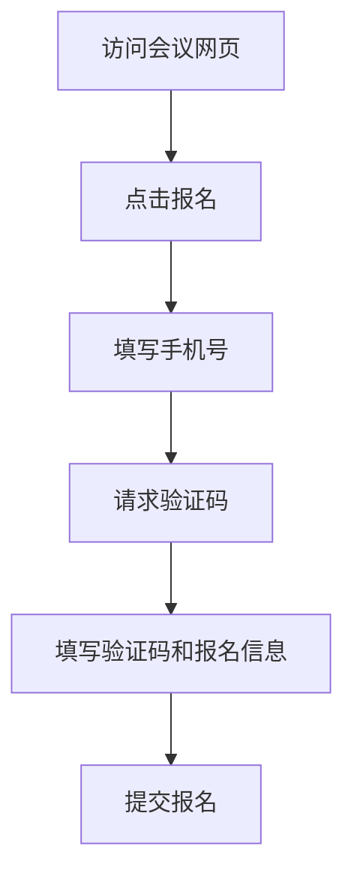

# 【二期】免登录报名与账号联动产品需求说明书

## 需求概览

本次【二期】将报名入口从“先登录后报名”调整为“可先报名再完成账号联动”。参会人在会议网页填写手机号并完成验证码校验后即可提交报名，系统按手机号命中结果自动分流：命中已有账号则自动关联该账号，未命中则自动创建会议系统账号并同步报名信息。该设计在保证账号识别准确性的同时减少流程摩擦，提升报名转化。

## 第1章：概述

### 1.1 术语表

| 名称 | 详细描述 |
|------|----------|
| 【二期】免登录报名 | 参会人不强制登录即可发起报名的流程 |
| 【二期】账号自动关联 | 报名手机号命中已有账号时，报名记录自动绑定该账号 |
| 【二期】自动注册账号 | 报名手机号未注册时，系统自动创建会议系统账号 |
| 【二期】验证码模板分流 | 按手机号账号状态发送登录模板或注册模板短信 |
| 【二期】来源渠道 | 报名人通过会议创建者某个渠道分享链接进入后写入的渠道标识 |

### 1.2 修订记录

| 版本号 | 内容 | 负责人 | 更新时间 | 备注 |
|------|------|------|------|------|
| V2.0 | 新增免登录报名、账号联动、短信模板分流 | - | 2026-04-21 | 首版 |
| V2.1 | 新增报名来源渠道回流：报名记录写入来源渠道并在审核页展示 | - | 2026-04-21 | 二期增补 |

### 1.3 背景和价值

- 背景问题：先登录再报名的前置门槛导致部分潜在参会人流失。
- 业务价值：在不牺牲身份识别能力的前提下，缩短报名路径，提升提交率。
- 系统一致性价值：将报名数据与账号体系自动打通，避免“匿名报名孤岛数据”。

## 第2章：功能需求

### 2.1 【二期】免登录报名入口（V2-REG-01）

#### 场景描述

参会人通过随机官网链接访问会议页面，点击报名时无需先登录，直接进入手机号验证码报名流程。



#### 基本事件流程

- 前置条件：会议处于可报名状态。
- 基本事件流程：
  1. 用户点击报名后进入报名表单。
  2. 用户输入手机号并获取验证码。
  3. 用户输入验证码并填写报名字段后提交。
- 后置条件：进入账号识别分流处理。

#### 异常事件流程

- 验证码错误、过期或发送失败时，系统阻止提交并提示重试。

### 2.2 【二期】手机号命中已有账号自动关联（V2-REG-02）

#### 基本事件流程

- 前置条件：验证码校验通过，手机号命中已有会议系统账号。
- 基本事件流程：
  1. 系统将报名记录关联到命中的账号。
  2. 该账号可在已报名会议中看到记录。
  3. 发起人审核侧按该账号信息进行审核。
- 后置条件：报名和账号完成自动关联。

### 2.3 【二期】手机号未注册自动建号（V2-REG-03）

#### 基本事件流程

- 前置条件：验证码校验通过，手机号未命中会议系统账号。
- 基本事件流程：
  1. 系统自动创建会议系统账号。
  2. 将报名填写信息同步写入账号身份信息。
  3. 报名记录与新账号自动绑定。
- 后置条件：形成“报名即建号”的联动闭环。

### 2.4 【二期】提示文案、协议入口与短信模板分流（V2-REG-04）

#### 基本事件流程

- 前置条件：用户进入报名表单。
- 基本事件流程：
  1. 页面在手机号输入区附近展示提示：`未注册手机号将自动创建会议系统账号`。
  2. 页面提供`用户条款`与`隐私协议`查看入口。
  3. 请求验证码时，系统按账号状态分流短信模板：
     - 已注册账号 -> 登录验证码模板；
     - 未注册账号 -> 注册验证码模板。
- 后置条件：用户明确知晓账号联动规则，系统短信模板与账号状态一致。

### 2.5 【二期】报名来源渠道回流与审核展示（V2-REG-05）

#### 基本事件流程

- 前置条件：用户通过带渠道标识的分享链接进入并提交报名。
- 基本事件流程：
  1. 系统解析分享链接中的渠道配置标识。
  2. 报名提交成功时，将来源渠道写入报名记录。
  3. 会议创建者在报名审核列表查看该报名人时，系统展示来源渠道名称。
  4. 渠道名称展示值与创建者的渠道分享配置名称一致。
- 后置条件：报名记录具备可追溯的来源渠道字段，供审核和后续看板使用。

#### 异常事件流程

- 无渠道标识或渠道标识无效时，来源渠道记为“默认/未知渠道”（具体文案在实施时统一）。

### 数据项描述

| 字段名（中英文） | 数据类型 | 是否必填 | 前端展示 | 说明 | 备注 |
|---|---|---|---|---|---|
| 手机号 `mobile` | String | 是 | 是 | 报名与账号识别主键 | - |
| 账号匹配状态 `account_match_status` | Enum | 是 | 否 | 已注册/未注册 | 由服务端判定 |
| 短信模板类型 `sms_template_type` | Enum | 是 | 否 | 登录模板/注册模板 | 按匹配状态分流 |
| 报名记录ID `registration_id` | Long | 是 | 否 | 报名主键 | - |
| 关联用户ID `linked_user_id` | Long | 否 | 否 | 命中已有账号时写入 | - |
| 自动建号用户ID `auto_created_user_id` | Long | 否 | 否 | 未命中账号时写入 | - |
| 条款确认 `tos_confirmed` | Boolean | 是 | 是 | 用户条款确认状态 | - |
| 隐私确认 `privacy_confirmed` | Boolean | 是 | 是 | 隐私协议确认状态 | - |
| 来源渠道ID `source_channel_id` | Long | 否 | 否 | 对应创建者渠道配置ID | 从分享链接解析 |
| 来源渠道名称 `source_channel_name` | String | 否 | 是 | 报名审核页展示的渠道名 | 与配置名称一致 |

### 需求波及分析

- 影响模块：会议报名页、验证码发送服务、账号识别服务、用户创建服务、报名审核页、分享链接解析能力。
- 数据影响：报名记录与用户账号关系从“登录态主导”扩展为“手机号识别主导”；报名记录新增来源渠道字段。
- 业务规则影响：短信模板选择逻辑新增账号状态分支；审核页新增来源渠道展示并与渠道配置名称保持一致。
- 历史文档查阅记录：
  - 查阅的历史需求文档：`会议详情与报名产品需求说明书`（`CSDN会议功能/docs/会议详情与报名产品需求说明书.md`）
  - 查阅的现有功能文档：`用户体系产品需求说明书`（`CSDN会议功能/docs/用户体系产品需求说明书.md`）
  - 参考的实现方案：沿用报名主流程、条款隐私入口规范、验证码能力。
  - 设计一致性保证：不改变现有账号体系边界，仅扩展报名触发下的自动关联和自动注册。

### 验收准则

| 验收准则编号 | 场景描述 | Given（前置条件） | When（触发条件） | Then（预期结果） | And（附加验证） |
|---|---|---|---|---|---|
| AC-V2-REG-01 | 免登录可报名 | 用户未登录且会议可报名 | 用户点击报名 | 可进入报名表单 | 不强制跳登录页 |
| AC-V2-REG-02 | 验证码必填 | 用户已输入手机号 | 用户未完成验证码校验直接提交 | 系统拦截提交 | 显示验证码必填提示 |
| AC-V2-REG-03 | 已有账号自动关联 | 手机号命中已有账号 | 用户完成验证码并提交 | 报名记录关联已有账号 | 审核页显示关联账号信息 |
| AC-V2-REG-04 | 未注册自动建号 | 手机号未命中账号 | 用户完成验证码并提交 | 系统自动创建账号并绑定报名 | 报名信息同步为账号身份信息 |
| AC-V2-REG-05 | 模板分流 | 用户请求验证码 | 系统识别账号状态 | 已注册发送登录模板 | 未注册发送注册模板 |
| AC-V2-REG-06 | 协议提示 | 用户进入报名页 | 用户查看手机号区域 | 可见自动建号提示与协议入口 | 链接可点击查看 |
| AC-V2-REG-07 | 来源渠道写入 | 用户通过带渠道标识链接进入 | 用户提交报名成功 | 报名记录写入来源渠道 | 来源渠道可在审核页展示 |
| AC-V2-REG-08 | 审核页渠道一致性 | 创建者已配置渠道分享名称 | 创建者查看报名审核列表 | 报名人来源渠道名称与配置名称一致 | 支持后续看板按此字段统计 |

#### Gherkin

```gherkin
Feature: 二期免登录报名与账号联动
  Scenario: 用户未登录也可发起报名
    Given 用户未登录且会议处于可报名状态
    When 用户在会议网页点击报名
    Then 系统应展示报名表单
    And 不应强制先跳转登录

  Scenario: 手机号命中已有账号时自动关联
    Given 用户填写的手机号已在会议系统注册
    When 用户完成验证码并提交报名
    Then 报名记录应自动关联该已有账号
    And 发起人审核侧应按该账号信息展示

  Scenario: 手机号未注册时自动建号
    Given 用户填写的手机号未在会议系统注册
    When 用户完成验证码并提交报名
    Then 系统应自动创建会议系统账号
    And 报名信息应同步写入该账号身份信息

  Scenario: 报名记录写入来源渠道并在审核页展示
    Given 会议创建者已创建多个渠道分享配置
    And 报名人通过其中一个渠道链接进入并提交报名
    When 创建者进入报名审核列表查看该报名人
    Then 系统应展示该报名人的来源渠道
    And 渠道名称应与创建者配置名称一致
```

### 国际化命名规则

| 使用场景说明 | 中文 | 英文 |
|---|---|---|
| 报名按钮 | 立即报名 | Register Now |
| 提示文案 | 未注册手机号将自动创建会议系统账号 | Unregistered mobile numbers will automatically create an account |
| 协议入口 | 用户条款 | Terms of Service |
| 协议入口 | 隐私协议 | Privacy Policy |
| 审核列表字段 | 来源渠道 | Source Channel |

### 埋点定义

| 模块 | 指标名称 | 指标定义 | PC/移动端 | 触发时机 | 频率 |
|---|---|---|---|---|---|
| 报名 | 进入报名表单 | 免登录报名入口访问次数 | PC | 点击报名时 | 每次 |
| 验证码 | 请求验证码 | 验证码请求次数与成功率 | PC | 点击获取验证码时 | 每次 |
| 账号联动 | 自动关联成功 | 命中已有账号后关联成功次数 | PC | 报名提交成功时 | 每次 |
| 账号联动 | 自动建号成功 | 未注册手机号自动建号成功次数 | PC | 报名提交成功时 | 每次 |
| 来源回流 | 来源渠道写入成功率 | 报名记录来源渠道写入成功/失败占比 | PC | 报名提交成功时 | 每次 |
| 审核 | 来源渠道展示覆盖率 | 审核列表中来源渠道字段有值的占比 | PC | 审核列表加载时 | 每次 |

### 非功能性需求

- 性能要求：手机号识别与验证码发送链路建议在 2 秒内给出反馈。
- 安全要求：验证码校验必须服务端完成，防止绕过校验提交报名。
- 合规要求：报名页必须可访问用户条款与隐私协议。
- 兼容性要求：支持会议系统当前网页端主流浏览器。

