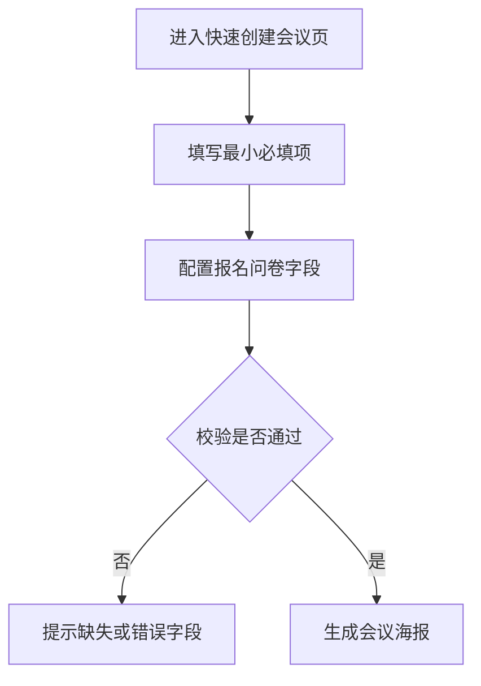

# 【二期】快速创建会议与海报官网产品需求说明书

## 需求概览

本次【二期】聚焦“轻量创建+快速传播”场景：用户在新增的快速创建页填写核心会议信息后，可直接生成含报名区域与报名按钮的会议海报，并一键渲染为会议系统托管的独立网页。系统自动生成随机链接用于外部传播，参会人可通过链接直接查看并报名，最终提升中小活动创建与报名转化效率。

## 第1章：概述

### 1.1 术语表

| 名称 | 详细描述 |
|------|----------|
| 【二期】快速创建会议 | 通过最小必填项发起会议的网页端创建模式 |
| 【二期】报名问卷配置 | 由发起人定义报名字段、字段类型、是否必填的配置能力 |
| 【二期】会议海报 | 包含会议信息、报名填写区和报名按钮的传播素材 |
| 【二期】海报官网页 | 将海报渲染成独立网页后的展示形态 |
| 【二期】随机链接 | 系统自动生成、长期有效且不可修改的官网地址 |
| 【二期】渠道分享配置 | 会议创建者为不同投放渠道创建的分享配置项，包含渠道名称、分享链接与二维码海报 |

### 1.2 修订记录

| 版本号 | 内容 | 负责人 | 更新时间 | 备注 |
|------|------|------|------|------|
| V2.0 | 按二期方案新增快速创建、海报官网、随机链接规则 | - | 2026-04-21 | 首版 |
| V2.1 | 增加多渠道分享链接与二维码海报能力，支持来源渠道回流字段生成 | - | 2026-04-21 | 二期增补 |

### 1.3 背景和价值

- 背景问题：一期创建流程偏完整配置，难以满足“快速起会、快速传播”的轻量需求。
- 业务价值：降低创建门槛，提升传播效率；让会议从“填完再传播”转为“创建即传播”。
- 用户价值：无现成复杂资料的用户也能快速发起活动并获得可报名的官网页。

## 第2章：功能需求

### 2.1 【二期】快速创建会议（V2-FAST-01）

#### 场景描述

“快速创建会议”需求拆分为两块：

1. 支持通过快速创建流程创建会议（本章已详细描述）。
2. 优化现有创建会议逻辑、流程与页面配置（本期仅做方向性约束，具体方案由产品与开发线下对齐）。

发起人可在几分钟内完成核心字段填写并发布会议，不再进入完整复杂表单链路。



#### 基本事件流程

- 前置条件：用户已登录并具备会议创建权限。
- 基本事件流程：
  1. 用户填写最小必填项：会议标题、副标题、开始时间、会议地点、会议议程、报名问卷配置。
  2. 用户配置报名问卷字段与必填规则，可新增自定义字段。
  3. 系统校验必填项和字段配置合法性。
  4. 校验通过后进入海报生成环节。
- 后置条件：形成可发布的会议草稿和海报输入数据。
- 说明：当前文档对“快速创建流程创建会议”给出完整需求；“现有创建会议逻辑/流程/页面配置优化”仅记录目标，不在本文展开详细交互与规则。

#### 扩展事件流程

- 用户可在提交前多次调整问卷字段顺序与必填状态。

#### 异常事件流程

- 自定义字段名为空、重复或超长时，系统阻止提交并给出明确提示。

### 2.2 【二期】会议海报生成（V2-FAST-02）

#### 基本事件流程

- 前置条件：快速创建校验通过。
- 基本事件流程：
  1. 系统基于会议信息与问卷配置生成海报。
  2. 海报需包含会议信息展示区、报名信息填写区域、报名按钮。
  3. 用户确认后可继续发布为官网页。
- 后置条件：生成可渲染为网页的海报资源。

#### 异常事件流程

- 海报生成失败时提示重试，不应丢失用户已填写的创建内容。

### 2.3 【二期】海报官网页与随机链接（V2-FAST-03）

#### 基本事件流程

- 前置条件：海报已生成并确认发布。
- 基本事件流程：
  1. 系统将海报渲染为会议系统托管的独立网页。
  2. 自动生成随机链接并绑定会议。
  3. 参会人可通过链接直接访问网页并报名。
  4. 会议开始或报满后，报名入口自动关闭。
- 后置条件：形成可长期访问的会议官网页。

#### 业务规则

- 随机链接长期有效。
- 链接地址不支持修改。
- 报名截止条件为“会议正式开始”或“会议已报满”。

### 2.4 【二期】多渠道分享链接与二维码海报（V2-FAST-04）

#### 场景描述

会议创建者希望针对不同外部渠道分别投放会议海报与链接，并在后续报名审核时区分引流来源。

#### 基本事件流程

- 前置条件：会议已创建且可分享。
- 基本事件流程：
  1. 创建者进入分享配置，新增渠道配置项（如小红书、抖音、知乎、B站）。
  2. 系统为每个渠道配置生成独立分享链接。
  3. 系统为每个渠道生成包含对应链接二维码的海报。
  4. 创建者复制对应渠道链接/海报并分发。
- 后置条件：形成可区分渠道的分享入口集合。

#### 扩展事件流程

- 创建者可新增或停用渠道配置；停用后渠道链接不再用于新分发，但历史报名来源保留。

#### 异常事件流程

- 渠道名称为空或重复时，系统拦截并提示修正。

### 数据项描述

| 字段名（中英文） | 数据类型 | 是否必填 | 前端展示 | 说明 | 备注 |
|---|---|---|---|---|---|
| 快速会议ID `quick_meeting_id` | Long | 是 | 否 | 快速创建会议主键 | - |
| 海报资源ID `poster_asset_id` | String | 是 | 否 | 海报资源标识 | - |
| 官网链接Token `site_token` | String | 是 | 否 | 生成随机链接的唯一标识 | 长期有效 |
| 报名上限 `registration_limit` | Integer | 否 | 否 | 用于报满判定 | 无上限时可为空 |
| 报名截止状态 `registration_status` | Enum | 是 | 是 | 可报名/已截止 | 自动计算 |
| 问卷字段配置 `form_schema` | JSON | 是 | 否 | 字段名、类型、必填规则 | 支持自定义字段 |
| 渠道配置ID `channel_config_id` | Long | 是 | 否 | 渠道分享配置主键 | - |
| 渠道名称 `channel_name` | String | 是 | 是 | 创建者配置的渠道显示名 | 需唯一 |
| 渠道分享链接 `channel_share_url` | String | 是 | 是 | 对应渠道独立链接 | 与二维码一一对应 |
| 渠道二维码海报ID `channel_qr_poster_id` | String | 是 | 否 | 对应渠道二维码海报资源标识 | - |

### 需求波及分析

- 影响模块：快速创建页、海报生成服务、会议官网渲染页、报名入口控制。
- 数据影响：新增快速创建与海报渲染相关业务数据；新增渠道配置、渠道链接与渠道二维码资源数据。
- 业务规则影响：问卷配置灵活性提升，需严格前后端一致校验。
- 历史文档查阅记录：
  - 查阅的历史需求文档：`发起会议与会议信息管理产品需求说明书`（`CSDN会议功能/docs/发起会议与会议信息管理产品需求说明书.md`）
  - 查阅的现有功能文档：`会议详情与报名产品需求说明书`（`CSDN会议功能/docs/会议详情与报名产品需求说明书.md`）
  - 参考的实现方案：沿用会议基础字段语义、报名入口关闭逻辑和会议信息展示方式。
  - 设计一致性保证：快速创建仅简化输入链路，不改变会议主数据定义和报名关闭原则。

### 验收准则

| 验收准则编号 | 场景描述 | Given（前置条件） | When（触发条件） | Then（预期结果） | And（附加验证） |
|---|---|---|---|---|---|
| AC-V2-FAST-01 | 最小必填项校验 | 用户进入快速创建页 | 用户缺少任一必填项后提交 | 系统拦截提交并提示缺失项 | 已填内容保留 |
| AC-V2-FAST-02 | 海报生成 | 用户完成最小必填项与问卷配置 | 用户提交创建 | 系统生成会议海报 | 海报含报名填写区和报名按钮 |
| AC-V2-FAST-03 | 官网生成 | 海报已生成 | 用户确认发布 | 系统生成独立官网页与随机链接 | 链接立即可访问 |
| AC-V2-FAST-04 | 报名截止 | 官网页已发布 | 会议开始或已报满 | 报名入口关闭 | 提示截止原因 |
| AC-V2-FAST-05 | 链接不可修改 | 随机链接已生成 | 用户尝试修改链接地址 | 系统不支持修改 | 原链接继续有效 |
| AC-V2-FAST-06 | 多渠道链接生成 | 会议已创建且可分享 | 创建者新增多个渠道配置 | 每个渠道均生成独立分享链接和对应二维码海报 | 渠道名称需唯一 |

#### Gherkin

```gherkin
Feature: 二期快速创建与海报官网
  Scenario: 最小必填项未完成时不可提交
    Given 用户进入快速创建会议页
    When 用户缺少任一最小必填项并提交
    Then 系统应拦截提交
    And 页面提示具体缺失字段

  Scenario: 创建成功后生成海报与官网链接
    Given 用户已完成最小必填项和问卷配置
    When 用户提交并确认发布
    Then 系统应生成会议海报
    And 系统应生成独立官网页与随机链接

  Scenario: 官网报名入口按规则关闭
    Given 官网页已发布且可报名
    When 会议开始时间已到或报名人数已满
    Then 官网报名入口应自动关闭
    And 页面应显示报名已截止提示

  Scenario: 创建者可为不同渠道生成独立分享资产
    Given 会议创建者进入分享配置页面
    When 创建者新增小红书、抖音、知乎、B站等渠道配置
    Then 系统应为每个渠道生成独立分享链接
    And 系统应为每个渠道生成包含对应二维码的海报
```

### 国际化命名规则

| 使用场景说明 | 中文 | 英文 |
|---|---|---|
| 页面标题 | 快速创建会议 | Quick Create Meeting |
| 模块标题 | 报名问卷配置 | Registration Form Settings |
| 按钮文案 | 生成海报 | Generate Poster |
| 状态文案 | 报名已截止 | Registration Closed |
| 分享配置 | 渠道分享配置 | Channel Share Configuration |
| 分享字段 | 来源渠道 | Source Channel |

### 埋点定义

| 模块 | 指标名称 | 指标定义 | PC/移动端 | 触发时机 | 频率 |
|---|---|---|---|---|---|
| 快速创建 | 提交成功 | 快速创建提交成功次数 | PC | 提交成功时 | 每次 |
| 问卷配置 | 新增自定义字段 | 新增自定义字段次数 | PC | 点击新增字段时 | 每次 |
| 海报 | 海报生成成功率 | 海报生成成功/失败占比 | PC | 生成结束时 | 每次 |
| 官网页 | 官网链接访问量 | 随机链接访问次数 | PC | 页面访问时 | 每次 |
| 分享配置 | 渠道配置创建数 | 创建渠道分享配置次数 | PC | 创建渠道配置成功时 | 每次 |
| 分享配置 | 渠道海报生成成功率 | 渠道二维码海报生成成功/失败占比 | PC | 生成结束时 | 每次 |

### 非功能性需求

- 性能要求：海报生成建议在 5 秒内完成，超时需给出可重试反馈。
- 安全要求：随机链接需具备足够随机性，避免被批量枚举。
- 兼容性要求：官网页在会议系统支持的主流浏览器中正常展示与报名。
- 此处信息不明确，需补充确认：海报图与官网背景图是否设为强制上传项。

