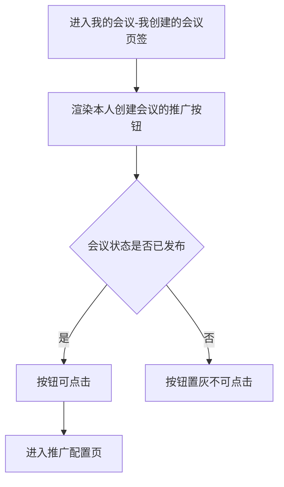
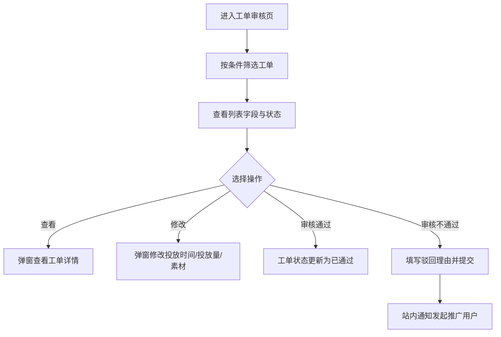
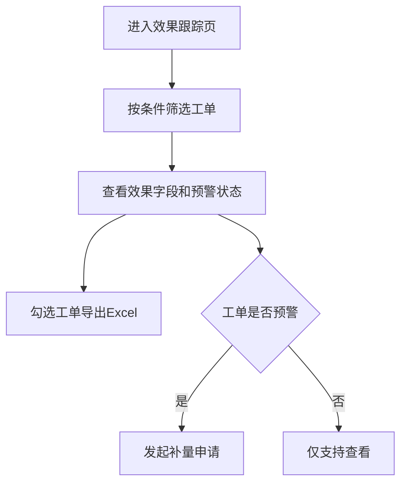
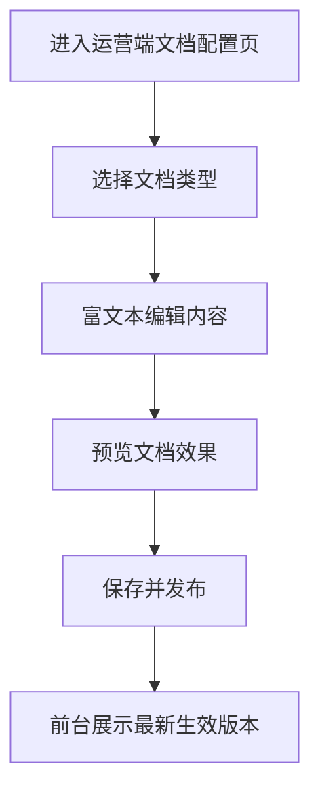

# 【二期】推广配置与账单产品需求说明书

## 需求概览

本次【二期】围绕办会方推广场景补齐交易闭环：在`我的会议`-`我创建的会议`页签中对本人创建且已发布的会议发起推广，进入会议系统内推广配置页调用广告系统能力生成报价，完成会议系统内支付后自动进入`推广中`状态，并在新增的推广账单页统一查看费用记录。同时新增运营端`工单审核页`与`效果跟踪页`，实现推广工单审核、过程调整、效果复盘、预警识别与补量申请闭环。该方案保持“会议系统承接业务流程、广告系统提供投放能力、运营后台负责审核与运营动作、运营线下对 CSDN 结算”的职责边界，避免跨系统职责混淆。

## 第1章：概述

### 1.1 术语表

| 名称 | 详细描述 |
|------|----------|
| 【二期】推广入口 | `我的会议`-`我创建的会议`页签中的`推广`按钮，仅展示并操作本人创建会议，且仅已发布可点击 |
| 【二期】推广配置页 | 会议系统内页面，负责承接投放配置并调用广告系统接口 |
| 【二期】推广中 | 推广支付成功后至会议开始前的会议标识状态 |
| 【二期】推广账单 | 当前用户名下所有推广费用记录的汇总页面 |

### 1.2 修订记录

| 版本号 | 内容 | 负责人 | 更新时间 | 备注 |
|------|------|------|------|------|
| V2.0 | 按二期方案新增推广配置、支付、推广账单 | - | 2026-04-21 | 首版 |
| V2.1 | 新增运营端工单审核与效果跟踪需求 | - | 2026-04-22 | 二期增补 |

### 1.3 背景和价值

- 一期存在“推广流程不闭环、付费记录不集中”的问题，办会方难以快速自助完成推广。
- 本次通过系统内闭环减少人工沟通成本，提升推广转化效率和运营可追踪性。
- 对业务侧的直接价值是：推广能力可卖、账单可查、状态可见、用户感知明确。

## 第2章：功能需求

### 2.1 【二期】推广入口与状态可用性（V2-PROMO-01）

#### 场景描述

办会方在`我的会议`-`我创建的会议`页签管理本人创建的会议，希望统一看到推广入口，并明确哪些会议可立即发起推广。



#### 基本事件流程

- 前置条件：用户已登录且进入`我的会议`-`我创建的会议`页签。
- 基本事件流程：
  1. 系统对每行会议展示`推广`按钮。
  2. 状态为`已发布`时，按钮可点击。
  3. 状态非`已发布`时，按钮置灰且提示“仅已发布会议支持推广”。
  4. 用户点击可用按钮后进入推广配置页。
- 后置条件：用户进入会议系统内推广配置流程。

#### 扩展事件流程

- 用户从列表刷新、筛选、分页后，按钮状态保持与会议状态一致。

#### 异常事件流程

- 若会议状态在点击时被并发修改为非`已发布`，系统拦截并提示当前不可推广。

### 2.2 【二期】推广配置与报价（V2-PROMO-02）

#### 场景描述

办会方在会议系统内完成推广配置并提交发送推广，系统调用广告系统返回报价与预计触达效果结果，用户确认后进入支付流程。

#### 基本事件流程

- 前置条件：会议状态为`已发布`。
- 基本事件流程：
  1. 用户进入推广配置页，按页面要求完成以下字段填写：
     - `我想提升`：单选，可选`会议曝光量`、`会议点击量`、`会议报名量`。
     - `推广金额`：单选，可选`1000`、`2000`、`5000`、`自定义`；选择`自定义`时支持手动输入金额。
     - `开始时间`：选择本次推广行为开始时间，支持`年月日时分秒`。
     - `推广素材`：单选，可选`智能推荐`、`自定义文案`。
       - 选择`智能推荐`时，系统自动生成不可修改的推广文案，支持点击右上角`换一个`重新生成文案。
       - 选择`自定义文案`时，支持手动输入文案，字数上限为`xx字（待定）`。
     - `支付方式`：单选，可选`支付宝`、`微信支付`、`余额支付（待定）`。
     - `优惠券`：在`支付及优惠`模块手动输入优惠码，仅支持折扣券（如`8折`、`5折`）。
     - `开具发票`：展示二维码，支持用户扫码添加企业客服，提供一对一开票服务。
  2. 用户完成配置后提交，系统调用广告系统报价与触达效果计算能力。
  3. 系统基于`我想提升`和`推广金额`返回本次推广预计触达效果：
     - 选择`会议曝光量`时，展示`预计触达效果为 xxx 次曝光`。
     - 选择`会议点击量`时，展示`预计触达效果为 xxx 次点击`。
     - 选择`会议报名量`时，展示`预计触达效果为 xxx 次报名`。
  4. 页面在`支付及优惠`模块的`总计`区域展示：
     - `原推广总金额`：与用户选择的推广金额一致；
     - `优惠金额`：默认`0`；
     - `应付金额`：默认等于原推广总金额。
  5. 用户在优惠码输入框后点击`使用`按钮，系统发起优惠码校验并锁码；校验通过后按折扣券规则更新`优惠金额`与`应付金额`（最低可为`0`）。
  6. 使用优惠券仅影响`总计`区域金额展示与订单实付金额，不改变上方`推广金额`选项值与`预计触达效果`展示。
  7. 用户确认后进入支付流程。
- 后置条件：形成待支付推广订单。

#### 异常事件流程

- 广告系统接口失败时，提示“报价暂不可用，请稍后重试”，不生成订单。
- 用户选择`自定义文案`且输入超过字数上限时，提示“文案已超过字数上限，请调整后提交”，不允许提交。
- 用户选择`推广金额-自定义`但未填写金额时，提示“请输入推广金额”，不允许提交。
- 优惠码不存在时，提示“优惠码不存在，请核对后重试”，并保留当前配置内容。
- 优惠码已使用时，提示“该优惠码已被使用”，并保留当前配置内容。
- 优惠码已过期时，提示“该优惠码已过期”，并保留当前配置内容。
- 优惠码不满足使用条件时，提示“当前订单不满足该优惠码使用条件”，并保留当前配置内容。

### 2.3 【二期】支付、推广中与账单（V2-PROMO-03）

#### 基本事件流程

- 前置条件：已生成待支付推广订单。
- 基本事件流程：
  1. 用户点击优惠码输入框后方`使用`按钮时，系统按“先锁码后支付”规则校验并锁定优惠码（若使用优惠码）。
  2. 用户在会议系统内完成支付。
  3. 支付成功后更新订单状态为`已支付`，并将优惠码状态更新为`已使用`。
  4. 目标会议展示`推广中`标识，持续至会议开始前。
  5. 系统写入推广账单记录。
- 后置条件：账单可在推广账单页查看。

#### 扩展事件流程

- 支付失败时允许重试，订单保持`待支付`或`支付失败`状态。
- 订单超时未支付或支付失败时，系统自动释放已锁定优惠码，优惠码恢复为`未使用`。

#### 异常事件流程

- 支付回调超时或状态不一致时，以支付网关最终状态为准并提示用户刷新。
- 优惠码锁定状态与支付状态不一致时，以订单最终状态进行补偿：已支付则核销、未支付则释放。

### 2.4 【二期】推广账单与人工开票沟通（V2-PROMO-04）

#### 基本事件流程

- 前置条件：用户存在至少一条推广订单记录，且当前位于`我的会议`-`我创建的会议`页签。
- 基本事件流程：
  1. 运营人员在运营后台通过`开票客服二维码配置`入口上传或替换企业微信二维码图片，保存后配置即时生效。
  2. 系统保存当前生效二维码配置，作为推广账单页展示来源。
  3. 用户在`我的会议`-`我创建的会议`页签内点击`我的账单`入口，进入`推广账单`页面。
  4. 系统展示当前用户全部推广账单。
  5. 系统在`推广账单`页面底部或侧面展示企业微信二维码区域，二维码图片取运营端当前生效配置。
  6. 二维码旁展示提示文案：“如需开具发票，请扫描左侧二维码添加企业客服，我们将为您提供一对一开票服务。”
- 后置条件：形成运营人工跟进线索。

#### 边界说明

- 本期不提供标准化开票流程和开票页面。

### 2.5 【二期】工单审核页（V2-PROMO-05）

#### 场景描述

运营人员在广告系统（甲方）运营后台统一处理平台内推广工单，需要快速筛选工单、查看详情、修正关键信息并完成审核决策，确保投放执行前规则合规、信息准确。我方不开发该页面，仅提供广告系统调用所需的工单数据与状态变更接口。



#### 基本事件流程

- 前置条件：运营人员已登录广告系统（甲方）运营后台并具备推广工单审核权限。
- 基本事件流程：
  1. 广告系统（甲方）工单审核页调用我方接口拉取工单列表，支持按`工单业务来源`、`审核状态`、`会议ID`、`会议名称`、`开始投放时间`等参数查询。
  2. 我方接口返回工单审核页展示与操作所需数据，具体字段定义以双方开发联调确认为准。
  3. 广告系统（甲方）在页面完成查看与修改操作后，调用我方接口提交修改内容（`推广开始/结束时间`、`短信发送数`、`Push发送数`、`推广素材`）。
  4. 广告系统（甲方）在页面发起审核操作时，调用我方接口提交审核结果：
     - 通过：我方更新工单状态为`已通过`。
     - 不通过：广告系统（甲方）需传入驳回理由；我方更新工单状态为`已驳回`并触发站内通知发起推广用户。
- 后置条件：工单审核结果可追踪，发起用户可收到明确审核反馈。

#### 扩展事件流程

- 广告系统（甲方）可先调用我方修改接口再调用审核接口。
- 广告系统（甲方）可多条件组合查询并按业务优先级处理工单。

#### 异常事件流程

- 广告系统（甲方）提交审核不通过但未传驳回理由时，我方接口返回失败并提示“请输入驳回理由”。
- 广告系统（甲方）提交修改时若短信或 Push 数量为空或非有效数值，我方接口返回失败并提示“请输入有效投放数量”。
- 广告系统（甲方）提交修改时若推广结束时间早于开始时间，我方接口返回失败并提示“结束时间需晚于开始时间”。

### 2.6 【二期】效果跟踪页（V2-PROMO-06）

#### 场景描述

运营人员需要在广告系统（甲方）对已投放工单持续跟踪实际效果与经营结果，识别预警工单，针对风险工单发起补量申请，并将所选数据导出用于复盘。我方不开发该页面，仅提供广告系统调用所需的效果数据查询、补量申请与导出数据接口。



#### 基本事件流程

- 前置条件：运营人员已登录广告系统（甲方）并具备效果跟踪查看权限。
- 基本事件流程：
  1. 广告系统（甲方）效果跟踪页调用我方查询接口，支持与工单审核一致的筛选查询参数。
  2. 我方接口返回效果跟踪页展示与操作所需数据，具体字段定义以双方开发联调确认为准。
  3. 我方接口按以下口径返回计算结果：
     - `点击率 = 已点击 / 已送达`。
     - `完成率 = 已点击数量 / 目标推广数量`。
     - `利润率`根据`收入`与`成本`计算得出。
  4. 广告系统（甲方）勾选数据后调用我方导出接口，导出所选工单数据为 Excel 文件。
  5. 广告系统（甲方）在预警工单发起补量申请时，调用我方补量申请接口提交`补充短信数`、`补充Push数`、`补量原因`。
- 后置条件：效果数据可复盘、预警工单可发起补量动作。

#### 扩展事件流程

- 广告系统（甲方）可同时勾选多条工单后调用一次导出接口。
- 广告系统（甲方）可先筛选后导出，提高导出数据准确性。

#### 异常事件流程

- 广告系统（甲方）调用导出接口未传工单 ID 列表时，我方接口返回失败并提示“请先选择需要导出的工单数据”。
- 广告系统（甲方）对非预警工单调用补量申请接口时，我方接口返回失败并提示“仅预警工单支持补量申请”。
- 广告系统（甲方）调用补量申请接口时若补量原因为空，我方接口返回失败并提示“请输入补量原因”。
- 预警阈值未配置时，我方接口返回“此处信息不明确，需补充确认：预警阈值具体规则”。

### 2.7 【二期】运营端协议与说明文档配置（V2-PROMO-07）

#### 场景描述

运营人员需要在后台统一维护对用户可见的文档内容（网站使用说明文档、用户协议、隐私协议），并通过富文本编辑器快速更新，确保前台展示内容可运营、可追踪、可及时生效。



#### 基本事件流程

- 前置条件：运营人员已登录运营后台并具备文档配置权限。
- 基本事件流程：
  1. 运营人员进入`文档配置`页面，系统展示三类配置项：`网站使用说明文档`、`用户协议`、`隐私协议`。
  2. 运营人员选择任一文档类型后，系统打开对应富文本编辑器内容区。
  3. 运营人员在编辑器内编辑文档内容，支持基础富文本能力（标题、段落、列表、加粗、链接、图片等）。
  4. 运营人员点击`预览`可查看发布后的展示效果。
  5. 运营人员点击`保存并发布`后，系统保存当前文档内容并更新为该类型的最新生效版本。
  6. 前台页面在对应入口展示最新生效版本内容（如报名区的`用户协议`与`隐私协议`入口）。
- 后置条件：三类文档均可由运营端独立配置并对前台生效。

#### 扩展事件流程

- 运营人员可分别维护三类文档内容，互不影响。
- 运营人员可在不修改其他类型文档的情况下单独发布某一类型文档。

#### 异常事件流程

- 文档内容为空时点击发布，系统提示“文档内容不能为空”并阻止发布。
- 运营人员无文档配置权限时，系统提示“暂无权限操作该配置”并禁止编辑与发布。
- 富文本内容包含非法链接或违规内容时，系统提示“文档内容校验失败，请检查后重试”并阻止发布。

### 2.8 【二期】运营端优惠券发放与管理（V2-PROMO-08）

#### 场景描述

运营人员在运营后台创建推广优惠券批次，按指定折扣和数量生成优惠码并对外发放；办会方在推广支付前输入优惠码并点击`使用`按钮，系统完成校验、锁码与实付金额更新。

#### 基本事件流程

- 前置条件：运营人员具备优惠券管理权限。
- 基本事件流程：
  1. 运营人员进入`优惠券管理`页面，创建优惠券批次并配置：`批次名称`、`折扣力度`、`生成张数`、`有效期`、`单码可用次数`。
  2. 运营点击`生成优惠码`后，系统按配置生成对应数量的唯一优惠码。
  3. 运营在列表查看优惠码，列表字段与操作如下：
     - 列表展示字段：
      - `选择框`：支持单选/多选，用于批量复制与批量作废。
      - `优惠码`：完整展示码值。
       - `批次名称`：展示所属批次，支持按批次筛选。
       - `折扣力度`：如`8折`、`5折`。
       - `状态`：`未使用`、`已锁定`、`已使用`、`已过期`、`已作废`。
       - `有效期`：展示起止时间（`coupon_valid_from`~`coupon_valid_to`）。
       - `创建时间`：优惠码生成时间。
       - `创建人`：生成该批次的运营人员。
       - `使用时间`：优惠码核销成功时间，未使用时显示`-`。
      - `关联工单号`：已锁定或已使用时展示对应工单号，其他状态显示`-`。
    - 操作列与列表批量操作按钮：
      - `复制`：所有状态可见；点击后复制当前优惠码并提示“优惠码已复制”。
      - `批量复制`：勾选一条及以上记录后可点击；点击后按“每行一个优惠码”拼接复制并提示“已复制X个优惠码”。
      - `作废`：仅`未使用`状态可点击；点击后需二次确认“确认作废该优惠码？作废后不可恢复”。
      - `批量作废`：仅当勾选记录全部为`未使用`时可点击；点击后需二次确认“确认作废选中的X条优惠码？作废后不可恢复”。
  4. 办会方在推广页面`支付及优惠`模块输入优惠码并点击`使用`按钮，系统返回校验结果并在成功时锁定优惠码与更新折扣后应付金额。
- 后置条件：优惠券可被发放、查询、核销，且支付订单可按优惠后金额结算。

#### 扩展事件流程

- 运营支持批量导出优惠码（CSV，可选）。
- 运营支持对未使用优惠码执行单条作废和批量作废，作废后不可再被使用。

#### 异常事件流程

- 运营填写配置项不完整时，系统提示“请完善优惠券配置后再生成”并阻止生成。
- 运营设置折扣力度超出范围时，系统提示“折扣配置不合法，请重新设置”并阻止生成。
- 运营尝试作废已使用优惠码时，系统提示“该优惠码已使用，无法作废”。
- 运营点击`批量复制`或`批量作废`但未勾选记录时，系统提示“请先选择优惠码”。
- 运营勾选了非`未使用`状态记录后点击`批量作废`，系统提示“仅未使用优惠码支持作废，请调整后重试”并阻止提交。

### 数据项描述

| 字段名（中英文） | 数据类型 | 是否必填 | 前端展示 | 说明 | 备注 |
|---|---|---|---|---|---|
| 推广订单号 `promotion_order_no` | String | 是 | 是 | 推广支付主键 | 全局唯一 |
| 会议ID `meeting_id` | Long | 是 | 否 | 关联会议主键 | - |
| 我想提升 `promotion_goal` | Enum | 是 | 是 | 可选：会议曝光量/会议点击量/会议报名量 | 单选 |
| 推广金额 `promotion_budget` | Decimal | 是 | 是 | 固定选项1000/2000/5000或自定义输入 | 单位元 |
| 开始时间 `promotion_start_time` | Datetime | 是 | 是 | 推广开始时间，精度到秒 | 年月日时分秒 |
| 推广素材类型 `creative_type` | Enum | 是 | 是 | 可选：智能推荐/自定义文案 | 单选 |
| 推广文案 `creative_content` | String | 是 | 是 | 智能推荐时系统生成且不可修改；自定义时用户输入 | 自定义文案上限`xx字（待定）` |
| 支付方式 `payment_method` | Enum | 是 | 是 | 可选：支付宝/微信支付/余额支付（待定） | 单选 |
| 优惠券码 `coupon_code` | String | 否 | 是 | 用户在支付前输入优惠码 | 可为空 |
| 优惠券批次名称 `coupon_batch_name` | String | 否 | 是 | 运营端创建的优惠券批次标识 | 便于查询与审计 |
| 折扣力度 `coupon_discount_rate` | Decimal | 否 | 是 | 仅支持折扣券（如0.8、0.5） | 取值区间(0,1] |
| 优惠金额 `discount_amount` | Decimal | 否 | 是 | 基于原推广总金额和折扣计算 | 最低可为0 |
| 应付金额 `payable_amount` | Decimal | 是 | 是 | 原推广总金额-优惠金额 | 最低可为0 |
| 优惠券状态 `coupon_status` | Enum | 否 | 是 | 未使用/已锁定/已使用/已过期/已作废 | 锁定后待支付 |
| 优惠券关联工单号 `coupon_related_work_order_no` | String | 否 | 是 | 记录当前优惠券关联的推广工单号 | 仅用于追踪，不提供跳转 |
| 优惠券锁定时间 `coupon_locked_at` | Datetime | 否 | 否 | 记录锁码时间 | 用于超时释放 |
| 优惠券有效期开始 `coupon_valid_from` | Datetime | 否 | 是 | 优惠券可使用起始时间 | 运营端配置 |
| 优惠券有效期结束 `coupon_valid_to` | Datetime | 否 | 是 | 优惠券可使用截止时间 | 运营端配置 |
| 优惠券生成张数 `coupon_generate_count` | Int | 否 | 是 | 单批次生成的优惠码数量 | 运营端配置 |
| 单码可用次数 `coupon_usage_limit` | Int | 否 | 是 | 单个优惠码允许使用次数 | 默认1 |
| 发票客服二维码 `invoice_qr` | String | 是 | 是 | 用于扫码添加企业客服，进行一对一开票服务 | 图片/链接 |
| 二维码配置更新时间 `invoice_qr_updated_at` | Datetime | 是 | 否 | 记录运营端最近一次替换二维码时间 | 用于配置审计与展示生效时间 |
| 文档类型 `doc_type` | Enum | 是 | 是 | 可选：网站使用说明文档/用户协议/隐私协议 | 运营端配置主维度 |
| 文档标题 `doc_title` | String | 是 | 是 | 对应文档展示标题 | 支持运营端编辑 |
| 文档内容 `doc_content` | RichText | 是 | 是 | 富文本正文内容 | 由富文本编辑器维护 |
| 文档版本号 `doc_version` | String/Int | 是 | 否 | 文档发布版本标识 | 用于版本追踪 |
| 文档发布时间 `doc_published_at` | Datetime | 是 | 否 | 最近一次发布生效时间 | 用于审计与回溯 |
| 文档发布人 `doc_publisher` | String | 是 | 否 | 最近一次发布操作人 | 用于审计与追责 |
| 报价金额 `quoted_amount` | Decimal | 是 | 是 | 广告系统返回应付金额 | 单位元 |
| 预计触达效果值 `estimated_reach_value` | Long | 是 | 是 | 广告系统基于我想提升+推广金额计算返回 | 数值 |
| 预计触达效果类型 `estimated_reach_type` | Enum | 是 | 是 | 曝光/点击/报名 | 与我想提升联动 |
| 支付状态 `pay_status` | Enum | 是 | 是 | 待支付/已支付/支付失败 | - |
| 推广状态 `promotion_status` | Enum | 是 | 是 | 推广中/已结束 | 用于会议列表标识 |
| 账单ID `bill_id` | String | 是 | 是 | 账单唯一编号 | - |
| 工单号 `work_order_no` | String | 是 | 是 | 推广工单唯一编号 | 工单审核/效果跟踪主键 |
| 工单业务来源 `work_order_source` | Enum/String | 是 | 是 | 工单对应的业务来源 | 用于筛选查询 |
| 审核状态 `review_status` | Enum | 是 | 是 | 待审核/已通过/已驳回 | 工单审核状态 |
| 审核驳回理由 `review_reject_reason` | String | 条件必填 | 是 | 审核不通过时必须填写 | 审核通过时可为空 |
| 推广结束时间 `promotion_end_time` | Datetime | 是 | 是 | 推广结束时间 | 与开始时间组成投放区间 |
| 短信发送数 `sms_send_count` | Int | 是 | 是 | 计划或补充发送短信数量 | 查看/修改/补量场景使用 |
| Push发送数 `push_send_count` | Int | 是 | 是 | 计划或补充发送 Push 数量 | 查看/修改/补量场景使用 |
| 实际已发送数 `actual_send_count` | Int | 是 | 是 | 已实际发送总量 | 效果跟踪展示 |
| 实际已送达数 `actual_reach_count` | Int | 是 | 是 | 已送达总量 | 效果跟踪展示 |
| 实际已点击数 `actual_click_count` | Int | 是 | 是 | 已点击总量 | 效果跟踪展示 |
| 点击率 `click_rate` | Decimal | 是 | 是 | 已点击/已送达 | 百分比展示 |
| 目标推广数量 `target_count` | Int | 是 | 是 | 本工单目标效果数 | 用于完成率计算 |
| 完成率 `completion_rate` | Decimal | 是 | 是 | 已点击/目标推广数量 | 百分比展示 |
| 实际成本 `actual_cost` | Decimal | 是 | 是 | 本次推广实际成本 | 数据来自 CSDN 广告系统 |
| 用户收入 `user_revenue` | Decimal | 是 | 是 | 用户支付金额 | 与成本配合计算利润率 |
| 利润率 `profit_rate` | Decimal | 是 | 是 | 根据收入与成本计算 | 百分比展示 |
| 预警状态 `warning_status` | Enum | 是 | 是 | 正常/预警 | 预警阈值规则待定 |
| 补充短信数 `extra_sms_count` | Int | 否 | 是 | 补量申请填写 | 仅预警工单可提交 |
| 补充Push数 `extra_push_count` | Int | 否 | 是 | 补量申请填写 | 仅预警工单可提交 |
| 补量原因 `extra_reason` | String | 条件必填 | 是 | 提交补量申请时必填 | 非补量场景可为空 |

### 需求波及分析

- 影响模块：`我的会议`-`我创建的会议`页签、推广配置页、支付页、推广账单页（含企业微信二维码展示区）、运营端优惠券管理页。
- 数据影响：新增推广订单与账单记录；会议维度新增`推广中`展示状态；新增推广工单审核与效果跟踪相关字段；新增优惠券批次、优惠码、锁码状态与核销状态字段。
- 业务规则影响：推广入口可见性与可点击性强依赖会议状态；审核不通过必须填写驳回理由并通知用户；仅预警工单可发起补量申请；优惠券采用“点击使用即校验并锁码，支付成功核销，支付失败/超时释放”规则；优惠券仅影响实付金额，不改变推广金额与预计触达效果展示。
- 历史文档查阅记录：
  - 查阅的历史需求文档：`我的会议与商业化产品需求说明书`（`CSDN会议功能/docs/我的会议与商业化产品需求说明书.md`）
  - 查阅的历史需求文档：`二期开发工作量评估`（`CSDN会议功能/docs/二期开发工作量评估.md`）
  - 查阅的现有功能文档：`CSDN会议产品二期整体方案`（`CSDN会议功能/CSDN会议产品二期整体方案.md`）
  - 参考的实现方案：沿用我的会议操作入口与账单查询框架，扩展二期推广支付、工单审核、效果跟踪与补量申请闭环。
  - 设计一致性保证：保持“会议系统承接流程、广告系统提供能力、运营后台执行审核与跟踪动作”的分层不变。
  - 此处信息不明确，需补充确认：预警状态由“正常”转“预警”的具体阈值规则。

### 验收准则

| 验收准则编号 | 场景描述 | Given（前置条件） | When（触发条件） | Then（预期结果） | And（附加验证） |
|---|---|---|---|---|---|
| AC-V2-PROMO-01 | 推广按钮状态控制 | 用户已进入我的会议-我创建的会议页签，且会议为本人创建 | 会议状态为已发布 | 推广按钮可点击 | 点击后进入推广配置页 |
| AC-V2-PROMO-02 | 非已发布会议不可推广 | 用户已进入我的会议-我创建的会议页签，且会议为本人创建 | 会议状态非已发布 | 推广按钮可见但不可点击 | 显示不可用提示 |
| AC-V2-PROMO-03 | 广告报价返回 | 会议为已发布 | 用户提交推广配置 | 页面展示报价结果 | 报价失败不生成订单 |
| AC-V2-PROMO-06 | 推广配置字段完整填写 | 会议为已发布且用户进入推广配置页 | 用户填写并提交配置 | 系统校验我想提升、推广金额、开始时间、推广素材、支付方式等字段 | 缺失必填项时阻止提交并提示 |
| AC-V2-PROMO-07 | 智能推荐素材重生成功能 | 用户已选择推广素材为智能推荐 | 用户点击换一个 | 系统生成新的推广文案 | 新文案不可手动修改 |
| AC-V2-PROMO-08 | 自定义文案字数限制 | 用户已选择推广素材为自定义文案 | 用户输入文案并提交 | 文案在上限内可提交 | 超过`xx字（待定）`时提示并阻止提交 |
| AC-V2-PROMO-09 | 预计触达效果联动展示 | 用户已选择我想提升并填写推广金额 | 用户提交配置请求报价 | 系统返回并展示预计触达效果 | 曝光/点击/报名展示文案与我想提升一致 |
| AC-V2-PROMO-04 | 支付成功后状态变更 | 推广订单为待支付 | 用户完成支付 | 订单状态变为已支付 | 会议展示推广中 |
| AC-V2-PROMO-05 | 推广账单可查并展示开票入口 | 用户存在推广订单并位于我的会议-我创建的会议页签 | 用户点击我的账单并进入推广账单页 | 展示当前用户全部账单 | 页面底部或侧面展示企业微信二维码与开票提示文案 |
| AC-V2-PROMO-15 | 运营端支持更换开票二维码 | 运营人员具备运营后台配置权限 | 运营在二维码配置入口上传并保存新二维码 | 系统保存并更新生效二维码配置 | 推广账单页展示最新生效二维码图片 |
| AC-V2-PROMO-10 | 工单审核列表筛选与字段展示 | 运营人员进入工单审核页 | 用户按业务来源/审核状态/会议ID/会议名称/开始投放时间筛选 | 列表返回匹配工单 | 列表展示工单号、来源、会议信息、投放时间、短信/Push、成本、付款金额、工单状态 |
| AC-V2-PROMO-11 | 工单审核不通过需填写理由并通知用户 | 工单处于待审核 | 运营选择审核不通过 | 系统要求填写驳回理由并更新为已驳回 | 站内发送提示给发起推广用户 |
| AC-V2-PROMO-12 | 效果跟踪页导出所选工单 | 运营进入效果跟踪页 | 运营勾选工单并点击导出 | 系统导出所选数据为 Excel 文件 | 未勾选数据时阻止导出并提示 |
| AC-V2-PROMO-13 | 预警工单补量申请限制 | 工单存在预警状态字段 | 运营点击补量申请 | 仅预警状态工单允许填写补充短信/Push及原因并提交 | 非预警状态点击时提示不可补量 |
| AC-V2-PROMO-14 | 效果指标计算展示 | 工单存在发送/送达/点击、目标、成本和收入数据 | 运营查看效果跟踪列表 | 系统展示点击率、完成率、利润率 | 点击率按已点击/已送达，完成率按已点击/目标推广数量计算 |
| AC-V2-PROMO-16 | 运营端可配置三类文档 | 运营人员具备文档配置权限并进入文档配置页 | 运营选择文档类型并在富文本编辑器编辑后发布 | 系统保存并生效该类型文档最新版本 | 前台对应入口展示最新生效内容 |
| AC-V2-PROMO-17 | 空内容发布拦截 | 运营人员进入文档配置页 | 运营未填写正文直接发布 | 系统阻止发布 | 提示“文档内容不能为空” |
| AC-V2-PROMO-18 | 折扣券生效后总计金额更新 | 用户在推广配置页已选推广金额1000并进入支付及优惠模块 | 用户输入8折优惠码并点击使用且校验通过 | 总计区展示原推广总金额1000、优惠金额200、应付金额800 | 上方推广金额选项仍显示1000且预计触达效果不重算 |
| AC-V2-PROMO-19 | 使用按钮锁码并发控制 | 同一优惠码被两个用户同时输入并点击使用 | 两个用户几乎同时点击使用 | 先完成校验的订单锁定优惠码成功 | 后续订单提示“该优惠码已被使用或锁定，请更换后重试” |
| AC-V2-PROMO-20 | 未支付订单释放锁码 | 订单已锁定优惠码但支付失败或超时 | 订单进入支付失败或超时状态 | 系统自动释放优惠码锁定状态 | 优惠码恢复为未使用并可再次使用 |
| AC-V2-PROMO-21 | 运营端生成折扣优惠码 | 运营人员具备优惠券管理权限 | 运营配置批次名称、折扣力度、生成张数、有效期并提交生成 | 系统生成指定数量唯一优惠码并可在列表查看 | 支持复制单个优惠码并展示未使用状态 |

#### Gherkin

```gherkin
Feature: 二期推广配置与账单
  Scenario: 仅已发布会议可发起推广
    Given 用户进入我的会议-我创建的会议页签且会议为本人创建
    When 会议状态为已发布
    Then 推广按钮可点击
    And 点击后进入推广配置页

  Scenario: 推广支付成功后进入推广中
    Given 用户已生成待支付推广订单
    When 用户在会议系统内支付成功
    Then 订单状态应更新为已支付
    And 目标会议应展示推广中标识

  Scenario: 提交推广配置后展示预计触达效果
    Given 用户进入推广配置页并选择我想提升与推广金额
    When 用户提交配置并请求报价
    Then 系统应返回报价结果与预计触达效果
    And 曝光/点击/报名的展示类型应与我想提升保持一致

  Scenario: 从我创建的会议进入推广账单并查看开票二维码入口
    Given 用户存在推广账单记录
    And 用户位于我的会议-我创建的会议页签
    When 用户点击我的账单并进入推广账单页
    Then 页面展示该用户全部推广账单
    And 页面底部或侧面展示企业微信二维码和开票提示文案，支持用户扫码添加企业客服

  Scenario: 运营在工单审核页驳回工单并通知用户
    Given 运营人员进入工单审核页且工单状态为待审核
    When 运营选择审核不通过并填写驳回理由后提交
    Then 工单状态应更新为已驳回
    And 系统应站内发送提示给发起推广用户

  Scenario: 运营导出效果跟踪所选数据
    Given 运营人员进入效果跟踪页并勾选至少一条工单
    When 运营点击导出按钮
    Then 系统应导出所选工单数据的Excel文件
    And 未勾选工单时应提示先选择数据后再导出

  Scenario: 仅预警工单支持补量申请
    Given 运营人员进入效果跟踪页
    When 运营对非预警工单点击补量申请
    Then 系统应提示仅预警工单支持补量申请
    And 不应允许提交补量信息

  Scenario: 运营端发布用户协议并在前台生效
    Given 运营人员具备文档配置权限并进入文档配置页
    When 运营选择用户协议并通过富文本编辑器编辑后点击保存并发布
    Then 系统应保存并生效用户协议最新版本
    And 前台用户协议入口应展示最新发布内容

  Scenario: 点击使用后折扣券仅影响总计应付金额
    Given 用户在推广配置页选择推广金额1000并进入支付及优惠模块
    When 用户输入8折优惠码并点击使用且校验通过
    Then 总计应展示原推广总金额1000、优惠金额200、应付金额800
    And 上方推广金额与预计触达效果展示保持不变

  Scenario: 同一优惠码并发点击使用时按先锁码处理
    Given 同一优惠码被两个用户同时输入并准备点击使用
    When 两个用户几乎同时点击使用
    Then 先完成校验的订单应锁定优惠码成功
    And 后续订单应收到优惠码已被使用或锁定的提示

  Scenario: 已锁定优惠码在支付失败或超时后自动释放
    Given 订单已锁定优惠码且订单状态为待支付
    When 该订单支付失败或支付超时
    Then 系统应自动释放优惠码锁定状态
    And 优惠码应恢复为未使用状态

  Scenario: 运营端按批次生成折扣优惠码
    Given 运营人员具备优惠券管理权限并进入优惠券管理页
    When 运营配置批次名称、折扣力度、生成张数、有效期并提交生成
    Then 系统应生成对应数量的唯一优惠码
    And 运营应可在列表查看并复制单个优惠码
```

### 国际化命名规则

| 使用场景说明 | 中文 | 英文 |
|---|---|---|
| 我的会议操作列 | 推广 | Promote |
| 不可用提示 | 仅已发布会议支持推广 | Only published meetings can be promoted |
| 会议状态标识 | 推广中 | Promoting |
| 账单页标题 | 推广账单 | Promotion Bills |
| 运营页签标题 | 工单审核 | Work Order Review |
| 运营页签标题 | 效果跟踪 | Performance Tracking |
| 运营页签标题 | 文档配置 | Document Configuration |
| 工单状态 | 待审核/已通过/已驳回 | Pending/Approved/Rejected |
| 预警状态 | 正常/预警 | Normal/Warning |
| 操作按钮 | 补量申请 | Top-up Request |
| 文档配置类型 | 网站使用说明文档 | Website Usage Guide |
| 文档配置类型 | 用户协议 | User Agreement |
| 文档配置类型 | 隐私协议 | Privacy Policy |
| 操作按钮 | 保存并发布 | Save and Publish |
| 支付及优惠模块 | 原推广总金额/优惠金额/应付金额 | Original Amount/Discount/Amount Payable |
| 优惠券状态 | 未使用/已锁定/已使用/已过期/已作废 | Unused/Locked/Used/Expired/Voided |
| 运营功能 | 优惠券管理 | Coupon Management |

### 埋点定义

| 模块 | 指标名称 | 指标定义 | PC/移动端 | 触发时机 | 频率 |
|---|---|---|---|---|---|
| 我的会议 | 点击推广按钮 | 统计发起推广次数 | PC | 点击推广按钮时 | 每次 |
| 推广配置 | 报价请求成功率 | 报价接口成功/失败比例 | PC | 请求报价后 | 每次 |
| 支付 | 推广支付成功 | 推广支付成功次数 | PC | 支付回调成功时 | 每次 |
| 账单 | 打开推广账单页 | 账单页访问量 | PC | 页面加载时 | 每次 |
| 账单 | 开票二维码曝光 | 统计企业微信二维码展示次数 | PC | 推广账单页渲染二维码区域时 | 每次 |
| 工单审核 | 审核通过提交 | 统计审核通过次数 | PC | 运营提交审核通过时 | 每次 |
| 工单审核 | 审核驳回提交 | 统计审核驳回次数 | PC | 运营提交审核驳回时 | 每次 |
| 工单审核 | 工单修改提交 | 统计工单修改保存次数 | PC | 运营提交修改时 | 每次 |
| 效果跟踪 | 导出工单数据 | 统计导出动作次数与导出条数 | PC | 运营点击导出并成功生成文件时 | 每次 |
| 效果跟踪 | 补量申请提交 | 统计预警工单补量申请次数 | PC | 运营提交补量申请时 | 每次 |
| 文档配置 | 文档发布提交 | 统计三类文档发布次数 | PC | 运营点击保存并发布时 | 每次 |
| 文档配置 | 文档预览点击 | 统计文档预览使用次数 | PC | 运营点击预览时 | 每次 |
| 支付及优惠 | 优惠码校验结果 | 统计优惠码校验成功/失败及失败原因分布 | PC | 用户点击优惠码`使用`按钮触发校验时 | 每次 |
| 支付及优惠 | 优惠金额应用成功 | 统计优惠券成功应用次数与优惠金额区间 | PC | 优惠码校验通过并刷新总计时 | 每次 |
| 运营优惠券管理 | 优惠码批次生成 | 统计运营端生成优惠码批次次数与生成张数 | PC | 运营点击生成优惠码并成功返回时 | 每次 |

### 非功能性需求

- 性能要求：报价接口响应建议小于 2 秒；账单页首屏加载建议小于 3 秒。
- 安全要求：支付金额以服务端报价和订单为准，前端仅展示不得自行计算。
- 兼容性要求：支持会议系统当前网页端主流浏览器版本。

