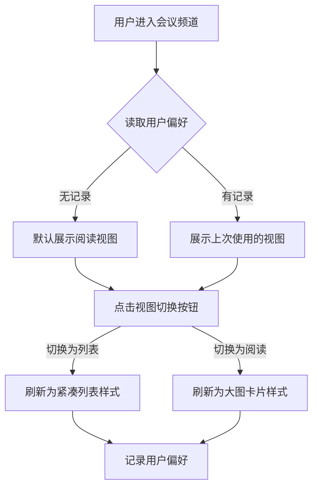

# CSDN会议列表与检索产品需求说明书

## 需求概览

> **核心变革：从“被动寻找”到“主动发现”与“精准触达”**
>
> 作为 CSDN 全新上线的会议频道，我们希望用户从首屏开始就能高效发现符合自身技术栈（如 Java、AI）的会议，而非在海量信息中“大海捞针”。为此，我们将会议列表设计为**兼具“高效浏览”与“沉浸阅读”的双视图模式**，让用户既能快速扫视，又能深入了解。
>
> 更重要的是，我们引入了**轻量级标签订阅**。用户不再需要反复刷新页面查找感兴趣的标签会议，只需在会议详情页点击标签旁的铃铛订阅，该标签下新会议发布时将第一时间收到站内信和 App 推送。通过**多维度标签筛选**（会议形式、会议类型、会议场景、召开时间）与关键词搜索的组合，我们将会议发现的效率显著提升，致力于让每一次技术相遇都恰逢其时。

---

# 第1章：概述

## 1.1 术语表

| 术语 | 英文 | 描述 |
| :--- | :--- | :--- |
| **列表视图** | List View | 一种高密度的信息展示方式，侧重于展示会议的时间、地点、状态等关键元数据，便于快速扫描。 |
| **阅读视图** | Reading View | 一种侧重于视觉体验的展示方式，突出会议海报、摘要和亮点，提供类似文章阅读的沉浸感。 |
| **订阅** | Subscribe | 用户在会议详情页中，通过点击会议标签旁的铃铛图标关注该标签的行为，关注后可接收该标签下新会议发布的站内信及 App 推送。 |
| **多维度标签筛选** | Multi-dimension Tag Filter | 会议列表页筛选区按维度（会议形式、会议类型、会议场景、召开时间）分行展示，每行以可点击的标签按钮供用户选择，选中后列表即时按条件刷新的交互方式。 |

## 1.2 修订记录

| 版本 | 内容 | 负责人 | 更新时间 | 备注 |
| :--- | :--- | :--- | :--- | :--- |
| V1.0 | 初始版本，包含列表双视图、联动筛选、订阅功能 | (待定) | 2026-02-03 | 基于整体方案 6.1 章节细化 |
| V1.1 | 2.2 筛选能力调整：改为多维度标签筛选（会议形式/类型/场景/召开时间），移除线下→城市联动；补充视图切换位置与验收/国际化/埋点 | (待定) | 2026-02-12 | 与当前设计稿一致 |

## 1.3 背景和价值

业界常见的会议列表往往存在以下痛点，我们在一期设计中即予以规避：
1.  **展示效率低**：单一列表无法满足“快速查找”和“逛一逛”两种截然不同的用户诉求。
2.  **触达被动**：用户必须主动检索才能发现会议，极易错过热门活动。
3.  **筛选体验差**：筛选维度单一，难以按会议类型、场景、时间快速缩小范围，用户需在长列表中逐条浏览。

**业务价值**：
1.  **提升报名转化率**：通过精准的筛选和双视图切换，缩短用户从“发现”到“点击详情”的路径。
2.  **构建私域流量**：通过订阅功能，帮助主办方（企业）积累粉丝，同时提高平台的用户留存率。
3.  **优化流量分发**：结构化的筛选数据有助于算法更精准地进行会议推荐。

---

# 第2章：功能需求详情

## 2.1 会议列表与双视图切换

### 场景描述
**场景一：高效查找**
小王（Java开发工程师）想快速寻找本周末在北京举办的所有技术沙龙。他进入会议频道，默认看到**列表视图**，清晰地列出了时间、地点和状态，他迅速筛选出 3 个候选会议。

**场景二：闲暇浏览**
小李（AI研究员）在通勤路上想看看最近有哪些有趣的行业大会。她切换到**阅读视图**，大图卡片展示了精美的会议海报和精彩亮点，她像刷朋友圈一样浏览，发现了一个感兴趣的 AIGC 峰会并点击收藏。

### 业务流程


### 基本事件流程

#### 主业务流程
1.  **列表初始化**：
    *   【前置条件】：用户访问 CSDN 会议频道（Web/App）。
    *   【基本事件流程】：
        *   系统根据用户上次的视图偏好（本地缓存）加载会议数据。若无偏好，默认加载**阅读视图**。
        *   列表按“推荐权重 > 发布时间”降序排列。
        *   系统仅展示状态为「已发布」、「进行中」、「已结束」的会议（「已结束」会议默认沉底或需通过筛选查看）。
    *   【后置条件】：列表加载完成，展示第一页数据。

2.  **视图切换**：
    *   【基本事件流程】：
        *   用户点击列表顶部的“视图切换”图标（列表图标/卡片图标）。
        *   系统即时重新渲染列表区域：
            *   **阅读视图**：展示 16:9 大海报、会议标题（2行）、主办方头像与名称、核心标签、报名热度。
            *   **列表视图**：左侧 1:1 小图，右侧展示标题（1行）、时间（格式化的具体日期）、地点（城市+场馆）、状态标签（报名中/进行中）。
        *   系统自动保存当前选择至本地缓存。

#### 异常事件流程
*   **数据加载失败**：若网络异常导致列表数据获取失败，显示统一的缺省页（空状态图），并提供“重新加载”按钮。
*   **无数据**：若当前筛选条件下无会议，显示“暂无相关会议，可进入感兴趣的会议详情页订阅标签获取推送”的引导提示（引导去订阅）。

---

## 2.2 智能筛选与检索

### 场景描述
用户在会议频道顶部通过搜索框输入关键词（如“Java”）后，可在搜索栏下方按多维度筛选会议：**会议形式**、**会议类型**、**会议场景**、**召开时间**。每一维度以一行标签式按钮展示，用户点击某一标签即选中该条件，列表即时刷新；选择“全部”即清除该维度条件。搜索栏右侧提供**网格视图/列表视图**切换，便于用户在不同展示方式下浏览筛选结果。

**业务场景示例**：
*   **场景一**：开发者想找本周可参加的线下技术沙龙。在搜索框旁保持默认“全部”，在“会议形式”选“线下”、“会议类型”选“技术沙龙”、“召开时间”选“本周”，列表仅展示符合条件的会议。
*   **场景二**：用户关注产业向会议。在“会议场景”中选择“产业会议”，其他维度保持“全部”，快速浏览该类会议。

### 基本事件流程

#### 主业务流程
1.  **关键词搜索**：
    *   用户在顶部搜索框输入关键词（如“Java”），占位符提示：搜索会议名称、主办方或标签…。
    *   系统执行混合检索：优先匹配**会议标题**，其次匹配**标签（Tag）**、**主办方**，再次匹配**简介**。
    *   用户确认搜索或选择筛选条件后，列表按当前关键词 + 各维度筛选条件刷新。

2.  **多维度标签筛选**：
    *   筛选区位于搜索栏下方，分为多行，每行对应一个维度，行首为维度名称（带下拉箭头图标），后跟一组可点击的标签按钮。
    *   **会议形式**：全部、线上、线下、线上+线下。用户点击某一项即选中，选中态高亮（如橙色），列表仅展示该形式的会议；“全部”表示不限制形式。
    *   **会议类型**：全部、技术峰会、技术沙龙、技术研讨会。每维度单选，逻辑同会议形式。
    *   **会议场景**：全部、开发者会议、产业会议、产品发布会议、区域营销会议、高校会议。交互同上。
    *   **召开时间**：全部、本周、本月、未来三个月。交互同上，列表仅展示落在对应时间范围内的会议。
    *   **系统响应**：用户点击任一维度的某一标签后，该维度当前选中项更新，列表立即根据“当前关键词 + 各维度当前选中值”重新请求并刷新；若某维度为“全部”，则该维度不参与过滤。

3.  **视图切换（与列表联动）**：
    *   搜索栏右侧提供两个图标按钮：网格视图（如 2×2 宫格图标）、列表视图（列表图标）。当前选中的视图高亮显示。
    *   用户点击另一视图时，列表区域切换为对应展示方式（与 2.1 双视图定义一致），并持久化用户偏好。

#### 扩展事件流程
*   **组合筛选**：用户可同时选择多个维度（如会议形式=线下 + 会议类型=技术沙龙 + 召开时间=本月），列表取各条件交集。
*   **清空筛选**：各维度均选“全部”且搜索框为空时，等价于无筛选；用户将某维度从具体选项改回“全部”即取消该维度条件。

#### 异常事件流程
*   **无结果**：当关键词与筛选条件组合下无会议时，展示统一空状态提示（如“暂无相关会议，可进入感兴趣的会议详情页订阅标签获取推送”），并可提供“清空筛选”或调整条件的引导。

---

## 2.3 订阅与推送

### 场景描述
用户在会议详情页浏览“HarmonyOS 开发者日”时，看到该会议带有“鸿蒙”“华为”等标签。他点击“鸿蒙”标签旁的铃铛图标完成订阅。一周后，平台发布了另一场带“鸿蒙”标签的技术沙龙，用户手机收到 Push 推送：“您订阅的「鸿蒙」有新会议发布，快来报名！”。

### 基本事件流程

#### 主业务流程
1.  **订阅操作**：
    *   **入口**：用户在会议列表页点击某个具体会议，进入会议详情页。
    *   会议详情页下方展示当前会议关联的各类标签（如 AI、鸿蒙、云原生等）。
    *   用户点击某个标签旁的**铃铛图标**，即可订阅该标签。
    *   系统提示“订阅成功，该标签下新会议发布时将第一时间通知您”。
    *   已订阅的标签，铃铛图标展示为已订阅状态（如高亮或填充样式），用户再次点击可取消订阅。

2.  **推送触发（后台逻辑）**：
    *   办会方发布新会议并通过审核。
    *   系统异步匹配新会议的标签与用户订阅库。
    *   若新会议包含用户已订阅的标签，则向该用户发送站内信及 App Push（需用户开启权限）。

---

# 第3章：数据项描述

## 3.1 会议列表项数据结构

| 字段名 | 标识符 | 类型 | 必填 | 说明 | 展示逻辑 |
| :--- | :--- | :--- | :--- | :--- | :--- |
| 会议ID | `meeting_id` | Long | 是 | 唯一主键 | 不展示 |
| 标题 | `title` | String | 是 | 会议名称 | 双视图均展示 |
| 海报地址 | `poster_url` | String | 是 | 图片URL | 阅读视图展示大图，列表视图展示缩略图 |
| 主办方 | `organizer_info` | Object | 是 | 含ID、名称、头像 | 阅读视图展示名称+头像 |
| 状态 | `status` | Enum | 是 | 1:报名中 2:进行中 3:已结束 | 显示对应状态标签 |
| 形式 | `format` | Enum | 是 | 1:线上 2:线下 3:混合 | 筛选条件 |
| 开始时间 | `start_time` | DateTime | 是 | 会议开始时间 | 列表视图格式化显示（如 "02-14 14:00"） |
| 城市 | `city_code` | String | 否 | 线下会议必填 | 列表视图展示，阅读视图不强制展示 |
| 标签 | `tags` | List | 否 | 智能标签或手动标签 | 阅读视图展示前3个 |
| 报名热度 | `hot_score` | Integer | 否 | 浏览/报名综合计算 | 阅读视图展示（如 "1.2k人感兴趣"） |

---

# 第4章：需求波及分析

## 4.1 影响模块与系统
| 影响模块 | 影响说明 | 备注 |
| :--- | :--- | :--- |
| **搜索引擎 (ES)** | 需调整索引结构，支持会议形式、会议类型、会议场景、召开时间等多维度筛选及“标签/标题/主办方”的混合检索与订阅匹配 | 需重建或扩展会议索引 |
| **消息中心** | 新增“会议订阅”类型的消息模板 | 涉及站内信和Push通道 |
| **用户画像** | 用户的订阅数据需写入用户画像系统，用于后续推荐 | 数据同步 |

## 4.2 历史文档查阅记录
> **说明**：在当前项目目录（`CSDN会议功能/`）下未找到历史需求文档目录（`docs/history`）或相关历史 PRD。
>
> **参考来源**：
> *   `CSDN会议功能/CSDN会议产品整体方案.md`：参考了整体架构与功能范围定义。
> *   `CSDN会议功能/docs/技术会议结构化-会议定义.md`：参考了会议的基础字段定义。

---

# 第5章：验收准则

## 5.1 验收场景列表

| 编号 | 场景描述 | Given (前置条件) | When (触发条件) | Then (预期结果) | And (附加验证) |
| :--- | :--- | :--- | :--- | :--- | :--- |
| AC01 | 视图切换记忆 | 用户首次访问列表 | 用户切换到“列表视图”并刷新页面 | 页面重新加载后仍保持“列表视图” | 本地缓存生效 |
| AC02 | 多维度筛选生效 | 用户处于会议列表页，当前为默认筛选（各维度为“全部”） | 用户依次选择会议形式=“线下”、会议类型=“技术沙龙”、召开时间=“本周” | 列表仅展示“线下 + 技术沙龙 + 本周”的会议，且筛选区选中态正确高亮 | 将任一级别改回“全部”后，该维度不再参与过滤，列表相应刷新 |
| AC03 | 订阅内容推送 | 用户已在某会议详情页通过铃铛图标订阅了标签“Java” | 平台发布了一个带有“Java”标签的会议 | 用户收到一条“新会议发布”的站内信 | 点击通知可跳转到新会议详情 |
| AC04 | 列表状态过滤 | 列表中存在未发布会议 | 用户浏览列表 | 仅展示“已发布/进行中/已结束”的会议 | “新建/待审核”会议不可见 |

## 5.2 Gherkin 验收用例

```gherkin
Feature: 会议列表多维度标签筛选
  Scenario: 用户通过多维度标签筛选会议
    Given 用户位于会议列表页
    And 当前各筛选维度均为“全部”
    When 用户在“会议形式”行点击“线下”
    Then “线下”标签呈选中高亮状态
    And 会议列表应自动刷新，仅展示形式为线下的会议
    When 用户再在“会议类型”行点击“技术沙龙”
    Then “技术沙龙”标签呈选中高亮状态
    And 会议列表应仅展示“线下且技术沙龙”的会议

Feature: 视图模式切换与记忆
  Scenario: 切换视图并保持用户偏好
    Given 用户当前处于“阅读视图”
    When 用户点击“列表视图”图标
    Then 会议列表布局应转换为紧凑的行级展示
    And 能够清晰看到每场会议的具体时间与地点
    When 用户刷新浏览器页面
    Then 页面加载完成后应默认保持在“列表视图”
```

---

# 第6章：国际化与埋点

## 6.1 国际化 (i18n)

| 键值 (Key) | 中文 (zh-CN) | 英文 (en-US) |
| :--- | :--- | :--- |
| `view_list` | 列表模式 | List View |
| `view_card` | 阅读模式 | Card View |
| `view_grid` | 网格视图 | Grid View |
| `filter_format` | 会议形式 | Meeting Format |
| `filter_type` | 会议类型 | Meeting Type |
| `filter_scene` | 会议场景 | Meeting Scene |
| `filter_time` | 召开时间 | Time of Conference |
| `filter_all` | 全部 | All |
| `filter_offline` | 线下 | Offline |
| `filter_online` | 线上 | Online |
| `filter_hybrid` | 线上+线下 | Online + Offline |
| `subscribe_btn` | 订阅更新 | Subscribe |
| `empty_tip` | 暂无相关会议，可进入感兴趣的会议详情页订阅标签获取推送 | No events found. Subscribe to tags in meeting details for updates. |

## 6.2 埋点定义

| 模块 | 动作 | 参数 | 说明 |
| :--- | :--- | :--- | :--- |
| 会议列表 | 点击_视图切换 | `target_view` (list/card) | 统计用户偏好的视图模式 |
| 会议列表 | 点击_筛选 | `filter_dimension` (format/type/scene/time), `filter_value` | 统计各维度筛选使用率 |
| 会议详情 | 点击_标签铃铛 | `tag_id`, `meeting_id`, `subscribe_action` (subscribe/unsubscribe) | 统计标签订阅转化率 |
| 会议列表 | 点击_会议卡片 | `meeting_id`, `position` | 统计列表点击率 (CTR) |

---

# 第7章：非功能性需求

1.  **性能要求**：
    *   列表加载时间（首屏）在 4G 网络下不超过 1.5秒。
    *   视图切换需在前端完成渲染，无网络请求，响应时间 < 100ms。
2.  **兼容性**：
    *   Web端兼容 Chrome 80+, Safari 13+, Edge 等主流浏览器。
    *   移动端兼容 iOS 14+ 及 Android 8.0+ 的系统浏览器及 CSDN App 内嵌 WebView。
