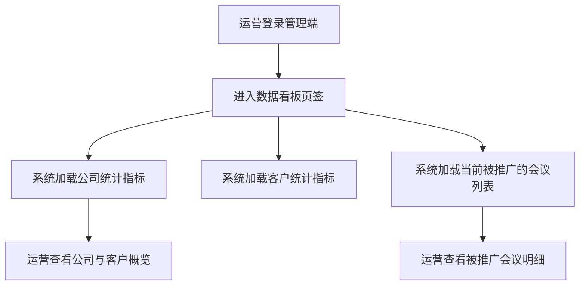

# 会议管理与审核产品需求说明书

## 需求概览

### 核心摘要
本次需求为平台运营团队打造会议审核管理端，采用**三页签**结构：**数据看板**、**会议列表**、**模板管理**。本期在原有**会议列表**与**模板管理**已实现能力基础上，**新增落地数据看板页签的首批核心指标**：在数据看板中集中展示公司统计（如当前已注册的公司数量、已发布会议的公司数量）、客户信息（如已注册客户数量、发布会议的客户数量、活跃参加会议的客户数量）以及当前所有被推广的会议列表，帮助运营从公司与客户两个维度快速把握平台健康度，并对正在投放的会议做到一目了然；会议列表继续承担“看所有会议 + 按状态筛选 + 审核/查看/强制下架”的职责，模板管理保持现有活动模板的配置与上架管理不变。通过**标准化的违规标签**与清晰的列表与操作区分，以及新增的宏观数据看板，本期让审核、治理与运营决策都有据可依。

### 设计思路
设计理念遵循“页签清晰、规则标准化、配置灵活化”。
1.  **页签清晰**：管理端以数据看板、会议列表、模板管理三个页签划分能力，运营按需切换；会议列表统一承载“看所有会议 + 按状态筛选 + 审核/查看”的动线，避免入口分散。
2.  **规则标准化**：在审核与下架环节，建立统一的“违规原因标签库”，为后续的违规分析与自动化策略积累结构化数据。
3.  **配置灵活化**：模板管理将配置能力开放给运营，支持随时增删与上架/下架活动模板，与发起端模板使用字段严格对应。

### 历史实现参考
在审核流程设计上，我们承接了 `docs/发起会议与会议信息管理产品需求说明书.md` 中定义的会议状态流转闭环，确保“通过/驳回”与“下架”操作能正确触发状态变更。活动模板的管理结构严格对应发起端的模板使用字段，确保前后端数据一致。会议列表的“待审核、已发布、进行中、已结束”与现有会议状态定义对齐。

---

# 第1章：概述

## 1.1 术语表

| 术语 | 英文 | 描述 |
| :--- | :--- | :--- |
| **会议审核** | Conference Audit | 运营人员对办会方提交的会议信息进行合规性检查，决定其是否可发布的过程。 |
| **会议列表** | Meeting List | 管理端页签之一，展示所有会议，支持按状态筛选（全部/待审核/已发布/进行中/已结束）；待审核会议支持审核操作，其他状态支持查看操作。 |
| **数据看板** | Data Dashboard | 管理端页签之一，用于展示公司统计（如当前已注册的公司、已发布会议的公司等）、客户信息（如已注册客户数量、发布会议的客户数量、活跃参加会议的客户数量等）以及当前所有被推广的会议等运营数据；本期仅落地上述明确指标，其余统计维度待后续补充确认。 |
| **活动模板管理** | Template Management | 管理端页签之一，运营在后台配置供办会方使用的预置会议模板（含默认文案、封面、场景等）。 |
| **模板状态** | Template Status | 模板生命周期状态：新建（DRAFT）、未上架（UNLISTED）、已上架（LISTED）。仅已上架模板对办会方可见可用；新建与未上架可编辑、可删除，已上架需先下架再编辑或删除。 |
| **违规标签** | Violation Tag | 标准化的审核拒绝或下架原因分类（如“内容违规”、“广告引流”），用于数据统计与用户提示。 |

## 1.2 修订记录

| 版本 | 内容 | 负责人 | 更新时间 | 备注 |
| :--- | :--- | :--- | :--- | :--- |
| V1.0 | 初始版本，包含审核、商业化配置、推荐干预、数据看板 | — | 2026-02-03 | 基于整体方案 6.5 节细化 |
| V1.1 | 细化活动模板配置字段，对齐技术会议结构化定义，全部字段均支持灵活可选配置 | — | 2026-02-09 | — |
| V1.2 | 补充模板状态与配套规则：新建/未上架/已上架三态，仅已上架对办会方可用；已上架须先下架再编辑；仅新建与未上架可删除 | — | 2026-02-10 | — |
| V1.3 | 管理端整体调整为三页签：数据看板（第一期不开发）、会议列表、模板管理；会议列表支持按状态筛选与审核/查看操作区分 | — | 2026-02-12 | — |
| V1.4 | 移除推荐干预（加权模式）功能，暂不开发 | — | 2026-02-12 | — |
| V1.5 | 数据看板本期纳入开发：新增公司统计、客户信息及当前被推广会议展示能力 | — | 2026-03-03 | — |

## 1.3 背景和价值

**背景与痛点**：
随着 CSDN 会议平台业务量的增长，人工运营面临巨大挑战：审核标准不统一导致用户投诉；商业化产品单一且调整需依赖研发排期；活动模板更新滞后，无法引导用户发布高质量内容；缺乏宏观数据监控，难以发现生态问题。

**业务价值**：
1.  **风控能力提升**：通过标准化违规标签与审核流程，降低合规风险，提升审核效率与一致性。
2.  **运营人效倍增**：模板化配置让运营能以较低成本撬动平台内容质量与发布效率。
3.  **决策科学化**：全网数据看板提供实时业务洞察，帮助运营及时发现热门趋势或异常波动。

---

# 第2章：功能需求

会议审核管理端整体采用**页签式**布局，包含三个页签：**数据看板**、**会议列表**、**模板管理**。运营人员通过页签切换进入对应功能模块。

| 页签 | 说明 | 本期开发范围 |
| :--- | :--- | :--- |
| 数据看板 | 在管理端集中查看公司统计（当前已注册的公司、已发布会议的公司等）、客户信息（已注册客户数量、发布会议的客户数量、活跃参加会议的客户数量等）以及当前所有被推广的会议 | 本期实现公司与客户统计指标，以及当前所有被推广会议列表；其余报表类别待后续明确 |
| 会议列表 | 展示所有会议，按状态筛选；对待审核会议进行审核，对其他状态会议进行查看 | 本期实现 |
| 模板管理 | 运营配置供办会方使用的预置会议模板（新建、编辑、上架、下架、删除） | 本期实现，保持现有设计 |

---

## 2.1 数据看板

### 场景描述
**场景 1：公司整体健康度洞察**
运营总监进入管理端后切换到“数据看板”页签，在页面顶部的“公司统计”区域一眼看到“当前已注册的公司数”和“已发布会议的公司数”（例如：当前已注册公司数为 120，已发布会议的公司数为 35），用于判断当前平台服务的公司基盘与活跃办会公司的规模。

**场景 2：客户活跃度监控**
客户运营同学在“数据看板”的“客户信息”区域查看当前“已注册客户数量”、“发布会议的客户数量”以及“活跃参加会议的客户数量”（例如：已注册客户 5,000 人，其中 300 人发布过会议，1,200 人在近一段时间内至少参加过 1 场会议），以评估平台对客户的转化能力与参会活跃度。

**场景 3：当前推广会议一览**
商业化负责人需要快速了解当前有哪些会议正在进行推广投放。在“数据看板”的“被推广的会议”列表区，可以看到当前所有处于推广中的会议（例如：会议名称、推广状态等基础信息），方便与销售、运营沟通投放效果与重点项目。

> 注：以上数值仅为示例，用于说明业务场景，非强制业务指标。



### 基本事件流程

#### 主业务流程

**前置条件**：运营人员已登录管理端，且拥有“数据看板”查看权限。

**基本事件流程**：
1. **进入数据看板页签**
   * 运营人员在管理端顶部页签中点击“数据看板”。
   * 系统进入“数据看板”页签，页面分为“公司统计”、“客户信息”、“被推广的会议”三个主要区域。
2. **公司统计区域展示**
   * 系统在“公司统计”区域展示至少以下两个指标：
     * **当前已注册的公司数**：截至当前时刻，在系统中已完成注册的公司总数量。
     * **已发布会议的公司数**：截至当前时刻，历史上至少发布过 1 场会议的公司总数量。
   * 指标以清晰的数字卡片形式展示（例如大号数字 + 指标名称），用于快速浏览。
3. **客户信息区域展示**
   * 系统在“客户信息”区域展示至少以下三个指标：
     * **已注册客户数量**：截至当前时刻，在系统中已完成注册的客户总数量。
     * **发布会议的客户数量**：截至当前时刻，历史上至少发布过 1 场会议的客户总数量。
     * **活跃参加会议的客户数量**：在业务约定的时间范围内（如近 N 天，具体取值待确认）至少报名或参加过 1 场会议的客户总数量。
   * 指标同样以数字卡片形式展示，便于对比公司与客户两个维度的活跃程度。
4. **被推广的会议列表展示**
   * 系统在“被推广的会议”区域展示当前所有处于推广中的会议列表。
   * 列表中至少包含**会议名称**以及用于标识其处于“被推广”状态的基础信息（如推广状态/标识），具体字段名称与展示样式待补充确认。
   * 运营可通过该列表快速浏览当前正在推广的会议；**列表每条会议项支持点击跳转**：点击后进入该会议的**会议详情页**或**推广配置页**（至少支持其一，具体入口形式如“会议名称可点击”或“查看/推广配置”链接由实现确定），便于进一步查看与操作。跳转目标页面及权限控制与会议列表的“查看”能力保持一致。

**后置条件**：数据看板在任意时刻打开时，均能展示一组关于公司、客户及被推广会议的最新统计数据，帮助运营在无需跳转多页面的情况下掌握核心运营指标。

#### 扩展事件流程

* **被推广会议列表的跳转能力**
  * “被推广的会议”列表中每条会议项提供**跳转入口**（如会议名称可点击，或每行提供“查看”/“推广配置”链接）。
  * 点击后跳转至该会议的**会议详情页**或**推广配置页**（至少支持其一），便于运营进一步查看会议信息或推广配置。
  * 跳转目标页面与权限控制与会议列表的“查看”能力保持一致：拥有数据看板或会议列表查看权限的运营人员可正常使用跳转并访问目标页；若目标页（如推广配置）存在独立权限，则按系统既有权限规则校验。

#### 异常事件流程

* **暂无数据场景**
  * 若当前暂无注册公司或注册客户（如平台初期），则对应指标显示为 0，页面可正常打开。
  * 若当前不存在任何处于推广中的会议，则“被推广的会议”列表区域展示为空状态文案（如“当前暂无正在推广的会议”），不报错。
* **数据加载失败**
  * 若由于网络或后台异常导致公司统计、客户信息或被推广会议列表任一数据块加载失败，系统在对应区域展示错误提示（如“数据加载失败，请重试”），不影响其他已成功加载的数据块展示。

### 数据项描述（数据看板相关）

本功能不单独新增数据编辑能力，仅在管理端聚合展示已有“公司”“客户”“推广会议”等数据的统计结果。数据来源依赖于当前系统中对公司、客户及推广数据的既有定义；若现有系统尚未沉淀对应数据结构或枚举，则需在相关文档中补充。

| 指标名称 | 说明 | 统计口径（业务层） | 备注 |
| :--- | :--- | :--- | :--- |
| 当前已注册的公司数 | 统计当前在平台上已完成注册的公司数量 | 截至查询时刻，具有“公司”主体且已完成注册流程的唯一公司数量（按公司主键计数） | 需确认“公司”的具体判定标准（如是否包含个人主体/团队） |
| 已发布会议的公司数 | 统计历史上至少发布过 1 场会议的公司数量 | 截至查询时刻，历史上存在至少 1 场会议处于“已发布”或后续状态（进行中/已结束/已下架等）的公司数量 | 需确认是否包含曾发布后已被全部删除/下架的公司 |
| 已注册客户数量 | 统计当前在平台上已完成注册的客户数量 | 截至查询时刻，具有有效账户且已完成注册流程的客户数量 | 需确认“客户”与“用户”的边界（是否仅指企业客户，还是包含个人） |
| 发布会议的客户数量 | 统计历史上至少创建并发布过 1 场会议的客户数量 | 截至查询时刻，作为会议创建者或主办方身份，历史上至少发布过 1 场会议的客户数量 | 与“已发布会议的公司数”的统计口径保持一致，仅粒度不同 |
| 活跃参加会议的客户数量 | 统计在业务约定时间范围内有参会行为的客户数量 | 在约定时间范围内（如近 N 天，具体待确认）至少报名或参加过 1 场会议的客户数量 | 此处信息不明确，需补充确认：活跃时间窗口取值（如近 30 天）以及“参加”是否以报名成功、签到成功或其它口径为准 |
| 当前所有被推广的会议列表 | 展示当前处于推广中的会议清单 | 截至查询时刻，处于“推广中”状态的全部会议集合 | 此处信息不明确，需补充确认：推广状态的判定规则（如是否包含待支付订单）、列表字段与排序规则 |

---

## 2.2 会议列表

### 场景描述
**场景 1：日常审核驳回**
审核员小李在“会议列表”页签下切换到“待审核”状态，发现一个会议的简介中充斥着无关的博彩广告。他点击该会议的“审核”操作，进入审核详情后点击“驳回”，在弹出的原因选择框中选中标准标签“**广告引流**”和“**内容违规**”，并补充备注“请删除博彩相关链接”。提交后，会议状态变为“已拒绝”，办会方立刻收到带有具体原因的通知。

**场景 2：按状态查看与强制下架**
运营经理接到举报，某已发布的会议涉嫌虚假宣传。经理在“会议列表”中选择“已发布”或“全部”，检索到该会议，点击“查看”进入详情后执行“强制下架”。系统提示选择下架原因，经理选择“**虚假信息**”，确认后会议立即从 C 端列表消失（状态变更为“已下架/已结束”），并触发系统消息通知主办方整改。

**场景 3：查看进行中与已结束会议**
运营需要盘点本周已结束的会议，在“会议列表”页签下选择“已结束”，列表展示所有已结束会议；点击某会议的“查看”进入详情页查看完整信息，无审核操作入口。

### 基本事件流程

#### 主业务流程
**前置条件**：运营人员登录后台，拥有“会议审核”或“会议列表”相关权限。

**流程描述**：
1.  **页签与列表展示**：
    *   在管理端进入“会议列表”页签。
    *   展示当前**所有会议**，列表字段包括：**会议信息**（如会议名称等）、**发起方**、**时间地点**、**规模**、**状态**、**操作**。
    *   支持按**状态**筛选查看：**全部**、**待审核**、**已发布**、**进行中**、**已结束**。默认展示“全部”。
2.  **操作权限与入口**：
    *   **待审核**状态的会议：操作列提供“**审核**”入口。管理员点击后进入审核详情，可执行“通过”或“驳回”。
    *   **其他状态**（已发布、进行中、已结束等）的会议：操作列仅提供“**查看**”入口。管理员点击后进入会议详情页查看完整信息，不提供审核通过/驳回；对已发布、进行中的会议若需下架，在详情页或列表中提供“强制下架”能力（见下）。
3.  **审核详情与通过/驳回**（仅待审核会议）：
    *   点击待审核会议的“审核”，进入审核详情页，可查看会议完整信息（标题、简介、海报、嘉宾等）。
    *   **通过**：
        *   点击“通过”。
        *   系统判断当前时间：若未开始则状态流转为 `已发布`（预告/报名中）；若已开始则状态流转为 `进行中`。
        *   系统发送“审核通过”通知给办会方。
    *   **驳回**：
        *   点击“驳回”。
        *   **选择原因标签（必选）**：从预置标签库中选择（支持多选）。*预置标签：内容违规、虚假信息、广告引流、质量低劣、类目错误、重复提交、其他。*
        *   填写详细备注（可选），确认提交。
        *   状态流转为 `已拒绝`，系统发送“审核驳回”通知给办会方，包含标签与备注内容。
4.  **强制下架**（已发布或进行中的会议）：
    *   在会议列表中或会议详情页，对状态为 `已发布` 或 `进行中` 的会议可执行“强制下架”。
    *   选择下架原因标签（同驳回标签库）并可选填备注，确认后状态流转为 `已下架`，并通知主办方。

**后置条件**：列表状态筛选与展示、操作入口（审核/查看）与会议状态一致；审核与下架后状态、通知与审核记录正确更新。

#### 异常事件流程
*   **重复审核**：若多人同时审核同一会议，后提交者提示“该会议已被审核处理，请刷新列表”。

### 数据项描述（会议列表相关）
会议列表展示的数据来源于会议主数据及关联的发起方信息，字段需包含：会议信息（名称等）、发起方、时间地点、规模、状态。具体字段命名与接口由技术方案对齐会议定义文档，本节不展开表结构变更。

---

## 2.3 模板管理（活动模板）

### 场景描述
运营人员可在此配置**各种会议形式的预置模板**（如技术沙龙、技术峰会、研讨会等），并对模板进行新建、编辑、上架与删除等管理。仅**已上架**的模板会在办会方发起会议时展示并可被选用；新建与未上架的模板仅在运营后台可见，用于筹备或暂时下线。

**场景 1：更新活动模板**
发现近期“AI 转型”话题火热，运营小张在“模板管理”中新增“AI 转型研讨会”模板（初始为**新建**状态）。他配置了默认封面图，预置了包含“大模型落地、算力挑战”等小标题的简介文案，并设置排序权重为 100（最靠前）。保存后执行“上架”，模板变为**已上架**，办会方在发起会议时即可看到该新模板。

**场景 2：下架后再编辑**
某“技术沙龙”模板已上架且被多次使用，运营需要调整其预置简介。因该模板当前为**已上架**，系统不允许直接编辑。运营先将其“下架”为**未上架**，再进入编辑页修改文案，保存后可重新“上架”供办会方使用。

### 基本事件流程

#### 主业务流程
**前置条件**：运营人员登录后台，拥有“活动模板管理”权限。

1.  **活动模板管理**：
    *   **列表展示**：展示现有模板，包括名称、适用场景、使用次数、排序、**模板状态**（新建 / 未上架 / 已上架）。支持按状态筛选。
    *   **模板状态说明**：
        *   **新建**：刚创建或仅保存未上架过的模板；可编辑、可删除。
        *   **未上架**：曾上架后被下架的模板；可编辑、可删除。
        *   **已上架**：当前对办会方可见、可选的模板；**仅已上架的模板**可在办会方发起会议时被使用；不可直接编辑、不可直接删除，需先执行“下架”变为未上架后再编辑或删除。
    *   **新建/编辑模板**：运营可灵活配置以下预置字段，**所有字段均为可选**，按需填写即可；未填写的字段在办会方应用模板时保持为空，由办会方自行补充。
        *   **可编辑范围**：仅**新建**、**未上架**状态的模板支持编辑。对**已上架**模板点击编辑时，系统提示：“该模板已上架，请先下架后再编辑”，并引导至“下架”操作。
    *   **状态流转**：
        *   新建 → **上架** → 已上架。
        *   已上架 → **下架** → 未上架。
        *   未上架可再次**上架** → 已上架。
    *   **删除**：仅**新建**、**未上架**状态的模板支持删除。**已上架**模板不提供删除入口；若需删除，须先下架为未上架后再删除。删除前系统可二次确认（如“确定删除该模板？删除后不可恢复。”）。
**后置条件**：模板列表与状态、办会端可选模板列表与后台操作结果一致；状态变更与编辑、删除规则符合上述约定。

#### 异常事件流程
*   **已上架模板编辑**：运营对“已上架”模板点击编辑时，系统提示“该模板已上架，请先下架后再编辑”，不进入编辑页。
*   **已上架模板删除**：已上架模板不展示“删除”按钮或入口；若通过其他方式发起删除请求，系统提示“已上架的模板不可直接删除，请先下架后再操作”。

### 2.3.1 模板配置字段说明

模板字段与 `docs/技术会议结构化-会议定义.md` 及发起会议表单保持一致，**运营在管理端配置时所有字段均为可选**，可灵活配置。办会方应用模板时，仅对模板中已配置的字段进行预填充，未配置字段由办会方自行填写。

| 字段分组 | 字段名 | 标识符 | 类型 | 必填 | 说明 | 关联文档 ID |
| :--- | :--- | :--- | :--- | :--- | :--- | :--- |
| **基础信息** | 模板名称 | `name` | String | 是 | 模板在列表中的展示名称 | — |
| | 排序权重 | `sort_weight` | Int | 是 | 默认 0，越大越靠前 | — |
| | 会议名称前缀 | `default_title_prefix` | String | 否 | 预置的会议名称前缀，办会方可在此后追加 | 1.1 |
| | 主办方默认值 | `default_host_company` | String | 否 | 预置主办方名称 | 1.2 |
| | 部门 | `default_department` | String | 否 | 预置部门 | 1.2.1 |
| | 联系人 | `default_contact` | String | 否 | 预置联系人 | 1.2.2 |
| | 职位 | `default_contact_title` | String | 否 | 预置职位 | 1.2.2.1 |
| | 联系方式 | `default_contact_phone` | String | 否 | 预置联系电话 | 1.2.2.2 |
| **会议形式与场景** | 会议形式 | `default_form` | Enum | 否 | 选项：线上、线下、线上线下结合 | 1.3 |
| | 会议类型 | `default_meeting_type` | Enum | 否 | 选项：技术沙龙、技术峰会、技术研讨会 | 1.3.2 |
| | 会议场景 | `default_scene` | Enum | 否 | 选项：开发者会议、产业会议、产品发布会议、区域营销、高校会议 | 1.4 |
| | 重现性 | `default_recurrence` | Enum | 否 | 选项：定期举办、单次举办 | 1.3.3 |
| | 会议规模 | `default_scale` | Enum | 否 | 选项：1000人以上、500~1000人、200~500人、100~200人 | 1.7 |
| | 会议时长 | `default_duration` | Enum | 否 | 选项：半天、一天、两天、三天或更长 | 1.8 |
| **场景联动字段** | 开发者类型 | `default_dev_type` | String | 否 | 多选，逗号分隔 | 1.4.x.2 |
| | 所属产业 | `default_industry` | Enum | 否 | 会议场景=产业会议时展示 | 1.4.2.1 |
| | 涉及产品 | `default_products` | String | 否 | 会议场景=产品发布会议时展示 | 1.4.3.1 |
| | 涉及区域 | `default_regions` | String | 否 | 多选，逗号分隔；会议场景=区域营销时展示 | 1.4.4.1 |
| | 涉及高校 | `default_universities` | String | 否 | 多选，逗号分隔；会议场景=高校会议时展示 | 1.4.5.1 |
| | 举办地域 | `default_location` | String | 否 | 多选，逗号分隔；会议形式含线下时展示 | 1.6 |
| **会议内容** | 预置简介 | `default_intro` | Text | 否 | Markdown 格式，可含“活动背景、演讲嘉宾、日程安排”等骨架 | — |
| | 预置封面 | `cover_url` | String | 否 | 默认海报图 URL，比例 16:9 | — |
| | 适合人群 | `default_audience` | String | 否 | 多选，逗号分隔；初级/中级/高级、前端/后端/AI 等 | 1.9 |
| | 会议标签 | `default_tags` | String | 否 | 多选，逗号分隔；最多 5 个 | — |
| | 演讲主题骨架 | `default_topic_skeleton` | Text | 否 | 预置演讲主题填写框架 | 2.1 |
| | 圆桌讨论骨架 | `default_panel_skeleton` | Text | 否 | 预置圆桌讨论填写框架 | 2.2 |
| | 其他内容载体 | `default_other_content` | Text | 否 | 预置其他内容载体形式 | 2.4 |
| | 图像传播 | `default_image_media` | String | 否 | 多选，逗号分隔；视频直播、图片直播、第三方媒体直播 | 2.5.1 |
| | 文字传播 | `default_text_media` | String | 否 | 多选，逗号分隔；在线社区、私域社群、第三方媒体 | 2.5.2 |

> **说明**：模板名称、排序权重为管理端必填项；其余字段均为可选，运营可根据业务需要灵活配置。办会方应用模板后，可对预填充内容进行修改或补充。

---

# 第3章：数据项描述

## 3.1 活动模板表 (Activity_Template)
运营配置的快速创建模板。除模板名称、排序权重、状态外，其余字段均为可选；运营可灵活配置，未配置字段在办会方应用时不预填充。

| 字段名 | 标识符 | 类型 | 必填 | 说明 |
| :--- | :--- | :--- | :--- | :--- |
| 模板 ID | `template_id` | Long | 是 | 主键 |
| 模板名称 | `name` | String | 是 | 列表展示名称 |
| 排序权重 | `sort_weight` | Int | 是 | 默认 0，越大越靠前 |
| 状态 | `status` | Enum | 是 | DRAFT(新建), UNLISTED(未上架), LISTED(已上架)。仅 LISTED 的模板对办会方可见可用。 |
| 会议名称前缀 | `default_title_prefix` | String | 否 | 对应 1.1 |
| 主办方默认值 | `default_host_company` | String | 否 | 对应 1.2 |
| 部门 | `default_department` | String | 否 | 对应 1.2.1 |
| 联系人 | `default_contact` | String | 否 | 对应 1.2.2 |
| 职位 | `default_contact_title` | String | 否 | 对应 1.2.2.1 |
| 联系方式 | `default_contact_phone` | String | 否 | 对应 1.2.2.2 |
| 会议形式 | `default_form` | String | 否 | online/offline/hybrid |
| 会议类型 | `default_meeting_type` | String | 否 | tech_salon/tech_summit/tech_seminar |
| 会议场景 | `default_scene` | String | 否 | developer/industry/product_launch/regional/university |
| 重现性 | `default_recurrence` | String | 否 | recurring/one_time |
| 会议规模 | `default_scale` | String | 否 | 1000+/500_1000/200_500/100_200 |
| 会议时长 | `default_duration` | String | 否 | half_day/one_day/two_days/three_plus |
| 开发者类型 | `default_dev_type` | String | 否 | 多选，逗号分隔 |
| 所属产业 | `default_industry` | String | 否 | AI/cloud/open_source 等 |
| 涉及产品 | `default_products` | String | 否 | 1.4.3.1 |
| 涉及区域 | `default_regions` | String | 否 | 多选，逗号分隔 |
| 涉及高校 | `default_universities` | String | 否 | 多选，逗号分隔 |
| 举办地域 | `default_location` | String | 否 | 多选，逗号分隔 |
| 预置简介 | `default_intro` | Text | 否 | Markdown 格式 |
| 预置封面 | `cover_url` | String | 否 | 图片 URL，比例 16:9 |
| 适合人群 | `default_audience` | String | 否 | 多选，逗号分隔 |
| 会议标签 | `default_tags` | String | 否 | 最多 5 个，逗号分隔 |
| 演讲主题骨架 | `default_topic_skeleton` | Text | 否 | 对应 2.1 |
| 圆桌讨论骨架 | `default_panel_skeleton` | Text | 否 | 对应 2.2 |
| 其他内容载体 | `default_other_content` | Text | 否 | 对应 2.4 |
| 图像传播 | `default_image_media` | String | 否 | 多选，逗号分隔 |
| 文字传播 | `default_text_media` | String | 否 | 多选，逗号分隔 |
| 使用次数 | `use_count` | Int | 否 | 办会方使用该模板创建会议的次数，供列表展示 |

## 3.2 审核记录表 (Audit_Log)
记录每一次审核操作及其原因。

| 字段名 | 标识符 | 类型 | 必填 | 说明 |
| :--- | :--- | :--- | :--- | :--- |
| 记录 ID | `log_id` | Long | 是 | 主键 |
| 会议 ID | `meeting_id` | Long | 是 | |
| 操作类型 | `action_type` | Enum | 是 | APPROVE(通过), REJECT(驳回), TAKEDOWN(下架) |
| 原因标签 | `tags` | String | 否 | 多选，逗号分隔 (如 "Ad_Spam,Low_Quality") |
| 详细备注 | `comment` | String | 否 | 人工输入 |
| 操作人 | `operator_id` | Long | 是 | 运营人员 ID |
| 操作时间 | `operate_time` | DateTime | 是 | |

---

# 第4章：需求波及分析

## 4.1 影响模块

| 影响模块 | 影响说明 | 关联文档 |
| :--- | :--- | :--- |
| **发起会议端** | 需适配从“活动模板表”动态拉取模板列表，而非前端写死。 | `docs/发起会议与会议信息管理产品需求说明书.md` |
| **我的会议端** | 权益购买页需跳转或对接广告系统；接收审核/下架通知。 | `docs/我的会议与商业化产品需求说明书.md` |
| **数据看板/商业化推广模块** | 数据看板需从商业化与推广配置中聚合“当前被推广的会议”列表，其统计口径与《我的会议与商业化产品需求说明书》中推广配置与推广订单的定义保持一致。 | `docs/我的会议与商业化产品需求说明书.md` |
| **消息中心** | 需新增“审核驳回”与“强制下架”的消息模板，支持透出原因标签与备注。 | — |

## 4.2 历史文档查阅记录

#### 历史需求文档
- **文档名称**：`CSDN会议功能/docs/技术会议结构化-会议定义.md`
- **文档位置**：`CSDN会议功能/docs/技术会议结构化-会议定义.md`
- **参考功能**：模板配置字段与会议定义文档中的字段一一对应（如 1.1~1.9、2.1~2.5），确保办会方应用模板时数据可直接填充至发起会议表单。
- **设计一致性**：字段标识符与关联文档 ID 保持映射关系，便于开发实现。

- **文档名称**：`CSDN会议功能/docs/发起会议与会议信息管理产品需求说明书.md`
- **文档位置**：`CSDN会议功能/docs/发起会议与会议信息管理产品需求说明书.md`
- **参考功能**：
    - 参考了会议的**状态机**定义，确保运营端的“通过/驳回”操作与 C 端的“新建/待审核/发布”状态完全兼容。
    - 参考了**活动模板**的使用场景，据此设计了运营端的模板配置字段（预置简介、封面等）。
- **设计一致性**：模板配置字段的命名（如 `scene_code`）与发起端保持一致，确保数据可直接渲染。

- **文档名称**：`CSDN会议功能/docs/我的会议与商业化产品需求说明书.md`
- **文档位置**：`CSDN会议功能/docs/我的会议与商业化产品需求说明书.md`
- **参考功能**：
    - 参考了**数据权益解锁**的业务流程。
    - 参考了**推广配置与推广订单**的定义，用于界定“被推广的会议”列表中会议的统计口径与范围。
- **设计一致性**：权益类型枚举 `DATA_PREMIUM` 及推广配置相关枚举保持一致，确保购买数据权益及推广配置在各端表现与统计口径统一。

---

# 第5章：验收准则

## 5.1 验收准则表格

| 编号 | 场景描述 | Given (前置条件) | When (触发条件) | Then (预期结果) | And (附加验证) |
| :--- | :--- | :--- | :--- | :--- | :--- |
| **AC01** | 会议列表页签与状态筛选 | 运营已登录管理端且拥有会议列表权限 | 进入“会议列表”页签，选择状态筛选为“待审核” | 列表仅展示状态为待审核的会议，且操作列显示“审核” | 切换为“已结束”时，列表仅展示已结束会议，操作列显示“查看” |
| **AC02** | 待审核会议仅展示审核操作 | 会议列表中存在至少一条待审核会议 | 查看该会议行的操作列 | 仅展示“审核”入口，不展示“查看” | 点击“审核”进入审核详情后可执行通过/驳回 |
| **AC03** | 非待审核会议仅展示查看操作 | 会议列表中存在已发布或进行中或已结束的会议 | 查看该会议行的操作列 | 仅展示“查看”入口，不展示“审核” | 点击“查看”进入详情页；已发布、进行中会议在详情页或列表中可执行强制下架 |
| **AC04** | 审核驳回带标签 | 运营在会议列表待审核态下，点击某会议的“审核” | 在审核详情中点击“驳回”并勾选“广告引流”标签，提交 | 会议状态变为“已拒绝” | 办会方收到包含“广告引流”原因的通知 |
| **AC05** | 模板动态下架 | 前端发起页正在展示“技术沙龙”模板，该模板状态为“已上架” | 运营在“模板管理”页签对“技术沙龙”模板执行“下架”操作 | 模板状态变为“未上架”，操作成功 | 刷新前端发起页，该模板不再显示 |
| **AC06** | 数据看板展示公司统计指标 | 系统中已注册公司数量为 120 家，已发布会议的公司数量为 35 家；运营已登录管理端且拥有数据看板权限 | 进入“数据看板”页签 | 数据看板“公司统计”区域分别展示“当前已注册的公司数=120”“已发布会议的公司数=35” | 再次刷新页面后，两项指标与后台统计结果保持一致 |
| **AC07** | 数据看板展示客户信息指标 | 系统中已注册客户数量为 5,000 人，其中 300 人发布过会议，1,200 人在定义的活跃时间窗口内至少参加过 1 场会议；运营已登录并拥有数据看板权限 | 进入“数据看板”页签 | 数据看板“客户信息”区域分别展示“已注册客户数量=5,000”“发布会议的客户数量=300”“活跃参加会议的客户数量=1,200” | 若基础数据发生变化，刷新页面后三项指标同步更新 |
| **AC08** | 数据看板展示当前被推广的会议列表 | 当前存在 3 场处于推广中的会议 A/B/C；运营已登录并拥有数据看板权限 | 进入“数据看板”页签 | “被推广的会议”列表区域展示会议 A/B/C 的列表项，且每条至少包含会议名称及处于推广中的标识信息 | 列表中不出现不在推广中的会议，列表条数与后台“推广中”会议数量一致 |
| **AC09** | 无推广会议时展示空状态 | 当前不存在任何处于推广中的会议；运营已登录并拥有数据看板权限 | 进入“数据看板”页签 | “被推广的会议”列表区域不展示任何会议条目 | 区域内展示空状态文案（如“当前暂无正在推广的会议”），页面其他统计区域正常展示 |

| **AC10** | 被推广会议列表支持点击跳转 | 当前存在至少 1 场处于推广中的会议；运营已登录并拥有数据看板权限 | 在“数据看板”页签的“被推广的会议”列表中点击某条会议项（如会议名称或“查看”/“推广配置”链接） | 系统跳转至该会议的会议详情页或推广配置页 | 跳转后页面展示对应会议的信息；权限不足时按系统既有规则提示或拦截 |

## 5.2 Gherkin 验收用例

```gherkin
Feature: 会议列表页签与操作

  Scenario: 按状态筛选会议列表
    Given 运营人员已登录管理端并进入"会议列表"页签
    And 系统中存在待审核、已发布、已结束等不同状态的会议
    When 运营人员选择状态筛选为"待审核"
    Then 列表仅展示状态为"待审核"的会议
    And 每条会议的操作列展示"审核"入口
    When 运营人员选择状态筛选为"已结束"
    Then 列表仅展示状态为"已结束"的会议
    And 每条会议的操作列展示"查看"入口

  Scenario: 待审核会议仅支持审核操作
    Given 会议列表中有一条状态为"待审核"的会议
    When 运营人员查看该会议行的操作列
    Then 应仅展示"审核"入口，不展示"查看"入口
    When 运营人员点击"审核"
    Then 进入审核详情页，可执行"通过"或"驳回"

  Scenario: 非待审核会议仅支持查看操作
    Given 会议列表中有一条状态为"已发布"的会议
    When 运营人员查看该会议行的操作列
    Then 应展示"查看"入口
    And 不展示"审核"入口
    When 运营人员点击"查看"
    Then 进入会议详情页查看完整信息

  Scenario: 审核驳回流程验证
    Given 存在一个状态为"待审核"的会议申请"AI沙龙"
    When 运营人员在会议列表中点击该会议的"审核"
    And 在审核详情中点击"驳回"按钮
    And 选择驳回原因标签为"Content_Violation"(内容违规)
    And 填写备注"请移除敏感词"
    And 点击确认提交
    Then 该会议的状态应更新为"已拒绝"
    And 审核记录表中应新增一条包含标签"Content_Violation"的记录
    And 系统应发送一条消息给主办方，内容包含"内容违规"和"请移除敏感词"

Feature: 管理端数据看板

  Scenario: 展示公司统计指标
    Given 系统中已注册公司数量为 120 家且已发布会议的公司数量为 35 家
    And 运营人员已登录管理端并拥有数据看板查看权限
    When 运营人员进入"数据看板"页签
    Then 页面上的"当前已注册的公司数"应显示为 120
    And 页面上的"已发布会议的公司数"应显示为 35

  Scenario: 展示客户信息指标
    Given 系统中已注册客户数量为 5000 人
    And 其中 300 人发布过会议
    And 其中 1200 人在约定的活跃时间窗口内至少参加过 1 场会议
    And 运营人员已登录管理端并拥有数据看板查看权限
    When 运营人员进入"数据看板"页签
    Then 页面上的"已注册客户数量"应显示为 5000
    And 页面上的"发布会议的客户数量"应显示为 300
    And 页面上的"活跃参加会议的客户数量"应显示为 1200

  Scenario: 存在推广会议时展示被推广会议列表
    Given 当前存在 3 场处于推广中的会议 A、B、C
    And 运营人员已登录管理端并拥有数据看板查看权限
    When 运营人员进入"数据看板"页签
    Then "被推广的会议"列表中应至少包含会议 A、B、C 的条目
    And 列表中不应包含处于非推广状态的会议

  Scenario: 无推广会议时展示空状态
    Given 当前不存在任何处于推广中的会议
    And 运营人员已登录管理端并拥有数据看板查看权限
    When 运营人员进入"数据看板"页签
    Then "被推广的会议"列表区域不应展示任何会议条目
    And 应展示类似"当前暂无正在推广的会议"的空状态提示

  Scenario: 从被推广会议列表点击跳转至会议详情或推广配置页
    Given 当前存在至少 1 场处于推广中的会议
    And 运营人员已登录管理端并拥有数据看板查看权限
    When 运营人员进入"数据看板"页签
    And 在"被推广的会议"列表中点击某条会议项（如会议名称或"查看"/"推广配置"链接）
    Then 系统应跳转至该会议的会议详情页或推广配置页
    And 跳转后页面应展示对应会议的信息
```

---

# 第6章：国际化与埋点

## 6.1 国际化 (i18n)

| 键值 (Key) | 中文 (zh-CN) | 英文 (en-US) |
| :--- | :--- | :--- |
| `tag_ad_spam` | 广告引流 | Advertising Spam |
| `tag_content_violation` | 内容违规 | Content Violation |
| `tab_dashboard` | 数据看板 | Data Dashboard |
| `section_company_stats` | 公司统计 | Company Stats |
| `section_client_stats` | 客户信息 | Client Info |
| `section_promoted_meetings` | 被推广的会议 | Promoted Meetings |
| `metric_total_companies` | 当前已注册的公司数 | Total Registered Companies |
| `metric_published_companies` | 已发布会议的公司数 | Companies With Published Meetings |
| `metric_total_clients` | 已注册客户数量 | Total Registered Clients |
| `metric_publisher_clients` | 发布会议的客户数量 | Clients Who Published Meetings |
| `metric_active_clients` | 活跃参加会议的客户数量 | Active Participant Clients |
| `empty_no_promoted_meetings` | 当前暂无正在推广的会议 | No promoted meetings at the moment |

## 6.2 埋点定义

| 模块 | 指标名称 | 指标定义 | 端 | 触发时机 |
| :--- | :--- | :--- | :--- | :--- |
| 审核管理 | 审核处理量 | 运营人员点击通过/驳回的次数 | Web | 点击提交时 |
| 审核管理 | 违规标签分布 | 各违规标签被选中的次数 | Web | 驳回/下架提交时 |
| 数据看板 | 查看_数据看板 | 进入或刷新“数据看板”页签的次数 | Web | 进入或刷新“数据看板”页签时 |
| 数据看板 | 曝光_公司与客户统计 | 数据看板成功加载并展示公司统计与客户信息区域的次数 | Web | 公司统计与客户信息区域首次加载成功时 |
| 数据看板 | 查看_被推广会议列表 | 数据看板成功加载“被推广的会议”列表的次数 | Web | 被推广会议列表区域加载成功时 |
| 数据看板 | 点击_被推广会议跳转 | 运营从“被推广的会议”列表点击某条会议项并跳转至会议详情或推广配置页的次数 | Web | 点击列表项并成功跳转时 |

---

# 第7章：非功能性需求

1.  **操作安全性**：
    *   **权限隔离**：审核、活动模板管理需作为独立的权限点。
    *   **操作审计**：所有后台操作（尤其是下架）必须记录详细的操作日志（Operator ID, IP, Time, OldValue, NewValue）。
2.  **配置生效时效**：
    *   **模板**：更新后需在 **1分钟** 内在 C 端生效（通过缓存刷新机制）。
3.  **并发处理**：
    *   支持多名审核员同时工作，通过**乐观锁**机制防止对同一条会议记录的重复审核（当一人提交时，若状态已被他人改变，则提示失败并刷新）。
