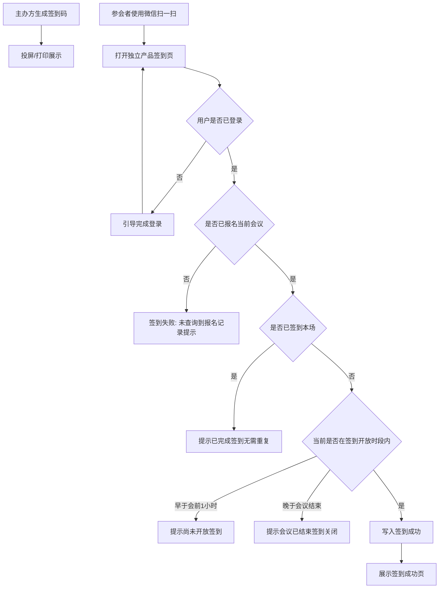

# CSDN会议详情与报名产品需求说明书

## 需求概览

> **核心变革：从“信息展示”到“参会全流程闭环”，并让分享真正可传播**
>
> 过去，CSDN 会议频道更多是一个信息展示窗口，用户报名往往需要跳转外部链接或重复填写冗长的表单，且主办方缺乏有效的现场签到工具。本次升级，我们致力于打造**流畅的参会体验**和**完整的数据闭环**：通过**复用 CSDN 账号画像**实现“一键预填、秒级报名”，通过**微信扫描签到二维码进入独立产品签到页**完成登录态与报名记录校验后的现场签到，并在**会议开始前 1 小时至会议结束**的开放时段内落库，避免过早或过晚签到；**会议简报**中的已签到人数与签到率按**实际报名用户**范围内的签到结果统计。在详情侧补充**会议日程**呈现，帮助用户在决策前快速把握议程结构（版式与粒度以原型为准）。
>
> 在传播上，我们拒绝“整页长截图看不清”的体验，改为**定制化分享海报**：突出头图、主标题与关键时间地点，并在边缘承载**站点标识与带参二维码/推广信息**，让用户在保存图片或复制链接时，既能一眼看懂卖点，又能顺畅回到会议详情。分享采用**先预览、后操作**的弹窗路径，并在生成过程中提供明确加载反馈，兼顾移动端与 PC 端习惯。用户收藏的会议统一在「我的会议」-「我收藏的会议」页签中查看，详见《我的会议与商业化产品需求说明书》。

---

# 第1章：概述

## 1.1 术语表

| 术语 | 英文 | 描述 |
| :--- | :--- | :--- |
| **报名** | Registration | 用户申请参加某个会议的行为，生成报名记录。 |
| **签到** | Check-in | 参会者在会议现场确认到场的操作；本期使用**微信扫描签到二维码**，在独立产品打开的签到页中完成，需已登录且已通过报名校验。 |
| **签到开放时段** | Check-in window | 允许完成有效签到的时间范围：**会议开始前 1 小时（含）起至会议结束（含）止**；不在该时段内不可签到成功，系统需给出对应提示。 |
| **核销** | Verification | 验证用户报名身份有效性的过程（本期主要指系统自动校验）。 |
| **主办方** | Organizer | 发布会议并负责审核报名、组织现场签到的企业或个人。 |
| **会议详情页** | Detail Page | 展示会议完整信息（议程、讲师、地点等）并提供报名入口的页面。 |
| **会议日程** | Agenda / Schedule | 会议各环节的时间与主题等结构化信息，用于详情页展示；具体字段与版式以原型为准。 |
| **分享海报** | Share Poster | 用于社交传播的定制版图片，非整页截图；包含核心会议信息与站点推广元素（如 Logo、带参二维码、站点链接提示）。 |
| **带参链接 / 带参二维码** | Tracked URL / QR | 会议详情页 URL 或二维码中携带用于统计或推广识别的参数，扫码或复制后可进入对应会议详情。 |

## 1.2 修订记录

| 版本 | 内容 | 负责人 | 更新时间 | 备注 |
| :--- | :--- | :--- | :--- | :--- |
| V1.0 | 初始版本，包含会议详情、报名流程、现场签到、收藏分享 | (待定) | 2026-02-03 | 基于整体方案 6.3 章节细化 |
| V1.1 | 收藏的会议查看入口：用户收藏的会议在「我的会议」-「我收藏的会议」页签中统一展示，个人中心-我的收藏下不再展示会议页签 | (待定) | 2026-02-11 | 详见我的会议与商业化产品需求说明书 |
| V1.2 | 统一报名审核：所有会议报名均需主办方审核，移除“审核规则/免审核”；报名填写项支持运营动态配置，前期运维接口、后期配置页 | (待定) | 2026-02-12 | 按业务澄清修订 |
| V1.3 | 详情页支持会议日程展示（以原型为准）；分享升级为海报生成（定制模板+推广区+二维码）、分享弹窗交互（预览后保存/复制链接）；加载态与封面图跨域展示约束 | (待定) | 2026-03-30 | 按产品澄清补充 |
| V1.4 | 现场签到改为独立产品形态：微信扫码进入签到页；增加登录态校验、报名记录校验、同会仅一次签到及对应提示文案；会议简报已签到人数与签到率按实际报名用户维度统计 | (待定) | 2026-05-13 | 按独立产品与现场流程修订 |
| V1.5 | 签到增加时间窗限制：仅会议开始前 1 小时至会议结束内允许签到；早于该窗、晚于结束后分别提示用户 | (待定) | 2026-05-13 | 按现场管控规则补充 |

## 1.3 背景和价值

当前 CSDN 会议功能在“发现”之后，缺乏完善的“转化”与“线下闭环”能力。用户看到感兴趣的会议后，报名流程繁琐，且缺乏有效的现场签到工具，导致主办方难以统计实际到场率。

**业务价值**：
1.  **提升报名转化率**：通过复用 CSDN 账号信息，支持“一键带入”报名表单，将报名耗时缩短至 10 秒以内。
2.  **打通线下数据闭环**：通过二维码签到功能，连接线上报名与线下参会数据，为主办方提供真实的“到场率”分析。
3.  **增强用户粘性**：通过收藏和分享功能，利用社交裂变传播会议，同时方便用户管理感兴趣的内容。
4.  **标准化通知触达**：自动化的审核与通知机制，降低了主办方的人力运营成本，确保参会者不错过关键信息。
5.  **提升传播转化率**：通过定制化海报（头图、主标题、关键信息、带参二维码与站点标识）替代难以阅读的整页截图，使朋友圈、群聊等场景下仍可看清卖点并回流详情页。
6.  **议程可读性**：在详情页展示会议日程，帮助用户在报名前快速理解议程结构（展示深度以原型为准）。

---

# 第2章：功能需求详情

## 2.1 会议详情页展示

### 场景描述

**场景一：信息确认与报名**
用户小张在列表中点击某 AI 峰会进入详情页。他首先查看顶部的会议时间与地点，确认日程合适；接着浏览**会议日程**（环节与时间线以原型为准，无需展示冗长文稿）和“特邀讲师”等板块，了解演讲内容。页面底部悬浮栏显示“立即报名”按钮，他发现名额紧张（显示“剩余 20 席”），决定立即点击报名。

**场景二：感兴趣但暂时无法决定**
用户小李看到一个下个月的开发者大会，内容很吸引人但还没确定行程。他点击页面右上角的“收藏”图标（心形），将其存入“我的收藏”，方便后续查看。

**场景三：分享海报与复制链接**
用户小王希望在微信群分享这场会议。他在底部操作栏点击【分享】，屏幕出现**半透明遮罩与分享弹窗**：先看到**海报预览缩略图**（由系统按模板生成，而非整页截图），下方有主操作【保存图片到本地】与次级操作【复制会议详情页 URL】。他保存图片后发群；群友长按二维码即可进入带参详情页。他也常一键复制链接发给同事。

### 业务流程
```mermaid
graph TD
    A[进入会议详情页] --> B{判断会议状态}
    B -->|未开始报名| C[展示"即将开始"按钮(置灰)]
    B -->|报名中且有名额| D[展示"立即报名"按钮]
    B -->|报名中但已满| E[展示"名额已满"按钮(置灰)]
    B -->|已结束| F[展示"会议已结束"按钮(置灰)]
    B -->|已报名| G[展示"查看票据/已报名"按钮]
    
    A --> H[浏览详情信息含日程]
    H --> I{操作行为}
    I -->|点击收藏| J[切换收藏状态]
    I -->|点击分享| K[展示Loading海报生成中]
    K --> L[打开分享弹窗含海报预览]
    L --> M{用户选择}
    M -->|保存图片| N[保存海报到本地]
    M -->|复制链接| O[复制会议详情URL到剪贴板]
    M -->|可选系统分享| P[移动端Web Share API]
```

### 基本事件流程

#### 主业务流程
1.  **页面加载与状态判断**：
    *   【前置条件】：用户点击会议链接或卡片。
    *   【基本事件流程】：
        *   系统加载会议基础信息（标题、时间、地点、主办方）、详细介绍（富文本）、**会议日程**（结构化展示，版式与字段粒度**以原型为准**，不追求与后台编辑稿同等篇幅）、讲师列表。
        *   **底部操作栏状态判断**：
            *   若用户**未登录**：显示“立即报名”，点击跳转登录。
            *   若用户**已报名**：显示“已报名”或“查看电子票”，点击跳转报名详情。
            *   若**未报名**：
                *   当前时间 > 报名结束时间 或 状态=已结束：按钮文案“报名已结束”，置灰。
                *   当前报名人数 >= 人数上限：按钮文案“名额已满”，置灰。
                *   正常情况：按钮文案“立即报名”，高亮可点。
    *   【后置条件】：页面完整展示，操作栏状态正确。

2.  **收藏**：
    *   【基本事件流程】：用户点击收藏图标，图标状态即时反转（空心变实心），并提示“收藏成功/已取消收藏”（具体文案见国际化表）。

3.  **会议日程展示（详情内）**：
    *   【前置条件】：会议存在可展示的日程数据；若无日程数据，该区域按原型展示空态或隐藏（**以原型为准**）。
    *   【基本事件流程】：用户在详情页滚动至会议日程模块，查看各日程条目（如时间段、环节名称等）；**不强制展示过长正文**，避免挤占首屏与报名决策区。
    *   【系统响应】：日程列表/时间轴样式、排序规则、是否折叠等**以原型为准**。

4.  **分享：海报生成与弹窗（先预览，后操作）**：
    *   【前置条件】：用户在会议详情页且会议可访问。
    *   【基本事件流程】：
        *   用户点击底部或页面内的【分享】按钮。
        *   **加载态**：在海报未就绪前，系统展示明确反馈（如文案“海报生成中…”及 Loading 动效），避免用户重复点击导致多次触发。
        *   **海报内容策略（非整页截图）**：系统使用**预置海报模板**生成图片（如独立隐藏画布/DOM 区域），**不得**采用整页详情长截图作为默认方案。海报需包含：**视觉锤**（大面积会议封面图或符合原型的主视觉）、**核心卖点**（大字号主标题）、**关键元数据**（会议时间、地点的精简版表述）、**引流区**（页面底部或侧缘等边缘位置）：**本网站/品牌标识**、**会议详情页带参链接对应的二维码**、引导文案（示例：“长按识别二维码，立即抢票/查看详情”——**最终文案以产品/运营确认为准**）。
        *   **分享弹窗**：生成完成后，**移动端**自屏幕底部、**PC 端**于页面中部弹出带半透明遮罩的弹窗：一侧展示**海报预览缩略图**，另一侧提供操作——**主按钮**：【保存图片到本地】（高亮）；**次级按钮**：【复制会议详情页 URL】（弱化/线框样式）。
        *   用户点击【保存图片到本地】后，将当前生成的海报保存至本地相册/下载目录，并给予成功反馈。
        *   用户点击【复制会议详情页 URL】后，将**当前会议的详情页 URL（含必要的推广/统计参数）**写入剪贴板，并提示“链接已复制”。
    *   【后置条件】：用户已获得可传播的图片或可复制链接；站点标识与二维码区域符合品牌与合规要求（与隐私政策、用户条款一致）。

#### 扩展事件流程
*   **系统分享（可选）**：在支持的移动端浏览器/环境中，可在分享弹窗内提供**系统级分享**入口（如 Web Share API），用于唤起微信、微博或系统分享面板；若当前环境不支持，则不展示或置灰并保留保存图片与复制链接路径。
*   **复制链接与海报并存**：用户可先复制链接再保存图片，两者互不冲突。

#### 异常事件流程
*   **会议不存在/下架**：展示 404 缺省页，提示“该会议已被删除或下架”，提供“返回会议列表”按钮。
*   **海报生成失败**：提示失败原因（如网络异常、生成超时），提供【重试】；仍可提供【复制会议详情页 URL】作为兜底。
*   **封面图无法绘制导致海报缺图**：若因跨域等原因导致封面在海报中无法渲染，系统应降级为占位图或明确提示用户稍后重试（具体降级策略以原型为准）；**开发与运维需保障封面资源可被安全绘制**（见第 7 章）。

---

## 2.2 报名流程

### 场景描述
用户点击“立即报名”后，系统弹出报名表单；表单中需填写的项（如姓名、手机号、邮箱、公司、职位等）由运营配置，与账号画像一致的字段可自动预填。用户确认并补全必填项后点击提交，系统提示“提交成功，请等待主办方审核”。管理员审核通过后，用户收到站内信和邮件形式的“报名成功通知”。

### 业务流程
```mermaid
graph TD
    A[点击立即报名] --> B{用户登录态校验}
    B -->|未登录| C[跳转登录]
    B -->|已登录| D[展示报名表单]
    D --> E[预填用户账号信息]
    E --> F[用户修改/补充信息]
    F --> G[点击提交]
    G --> H{表单校验}
    H -->|校验失败| F
    H -->|校验通过| I[创建报名记录(待审核)]
    I --> J[等待主办方审核]
    J --> K[管理员审核通过/拒绝]
    K --> L[状态变更为已报名/已拒绝]
    L --> M[发送审核结果通知]
```

### 基本事件流程

#### 主业务流程
1.  **填写报名表单**：
    *   【前置条件】：用户点击“立即报名”且已登录。
    *   【基本事件流程】：
        *   系统弹出/跳转报名填写页；**表单字段**由运营配置的“报名填写项”决定，展示哪些字段、是否必填等均按配置渲染。
        *   **自动填充**：对配置中与账号画像对应的字段（如姓名、手机号、邮箱），系统读取当前用户信息自动预填（若有）；姓名优先取真实姓名，手机号脱敏显示、提交时传输密文。
        *   用户按配置要求补全必填项及其它需填项。
        *   用户点击“提交报名”。
    *   【系统响应】：
        *   后端校验必填项格式、是否重复报名。
        *   校验通过后，生成报名记录，状态流转为 `待审核`，界面提示“提交成功，请等待主办方审核”。
        *   **报名填写项**：参会人在报名时需填写的信息由运营人员动态配置；前期可通过运维接口调整配置，后期需增加专门的配置页面供运营维护。

2.  **审核与通知（后台/异步）**：
    *   【前置条件】：存在待审核或状态变更的报名记录。
    *   【基本事件流程】：
        *   **审核通过**：状态变更为 `已报名`。系统自动触发通知（站内信+邮件+Push），模板示例：“您申请的[会议名称]已审核通过，请准时参会。”
        *   **审核拒绝**：状态变更为 `已拒绝`。系统触发通知，模板示例：“很遗憾，您申请的[会议名称]未能通过审核。”

#### 报名填写项配置
*   **配置含义**：参会人在报名时需填写的字段（如姓名、手机号、邮箱、公司、职位等）、是否必填、是否支持从账号画像预填等，由运营人员动态配置，前端按配置渲染报名表单。
*   **实施节奏**：前期通过**运维接口**（如运营/运维专用 API）调整报名填写项配置；后期需增加**专门的配置页面**，供运营人员在系统内维护配置，无需依赖运维接口。

#### 扩展事件流程
*   **重复报名拦截**：若用户已存在该会议的有效报名记录（待审核/已报名），再次点击报名时，直接跳转至“我的报名”详情页，提示“您已报名该会议”。

---

## 2.3 现场签到

### 场景描述

**场景一：微信扫码后登录再签到**
会议当天，主办方在会场入口投屏「会议签到二维码」。参会者小王使用**微信「扫一扫」**扫描该码，系统在**独立产品**内打开签到页。若小王**尚未登录**，页面引导其先完成登录；登录成功后，系统校验其是否**已报名本场会议**。小王此前已通过审核报名，且到场时间落在**签到开放时段**（会议开始前 1 小时至会议结束）内，页面展示**签到成功**（如大字号成功态与入场指引等，具体版式以原型为准），其报名记录更新为已签到并记录签到时间。

**场景二：未报名用户到场扫码**
用户小李未报名或未通过审核，使用微信扫描同一签到码并完成登录后，系统未查询到其**当前会议的有效报名记录**，签到失败，页面提示：「**未查询到您的报名记录，请先报名或联系现场工作人员**」（提示样式、位置、是否提供跳转报名入口等以原型为准）。

**场景三：重复签到拦截**
用户小张已完成本场会议签到，再次扫描签到码进入页面并处于已登录态时，系统识别其**已存在本场会议的签到记录**，不再重复写入签到；页面提示：「**您已完成签到，无需重复操作**」（可同步展示已签到时间，以原型为准）。

**场景四：早于签到开放时段扫码**
用户小周已登录且已报名，但在**会议开始前 1 小时之前**扫描签到码。系统判定当前不在签到开放时段内，**不执行签到落库**，页面给出「**早于开放时段**」类明确提示（具体文案见本章「签到时间窗与提示」及国际化表）。

**场景五：会议结束后扫码**
用户小陈在**会议已结束**后扫描签到码。系统判定已超过签到开放时段，**不执行签到落库**，页面给出「**会议已结束、签到已关闭**」类明确提示（具体文案见本章「签到时间窗与提示」及国际化表）。

### 业务流程



### 基本事件流程

#### 主业务流程

1.  **主办方生成签到码**：
    *   【前置条件】：主办方拥有管理权限。
    *   【基本事件流程】：
        *   主办方在**会议管理后台**（或与本产品一致的主办方工具入口，具体以实际后台形态为准）进入「签到管理」。
        *   系统生成该会议唯一的**签到二维码**（长期有效以便打印；安全策略见第 7 章）。
        *   支持下载图片或全屏展示。
    *   【后置条件】：现场可展示可供微信扫描的签到码。

2.  **参会者微信扫码签到**：
    *   【前置条件】：用户持有可扫码的微信客户端；签到码对应当前会议且有效。
    *   【基本事件流程】：
        *   用户使用**微信扫描**现场展示的会议签到二维码，在**独立产品**内打开签到页（**不再依赖 CSDN App 完成签到**）。
        *   **登录态校验**：若用户**未登录**，系统不执行报名与签到业务写入；界面引导用户**先完成登录**，登录成功后再继续本会议的签到校验流程。
        *   **报名记录校验**：在用户已登录前提下，系统校验当前登录用户是否**已报名当前会议**（与报名业务中「已通过审核、具备参会资格」的报名记录一致，具体状态口径与报名模块对齐）。
            *   **未报名**：签到失败，展示固定文案：「**未查询到您的报名记录，请先报名或联系现场工作人员**」。
            *   **已报名**：继续后续校验（见下）。
        *   **同会单次签到**：同一用户同一会议仅允许产生**一次**有效签到；若已存在签到完成记录，再次发起签到请求时**不重复落库**，并展示固定文案：「**您已完成签到，无需重复操作**」（**优先于**签到时间窗校验：已签到用户在任何时间再次扫码，均展示该重复签到提示，不再因「已结束」等时段文案造成歧义）。
        *   **签到时间窗校验**（在未命中「未报名」「重复签到」的前提下执行）：系统根据当前服务器时间与本次会议**开始时间、结束时间**判定是否处于**签到开放时段**。
            *   **开放时段定义**：**会议开始时间的前 1 小时（含该时刻）**起，至**会议结束时间（含该时刻）**止。即：`[会议开始时间 − 1 小时, 会议结束时间]` 闭区间内的时刻允许签到成功（边界时刻允许签到）。
            *   **早于开放时段**（当前时间早于「会议开始时间 − 1 小时」）：不允许签到落库；页面展示「**早于开放时段**」对应提示（固定文案见本章「签到时间窗与提示」）。
            *   **晚于会议结束**（当前时间晚于会议结束时间）：不允许签到落库；页面展示「**会议已结束**」对应提示（固定文案见本章「签到时间窗与提示」）。
            *   **处于开放时段内**且已报名、未重复签到：执行签到成功——将对应报名记录置为已签到（或等价业务状态）、记录签到时间；前端展示签到成功反馈（如大字号「签到成功」及座位号、入场指引等，**以原型为准**）。
    *   【后置条件】：签到成功时后台更新该用户本场会议的到场状态；**会议简报**中的统计口径见本章「会议简报统计口径」及第 3 章相关说明。

##### 签到时间窗与提示

| 情形 | 是否允许签到落库 | 用户提示（中文，须与界面一致） |
| :--- | :--- | :--- |
| 早于会议开始前 1 小时 | 否 | 「**签到尚未开放，请在会议开始前 1 小时内再来签到**」 |
| 晚于会议结束时间 | 否 | 「**会议已结束，签到通道已关闭**」 |

**此处信息不明确，需补充确认：[跨天会议、仅配置单日开始/结束、或多场次会议时，「会议开始时间」「会议结束时间」取主会程哪一组字段；若结束时间未配置时的默认处理]**。

##### 会议简报统计口径（签到相关）

*   **已签到人数**：统计对象为**已实际报名当前会议的用户**中，已完成签到的用户数量（即基于有效报名集合内的签到结果计数，不包含未报名用户的扫码行为）。
*   **签到率**：在**实际报名人数**（与简报中报名人数口径一致）为分母的前提下，由**已签到人数**与分母计算得出（例如：签到率 = 已签到人数 ÷ 实际报名人数；若分母为 0 时的展示规则以原型/报表约定为准）。**此处信息不明确，需补充确认：[「实际报名人数」是否含待审核、已拒绝、已取消等状态的统计边界]**。

#### 扩展事件流程

*   **主办方提前投码**：签到二维码可长期展示；用户在签到开放时段外扫码时，仅展示时段类提示，不产生签到记录。

#### 异常事件流程

*   **未登录访问签到页**：拦截业务签到提交，引导登录；登录完成后由用户再次触发或自动重试签到校验（具体交互以原型为准）。
*   **未报名或查询不到有效报名记录**：页面提示「**未查询到您的报名记录，请先报名或联系现场工作人员**」（不可误报为系统异常类模糊文案）。
*   **重复签到**：页面提示「**您已完成签到，无需重复操作**」；可展示历史签到时间以增强可信度（以原型为准）。
*   **早于签到开放时段或晚于会议结束**：按「签到时间窗与提示」表展示对应固定文案，**不写入**签到成功状态。
*   **网络异常 / 超时**：提示失败原因并提供重试入口（文案与样式以通用弱网规范及原型为准）。

---

# 第3章：数据项描述

## 3.1 报名记录表 (Event_Registration)

| 字段名 | 标识符 | 类型 | 必填 | 说明 | 界面/控件 |
| :--- | :--- | :--- | :--- | :--- | :--- |
| 记录ID | `id` | Long | 是 | 主键 | 不展示 |
| 会议ID | `meeting_id` | Long | 是 | 关联会议 | 不展示 |
| 用户ID | `user_id` | Long | 是 | 关联用户 | 不展示 |
| 姓名 | `real_name` | String | 是 | 报名填写的姓名 | 输入框 |
| 手机号 | `mobile` | String | 是 | 报名填写的手机 | 输入框(数字键盘) |
| 邮箱 | `email` | String | 否 | 报名填写的邮箱 | 输入框(Email格式) |
| 公司 | `company` | String | 否 | 所在公司 | 输入框 |
| 职位 | `job_title` | String | 否 | 职位头衔 | 输入框 |
| 状态 | `status` | Enum | 是 | 0:待审核, 1:已报名, 2:已拒绝, 3:已取消, 4:已签到 | 状态标签 |
| 签到时间 | `checkin_time` | DateTime | 否 | 实际签到时间 | 详情页展示 |
| 创建时间 | `create_time` | DateTime | 是 | 报名提交时间 | 不展示 |

## 3.2 会议表补充字段 (Meeting_Ext)

| 字段名 | 标识符 | 类型 | 说明 |
| :--- | :--- | :--- | :--- |
| 人数上限 | `max_participants` | Integer | 0表示不限 |
| 签到码Token | `checkin_token` | String | 用于生成签到二维码的唯一标识 |
| 报名截止时间 | `reg_end_time` | DateTime | 控制报名入口关闭 |
| 会议开始时间 | `meeting_start_time` | DateTime | 用于计算签到开放时段起点（会前 1 小时）；须与会议主数据/创建侧一致 |
| 会议结束时间 | `meeting_end_time` | DateTime | 用于签到开放时段截止；须与会议主数据/创建侧一致 |

*若上述时间与会议创建/编辑模块字段名或存储位置不一致，以会议主数据为准，此处仅表达逻辑依赖。*

## 3.3 会议日程（展示用）

会议详情页展示的日程数据来源于会议主数据或议程配置；**具体字段名称、是否分论坛、是否支持富文本详情等以会议创建/编辑侧及原型为准**。下表仅描述本需求涉及的**展示逻辑**，不替代接口或表结构定稿。

| 数据项（逻辑名） | 说明 | 前端是否展示 | 备注 |
| :--- | :--- | :--- | :--- |
| 日程条目顺序 | 各环节展示顺序 | 是 | 与后台配置顺序一致 |
| 时间段 | 环节开始/结束或时段说明 | 是 | 展示格式以原型为准 |
| 环节标题/主题 | 日程条目标题 | 是 | 精简展示；过长内容是否折叠见原型 |
| 关联会议 ID | 所属会议 | 否 | 用于数据拉取 |

*若日程与「会议创建/编辑」模块字段不一致，此处信息不明确，需补充确认：[日程主数据源与字段清单]。*

## 3.4 分享海报与链接（逻辑）

| 数据项（逻辑名） | 说明 | 备注 |
| :--- | :--- | :--- |
| 会议详情页 URL | 含会议唯一标识；分享复制与二维码指向一致 | 可携带推广/统计参数，参数规则与运营口径一致 |
| 海报模板元素 | 封面图 URL、主标题、时间地点精简文案、品牌 Logo、二维码内容 | 二维码内容为上述 URL（或等价跳转），保证扫码进入详情页 |

## 3.5 会议简报指标（签到相关，逻辑）

| 数据项（逻辑名） | 说明 | 备注 |
| :--- | :--- | :--- |
| 已签到人数 | 统计**当前会议下、属于实际报名用户**且已完成签到的用户数量 | 与 2.3「会议简报统计口径」一致；未报名用户不计入分子 |
| 签到率 | 由**已签到人数**与**实际报名人数**按简报与报表统一口径计算 | 分母边界若与报名状态枚举不完全一致，需与数据/报表侧对齐 |

---

# 第4章：需求波及分析

## 4.1 影响模块

| 影响模块 | 影响说明 | 备注 |
| :--- | :--- | :--- |
| **消息中心** | 需新增“报名审核结果”、“报名成功提醒”等消息模板。 | 涉及邮件、站内信、Push |
| **个人中心** | 需新增“我的会议”入口，展示用户报名的会议列表及状态。收藏的会议不在「我的收藏」下展示，统一在「我的会议」-「我收藏的会议」页签查看。 | /user/my-events |
| **报名填写项配置** | 报名表单字段由运营动态配置；前期通过运维接口调整，后期需增加专门的配置页面供运营维护。 | 配置页为后期迭代 |
| **独立产品签到页（微信内）** | 承载微信扫码后的签到流程：登录态校验、报名校验、**签到开放时段**校验、单次签到与提示文案；不依赖 CSDN App 完成签到。 | 与账号体系、报名服务、会议时间数据对接 |
| **会议简报 / 数据看板** | 已签到人数、签到率需按「实际报名用户范围内的签到结果」统计，与 2.3、3.5 口径一致。 | 若简报为独立模块，需同步调整取数逻辑 |
| **会议详情前端** | 新增会议日程模块渲染；分享链路改为海报生成 + 分享弹窗（含 Loading、保存图片、复制链接、可选系统分享）。 | 需设计稿/原型对齐 |
| **静态资源与 OSS** | 封面图等资源需满足在端内生成海报时的可绘制性（见第 7 章），避免海报缺图或黑块。 | 与运维/基础架构协同 |

**数据影响**：若会议日程数据已在会议主表或议程子表中维护，本期主要为**读取与展示**，是否新增字段以会议创建/编辑侧需求为准；分享海报所依赖的 URL 与参数规则与现有会议详情路由一致即可。签到成功仍落实在报名/参会状态与签到时间等既有业务数据上；**会议简报、报表侧**需按 2.3、3.5 约定核对统计口径，若存在历史按「扫码次数」等非报名基数统计的实现，需改为按**实际报名用户中的签到数量**计算已签到人数与签到率。

**业务规则影响**：现场签到入口统一为**微信扫码进入独立产品签到页**；签到前置条件增加**已登录**及**签到开放时段**（会前 1 小时至会议结束）；未报名、重复签到、时段外提示文案以本文 2.3 为准；简报指标口径变更见上。服务端与客户端时间判定需与标准时钟一致，避免边界争议（见第 7 章可补充时钟同步要求）。

## 4.2 历史文档查阅记录

#### 历史需求文档
- **文档名称**：`CSDN会议功能/docs/会议列表与检索产品需求说明书.md`
- **文档位置**：`CSDN会议功能/docs/会议列表与检索产品需求说明书.md`
- **参考功能**：参考了文档结构、术语定义（如“主办方”、“状态”枚举）、以及整体的业务背景描述。
- **设计一致性**：保持了“术语表-场景-流程-数据-验收”的章节结构；状态枚举值（如进行中、已结束）与列表文档保持逻辑一致。

- **文档名称**：`CSDN会议功能/CSDN会议产品整体方案.md`
- **文档位置**：`CSDN会议功能/CSDN会议产品整体方案.md`
- **参考功能**：直接依据该文档 6.3 章节定义的功能范围（详情、报名、签到、分享）进行细化。
- **设计一致性**：严格落实了整体方案中“复用账号信息”、“打通线下签到”的核心要求。

- **文档名称**：`CSDN会议功能/docs/我的会议与商业化产品需求说明书.md`
- **文档位置**：`CSDN会议功能/docs/我的会议与商业化产品需求说明书.md`
- **参考功能**：与「我的会议」、收藏入口等用户路径表述保持一致；推广类能力以该文档为准，本需求仅涉及**会议详情分享海报与链接**，不涉及推广订单与计费。
- **设计一致性**：收藏会议统一在「我的会议」-「我收藏的会议」查看，与本需求收藏表述一致。

- **文档名称**：`CSDN会议功能/docs/会议详情与报名产品需求说明书.md`（修订前 V1.3 版本）
- **文档位置**：`CSDN会议功能/docs/会议详情与报名产品需求说明书.md`
- **参考功能**：对照原文档中 2.3 现场签到、验收准则 AC03/AC04、国际化签到相关词条，完成独立产品 + 微信扫码路径的更替与口径补充。
- **设计一致性**：提示文案、单次签到规则与本文修订版保持一致；与《我的会议与商业化产品需求说明书》用户路径无冲突。

---

# 第5章：验收准则

## 5.1 验收场景列表

| 编号 | 场景描述 | Given (前置条件) | When (触发条件) | Then (预期结果) | And (附加验证) |
| :--- | :--- | :--- | :--- | :--- | :--- |
| **AC01** | 报名信息自动填充 | 用户已登录且账号完善 | 用户点击“立即报名” | 报名表单中自动显示用户的姓名、手机号 | 手机号应脱敏显示 |
| **AC02** | 满员禁止报名 | 会议已报名人数 = 上限 | 用户访问详情页 | 底部按钮显示“名额已满”且不可点击 | 无法进入填写页 |
| **AC03** | 微信扫码签到成功 | 用户已登录且已报名会议 M（状态为已报名），尚未对 M 签到，**当前时间处于 M 的签到开放时段内**（会前 1 小时至会议结束，含边界） | 用户使用微信扫描 M 的现场签到二维码并在打开的独立产品签到页完成流程 | 页面展示签到成功类反馈（如「签到成功」及入场指引，以原型为准） | 后台该用户在本会议的报名/参会状态更新为已签到并记录签到时间；**不依赖 CSDN App 完成签到** |
| **AC04** | 未报名扫码失败 | 用户已登录但未报名会议 M（或不存在有效报名记录） | 用户使用微信扫描 M 的现场签到二维码 | 页面提示「未查询到您的报名记录，请先报名或联系现场工作人员」 | 不产生有效签到记录 |
| **AC05** | 审核通过通知 | 用户已提交某会议报名（状态为待审核） | 管理员在后台点击“通过” | 用户收到“报名成功”的站内信和邮件 | 报名状态变更为“已报名” |
| **AC06** | 详情页展示会议日程 | 会议已配置至少一条日程数据 | 用户打开会议详情页并滚动至日程模块 | 日程按原型以结构化形式展示（如时间线/列表），可读且不默认展示整页长文 | 无日程时行为与原型一致（空态或隐藏） |
| **AC07** | 分享先生成海报再出弹窗 | 用户已打开可访问的会议详情页 | 用户点击【分享】 | 先出现“海报生成中…”类加载反馈，再出现含海报预览的分享弹窗 | 未直接下载、未静默长截图整页详情为默认方案 |
| **AC08** | 海报含推广与二维码 | 海报已生成成功 | 用户查看分享弹窗内预览 | 海报含封面主视觉、大标题、精简时间地点、站点标识与详情页带参二维码及引导文案 | 二维码扫码可进入该会议详情 |
| **AC09** | 保存图片与复制链接 | 分享弹窗已打开 | 用户依次点击【保存图片到本地】与【复制会议详情页 URL】 | 图片保存成功有反馈；剪贴板为当前会议详情 URL（含约定参数） | 两次操作互不冲突 |
| **AC10** | 海报生成失败兜底 | 模拟海报生成失败或超时 | 用户点击【分享】后生成失败 | 展示失败提示与【重试】；仍可提供【复制会议详情页 URL】 | 用户可通过链接完成传播 |
| **AC11** | 未登录先登录再签到 | 用户未登录 | 用户使用微信扫描现场签到二维码打开签到页 | 系统拦截签到业务完成，引导用户先完成登录 | 用户登录成功后继续执行报名、重复签到、签到时间窗等校验；已报名、未重复且在开放时段内则应可签到成功 |
| **AC12** | 同会重复签到提示 | 用户已登录且对会议 M 已完成签到 | 用户再次使用微信扫描 M 的签到二维码 | 页面提示「您已完成签到，无需重复操作」 | 不重复写入签到记录；可与首次签到时间展示一致 |
| **AC13** | 会议简报签到指标口径 | 会议 M 存在多条报名记录，其中部分用户已签到、部分未签到；简报展示已签到人数与签到率 | 主办方或授权用户在会议简报中查看签到统计 | 已签到人数等于「实际报名用户中已完成签到的用户数」 | 签到率由已签到人数与实际报名人数按简报统一口径计算，与 2.3、3.5 定义一致 |
| **AC14** | 早于签到开放时段拦截 | 用户已登录且已报名会议 M，尚未对 M 签到，**当前时间早于 M 的会议开始时间前 1 小时** | 用户使用微信扫描 M 的现场签到二维码并完成页内流程 | 页面提示「签到尚未开放，请在会议开始前 1 小时内再来签到」 | 不产生签到成功记录 |
| **AC15** | 会议结束后签到拦截 | 用户已登录且已报名会议 M，尚未对 M 签到，**当前时间晚于 M 的会议结束时间** | 用户使用微信扫描 M 的现场签到二维码并完成页内流程 | 页面提示「会议已结束，签到通道已关闭」 | 不产生签到成功记录 |

## 5.2 Gherkin 验收用例

```gherkin
Feature: 会议报名流程
  Scenario: 用户提交报名后进入待审核
    Given 用户已登录 CSDN 账号
    And 会议名额未满
    And 报名表单字段按运营配置展示
    When 用户填写并提交包含有效信息的报名表单
    Then 系统应创建一条新的报名记录
    And 报名状态应标记为“待审核”
    And 页面应提示“提交成功，请等待主办方审核”
    And 待主办方审核通过后用户将收到报名成功通知

Feature: 现场扫码签到（微信 + 独立产品）
  Scenario: 已登录且已报名用户首次签到成功
    Given 用户已登录
    And 用户已成功报名会议「AI开发者大会」且状态为已报名
    And 该用户尚未对该会议签到
    And 当前时间在该会议的签到开放时段内
    When 用户使用微信扫描该会议的现场签到二维码并在打开的独立产品签到页完成流程
    Then 页面应展示签到成功类反馈及入场指引
    And 后台该用户在本会议的报名记录应更新为已签到并记录签到时间
    And 签到流程不依赖 CSDN App

  Scenario: 未登录用户需先登录
    Given 用户未登录
    When 用户使用微信扫描现场签到二维码打开签到页
    Then 系统应拦截签到完成并引导用户先登录
    And 用户登录成功后若已报名且未签到且在签到开放时段内则应可完成签到成功

  Scenario: 未报名用户签到失败
    Given 用户已登录
    And 用户对会议「AI开发者大会」无有效报名记录
    When 用户使用微信扫描该会议的现场签到二维码
    Then 页面应提示「未查询到您的报名记录，请先报名或联系现场工作人员」
    And 不应产生有效签到记录

  Scenario: 已签到用户重复扫码
    Given 用户已登录
    And 用户已对会议「AI开发者大会」完成签到
    When 用户再次使用微信扫描该会议的签到二维码
    Then 页面应提示「您已完成签到，无需重复操作」
    And 不应重复写入新的签到记录

  Scenario: 早于签到开放时段无法签到
    Given 用户已登录
    And 用户已成功报名会议「AI开发者大会」且状态为已报名
    And 该用户尚未对该会议签到
    And 当前时间早于该会议开始时间前 1 小时
    When 用户使用微信扫描该会议的现场签到二维码
    Then 页面应提示「签到尚未开放，请在会议开始前 1 小时内再来签到」
    And 不应产生签到成功记录

  Scenario: 会议结束后无法签到
    Given 用户已登录
    And 用户已成功报名会议「AI开发者大会」且状态为已报名
    And 该用户尚未对该会议签到
    And 当前时间晚于该会议的会议结束时间
    When 用户使用微信扫描该会议的现场签到二维码
    Then 页面应提示「会议已结束，签到通道已关闭」
    And 不应产生签到成功记录

Feature: 会议详情日程与分享海报
  Scenario: 详情页展示会议日程
    Given 会议“2026 AI 峰会”已配置日程数据
    When 用户打开该会议详情页并浏览日程模块
    Then 系统应以原型约定的方式展示各日程条目（含时间段与环节标题等）
    And 不应以冗长全文默认占据首屏影响报名决策

  Scenario: 分享流程含加载与海报弹窗
    Given 用户正在可访问的会议详情页
    When 用户点击【分享】
    Then 系统应先展示海报生成中的加载反馈
    And 随后应展示包含海报预览的分享弹窗
    And 弹窗应提供主按钮【保存图片到本地】与次级按钮【复制会议详情页 URL】

  Scenario: 海报内容与二维码引流
    Given 分享弹窗中的海报已生成成功
    When 用户查看海报预览
    Then 海报应包含会议封面主视觉、主标题、精简时间与地点
    And 海报边缘区域应包含本网站标识与可扫码进入详情页的二维码及引导文案

Feature: 会议简报签到统计口径
  Scenario: 简报中已签到人数与签到率按报名用户统计
    Given 会议存在多名实际报名用户
    And 其中部分用户已完成签到、部分用户未完成签到
    When 主办方查看该会议的会议简报中的已签到人数与签到率
    Then 已签到人数应等于实际报名用户中已完成签到的用户数
    And 签到率应基于已签到人数与实际报名人数按简报统一口径计算
```

---

# 第6章：国际化与埋点

## 6.1 国际化 (i18n)

| 键值 (Key) | 中文 (zh-CN) | 英文 (en-US) |
| :--- | :--- | :--- |
| `btn_apply_now` | 立即报名 | Register Now |
| `btn_full` | 名额已满 | Full |
| `status_pending` | 审核中 | Pending |
| `status_success` | 已报名 | Registered |
| `msg_checkin_success` | 签到成功 | Check-in Successful |
| `msg_not_registered` | 未查询到您的报名记录，请先报名或联系现场工作人员 | No registration found; please register or contact staff |
| `msg_checkin_duplicate` | 您已完成签到，无需重复操作 | You have already checked in |
| `msg_checkin_not_open` | 签到尚未开放，请在会议开始前 1 小时内再来签到 | Check-in opens 1 hour before the event starts |
| `msg_checkin_ended` | 会议已结束，签到通道已关闭 | The event has ended; check-in is closed |
| `msg_checkin_need_login` | （登录引导文案以账号/登录产品为准） | (Login prompt per account product) |
| `share_poster_loading` | 海报生成中… | Generating poster… |
| `share_save_image` | 保存图片到本地 | Save image |
| `share_copy_link` | 复制会议链接 | Copy meeting link |
| `share_link_copied` | 链接已复制 | Link copied |
| `share_poster_fail` | 海报生成失败，请重试 | Failed to generate poster, please retry |

## 6.2 埋点定义

| 模块 | 指标名称 | 指标定义 | PC/移动端 | 触发时机 | 频率 |
| :--- | :--- | :--- | :--- | :--- | :--- |
| 会议详情 | 点击_立即报名 | 用户点击底部「立即报名」 | 双端 | 点击时 | 每次点击 |
| 报名表单 | 点击_提交 | 用户提交报名表单及结果 | 双端 | 提交成功/失败时 | 每次提交 |
| 签到页 | 扫码_结果 | 微信内打开签到页后签到成功或失败（含未登录、未报名、重复签到、早于开放时段、已结束） | 以微信内为主 | 签到校验完成时 | 每次完成校验 |
| 详情页 | 点击_分享 | 用户点击「分享」发起流程 | 双端 | 点击分享按钮时 | 每次点击 |
| 详情页 | 分享_海报生成结果 | 海报生成成功或失败及耗时 | 双端 | 生成结束回调时 | 每次生成结束 |
| 详情页 | 分享_保存图片 | 用户保存海报到本地 | 双端 | 点击保存并成功触发下载/保存时 | 每次成功 |
| 详情页 | 分享_复制链接 | 用户复制会议详情 URL | 双端 | 点击复制并写入剪贴板成功时 | 每次成功 |
| 详情页 | 分享_系统分享 | 用户通过系统分享面板分享 | 主要移动端 | 调用 Web Share 等成功时 | 每次 |

---

# 第7章：非功能性需求

1.  **高并发支持**：热门会议（如 1024 程序员节）报名开启瞬间可能产生高并发请求，报名接口需支持至少 1000 QPS，并具备超卖熔断机制（Redis 库存扣减）。
2.  **二维码安全性**：签到二维码建议包含加密签名，防止伪造；对于高安全级别会议，可配置为动态刷新二维码（每 5 秒刷新）。
3.  **弱网适配**：现场环境可能网络拥堵，签到接口需尽量轻量化，超时时间建议设为 10s，并提供失败重试机制。
4.  **签到时间判定**：签到开放时段以**服务端当前时间**与会议配置的开始、结束时间比对为准；客户端展示倒计时或提示时若与服务器存在偏差，以服务端校验结果为准，并在边界时刻（会前整 1 小时、会议结束时刻）避免歧义（如对请求到达时刻采用服务端接收时间）。
5.  **海报生成体验**：从用户点击【分享】到弹窗可交互，应在常见网络与机型下控制在可接受时长内；生成过程中须防重复提交（见 2.1 主流程）。若采用将 DOM/画布导出为图片的实现方式，需评估典型耗时并优化（如降低不必要重绘）。
6.  **封面与跨域绘制**：会议封面等图片资源若托管于第三方 OSS/CDN，须配置允许在端内以安全方式绘制到画布/导出图片（避免海报中封面黑屏、缺图）；产品侧要求**开发与运维在上线前完成相关资源域名校验**。实现上通常需为图片请求设置合适的跨域与匿名拉取策略（如 `crossOrigin` 与响应头协同），具体由工程实现确定。
7.  **分享合规**：海报中的站点标识、链接与二维码跳转须符合《CSDN会议独立站用户服务条款》及隐私政策中对标识与数据处理的要求。
