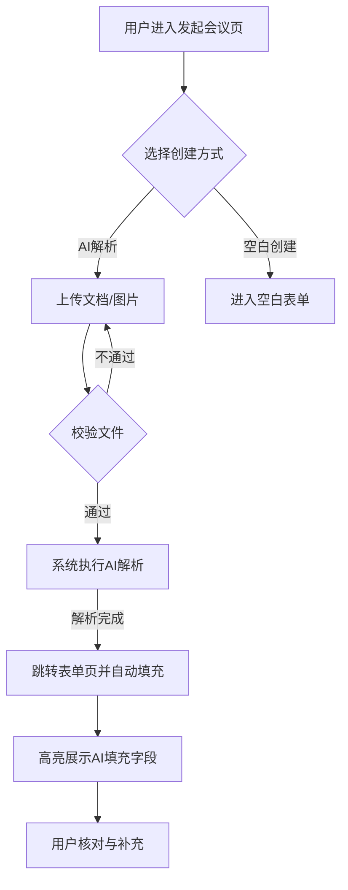
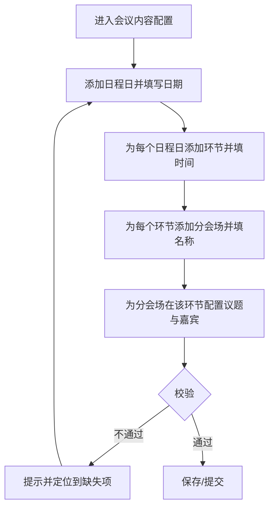

# 发起会议与会议信息管理产品需求说明书

## 需求概览

### 核心摘要
本次需求旨在解决办会方“填单繁琐、标准不一”的痛点，将会议创建从枯燥的表单录入升级为**AI 辅助的极速体验**。我们引入了**AI 智能解析**能力，用户只需上传一份 Word 文档或一张活动海报，系统即可自动提取关键信息并填单；同时预置了多套**专业活动模板**，让新手也能一键创建标准化的技术会议。通过**智能标签**与**精准人群画像**的结合，我们不仅提升了发布效率，更为后续的精准流量推荐打下了坚实的数据基础。此外，针对**会议内容**无法支撑多日、多分会场、按环节配置议题与嘉宾的复杂场景，我们**重构了会议内容配置模型**：支持用户自行配置**会议日程**与**分会场**，按「日程日 → 环节 → 分会场 → 议题」四级结构，为每个分会场、每个时间段分别配置主题与嘉宾，从而完整支持技术大会等多会场并行、多日多主题的典型场景，让每一次会议发布都更轻松、更专业、更完整。

### 设计思路
我们遵循“智能辅助优先，人工确认兜底”的设计理念。在创建入口，打破传统的“新建空白表单”模式，优先引导用户使用“文档/图片解析”或“活动模板”。在信息录入环节，采用“所见即所得”的结构化字段设计，并与业务定义的会议场景深度联动（如选择“线下”自动校验城市），确保数据既灵活又规范。**会议内容**不再沿用技术会议结构化中扁平的“演讲主题/圆桌”列表，而是采用“日程与分会场”模型：以自然日为纲、环节为时间段、分会场为并行维度、议题为最小配置单元，既支持单日单会场的简单沙龙，也支持多日多会场、每会场每环节不同主题与嘉宾的技术大会，设计上兼顾简单场景的快捷配置与复杂场景的完整表达。

### 历史实现参考
在设计过程中，我们深入查阅了 `docs/技术会议结构化-会议定义.md`，严格复用其**会议基本信息**的字段结构（如会议场景联动逻辑、人群标签体系），确保数据层面的统一性。**会议内容**部分因原文档为扁平化的演讲/圆桌结构，无法表达“多日 + 多时间段 + 多分会场 + 每会场每环节不同议题与嘉宾”的复杂场景，本次在本文档中重新定义为「会议日程与分会场」四级配置模型，与原有 2.1/2.2 等字段在嘉宾、主题名称、所涉及产品上保持命名对齐，便于后续与专家画像、产品结构化对接。交互模式上，我们参考了业内主流活动平台的“智能填单”流程，并结合 CSDN 现有文章发布的标签推荐机制，优化了智能标签的确认体验。

---

# 第1章：概述

## 1.1 术语表

| 术语 | 英文 | 描述 |
| :--- | :--- | :--- |
| **发起会议** | Initiate Conference | 办会方创建新会议并提交审核的全过程，包含信息录入、AI 解析、预览与提交。 |
| **AI 解析** | AI Parsing | 利用大模型技术，从用户上传的会议文档（PDF/Word）或宣传图片中自动提取标题、时间、地点、简介等信息并填充到表单中的功能。 |
| **活动模板** | Activity Template | 预置的标准化会议信息集合（如“技术沙龙”模板），包含预设的会议类型、简介框架及默认配置，用于快速复用。 |
| **智能标签** | Smart Tags | 系统根据会议标题与简介内容，调用 NLP 模型自动生成的会议分类标签（Tag），用于算法推荐与检索。 |
| **适合人群标签** | Target Audience Tags | 描述会议目标受众属性的标签（如“初级/中级”、“Java/前端”），用于精准推荐，不同于用户画像统计数据。 |
| **会议日程** | Conference Schedule | 会议按自然日划分的日程集合；每个日程日可包含多个时间段（环节），用于支撑多日会议。 |
| **分会场** | Sub-venue / Track | 在同一时间段内并行进行的独立会场，每个分会场可有独立的主题、议题与嘉宾配置。 |
| **环节** | Session / Time Slot | 某日程日下的一个时间段（如“上午”“下午”），有开始/结束时间；同一环节下可配置多个分会场。 |
| **议题** | Topic / Agenda Item | 在某一分会场的某一环节下配置的主题内容，包含主题名称、嘉宾列表等，对应“该会场在该时段讲什么、谁来讲”。 |

## 1.2 修订记录

| 版本 | 内容 | 负责人 | 更新时间 | 备注 |
| :--- | :--- | :--- | :--- | :--- |
| 0.1 | 初稿，基于整体方案 6.2 节细化 | — | 2026-02-03 | — |
| 0.2 | 会议内容重构：新增会议日程与分会场配置，支持多日多会场、按环节配置议题与嘉宾 | — | 2026-02-11 | 原技术会议结构化「会议内容」无法支持复杂场景，见 2.4 与第 3 章 |

## 1.3 背景和价值

**背景与痛点**：
目前 CSDN 平台缺乏自助化的会议创建入口，办会方需通过线下对接销售、人工传递资料录入系统，流程冗长且低效。即便开放了自助入口，复杂的表单填写（涉及数十个字段）也容易劝退用户，且填写质量参差不齐，导致后续推荐分发效果不佳。

**业务价值**：
1.  **发布效率提升 50%+**：通过 AI 解析文档/图片与活动模板，大幅减少手工录入时间，降低办会门槛。
2.  **数据标准化与结构化**：通过系统引导与智能校验，确保会议信息（如时间、地点、行业标签）的规范性，提升数据质量。
3.  **精准分发基础**：强制与智能结合的标签体系（适合人群、技术标签），为后续将会议精准推荐给感兴趣的开发者提供核心元数据。

---

# 第2章：功能需求

## 2.1 智能化创建（AI 解析）

### 场景描述
**场景 1：已有策划案的活动经理**
活动经理小王已写好一份《2026 生成式 AI 技术沙龙策划案.docx》，他希望直接利用文档内容创建会议。他上传文档后，系统自动识别出会议标题、时间、线下地点和议程简介，他只需核对微调即可提交。

**场景 2：仅有海报的社区主理人**
社区主理人李明只有一张设计好的活动海报。他上传图片，系统OCR识别海报上的文字，提取出活动名称、时间与二维码链接（若有），自动填充到对应字段。

### 基本事件流程

#### 主业务流程

**前置条件**：用户登录 CSDN 账号，进入“发起会议”页面。

**流程描述**：
1.  **选择创建方式**：用户在发起页选择“智能解析创建”。
2.  **上传文件**：
    *   用户点击上传区域，选择本地文件（支持 PDF/Word 文档，或 JPG/PNG 图片）。
    *   系统校验文件格式与大小（文档<20MB，图片<10MB）。
3.  **AI 解析处理**：
    *   系统显示“AI 正在解析中...”动画（支持取消）。
    *   系统调用后端解析服务，提取关键字段（标题、时间、地点、简介、主办方等）。
4.  **结果填充与确认**：
    *   解析完成后，系统自动跳转至“填写会议信息”页。
    *   **提取成功字段**：自动填入对应输入框，并高亮提示“AI 已自动填充”。
    *   **提取失败/存疑字段**：保持为空或显示待确认标记，提示用户人工补充。
5.  **人工核对**：用户检查填充内容，进行必要的修改或补充剩余必填项。

**系统响应与提示**：
*   上传成功后，显示进度条。
*   解析成功：Toast 提示“解析成功，已为您填充 X 个字段”。
*   解析失败：Toast 提示“解析超时或文件内容无法识别，请手动填写”，并保留空白表单。



#### 异常事件流程
*   **文件格式不符**：用户上传 .txt 或 .exe 文件。
    *   系统提示：“不支持该文件格式，请上传 PDF/Word 文档或 JPG/PNG 图片”。
*   **解析服务不可用**：AI 服务超时或报错。
    *   系统提示：“智能解析暂时繁忙，已为您切换至手动创建模式”，跳转至空白表单页。

## 2.2 活动模板创建

### 场景描述
**场景 1：新手运营快速上手**
新手运营小张第一次办会，不知道该写哪些内容。他选择了“技术沙龙”模板，发现简介里已经预置了“活动背景、演讲嘉宾、日程安排”等标准小标题，会议场景也默认选中了“开发者会议”，他只需做“填空题”即可。

### 基本事件流程

#### 主业务流程
1.  **浏览模板**：用户在发起页浏览模板库（如“技术沙龙”、“新品发布会”、“黑客马拉松”、“技术公开课”）。
2.  **预览模板**：点击某模板，弹窗预览该模板包含的预置信息（默认封面图、简介结构、默认会议类型）。
3.  **应用模板**：点击“使用此模板”。
4.  **表单初始化**：
    *   跳转至“填写会议信息”页。
    *   系统将模板中的预置数据（如会议场景=技术沙龙，简介=预设的 Markdown 骨架，人群标签=默认值）填充至表单。
5.  **个性化编辑**：用户基于模板内容进行修改和补充。

## 2.3 基础字段填写与智能标签

### 场景描述
**场景 1：填写与标签推荐**
用户在编辑会议信息时，输入标题“2026 Java 开发者大会”。失去焦点后，系统自动在下方推荐标签“Java”、“后端开发”。用户点击“Java”将其加入标签栏，并手动补充了“微服务”。

**场景 2：场景联动校验**
用户选择会议场景为“区域营销”，系统自动展开“涉及区域”多选框，并提示“请选择本次活动覆盖的城市”。

### 基本事件流程

#### 主业务流程

**前置条件**：进入“填写会议信息”页（无论是新建、AI 解析还是模板导入）。

**流程描述**：
1.  **填写基本信息**：
    *   用户填写/修改会议字段（字段列表见第 3 章）。
    *   **联动逻辑**：当用户改变“会议场景”或“会议形式”时，系统动态显示/隐藏相关子字段（如选择“线下”必填“举办地址”）。
2.  **智能标签生成**：
    *   用户完成“会议标题”和“会议简介”填写，光标离开输入框。
    *   系统异步调用 NLP 接口，分析文本内容。
    *   在“会议标签”字段下方显示“推荐标签：[标签A] [标签B]”。
3.  **确认标签**：
    *   用户点击推荐标签，标签自动填入输入框。
    *   用户也可以手动输入新标签，按回车确认。
4.  **选择人群画像**：
    *   用户在“适合人群”字段，从预置下拉框中选择（如“初级”、“中级”、“高级”；“前端”、“后端”、“AI”）。
5.  **提交审核**：
    *   用户点击“提交发布”。
    *   系统进行全表单校验（必填项、格式、敏感词初步拦截）。
    *   校验通过：提交成功，跳转至“我的会议”列表，状态变为“待审核”。
    *   校验不通过：定位至错误字段并红字提示。

#### 扩展事件流程
*   **保存草稿**：用户点击“存草稿”。系统仅校验“会议标题”必填，其他字段可为空，保存后状态为“草稿/新建”，不触发审核。

### 需求波及分析
*   **影响模块**：
    *   发起会议页（新增）
    *   会议列表页（需支持新字段展示）
    *   推荐算法（需接入新增的智能标签与人群画像数据）
*   **数据影响**：
    *   需要根据 `docs/技术会议结构化-会议定义.md` 新增/修改会议表结构。
    *   新增“活动模板”配置表。
*   **业务规则影响**：
    *   新增 AI 解析服务的调用额度与频率限制（初期暂不限制，仅监控）。
*   **历史文档查阅记录**：
    *   查阅的历史需求文档：`docs/技术会议结构化-会议定义.md` (工作区相对路径)
    *   参考功能：完全复用该文档中的“会议基本信息”与“会议内容”字段定义，包括字段类型、字典值及联动逻辑。
    *   设计一致性保证：本需求文档中的字段名称与 ID 与历史文档严格保持一致，避免开发歧义。

## 2.4 会议日程与分会场配置

### 场景描述

**场景 1：多日多分会场技术大会**
用户 A 要举办一场持续 3 天的技术大会，有多场并行分会场。例如：Day1 上午分会场 1 主题为「JAVA 开发」，嘉宾 A、B、C 三位演讲；分会场 2 主题为「SQL」，嘉宾 D、E、F 演讲。Day1 下午分会场 1 主题变更为「前端技术分享」，嘉宾 G、H、I；分会场 2 仍为「SQL」或更换主题。用户需要在发起会议时，为每个自然日、每个时间段（上午/下午等）、每个分会场分别配置该时段的主题与嘉宾，以便详情页按日/按会场展示完整议程。

**场景 2：单日单会场技术沙龙**
用户 B 举办半天技术沙龙，仅一个主会场、一个时间段。配置时只需添加一个日程日、一个环节、一个分会场（或使用“无分会场”的单会场模式），在该分会场下配置议题与嘉宾即可，无需填写多会场。

**场景 3：先填日程再填议题**
用户 C 先搭建会议骨架：添加 3 个日程日，每日上午/下午两个环节，每环节 2 个分会场。保存后，再逐一点进“某日-某环节-某分会场”填写该会场在该时段的主题名称与嘉宾列表，避免一次性表单过长。

### 2.4.1 基本事件流程

#### 主业务流程

**前置条件**：用户已进入“填写会议信息”页，且会议时间（第 3 章 1.5）已填写或由模板/AI 解析带出；会议内容采用“日程与分会场”配置模式（见第 3 章数据项）。

**流程描述**：
1.  **进入会议内容配置**：用户在表单中进入“会议日程与分会场”配置区域（与会议简介、会议标签等并列或分组展示）。
2.  **配置会议日程（按日）**：
    *   用户点击“添加日程日”，系统新增一条日程日记录，需填写**日期**（须在会议时间范围内）、可选**日标签**（如“Day1”“第一天”）。
    *   系统校验：同一会议下日期不重复；日期必须在会议开始日期与结束日期之间。
3.  **为每个日程日配置环节（时间段）**：
    *   在某一日程日下，用户点击“添加环节”。每条环节需填写**环节名称**（如“上午”“下午”）、**开始时间**、**结束时间**（均落在该日且不跨日）。
    *   系统校验：同一日程日内环节时间不重叠（允许不同日程日的时段任意）。
4.  **为每个环节配置分会场**：
    *   在某一环节下，用户点击“添加分会场”。分会场需填写**分会场名称**（如“主会场”“JAVA 分会场”）；同一环节可添加多个分会场，表示该时段并行进行的多个会场。
5.  **为每个分会场在该环节配置议题**：
    *   在“某日程日 - 某环节 - 某分会场”下，用户配置**议题**：**主题/议题名称**（必填）、**嘉宾列表**（可多选或手动输入嘉宾信息，数量≥0）。可选：议题简介、所涉及产品等（若与 `docs/技术会议结构化-会议定义.md` 中 2.1/2.2 等字段对接，可在此扩展）。
    *   同一分会场在不同环节可配置不同议题（如上午 JAVA、下午前端），对应不同主题与嘉宾。
6.  **保存与提交**：用户保存草稿或提交审核时，系统对“会议日程与分会场”做整体校验：至少存在一个日程日；每个日程日下至少一个环节；每个环节下至少一个分会场；每个分会场在该环节下至少配置一个议题（主题名称必填）。校验不通过时，定位到缺失项并提示“请完善会议日程：某日某环节下某分会场缺少议题主题”。

**后置条件**：会议内容以“日程 → 环节 → 分会场 → 议题”四级结构持久化，可供会议详情页按日/按会场展示议程。

**系统响应与提示**：
*   日期超出会议范围：提示“该日期不在会议时间范围内，请选择会议开始日至结束日之间的日期”。
*   环节时间重叠：提示“该日程日内环节时间存在重叠，请调整开始或结束时间”。
*   未配置完整即提交：提示“请完善会议日程与分会场配置”，并定位到第一个缺失议题的分会场。



#### 扩展事件流程

*   **编辑与删除**：用户可对已添加的日程日、环节、分会场、议题进行编辑或删除。删除某日程日时，其下所有环节、分会场、议题一并删除；删除环节、分会场时同理，仅影响其下级节点。
*   **排序**：支持对同一层级的日程日、环节、分会场进行拖拽排序，用于详情页展示顺序（同一环节内分会场顺序即展示顺序）。
*   **简单会议快捷模式**：若会议时长为“半天”或“一天”且用户未添加多个分会场，系统可提供“单会场模式”引导：仅一个默认日程日、一个默认环节、一个默认分会场，用户只需填写该分会场的议题与嘉宾，减少配置步骤。

#### 异常事件流程

*   **会议时间未填**：用户先进入“会议日程与分会场”但尚未填写会议时间。系统在“添加日程日”时提示“请先填写会议召开时间，以便校验日程日期范围”，并可在该配置区顶部展示“请先完成上方会议时间”的弱提示。
*   **日期与会议时间不一致**：用户将会议时间改为 1 天，但已配置了 3 个日程日。保存时系统提示“会议时间仅 1 天，当前配置了多日日程，请调整会议时间或删减日程日”，并列出超出范围的日期。
*   **嘉宾信息不完整**：若嘉宾为“选择已有专家”且必填，未选择时提示“请为该议题至少选择或填写一位嘉宾”；若嘉宾为选填，则允许嘉宾列表为空。

### 2.4.2 数据项描述（会议内容 — 日程与分会场）

见第 3 章「会议内容（日程与分会场）」表格。

### 2.4.3 需求波及分析（会议日程与分会场）

*   **影响模块**：发起会议页（新增“会议日程与分会场”配置区块）、会议详情与报名（详情页需按日程/分会场展示议程与讲师）、会议管理与审核（活动模板后续可支持预置日程骨架，本期可选）。
*   **数据影响**：需新增或扩展会议相关表结构，存储“日程日 → 环节 → 分会场 → 议题”层级数据；与 `docs/技术会议结构化-会议定义.md` 中“二、会议内容”2.1/2.2 等字段的对应关系见第 3 章说明。
*   **业务规则影响**：提交审核时增加对会议内容完整性的校验（至少一日、至少一环、至少一会场、每会场每环节至少一议题且主题必填）。
*   **历史文档查阅记录**：
    *   查阅的历史需求文档：`docs/技术会议结构化-会议定义.md`（工作区相对路径）
    *   参考与变更说明：原文档“二、会议内容”为扁平化的演讲主题、圆桌讨论、传播等，无法表达“多日 + 多时间段 + 多分会场 + 每会场每环节不同议题与嘉宾”的复杂场景。本次在本文档中**重新定义**“会议内容”的配置模型为“会议日程与分会场”，按“日程日 → 环节 → 分会场 → 议题”四级结构配置；简单会议可仅配置单日单会场单议题，与原有 2.1/2.2 语义兼容。设计一致性保证：嘉宾、主题名称、所涉及产品等字段命名与历史文档尽量对齐，便于后续与专家画像、产品结构化对接。

---

# 第3章：数据项描述

本功能涉及的核心数据项中，**会议基本信息**遵循 `docs/技术会议结构化-会议定义.md`；**会议内容**采用本需求定义的「会议日程与分会场」结构，以支持多日、多分会场、按环节配置议题与嘉宾的复杂场景（原技术会议结构化「二、会议内容」为扁平结构，无法完整支持该场景）。

### 3.1 会议基本信息（摘要）

| 序号 | 字段名称 | 类型 | 必填 | 说明/交互要求 | 关联文档 ID |
| :--- | :--- | :--- | :--- | :--- | :--- |
| 1.1 | 会议名称 | 文本 | 是 | 最大 50 字；AI 解析自动填充 | 1.1 |
| 1.2 | 主办方(公司) | 文本 | 是 | 默认为当前企业账号认证名，可修改 | 1.2 |
| 1.3 | 会议形式 | 单选 | 是 | 选项：线上/线下/结合；联动展示地址字段 | 1.3 |
| 1.4 | 会议场景 | 单选 | 是 | 选项：开发者会议/产业会议等；**决定下方展示哪些扩展字段** | 1.4 |
| 1.5 | 会议时间 | 日期范围 | 是 | 精确到分钟；AI 解析自动填充 | 1.5 |
| 1.6 | 举办地域 | 多选 | 否 | 当 1.3 含“线下”时必填；级联选择省市 | 1.6 |
| 1.9 | 适合人群 | 多选 | 是 | 包含职级（初/中/高）与技术方向；用于推荐 | 1.9 |
| - | 会议标签 | 标签组 | 是 | 支持 AI 推荐与手动输入；最多 5 个 | - |
| - | 会议简介 | 富文本 | 是 | 支持图文混排；AI 解析自动填充 | - |
| - | 会议海报 | 图片 | 是 | 列表页封面展示；比例 16:9 | - |

> **注意**：字段 1.4（会议场景）的具体联动规则（如选择“高校会议”时显示“涉及高校”字段），严格按照 `docs/技术会议结构化-会议定义.md` 中的 1.4.x 定义执行。

### 3.2 会议内容（日程与分会场）

会议内容按「日程日 → 环节 → 分会场 → 议题」四级配置。层级关系：一个会议包含多个**日程日**；每个日程日包含多个**环节**（时间段）；每个环节可包含多个**分会场**（并行）；每个分会场在该环节下配置一个或多个**议题**（主题名称 + 嘉宾等）。

| 层级 | 字段名称（中文） | 字段标识建议 | 类型 | 必填 | 说明/校验规则 | 前端展示/控件 |
| :--- | :--- | :--- | :--- | :--- | :--- | :--- |
| 日程日 | 日期 | schedule_date | 日期 | 是 | 须在会议开始日期与结束日期之间；同一会议下日期不重复 | 日期选择器 |
| 日程日 | 日标签 | day_label | 文本 | 否 | 如“Day1”“第一天”，最大 20 字 | 单行输入 |
| 环节 | 环节名称 | session_name | 文本 | 是 | 如“上午”“下午”，最大 30 字 | 单行输入 |
| 环节 | 开始时间 | start_time | 时间 | 是 | 当日内，且与同日内其他环节不重叠 | 时间选择器 |
| 环节 | 结束时间 | end_time | 时间 | 是 | 当日内且晚于开始时间 | 时间选择器 |
| 分会场 | 分会场名称 | sub_venue_name | 文本 | 是 | 如“主会场”“JAVA 分会场”，最大 50 字 | 单行输入 |
| 议题 | 主题/议题名称 | topic_title | 文本 | 是 | 该会场在该环节的主题，最大 100 字 | 单行输入 |
| 议题 | 嘉宾列表 | guests | 列表 | 否 | 可关联专家画像或手动输入姓名/身份；数量≥0 | 多选/列表编辑 |
| 议题 | 议题简介 | topic_intro | 富文本/长文本 | 否 | 该议题的简要说明 | 可选 |
| 议题 | 所涉及产品名称 | involved_products | 文本 | 否 | 与 技术会议结构化 2.1.4.1 对齐，供后续对接 | 可选 |

**说明**：简单会议可仅配置一个日程日、一个环节、一个分会场、一个议题，等价于“单会场单主题多嘉宾”的原有语义；嘉宾、所涉及产品等可与 `docs/技术会议结构化-会议定义.md` 中 2.1/2.2 相关字段对接，本期以主题名称与嘉宾列表为必填/选填核心。

---

# 第4章：验收准则

## 4.1 验收准则表格

| 编号 | 场景描述 | Given (前置条件) | When (触发条件) | Then (预期结果) | And (附加验证) |
| :--- | :--- | :--- | :--- | :--- | :--- |
| AC01 | AI 解析文档成功 | 用户在发起页，持有标准格式的会议 Word 文档 | 用户上传文档并等待解析完成 | 系统自动跳转至填写页，标题、时间、简介字段非空 | 对应字段显示“AI已填充”高亮标识 |
| AC02 | 必填项校验与场景联动 | 用户在填写页，会议场景选择“区域营销” | 用户未选择“涉及区域”并点击提交 | 系统提示“区域营销场景下，涉及区域不能为空” | 页面定位滚动至该字段 |
| AC03 | 智能标签推荐 | 用户已填写会议标题和简介 | 用户光标离开简介输入框 | 标签栏下方显示 3-5 个与内容相关的推荐标签 | 点击推荐标签可自动填入输入框 |
| AC04 | 活动模板应用 | 用户选择“技术沙龙”模板 | 点击“使用此模板” | 进入填写页，会议场景自动选为“技术沙龙”，简介包含预置骨架 | - |
| AC05 | 多日多分会场配置完整提交 | 会议时间为 3 天，用户已添加 3 个日程日，每日 2 个环节，某环节下 2 个分会场且均配置了议题主题与嘉宾 | 用户点击“提交审核” | 系统校验通过并提交成功 | 详情页可按日/按分会场展示议程与嘉宾 |
| AC06 | 日程日期超出会议范围 | 会议时间为单日 2026-03-01，用户在会议日程中添加了日期 2026-03-02 的日程日 | 用户保存或提交 | 系统提示“该日期不在会议时间范围内”并阻止保存/提交 | 焦点定位到该日程日的日期字段 |
| AC07 | 分会场议题主题必填 | 用户已添加某环节下的分会场，但该分会场未填写“主题/议题名称” | 用户点击“提交审核” | 系统提示“请完善会议日程：某日某环节下某分会场缺少议题主题”并定位到该分会场 | 该分会场下议题主题输入框标红 |
| AC08 | 单会场简单会议配置 | 会议时长为“半天”，用户仅添加 1 个日程日、1 个环节、1 个分会场、1 个议题（主题已填，嘉宾可选） | 用户点击“提交审核” | 系统校验通过并提交成功 | 会议详情页展示单日单会场议程 |

## 4.2 Gherkin 格式验收准则

```gherkin
Feature: AI 智能化会议创建

  Scenario: 用户使用文档解析创建会议
    Given 用户位于“发起会议”页面
    And 用户持有一份包含标题、时间和简介的 Word 格式策划案
    When 用户选择“文档解析”并上传该文件
    Then 系统应在 10 秒内完成解析
    And 跳转至“填写会议信息”页面
    And “会议名称”、“会议时间”、“会议简介”字段应自动填充文档中的对应内容
    And 被自动填充的字段应显示高亮标识提示用户核对

Feature: 基础字段填写与校验

  Scenario: 会议场景联动字段校验
    Given 用户正在填写会议信息
    And “会议场景”已选择为“区域营销”
    When 用户保持“涉及区域”字段为空并点击“提交审核”
    Then 系统应拦截提交请求
    And 显示错误提示“请选择涉及区域”
    And 页面焦点应自动定位到“涉及区域”字段

  Scenario: 智能标签自动推荐
    Given 用户已填写“会议名称”为“2026 生成式 AI 开发者大会”
    And 用户已填写“会议简介”包含相关 AI 技术描述
    When 用户完成输入并离开焦点
    Then 系统应在标签字段下方显示“AI”、“生成式AI”、“大模型”等推荐标签
    And 用户点击推荐标签后，该标签应自动添加到已选标签列表中

Feature: 会议日程与分会场配置

  Scenario: 多日多分会场配置完整提交
    Given 会议召开时间已设置为连续 3 天
    And 用户已添加 3 个日程日且日期均在会议时间范围内
    And 每个日程日下已添加至少 1 个环节并填写开始/结束时间
    And 某环节下已添加 2 个分会场且每个分会场均配置了议题主题与嘉宾
    When 用户点击“提交审核”
    Then 系统应校验通过并提交成功
    And 会议详情页应能按日、按分会场展示议程与嘉宾

  Scenario: 日程日期超出会议范围
    Given 会议召开时间为单日 2026-03-01
    And 用户在会议日程中添加了日期为 2026-03-02 的日程日
    When 用户点击保存或提交审核
    Then 系统应提示“该日期不在会议时间范围内”或等价提示
    And 应阻止保存或提交
    And 焦点应定位到该日程日的日期字段

  Scenario: 分会场议题主题必填校验
    Given 用户已添加某日程日下的某环节
    And 在该环节下已添加分会场但未填写“主题/议题名称”
    When 用户点击“提交审核”
    Then 系统应拦截提交并提示缺少议题主题
    And 应定位到该分会场并标红议题主题输入框

  Scenario: 单会场简单会议配置通过
    Given 会议时长已选择“半天”
    And 用户仅添加 1 个日程日、1 个环节、1 个分会场
    And 该分会场下已配置 1 个议题且“主题/议题名称”已填写
    When 用户点击“提交审核”
    Then 系统应校验通过并提交成功
    And 会议详情页应展示单日单会场议程
```

---

# 第5章：非功能性需求与埋点

## 5.1 非功能性需求
1.  **性能要求**：AI 解析过程（上传到回填）需在 **15秒** 内完成，若超时需提供降级处理（转手动）。
2.  **兼容性**：Web 端需适配 Chrome 80+、Safari 14+、Edge 等主流浏览器。
3.  **安全性**：上传的文件需经过病毒扫描；AI 解析内容需经过敏感词过滤，存在敏感词时需在回填后标红提示。

## 5.2 埋点定义

| 模块 | 指标名称 | 指标定义 | 端 | 触发时机 |
| :--- | :--- | :--- | :--- | :--- |
| 发起会议 | 开始创建_AI | 点击“AI解析创建”的次数 | Web | 点击按钮时 |
| 发起会议 | 开始创建_模板 | 点击“使用模板”的次数 | Web | 点击模板应用时 |
| 发起会议 | 解析成功率 | AI 解析成功返回数据的比例 | Server | 解析接口返回时 |
| 发起会议 | 标签采纳率 | 用户点击推荐标签的次数 / 推荐展示次数 | Web | 点击推荐标签时 |
| 发起会议 | 提交审核 | 点击“提交审核”按钮的次数 | Web | 点击提交时 |
| 发起会议 | 配置会议日程 | 进入或保存“会议日程与分会场”配置的次数 | Web | 保存/提交含日程配置时 |
| 发起会议 | 添加分会场 | 在某一环节下添加分会场的次数 | Web | 点击添加分会场时 |

## 5.3 国际化命名规则

| 使用场景 | 中文 | 英文 |
| :--- | :--- | :--- |
| 页面标题 | 发起会议 | Initiate Conference |
| 按钮 | 智能解析 | AI Parsing |
| 字段 | 适合人群 | Target Audience |
| 提示 | AI 正在解析中 | AI is parsing... |
| 区块标题 | 会议日程与分会场 | Conference Schedule & Sub-venues |
| 字段 | 日程日 | Schedule Day |
| 字段 | 环节 | Session / Time Slot |
| 字段 | 分会场 | Sub-venue |
| 字段 | 议题/主题名称 | Topic / Agenda Title |
| 提示 | 请先填写会议召开时间 | Please fill in conference time first |
| 提示 | 该日期不在会议时间范围内 | The date is outside the conference period |
