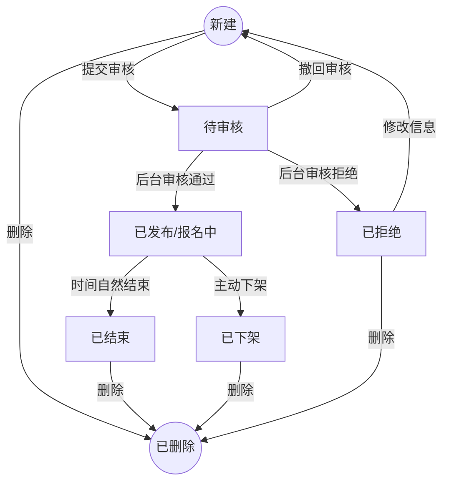
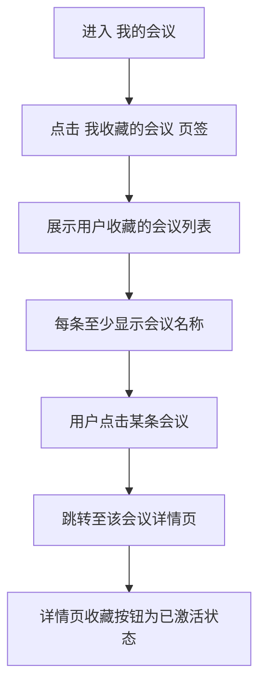

# 我的会议与商业化产品需求说明书

## 需求概览

### 核心摘要
本次需求聚焦于办会方的“后链路”管理体验，并扩展**参会者视角**的会议入口，旨在打造一个从**会议管理**到**数据复盘**再到**商业结算**的完整闭环工作台。**「我的会议」** 升级为**三页签**：**「我报名的会议」** 让用户集中查看已报名的会议（按会议日期倒序，日期最近的在上、日期较远的在下，默认仅展示已发布/进行中，可勾选包含已结束）；**「我收藏的会议」** 集中展示用户收藏的会议列表，点击可跳转会议详情且详情页收藏按钮为已激活状态，与原有「我的收藏」中会议能力迁移至本页签统一入口；**「我创建的会议」** 维持办会方原有的列表、状态操作、会议详情与数据统计、推广等能力。办会方侧，我们重点解决了“数据看不全、结算对账难”的痛点；**参会者整体分析**（会议详情中的用户画像与会议简报中的同一套聚合分析）在**会议独立站**阶段对办会方**免费开放**（会议发布后即可基于当前已报名人员查看整体画像，不必等会议结束；在保护隐私前提下仅展示聚合结果），以便在现阶段用户规模有限时降低使用门槛、提升办会体验。商业化侧仍通过 **推广投放** 与 **财务结算** 等能力支撑增长与结算；**智能会议简报**在可聚合数据具备时包含参会者整体分析章节，与会议详情中的用户画像数据口径一致。办会人可在「我创建的会议」中对**已发布**会议进行**参会人审核**（操作列「审核报名」+ 会议详情内「报名管理」双入口），审核通过后向报名人发送 **Push、短信、邮件、私信** 通知。

### 设计思路
设计遵循“管理高效、数据一致开放、服务集成”的原则。
1.  **管理高效**：在列表页提供清晰的状态流转操作（如撤回、下架），确保主办方对会议生命周期的绝对掌控。
2.  **数据一致开放**：在办会方会议详情页的数据统计中，基础数据（PV/UV/报名数）与**参会者整体分析（用户画像）**对办会方**均免费开放**（独立站阶段不再对用户画像单独收费），仅在隐私与聚合规则上保持一致（不提供具体某位参会者可识别信息）。
3.  **服务集成**：不重复造轮子，对于推广能力，仅在业务层做轻量级封装（发票/账单管理本期暂不纳入），底层直接打通 CSDN 成熟的中台能力，确保体验一致且研发成本可控。

### 历史实现参考
在梳理会议状态流转时，我们严格参考了 `docs/发起会议与会议信息管理产品需求说明书.md` 中定义的生命周期起点，确保“新建”到“发布”的逻辑闭环。**「我报名的会议」** 的数据范围与“已报名”判定，直接依赖 `docs/会议详情与报名产品需求说明书.md` 中的报名记录与会议状态定义，确保与详情页、报名流程一致。**「我收藏的会议」** 的展示与跳转逻辑自 `docs/会议详情与报名产品需求说明书.md` 第 2.4 节「我的收藏中的会议页签」及 `docs/移动端会议功能产品需求说明书.md` 中 App/小程序收藏会议能力迁移至本页签，数据仍依赖现有收藏体系（类型=会议），入口统一在「我的会议」下。会议详情中数据统计的维度则深度对齐该文档中的报名表结构，确保“职级”、“行业”等画像字段有数可依。商业化结算相关设计可参考 CSDN 现有企业工作台；账单管理功能本期暂不纳入。

---

# 第1章：概述

## 1.1 术语表

| 术语 | 英文 | 描述 |
| :--- | :--- | :--- |
| **我的会议** | My Events | 用户查看与管理会议的统一入口页面，包含「我报名的会议」「我收藏的会议」与「我创建的会议」三个页签。 |
| **我报名的会议** | My Registered Events | 当前用户已报名参加的会议列表，按会议日期倒序展示（日期最近的在上、日期较远的在下），默认仅展示已发布、进行中的会议，可切换包含已结束。 |
| **我收藏的会议** | My Favorited Events | 当前用户已收藏的会议列表，集中展示用户在各收藏夹中收藏的会议；点击会议名称跳转至会议详情页，详情页收藏按钮为已激活状态。原在「我的收藏」中的会议页签能力迁移至本页签统一入口。 |
| **我创建的会议** | My Created Events | 办会方管理自己创建的所有会议的控制台，包含列表、状态操作、数据、推广等入口。 |
| **会议详情（办会方）** | Event Detail (Organizer View) | 办会人进入自己创建的某会议后看到的页面，无单独的“数据看板”；该页包含会议内容、标签、信息及**会议的数据统计**（含 PV/UV/报名等基础数据与用户画像/参会者整体分析）。 |
| **参会者整体分析** | Aggregated Attendee Insights | 基于已报名用户聚合的整体画像（如公司类型、岗位、职级、行业、技术栈等），**仅提供整体分析结果**，不支持查看具体某个参会者的详细信息。**会议独立站阶段**：在会议详情**数据统计-用户画像**与**会议简报**中**对办会方免费开放**（无需购买权益；与历史方案中“付费高阶包”不同，以本文档为准）。 |
| **流量包** | Traffic Package | 对接 CSDN 站内广告系统的推广服务单元，通常包含固定的曝光量或点击量。 |
| **账单** | Bill | 记录办会方在平台上产生的费用明细（如推广费等）。*本期不提供账单管理与发票申请功能。* |
| **会议简报** | Event Brief | 系统基于会议数据自动生成的总结性文档（PDF/Word），包含核心数据概览与精彩回顾。 |
| **用户意图** | User Intent | 推广配置中用于界定目标用户具体搜索或行为目的的标签（如代码报错、求职面试等）。 |
| **审核报名** | Registration Review | 办会人在「我创建的会议」中对已发布会议的报名人员进行通过/拒绝操作；审核通过后系统向报名人发送审核结果通知（Push、短信、邮件、私信）。 |

## 1.2 修订记录

| 版本 | 内容 | 负责人 | 更新时间 | 备注 |
| :--- | :--- | :--- | :--- | :--- |
| V1.0 | 初始版本，包含会议管理、数据看板、商业化权益、推广账单 | — | 2026-02-03 | 基于整体方案 6.4 章节细化 |
| V1.1 | 新增推广配置详细字段定义，包含用户行为圈选、静态信息圈选等5大模块 | — | 2026-02-09 | 细化推广配置流程 |
| V1.2 | 推广费用明细补充预估效果（覆盖/曝光/点击）、总价及30分钟内支付享85折限时优惠 | — | 2026-02-09 | — |
| V1.3 | 「我的会议」拆分为双页签：新增「我报名的会议」列表（按时间倒序，默认已发布/进行中，可选含已结束），「我创建的会议」维持原有功能 | — | 2026-02-12 | — |
| V1.4 | 会议简报支持高阶数据（参会者整体分析，默认隐藏、付费开通）；与会议详情中用户画像统一为同一权益；权益价格支持运营端后台配置或预留运维配置接口 | — | 2026-02-12 | — |
| V1.5 | 用户画像会议发布后即可查看（可分析当前已报名用户）；付费以会议为粒度；统一“数据看板”为会议详情（含会议内容、标签、信息及数据统计） | — | 2026-02-12 | — |
| V1.6 | 新增办会人参会人审核能力：已发布会议支持审核报名，操作列「审核报名」+ 会议详情内入口双入口；审核通过后通知 Push、短信、邮件、私信 | — | 2026-02-12 | — |
| V1.7 | 「我的会议」新增第三页签「我收藏的会议」：自「我的收藏」中会议页签迁移，集中展示用户收藏的会议，点击跳转详情且收藏态一致 | — | 2026-03-03 | 迁移自会议详情与报名 2.4、移动端 2.5/2.6 |
| V1.8 | 参会者整体分析（会议详情用户画像与会议简报参会者分析）改为对办会方免费开放，取消付费解锁与相关价格配置；独立站阶段降低使用门槛 | — | 2026-03-29 | 产品策略调整 |

## 1.3 背景和价值

**背景与痛点**：
目前办会方在会议发布后，处于“两眼一抹黑”的状态：不知道多少人看了、来的人是谁、效果如何。同时，若想在平台进行推广或结算费用，需要人工对接销售和财务，流程由于线下流转而极度低效。

**业务价值**：
1.  **运营闭环效率提升**：提供自助式的管理与下架功能，应对突发变更，降低人工运维成本。
2.  **数据洞察普惠**：向办会方开放参会者整体分析能力，提升预热与复盘效率；**会议独立站**阶段用户基数有限，**不再对用户画像/参会者分析单独收费**，商业化侧重推广等场景。
3.  **商业化流程标准化**：打通推广与财务系统，实现从“买流量”到“开票”的全流程自助化，加速资金流转。
4.  **精准营销赋能**：通过细粒度的用户行为与画像圈选（如精确到“代码报错”意图或“AI行业”用户），大幅提升会议推广的转化率和ROI。

---

# 第2章：功能需求

## 2.1 我的会议页面与三页签结构

### 场景描述
**场景 1：查看我报名的会议**
开发者小王经常参加技术大会，希望在一个入口集中查看自己已报名的会议。进入「我的会议」后，默认停留在「我报名的会议」页签，列表按会议日期倒序展示，日期最近的会议在最上方、日期较远的在下方；默认只显示状态为「已发布」「进行中」的会议。若想回顾往年参加过的会议，可勾选「包含已结束」，列表扩展展示已结束的会议，仍按日期倒序排列。

**场景 2：查看我收藏的会议**
用户小陈在会议详情页收藏了几场感兴趣的会议。进入「我的会议」后切换到「我收藏的会议」页签，即可集中查看已收藏的会议列表；点击某条会议名称跳转至会议详情页，详情页收藏按钮为已激活状态。

**场景 3：管理我创建的会议（会议状态流转）**
运营经理小张提交了一个会议审核（状态：待审核），突然发现嘉宾名单有误，于是点击“撤回审核”，会议变回“新建”状态，修改后再次提交。
会议进行到一半，因不可抗力需紧急取消，小张点击“下架”，填写原因后，会议在前台停止展示（状态：已下架）。
对于去年已结束的测试会议，小张点击“删除”，将其从列表中移除，保持工作台整洁。

### 页面结构说明
「我的会议」页面顶部提供**三个页签**：
*   **第一个页签：我报名的会议** — 展示当前用户已报名参加的会议列表及相关筛选与排序规则。
*   **第二个页签：我收藏的会议** — 展示当前用户已收藏的会议列表；点击会议名称跳转至会议详情页，详情页收藏按钮为已激活状态。原在「我的收藏」中按收藏夹展示的会议能力迁移至本页签，作为「我的会议」下的统一入口。
*   **第三个页签：我创建的会议** — 展示当前用户作为办会方创建的所有会议，并支持状态操作（提交审核、撤回、下架、删除）、进入会议详情（含数据统计）、推广配置等能力。

页签切换时，仅切换列表数据与操作能力，不改变页面 URL 或刷新整页；默认进入页面时展示「我报名的会议」页签。

---

### 2.1.1 我报名的会议

#### 基本事件流程

##### 主业务流程
**前置条件**：用户已登录并进入「我的会议」页面，当前页签为「我报名的会议」。

**流程描述**：
1.  **列表展示**：
    *   数据范围：仅展示当前用户**已报名**（存在有效报名记录）的会议。
    *   **排序**：按会议日期倒序排列，**日期最近的会议在最上方**，日期较远的会议展示在下方（排序依据为会议开始日期，若同一日期有多场会议则按会议标题排序；具体以产品实现的“会议召开时间”字段为准）。
    *   **默认状态筛选**：默认仅展示会议状态为 **已发布**、**进行中** 的会议（即正在进行或即将进行的会议）。
    *   **可选“包含已结束”**：提供「包含已结束」勾选项（或等效筛选控件）。未勾选时仅展示已发布、进行中；勾选后，列表在原有基础上**同时展示状态为 已结束** 的会议，排序规则不变（仍按会议日期倒序，日期最近的在上、日期较远的在下）。
    *   列表项建议包含：会议封面、标题、会议时间、会议状态标签（报名中/进行中/已结束）、报名状态（如已报名/已签到）等；点击列表项可跳转至该会议详情页或报名/票据页。
2.  **无数据**：若用户未报名任何会议，或当前筛选条件下无数据，展示空状态提示（如“暂无报名的会议”），可引导用户去会议列表发现并报名。

**后置条件**：用户可区分“即将/正在参加的会议”与“已结束的会议”，并快速进入会议详情或票据。

##### 异常事件流程
*   **未登录**：未登录用户访问「我的会议」时，按系统现有逻辑跳转登录；登录后返回可恢复至「我的会议」并展示「我报名的会议」页签。

#### 业务规则小结
| 规则项 | 说明 |
| :--- | :--- |
| 数据来源 | 仅包含当前用户有报名记录的会议 |
| 默认状态 | 仅展示 已发布、进行中 |
| 可选扩展 | 勾选「包含已结束」后增加展示 已结束 |
| 排序 | 按会议日期倒序，日期最近的在上、日期较远的在下 |

---

### 2.1.2 我创建的会议（列表与状态管理）

#### 基本事件流程

##### 主业务流程
**前置条件**：用户登录并进入「我的会议」页面，当前页签为「我创建的会议」。

**流程描述**：
1.  **列表展示**：
    *   展示我创建的所有会议，支持按状态（全部/新建/待审核/已发布/已结束/已下架/已拒绝）、时间筛选。
    *   列表项包含：封面、标题、时间、当前状态、核心数据（浏览/报名）、**操作列**。
    *   **操作列**：所有会议均提供「查看详情」；**已发布**状态的会议额外提供「审核报名」、会议简报、数据统计（用户画像）等入口。「审核报名」点击后进入该会议的报名审核页，对当前会议的报名人员进行审核；会议详情页内也提供「报名管理」或「审核报名」入口，与操作列进入**同一审核页**。
2.  **状态操作**：
    *   **提交审核**：
        *   适用状态：`新建`、`已拒绝`、`已撤回`。
        *   操作：点击“提交审核”。
        *   结果：状态流转为 `待审核`，锁定编辑功能。
    *   **撤回审核**：
        *   适用状态：`待审核`。
        *   操作：点击“撤回审核”。
        *   结果：状态流转为 `新建`，恢复编辑权限。
    *   **下架**：
        *   适用状态：`已发布`（报名中/进行中）。
        *   操作：点击“下架” -> 弹窗填写下架原因（必填） -> 确认。
        *   结果：状态流转为 `已下架`，C 端详情页显示“会议已停止/下架”，停止报名。
    *   **删除**：
        *   适用状态：`新建`、`已结束`、`已下架`、`已拒绝`。
        *   操作：点击“删除” -> 二次确认。
        *   结果：列表移除该条目（逻辑删除 `status=Deleted`）。

本页签下的**会议详情与数据统计、会议简报、推广配置、参会人审核（报名管理）**等能力维持不变，均针对「我创建的会议」列表中的会议进行操作（详见 2.2、2.3、2.4、2.5）。

##### 异常事件流程
*   **操作冲突**：若管理员正在后台审核中（锁定态），用户点击撤回，提示“正在审核中，无法撤回，请联系管理员”。



## 2.1.3 我收藏的会议

本页签内容自《会议详情与报名产品需求说明书》第 2.4 节「我的收藏中的会议页签」及《移动端会议功能产品需求说明书》中 App/小程序收藏会议能力迁移至「我的会议」下，作为统一入口集中展示用户收藏的会议。

### 场景描述

**场景 1：在「我的会议」中查看收藏的会议**
用户小陈在会议详情页收藏了几场感兴趣的峰会。某天他想回顾这些会议时，进入「我的会议」并切换到「我收藏的会议」页签。列表展示其已收藏的会议（至少包含会议名称）；点击某条会议名称即可跳转到该会议详情页，且详情页上的收藏按钮已处于激活状态（已收藏）。

**场景 2：多端一致**
网页端与移动端「我的会议」均提供「我收藏的会议」页签；两个端在页签下的列表展示与跳转逻辑一致，保证用户在不同设备上都能统一管理收藏的会议。

### 业务流程



### 基本事件流程

#### 主业务流程

**前置条件**：用户已登录并进入「我的会议」页面，当前页签为「我收藏的会议」。

**流程描述**：
1.  **列表展示**：
    *   数据范围：展示当前用户**已收藏**的会议（依赖现有收藏体系，收藏类型=会议；可聚合用户在各收藏夹中的会议收藏，或按产品约定展示逻辑）。
    *   列表项至少包含：**会议名称**（可点击）；是否展示封面、会议时间、状态等以产品设计为准，本期至少展示会议名称。
    *   样式与交互与「我报名的会议」列表风格保持一致（如可带星标/心形已激活态）。
2.  **无数据**：若用户未收藏任何会议，或当前无收藏会议数据，展示空状态提示（如「暂无收藏的会议」），可引导用户去会议列表发现并收藏。
3.  **点击条目跳转与收藏态**：
    *   用户点击某条会议名称，系统跳转到该会议的**会议详情页**。
    *   会议详情页加载完成后，**收藏按钮（图标）为已激活状态**，表示该会议已收藏；若用户在详情页取消收藏，再次进入「我收藏的会议」时该会议不再出现在列表中。
**后置条件**：详情页与「我收藏的会议」列表的收藏状态保持一致。

#### 扩展事件流程

*   **可选：按收藏夹筛选**：若产品需要与「我的收藏」中按收藏夹查看的体验对齐，可在本页签提供按收藏夹筛选（下拉或 Tab），列表随所选收藏夹变化；本期若不实现则默认展示用户全部收藏的会议。

#### 异常事件流程

*   **会议已下架/删除**：若某条收藏的会议已被下架或删除，列表仍可展示该条（展示会议名称），点击跳转后由会议详情页按现有逻辑展示「会议已下架」等提示。
*   **未登录**：未登录用户访问「我的会议」时，按系统现有逻辑跳转登录；登录后返回可恢复至「我的会议」并展示对应页签。

### 数据项描述

| 项目 | 说明 |
| :--- | :--- |
| 依赖现有收藏体系 | 会议收藏与「我的收藏」共用现有收藏夹与收藏关系数据；需在收藏类型/业务类型中支持「会议」类型，并与会议 ID 关联。本页签列表查询条件：当前用户、类型=会议（可聚合各收藏夹下的会议收藏）。 |
| 列表展示字段 | 列表项至少包含：会议名称（可点击）、会议 ID（用于跳转）；是否展示其它字段（如时间、封面）以产品设计为准，本期至少要求展示会议名称。 |

### 需求波及分析

*   **影响模块**：「我的会议」页面（含网页端与移动端）需新增「我收藏的会议」页签，并实现会议收藏列表拉取与会议详情跳转；会议详情页需在由「我收藏的会议」进入时正确展示已收藏状态。与「我的收藏」中会议页签可并存（双入口）或由产品决定是否仅在「我的会议」保留本入口。
*   **数据影响**：若现有收藏表无「会议」类型，需扩展收藏类型枚举或关联表，支持按「会议」类型与会议 ID 存储与查询；本页签不新增独立表，复用收藏服务。
*   **业务规则影响**：收藏/取消收藏规则与会议详情页收藏能力一致；「我收藏的会议」列表与会议详情页收藏状态双向一致。

### 验收准则

| 编号 | 场景描述 | Given（前置条件） | When（触发条件） | Then（预期结果） | And（附加验证） |
| :--- | :--- | :--- | :--- | :--- | :--- |
| **AC-F01** | 我收藏的会议页签展示与列表 | 用户已登录，且已收藏至少 1 场会议 | 用户进入「我的会议」并点击「我收藏的会议」页签 | 页签切换为「我收藏的会议」，列表展示用户收藏的会议，每条至少显示会议名称 | 无收藏会议时展示空状态「暂无收藏的会议」 |
| **AC-F02** | 点击会议名称跳转且收藏已激活 | 用户在「我收藏的会议」页签下看到会议 A | 用户点击会议 A 的名称 | 跳转到会议 A 的详情页，且详情页上的收藏按钮为已激活状态 | 在详情页取消收藏后，再回到「我收藏的会议」，会议 A 不再出现在列表 |
| **AC-F03** | 多端一致 | 网页端与移动端均支持「我的会议」 | 分别在网页端与移动端进入「我的会议」-「我收藏的会议」页签 | 均展示用户收藏的会议列表，点击条目均跳转详情且收藏已激活 | 两端交互与数据范围一致 |

### 国际化命名

| 使用场景 | 中文 | 英文 |
| :--- | :--- | :--- |
| 页签名称 | 我收藏的会议 | My Favorited Events |
| 空状态提示 | 暂无收藏的会议 | No favorited meetings |

### 埋点建议

| 模块 | 指标名称 | 指标定义 | 触发时机 |
| :--- | :--- | :--- | :--- |
| 我的会议 | 点击_我收藏的会议页签 | 点击「我收藏的会议」页签的次数 | 点击页签时 |
| 我的会议 | 点击_收藏会议条目 | 在「我收藏的会议」页签下点击某条会议名称的次数 | 点击会议名称跳转前，可带 meeting_id |

---

## 2.2 会议详情与数据统计（含用户画像）

办会人进入自己创建的某会议后，在该会议的**详情页**即可查看**会议内容、标签、信息**以及**会议的数据统计**（含 PV/UV/报名等基础数据与**参会者整体分析/用户画像**）。以下描述均基于该会议详情页中的数据统计能力。

### 场景描述
**场景 1：基础数据查看**
主办方进入某会议详情页，在数据统计区域随时查看今日 PV、UV 和新增报名数，评估预热效果。

**场景 2：查看参会者整体分析（与会议简报中参会者分析同一数据口径，免费开放）**
主办方想分析参会人员构成（仅需整体分析，如职级、行业、公司、岗位等分布，不需要查看具体某位参会者信息）。**会议独立站阶段该能力对办会方免费开放**。**用户画像在会议发布后即可查看**，可分析**当前已报名人员**的整体画像，不必等会议结束。例如办会者创建并发布了会议 A，在会议 A 召开前即可在会议详情页的数据统计中查看已报名人员的整体画像；会议结束后，在**会议简报**中可查看**同一套**参会者整体分析（数据可聚合的前提下）。在**会议详情页**的数据统计区域进入“用户画像”时，**不再**进行隐藏/模糊或引导付费解锁；若尚无可聚合的报名数据，展示空状态或说明文案（如“暂无报名数据”），**不**出现购买权益类提示。

### 基本事件流程

#### 主业务流程
1.  **基础数据展示**：
    *   实时展示：浏览量 (PV)、访客数 (UV)、报名人数、签到人数、签到率。
    *   趋势图：展示近 7 日的数据变化曲线。

2.  **用户画像展示（免费开放，与会议简报中参会者分析为同一数据口径）**：
    *   **有已报名用户且可聚合时**：直接展示整体分析结果，**无需**购买、解锁或支付。
        *   **职级分布**：饼图展示（如 初级 20%, 中级 30%, 高级 50%）。
        *   **行业分布**：柱状图展示（如 互联网, 金融, 制造）。
        *   **公司/岗位**等：整体分布统计（如 常见公司类型、岗位占比）。
        *   **技术栈**：词云展示（基于参会者 CSDN 历史行为标签）。
        *   *注：仅提供整体分析结果，不展示、不支持查看具体某个参会者的详细信息；所有数据基于 CSDN 大数据脱敏聚合。*
    *   **暂无可聚合数据时**：展示空状态或零数据说明，**不**展示付费解锁、价格或收银台入口。

#### 扩展事件流程
*   （本期不适用）原“数据权益购买/后付费解锁用户画像”流程已取消

## 2.3 会议简报下载

### 场景描述
会议结束一周后，主办方需要向领导汇报。进入「我的会议」-「我创建的会议」，进入某会议后点击“下载简报”。系统自动生成一份精美的 PDF，包含封面、核心数据大字报、热门议题回顾；在**数据可聚合**的前提下，简报中**默认包含**与会议详情**数据统计-用户画像**一致的**参会者整体分析**章节（公司、岗位、职级、行业、技术栈等常见用户信息的聚合分析），仅整体分析结果，不包含任何具体某位参会者的详细信息。**会议独立站阶段无需付费开通**该章节；若某次会议尚无可聚合的报名/参会数据，该章节可省略或展示“暂无数据”类说明，**不**使用“开通权益后可查看”类付费引导。

### 基本事件流程
1.  **生成简报**：
    *   点击“下载简报”按钮。
    *   系统后端聚合数据：基础统计（PV/UV/报名/签到等）、热门议题（基于议题点击/评分数据）。
    *   **参会者整体分析**：
        *   **数据可聚合时**：简报中包含参会者整体分析章节（公司、岗位、职级、行业、技术栈等聚合结果），仅整体分析，不展示单个参会者信息；与 2.2 会议详情中的用户画像**数据口径一致**。
        *   **暂无可聚合数据时**：可不生成该章节或展示空/无数据说明；不提供具体某参会者明细。
    *   与 2.2 会议详情中的数据统计为**同一套分析能力**，**不再**依赖单独购买权益。
2.  **格式选择**：
    *   支持 PDF（适合直接打印/汇报）和 Word（适合二次编辑）。
3.  **下载**：
    *   浏览器触发文件下载任务。

## 2.4 推广配置（暂不实现）

### 场景描述
**场景 1：精准推广配置**
主办方希望为“2025 AI技术峰会”进行精准引流。在“我的会议”列表中，点击该已发布会议右侧的【配置推广】按钮。进入推广配置页后，他依次配置了产品信息、目标用户行为（如“近一个月搜索过相关内容”）、静态画像（如“北京/上海的AI行业从业者”），并选择了“短信”和“邮件”渠道。右侧的“推广费用明细”根据他的选择实时计算出预计覆盖10万名开发者，预计费用为 ¥5000。

**场景 2：费用实时测算与限时优惠**
在配置过程中，主办方尝试勾选“私信”渠道，右侧的预计覆盖、预计曝光、预计点击及总价立即更新。考虑到预算有限，他取消了“私信”并调整了“付费形式”为“按点击结算”，费用随之下降。配置完成后他点击「生成订单」，系统生成订单并向管理后台发送通知、留档；页面展示“30 分钟内支付享 85 折”及倒计时（自生成订单起算），他在倒计时内完成支付，成功享受优惠。

### 2.4.1 推广配置详情
**前置条件**：会议状态必须为`已发布`。若会议状态为“待审核”或“新建”，【配置推广】按钮应置灰不可点。

**配置流程与字段说明**：
用户点击【配置推广】后进入配置页面，页面包含以下5个核心模块，用户配置过程中，右侧侧边栏【推广费用明细】需实时联动更新。

#### 1. 产品信息
*   **产品名称**：手动输入（默认填充会议名称，可修改）。
*   **用户意图**（多选）：
    *   选项：知识点问答、代码报错、开发工具获取与安装、代码获取、体系学习/培训/认证、考试/比赛/面试求职、行业资讯/政策/产品发布。
*   **精准投放等级**（多选）：
    *   选项：一级（本产品&同义词）、二级（竞品词）、三级（上位词）、四级（仅根据意图）。
*   **扩展产品词**：手动输入，用于补充特定关键词。

#### 2.1 用户行为圈选
基于用户在 CSDN 站内的历史行为进行动态筛选。
*   **行为周期**（单选）：
    *   选项：近7天、近15天、近一个月、近两个月、近三个月。
*   **选择行为**（多选）：
    *   选项：搜索、创作。
*   **用户行为频次**：数值选择（默认为 >=1）。
*   **近期触达**（多选）：
    *   选项：近半年内点击过短信、近半年内点击过邮件。

#### 2.2 静态信息圈选
基于用户的注册信息和画像标签进行筛选。
*   **地域**（多选）：省市区级联选择，精确到市级（如 北京市-朝阳区）。
*   **学历**（多选）：专科、本科、研究生、博士。
*   **毕业院校**（多选）：支持搜索，基于学校标准库列表。
*   **是否学生**（单选）：是、否。
*   **行业领域**（多选）：AI人工智能、云计算、开源、出海、鸿蒙、游戏、金融、电商、机器人、医疗、数据库/操作系统、教育、音视频、互联网、企业服务、政府/事业单位。
*   **公司名称**（多选）：支持搜索，基于公司标准库列表。
*   **职位**（多选）：CTO/技术VP、技术总监、架构师、高级工程师、中级工程师、初级工程师。
*   **其他标签**（多选）：基于标签库选择。

#### 3. 渠道选择
*   **推广渠道**（多选）：短信、邮件、私信、push。

#### 4. 付费形式选择
*   **计费方式**（多选）：按曝光结算 (CPM)、按点击结算 (CPC)、按报名结算 (CPA)。

#### 5. 推广费用明细（右侧实时展示）
用户完成左侧配置后，右侧【推广费用明细】实时展示当前方案的**预估效果**与**总价**。

*   **预估效果**（根据圈选条件实时计算）：
    *   **预计覆盖**：满足圈选条件的开发者总人数（单位：人）。
    *   **预计曝光**：预计推广内容将被展示的总次数。
    *   **预计点击**：预计产生的点击次数。
*   **费用**：
    *   **原价（小计）**：按当前配置计算的基础费用。
    *   **限时优惠**：用户完成推广信息配置后点击「**生成订单**」，**从生成订单开始计时**，30 分钟内完成支付可享受 **85 折**优惠（即实付金额 = 原价 × 0.85）；过时则按原价结算。页面需明确展示优惠倒计时或“30 分钟内支付享 85 折”的提示文案。
    *   **生成订单与后台通知**：用户完成推广信息配置后点击「生成订单」，系统生成推广订单（待支付状态）；限时优惠的 30 分钟自此时起算。用户点击「生成订单」后，系统需**向管理后台发送通知**，管理后台需**保留该订单生成/待支付记录**，便于运营或财务跟进待支付订单。
*   **交互**：每当左侧配置项发生变更（如增加渠道、缩小地域），右侧的预估效果与总价需立即重新计算并刷新；限时优惠的 30 分钟计时自用户点击「生成订单」起算。

*注：账单管理（账单列表、发票申请）本期暂不考虑，后续如需再单独规划。*

## 2.5 参会人审核（报名管理）

办会人需能够对**已发布**状态下、自己发起的会议的**报名人员**进行审核（通过/拒绝）。审核通过后，系统向该报名人发送审核结果通知（**Push、短信、邮件、私信**），通知其“报名已通过”；审核拒绝时同样通过上述渠道通知“未通过审核”（具体文案由产品/运营确定）。

### 入口设计（双入口）
*   **操作列按钮**：在「我创建的会议」列表中，对**已发布**状态的会议，在操作列提供「**审核报名**」按钮（与「查看详情」、会议简报、数据统计等并列）。点击后进入该会议的**报名审核页**，进行报名列表查看与通过/拒绝操作。
*   **会议详情页入口**：办会人进入某会议详情页后，在详情页内提供「**报名管理**」或「**审核报名**」入口（如 Tab、区块按钮），点击后进入**同一报名审核页**。列表操作列与会议详情共用同一审核能力与页面，避免两套逻辑。

仅**已发布**的会议展示审核报名入口；新建、待审核、已结束、已下架、已拒绝状态的会议不展示该入口。

### 场景描述
**场景 1：从列表快速审核**
运营小张在「我创建的会议」中看到“2025 AI技术峰会·北京站”状态为已发布，待审核报名较多。他直接点击该行操作列的「审核报名」，进入报名审核页，按列表逐条通过或拒绝，审核通过的用户将收到 Push、短信、邮件、私信通知。

**场景 2：从会议详情进入审核**
小张点击「查看详情」进入该会议详情页，在页面中找到「报名管理」入口并点击，同样进入报名审核页，与从操作列进入的页面一致。

### 基本事件流程

#### 主业务流程
**前置条件**：会议状态为**已发布**；当前用户为该会议的办会人（创建者/管理权限）。

1.  **进入审核页**：
    *   从「我创建的会议」列表操作列点击「审核报名」，或从会议详情页点击「报名管理」/「审核报名」。
    *   系统跳转至该会议的**报名审核页**，展示该会议下状态为「待审核」的报名记录列表（可扩展支持查看“已报名”“已拒绝”等筛选）。
2.  **审核列表展示**：
    *   列表字段建议包含：报名人姓名、手机号（脱敏）、邮箱、公司、职位、报名时间、当前状态等（与《会议详情与报名产品需求说明书》中报名填写项及报名记录表对齐）。
    *   支持单条「通过」「拒绝」操作；可选支持批量通过/拒绝。
3.  **审核通过**：
    *   办会人点击某条记录的「通过」。
    *   系统将该报名记录状态更新为「已报名」。
    *   系统向该报名人发送**审核通过**通知，触达渠道包括：**Push、短信、邮件、私信**（模板示例：“您申请的[会议名称]已审核通过，请准时参会。”具体文案可配置或由运营确定）。
4.  **审核拒绝**：
    *   办会人点击某条记录的「拒绝」（可选填写或选择拒绝原因）。
    *   系统将该报名记录状态更新为「已拒绝」。
    *   系统向该报名人发送**审核拒绝**通知，触达渠道包括：**Push、短信、邮件、私信**（模板示例：“很遗憾，您申请的[会议名称]未能通过审核。”）。

#### 异常事件流程
*   **会议已下架/已结束**：若办会人在审核页操作时会议已下架或已结束，后续审核操作是否允许由业务决定；建议提示“会议已结束/已下架，无法继续审核”并禁止通过/拒绝。
*   **并发审核**：同一报名记录被多人（如有协作权限）同时操作时，以先生效为准，后置操作提示“该条已处理”。

### 需求波及与历史文档
*   **会议详情与报名产品需求说明书**：报名记录状态（待审核/已报名/已拒绝）、报名填写项及列表展示字段与该文档保持一致；审核结果通知在该文档中已约定“站内信+邮件+Push”，本需求在办会人侧明确**操作入口（操作列+会议详情）**及**通知渠道补充为 Push、短信、邮件、私信**，与站内信一并由实现方统一落地。

---

# 第3章：数据项描述

## 3.1 会议权益记录表 (Meeting_Rights)
用于记录会议侧**增值服务购买**情况（若有）。**本期**参会者整体分析在会议详情与会议简报中**免费开放**，**不再**通过本表购买 DATA_PREMIUM 解锁用户画像；若需兼容历史已购记录或预留未来其他增值权益，可保留本表结构；若历史上无数据权益订单且本期无其他权益类型，实现上可简化或仅保留推广相关扩展能力。*此处信息不明确，需补充确认：是否必须保留 DATA_PREMIUM 枚举以兼容历史数据。*

| 字段名 | 标识符 | 类型 | 必填 | 说明 |
| :--- | :--- | :--- | :--- | :--- |
| 记录ID | `id` | Long | 是 | 主键 |
| 会议ID | `meeting_id` | Long | 是 | 关联会议 |
| 权益类型 | `rights_type` | Enum | 是 | 含历史或扩展项；**本期用户画像/参会者分析不依赖付费权益**（历史 DATA_PREMIUM 定义以兼容策略为准） |
| 状态 | `status` | Enum | 是 | ACTIVE(已生效), INACTIVE(未生效) |
| 生效时间 | `active_time` | DateTime | 否 | |
| 关联订单号 | `order_no` | String | 否 | 关联的账单/订单号 |

## 3.2 账单明细表 (Meeting_Bill)
用于在会议系统侧记录费用（**主要为推广费等**），供后续对账或扩展使用。*本期不提供账单列表与发票申请的前端功能。*实际资金流转在 CSDN 支付中心。**本期不向用户收取“数据权益/用户画像”费用**；`DATA_RIGHTS` 等枚举可保留作历史兼容或扩展。

| 字段名 | 标识符 | 类型 | 必填 | 说明 |
| :--- | :--- | :--- | :--- | :--- |
| 账单ID | `bill_id` | Long | 是 | 主键 |
| 会议ID | `meeting_id` | Long | 是 | |
| 费用类型 | `fee_type` | Enum | 是 | PROMOTION(推广), DATA_RIGHTS(数据权益，历史兼容/扩展；本期无用户画像付费) |
| 金额 | `amount` | Decimal | 是 | |
| 支付状态 | `pay_status` | Enum | 是 | PAID(已支付), UNPAID(待结算) |
| 开票状态 | `invoice_status` | Enum | 是 | NONE(未开票), APPLIED(开票中), ISSUED(已开票) |

## 3.3 推广配置表 (Promotion_Config)
用于存储用户单次推广配置的详细参数。

| 字段名 | 标识符 | 类型 | 必填 | 说明 |
| :--- | :--- | :--- | :--- | :--- |
| 配置ID | `config_id` | Long | 是 | 主键 |
| 会议ID | `meeting_id` | Long | 是 | |
| 用户意图 | `user_intents` | JSON | 否 | 存储选中的意图列表 |
| 行为周期 | `behavior_period` | String | 是 | 7d/15d/1m/2m/3m |
| 目标行为 | `target_behaviors` | JSON | 是 | ["Search", "Create"] |
| 目标地域 | `target_regions` | JSON | 否 | 城市ID列表 |
| 目标行业 | `target_industries` | JSON | 否 | 行业枚举值列表 |
| 投放渠道 | `channels` | JSON | 是 | ["SMS", "Email"] |
| 付费模式 | `pay_mode` | String | 是 | CPM/CPC/CPA |

---

# 第4章：需求波及分析

## 4.1 影响模块与系统集成

| 影响模块 | 影响说明 | 集成方式 |
| :--- | :--- | :--- |
| **我的会议（FE）** | 页面改为三页签（我报名的会议 / 我收藏的会议 / 我创建的会议）；「我报名的会议」为新增列表与筛选逻辑；「我收藏的会议」为自「我的收藏」中会议页签迁移的统一入口，展示用户收藏的会议列表；「我创建的会议」保留原有列表、状态操作及“配置推广”等入口，并在列表中为正在被推广的会议展示明显的推广状态标识。 | 新开发 + 改造 |
| **CSDN 广告系统** | 需对接广告投放配置接口，传递圈选条件。 | API 对接 |
| **管理后台** | 用户点击「生成订单」后需接收通知，并保留推广订单生成/待支付记录，便于运营或财务跟进。 | 通知对接 + 记录展示 |
| **CSDN 财务中心** | 需对接开票申请流程。 | 跳转链接 + 订单数据推送API |
| **CSDN 用户画像库** | 需调用大数据标签接口获取参会者画像分布及推广预估人数。 | 后端 API 调用 |
| **消息/通知中心** | 审核通过/拒绝后需向报名人发送 Push、短信、邮件、私信（及站内信）；需对接各渠道发送能力。 | 接口/模板配置 |

**数据影响**：「我报名的会议」依赖现有报名记录与会议主数据，通过“当前用户 + 报名记录”筛选并关联会议信息即可，无需新增数据表。「我收藏的会议」依赖现有收藏体系（类型=会议），无需新增数据表；列表可聚合用户在各收藏夹中的会议收藏。「我创建的会议」列表与状态逻辑不变，无额外数据库变更。**参会者整体分析免费开放**后，不再依赖“数据高阶权益”购买记录驱动展示；若库表仍保留历史权益字段，以实现方兼容策略为准。

## 4.2 历史文档查阅记录

#### 历史需求文档
- **文档名称**：`CSDN会议功能/docs/发起会议与会议信息管理产品需求说明书.md`
- **文档位置**：`CSDN会议功能/docs/发起会议与会议信息管理产品需求说明书.md`
- **参考功能**：
    - 参考了“会议状态”的初始定义，确保只有`已发布`状态的会议才能触发推广配置。
    - 确认了会议基本信息字段，以便在推广配置页预填“产品名称”。
- **设计一致性**：状态流转逻辑保持一致，推广操作作为“已发布”状态下的扩展行为。

- **文档名称**：`CSDN会议功能/docs/会议详情与报名产品需求说明书.md`
- **文档位置**：`CSDN会议功能/docs/会议详情与报名产品需求说明书.md`
- **参考功能**：
    - 「我报名的会议」仅展示当前用户有报名记录的会议，报名记录与状态定义以本文档为准。
    - 会议详情中数据统计的指标直接关联到该文档定义的报名数据。
    - 推广的转化目标（如“按报名结算”）依赖于该文档中定义的报名完成状态。
    - **参会人审核**：报名记录状态（待审核/已报名/已拒绝）、报名填写项及列表字段与该文档一致；审核结果通知在该文档为“站内信+邮件+Push”，本需求在办会人侧明确操作入口（操作列+会议详情）并补充通知渠道为 **Push、短信、邮件、私信**。
    - **我收藏的会议**：本需求将「我的收藏」中的会议页签能力（该文档第 2.4 节）迁移至「我的会议」下新增「我收藏的会议」页签，列表展示、跳转详情、收藏态一致等逻辑与该文档 2.4 及《移动端会议功能产品需求说明书》2.5/2.6 对齐，数据仍依赖现有收藏体系（类型=会议）。
- **文档名称**：`CSDN会议功能/docs/会议管理与审核产品需求说明书.md`
- **文档位置**：`CSDN会议功能/docs/会议管理与审核产品需求说明书.md`
- **参考功能**：
    - 参考了管理端对会议状态与生命周期的定义，确保「我创建的会议」列表中的状态展示与运营审核端保持一致。
- **设计一致性**：在新增推广状态标识时，不改变既有会议状态机与审核规则，仅作为办会方视角的补充信息展示。

- **文档名称**：`CSDN会议功能/docs/移动端会议功能产品需求说明书.md`
- **文档位置**：`CSDN会议功能/docs/移动端会议功能产品需求说明书.md`
- **参考功能**：
    - 参考了移动端「我的会议」三页签结构与能力边界，确保本需求新增的推广状态标识主要作用于网页端「我创建的会议」列表，移动端暂不引入额外管理操作。
- **设计一致性**：保持多端在「我的会议」结构上的一致性，仅在网页端增强列表展示信息，避免打破移动端“轻管理”原则。

---

# 第5章：验收准则

## 5.1 验收准则表格

| 编号 | 场景描述 | Given (前置条件) | When (触发条件) | Then (预期结果) | And (附加验证) |
| :--- | :--- | :--- | :--- | :--- | :--- |
| **AC-M01** | 我的会议默认页签与排序 | 用户已登录且至少有一条已报名会议（状态为已发布或进行中） | 用户进入「我的会议」页面 | 默认展示「我报名的会议」页签 | 列表按会议日期倒序，日期最近的会议在最上方、日期较远的在下方 |
| **AC-M02** | 我报名的会议默认不包含已结束 | 用户有已报名会议，其中包含已结束的会议 | 用户停留在「我报名的会议」页签且未勾选「包含已结束」 | 列表仅展示状态为已发布、进行中的会议 | 已结束的会议不出现 |
| **AC-M03** | 勾选包含已结束后展示已结束会议 | 用户有已报名的已结束会议，且当前在「我报名的会议」页签 | 用户勾选「包含已结束」 | 列表在原有已发布、进行中基础上增加展示已结束的会议 | 排序仍为按会议日期倒序，日期最近的在上、日期较远的在下 |
| **AC-M04** | 我报名的会议无数据空状态 | 用户已登录且未报名任何会议（或当前筛选下无数据） | 用户进入「我报名的会议」页签 | 展示空状态提示（如“暂无报名的会议”） | 可提供去会议列表发现的引导 |
| **AC-M05** | 我创建的会议功能保持 | 用户已登录且为某会议创建者 | 用户切换到「我创建的会议」页签 | 展示该用户创建的所有会议，支持按状态、时间筛选及提交审核/撤回/下架/删除等操作 | 会议详情与数据统计、推广等入口行为与改造前一致 |
| **AC-M06** | 我创建的会议展示推广状态标识 | 用户已登录且在「我创建的会议」页签下，且至少存在一场正在被推广的会议和一场未推广或推广已结束的会议 | 用户查看「我创建的会议」列表 | 正在被推广的会议在列表中展示明显的推广状态标识，用于区分“正在被推广”的会议与未推广或推广已结束的会议 | 未推广或推广已结束的会议不展示该标识；推广状态标识的具体展示文案、图标样式及在列表中的展示位置以后续产品与设计确认为准，此处信息不明确，需补充确认：推广状态标识的具体展示文案、图标样式及在列表中的展示位置。 |
| **AC-F01** | 我收藏的会议页签展示与列表 | 用户已登录，且已收藏至少 1 场会议 | 用户进入「我的会议」并点击「我收藏的会议」页签 | 页签切换为「我收藏的会议」，列表展示用户收藏的会议，每条至少显示会议名称 | 无收藏会议时展示空状态「暂无收藏的会议」 |
| **AC-F02** | 点击收藏会议跳转且收藏已激活 | 用户在「我收藏的会议」页签下看到会议 A | 用户点击会议 A 的名称 | 跳转到会议 A 的详情页，且详情页上的收藏按钮为已激活状态 | 在详情页取消收藏后，再回到「我收藏的会议」，会议 A 不再出现在列表 |
| **AC-F03** | 我收藏的会议多端一致 | 网页端与移动端均支持「我的会议」 | 分别在网页端与移动端进入「我的会议」-「我收藏的会议」页签 | 均展示用户收藏的会议列表，点击条目均跳转详情且收藏已激活 | 两端交互与数据范围一致 |
| **AC-B01** | 会议详情用户画像免费开放 | 会议已发布，当前用户为该会议办会人，且已存在可聚合的已报名用户数据 | 办会人在会议详情页进入数据统计中的「用户画像」 | 直接展示职级、行业、公司/岗位、技术栈等整体分析图表或统计 | 无模糊、遮罩、付费解锁或价格展示；不展示任何具体参会者可识别明细 |
| **AC-B02** | 会议简报含参会者整体分析（免费） | 会议可下载简报，且参会者数据可聚合 | 办会人下载会议简报 | 简报中包含参会者整体分析章节（与详情页用户画像口径一致） | 仅整体分析，不包含具体某位参会者信息；无“开通权益”类付费引导 |
| **AC-B03** | 无报名数据时不引导付费 | 会议已发布但尚无可聚合的报名数据 | 办会人查看会议详情「用户画像」或下载简报 | 展示空状态或“暂无数据”类说明 | 不出现购买权益、价格或收银台入口 |
| **AC-R01** | 已发布会议展示审核报名入口 | 会议状态为已发布，当前用户为该会议办会人 | 用户在「我创建的会议」列表或该会议详情页查看 | 列表操作列展示「审核报名」按钮；会议详情页展示「报名管理」或「审核报名」入口 | 非已发布会议不展示该入口 |
| **AC-R02** | 操作列与会议详情进入同一审核页 | 会议已发布且存在待审核报名 | 用户从操作列点击「审核报名」或从会议详情点击「报名管理」 | 均进入该会议的报名审核页，展示同一报名列表与通过/拒绝操作 | 列表字段与报名记录一致，支持单条通过/拒绝 |
| **AC-R03** | 审核通过后多渠道通知 | 某条报名为待审核状态 | 办会人在审核页点击该条「通过」 | 该报名状态变更为已报名；系统向该报名人发送审核通过通知 | 触达渠道包含 Push、短信、邮件、私信（及站内信）；文案含会议名称及“已审核通过”等 |
| **AC-R04** | 审核拒绝后通知 | 某条报名为待审核状态 | 办会人在审核页点击该条「拒绝」 | 该报名状态变更为已拒绝；系统向该报名人发送审核拒绝通知 | 触达渠道包含 Push、短信、邮件、私信（及站内信） |
| **AC01** | 推广入口控制 | 会议状态为“待审核”，且用户在「我创建的会议」列表 | 用户查看该会议操作栏 | 【配置推广】按钮应不可点击或隐藏 | 鼠标悬停提示“会议发布后方可推广” |
| **AC02** | 推广配置实时计算 | 用户在推广配置页 | 用户新增勾选“短信”渠道 | 右侧“推广费用明细”中的“小计”金额应立即增加 | “预计覆盖人数”应根据算法更新 |
| **AC03** | 静态画像圈选联动 | 用户在配置页 | 用户选择“是否学生”为“是” | “职位”和“公司名称”字段应置灰或隐藏 | 避免产生逻辑冲突的筛选条件 |
| **AC04** | 提交推广订单 | 用户完成了所有必填项配置 | 用户点击“确认推广” | 生成一条待支付的推广订单 | 跳转至收银台或提示支付 |
| **AC05** | 推广费用明细完整性 | 用户已完成任意有效配置 | 用户查看右侧推广费用明细 | 展示预计覆盖、预计曝光、预计点击三项预估效果及总价 | 三项预估数据与总价均随配置变更实时刷新 |
| **AC06** | 限时优惠展示与生效 | 用户完成推广配置并点击「生成订单」 | 自生成订单起 30 分钟内完成支付 | 实付金额按原价的 85% 结算 | 超过 30 分钟则按原价结算；页面需展示自生成订单起算的优惠倒计时或提示文案 |
| **AC07** | 生成订单后通知管理后台 | 用户完成推广配置并点击「生成订单」 | 系统生成推广订单（待支付） | 系统向管理后台发送通知，管理后台保留该订单生成/待支付记录 | 便于运营或财务跟进 |

## 5.2 Gherkin 验收用例

```gherkin
Feature: 我的会议双页签

  Scenario: 进入我的会议默认展示我报名的会议且按日期倒序
    Given 用户已登录
    And 用户至少有一条已报名且状态为已发布或进行中的会议
    When 用户进入「我的会议」页面
    Then 当前页签应为「我报名的会议」
    And 列表按会议日期倒序展示，日期最近的会议在最上方、日期较远的在下方

  Scenario: 我报名的会议默认不包含已结束
    Given 用户已登录且在「我报名的会议」页签
    And 用户存在已报名且状态为已结束的会议
    And 用户未勾选「包含已结束」
    When 用户查看列表
    Then 列表仅展示状态为已发布、进行中的会议
    And 已结束的会议不应出现在列表中

  Scenario: 勾选包含已结束后可看到已结束会议
    Given 用户已登录且在「我报名的会议」页签
    And 用户存在已报名的已结束会议
    When 用户勾选「包含已结束」
    Then 列表应在已发布、进行中基础上增加展示已结束的会议
    And 列表仍按会议日期倒序排列，日期最近的在上、日期较远的在下

  Scenario: 我报名的会议无数据时展示空状态
    Given 用户已登录
    And 用户未报名任何会议（或当前筛选下无数据）
    When 用户进入「我报名的会议」页签
    Then 应展示空状态提示（如「暂无报名的会议」）
    And 可提供前往会议列表的引导

  Scenario: 我创建的会议页签保持原有能力
    Given 用户已登录且为某会议创建者
    When 用户切换到「我创建的会议」页签
    Then 应展示该用户创建的所有会议
    And 应支持按状态、时间筛选
    And 应支持提交审核、撤回、下架、删除等状态操作
    And 会议详情与数据统计、推广等入口行为与改造前一致

  Scenario: 我收藏的会议页签展示与列表
    Given 用户已登录
    And 用户已收藏至少 1 场会议
    When 用户进入「我的会议」并点击「我收藏的会议」页签
    Then 页签应切换为「我收藏的会议」
    And 列表应展示用户收藏的会议且每条至少显示会议名称
    And 无收藏会议时应展示空状态「暂无收藏的会议」

  Scenario: 点击收藏会议跳转且详情页收藏已激活
    Given 用户在「我收藏的会议」页签下看到会议 A
    When 用户点击会议 A 的名称
    Then 应跳转到会议 A 的详情页
    And 详情页上的收藏按钮应为已激活状态
    And 在详情页取消收藏后再次进入「我收藏的会议」时会议 A 不应出现在列表

  Scenario: 我创建的会议展示推广状态标识
    Given 用户已登录且已创建至少一场正在被推广的会议和一场未推广或推广已结束的会议
    And 用户进入「我的会议」页面并切换到「我创建的会议」页签
    When 用户查看会议列表
    Then 正在被推广的会议应在列表中展示明显的推广状态标识，用于区分“正在被推广”的会议与未推广或推广已结束的会议
    And 未推广或推广已结束的会议不应展示该标识
```

```gherkin
Feature: 会议数据统计与参会者整体分析（免费开放）

  Scenario: 会议详情页直接展示用户画像
    Given 会议已发布
    And 当前用户为该会议办会人
    And 已存在可聚合的已报名用户数据
    When 办会人在会议详情页进入数据统计中的「用户画像」
    Then 应直接展示职级、行业、公司/岗位、技术栈等整体分析
    And 不应出现模糊、遮罩、付费解锁或价格展示
    And 不应展示任何具体参会者可识别明细

  Scenario: 简报包含参会者整体分析且无需付费
    Given 会议可下载简报
    And 参会者数据可聚合
    When 办会人点击「下载简报」并选择格式下载
    Then 简报中应包含参会者整体分析章节（公司、岗位、职级、行业、技术栈等聚合结果）
    And 仅展示整体分析结果，不包含具体某位参会者信息
    And 不应出现「开通权益」或付费引导文案

  Scenario: 无报名数据时不引导付费
    Given 会议已发布
    And 尚无可聚合的报名数据
    When 办会人查看会议详情「用户画像」或下载简报
    Then 应展示空状态或「暂无数据」类说明
    And 不应出现购买权益、价格或收银台入口
```

```gherkin
Feature: 参会人审核（报名管理）

  Scenario: 已发布会议展示审核报名入口
    Given 会议状态为已发布
    And 当前用户为该会议办会人
    When 用户在「我创建的会议」列表中查看该会议
    Then 操作列应展示「审核报名」按钮
    When 用户进入该会议详情页
    Then 应展示「报名管理」或「审核报名」入口

  Scenario: 双入口进入同一审核页
    Given 会议已发布且存在待审核报名
    When 用户从列表操作列点击「审核报名」
    Then 应进入该会议的报名审核页
    When 用户从会议详情页点击「报名管理」或「审核报名」
    Then 应进入同一报名审核页
    And 展示相同报名列表与通过/拒绝操作

  Scenario: 审核通过后发送多渠道通知
    Given 某条报名记录状态为待审核
    When 办会人在审核页点击该条「通过」
    Then 该报名状态应变更为已报名
    And 系统应向该报名人发送审核通过通知
    And 触达渠道应包含 Push、短信、邮件、私信（及站内信）

  Scenario: 审核拒绝后发送通知
    Given 某条报名记录状态为待审核
    When 办会人在审核页点击该条「拒绝」
    Then 该报名状态应变更为已拒绝
    And 系统应向该报名人发送审核拒绝通知
    And 触达渠道应包含 Push、短信、邮件、私信（及站内信）
```

```gherkin
Feature: 推广配置

  Scenario: 仅已发布会议可配置推广
    Given 我在“我的会议”列表页
    And 列表中有一个状态为“新建”的会议
    When 我查看该会议的操作栏
    Then 【配置推广】按钮应处于不可用状态

  Scenario: 配置推广并实时计算费用
    Given 我进入了某已发布会议的“推广配置”页面
    And 当前未选择任何渠道
    When 我勾选“短信”和“邮件”作为推广渠道
    And 我选择“按点击结算”
    Then 右侧费用明细栏应在 1秒内 刷新
    And 显示的“预计费用”应大于 0
    And “预计覆盖人数”应根据当前圈选条件显示具体数值

  Scenario: 用户行为圈选校验
    Given 我正在配置用户行为
    When 我选择行为周期为“近7天”
    And 我未选择具体的行为类型（如搜索、创作）
    And 我尝试提交配置
    Then 系统应拦截提交
    And 提示“请至少选择一种用户行为”

  Scenario: 推广费用明细展示预估效果与限时优惠
    Given 我进入了某已发布会议的“推广配置”页面
    And 我已至少完成产品信息与渠道选择
    When 我查看右侧“推广费用明细”区域
    Then 应展示“预计覆盖”、“预计曝光”、“预计点击”三项数据
    And 应展示总价（原价）
    And 应展示“30 分钟内支付享 85 折”的优惠提示
    When 我点击「生成订单」
    Then 系统应生成推广订单（待支付）
    And 系统应向管理后台发送通知，管理后台保留该订单记录
    And 优惠倒计时应自生成订单起算
    When 我在生成订单后 30 分钟内完成支付
    Then 实付金额应等于原价 × 0.85
```

---

# 第6章：国际化与埋点

## 6.1 国际化 (i18n)

| 键值 (Key) | 中文 (zh-CN) | 英文 (en-US) |
| :--- | :--- | :--- |
| `tab_my_registered` | 我报名的会议 | My Registered Events |
| `tab_my_favorited` | 我收藏的会议 | My Favorited Events |
| `tab_my_created` | 我创建的会议 | My Created Events |
| `filter_include_ended` | 包含已结束 | Include Ended |
| `empty_my_registered` | 暂无报名的会议 | No registered events |
| `empty_my_favorited` | 暂无收藏的会议 | No favorited meetings |
| `label_promotion_status` | 推广状态 | Promotion Status |
| `btn_review_registration` | 审核报名 | Review Registrations |
| `link_registration_manage` | 报名管理 | Registration Management |
| `btn_create_order` | 生成订单 | Create Order |
| `btn_config_promo` | 配置推广 | Configure Promotion |
| `label_user_intent` | 用户意图 | User Intent |
| `label_behavior_period` | 行为周期 | Behavior Period |
| `label_static_info` | 静态信息圈选 | Static Info Selection |
| `label_promo_cost` | 推广费用明细 | Promotion Cost Detail |
| `label_est_reach` | 预计覆盖 | Estimated Reach |
| `label_est_impression` | 预计曝光 | Estimated Impressions |
| `label_est_click` | 预计点击 | Estimated Clicks |
| `label_discount_promo` | 30 分钟内支付享 85 折 | 15% off when paid within 30 minutes |
| `opt_intent_qa` | 知识点问答 | Knowledge Q&A |
| `opt_channel_sms` | 短信 | SMS |

## 6.2 埋点定义

| 模块 | 指标名称 | 指标定义 | 触发时机 |
| :--- | :--- | :--- | :--- |
| 我的会议 | 页签_切换 | 在「我报名的会议」「我收藏的会议」与「我创建的会议」间切换的次数 | 点击页签时 |
| 我的会议 | 点击_我收藏的会议页签 | 点击「我收藏的会议」页签的次数 | 点击该页签时 |
| 我的会议 | 点击_收藏会议条目 | 在「我收藏的会议」页签下点击某条会议名称的次数 | 点击时，可带 meeting_id |
| 我的会议 | 我报名的会议_包含已结束 | 勾选/取消「包含已结束」的次数 | 勾选或取消时 |
| 我的会议 | 点击_审核报名 | 点击审核报名入口的次数（列表或会议详情） | 点击时 |
| 我的会议 | 审核_通过/拒绝 | 办会人在审核页执行通过或拒绝的次数 | 点击通过/拒绝时 |
| 我的会议 | 点击_配置推广 | 点击配置推广按钮的次数 | 点击列表项按钮时 |
| 推广配置 | 配置_意图选择 | 用户选择意图的分布情况 | 提交配置时 |
| 推广配置 | 配置_渠道选择 | 各渠道被选中的次数 | 提交配置时 |
| 推广配置 | 实时计算_触发 | 触发费用计算接口的次数 | 修改任意配置项时 |
| 推广配置 | 推广_提交成功 | 成功生成推广订单的次数 | 点击提交并校验通过时 |

---

# 第7章：非功能性需求

1.  **数据实时性**：会议详情页中的基础数据统计（PV/UV/报名）需达到**分钟级**更新；推广配置页面的“费用实时计算”接口响应时间需控制在 **500ms** 以内，以保证流畅的配置体验。
2.  **并发处理**：推广费用计算接口需支持高频调用（用户频繁切换选项），建议前端增加防抖（Debounce）机制，间隔 300ms 后再请求后端。
3.  **支付安全性**：涉及**推广等**订单与支付，必须使用 **HTTPS** 传输，且金额校验需在服务端进行，严禁前端计算金额。
