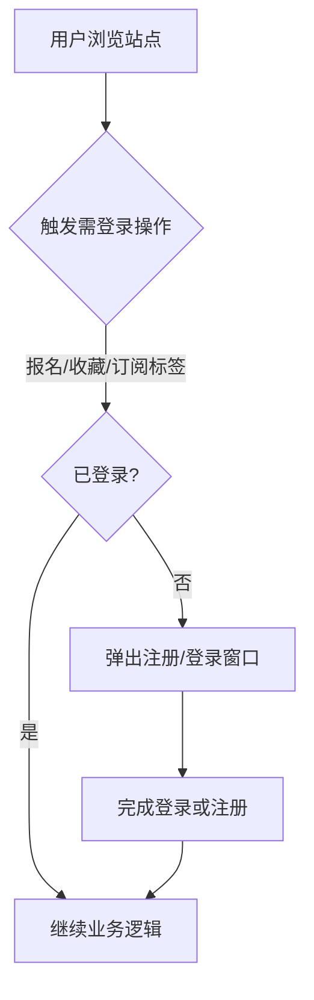
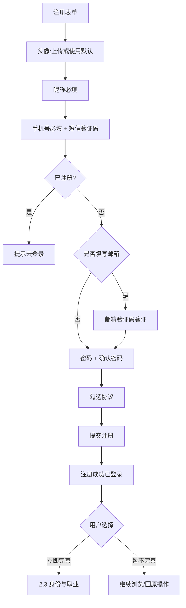
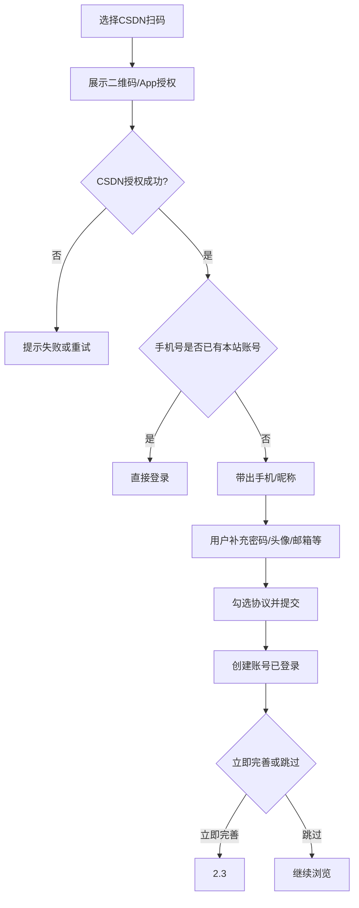
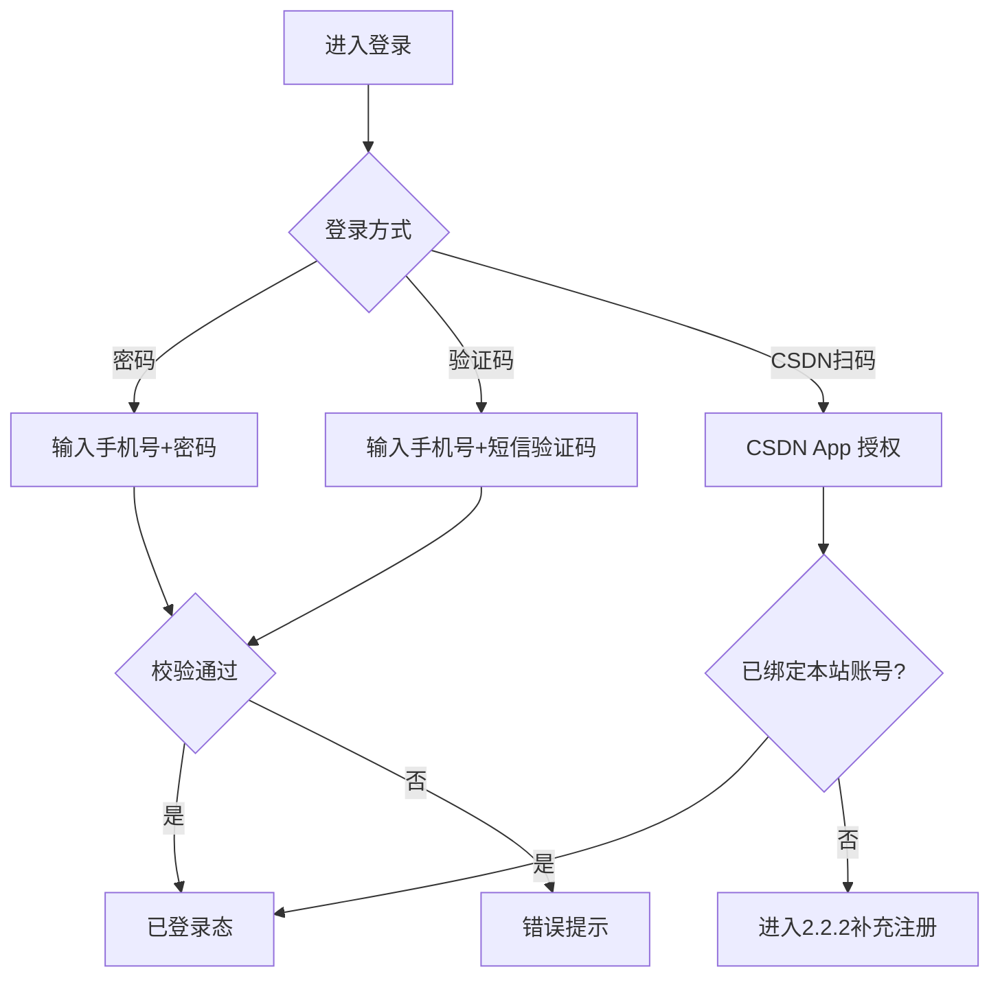
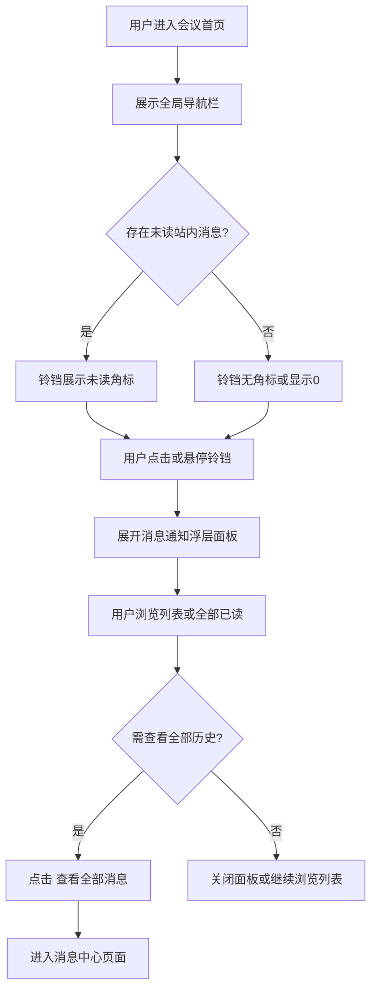

# CSDN会议独立站用户体系产品需求说明书

## 需求概览

会议独立站要承接办会、参会、运营等全链路能力，**不强制用户第一次访问就必须注册**：未登录用户可正常浏览会议内容。当用户执行**报名会议**、**收藏会议**、**订阅会议相关技术标签**等操作时，系统校验登录态；**未登录则弹出注册/登录窗口**（或等价浮层），完成注册或登录后再继续原操作意图。

在此基础上，我们建设**完整的自有用户体系**。注册支持两条路径：一是**表单注册**（头像/默认、昵称、手机号+短信验证、邮箱选填、密码等）；二是**使用 CSDN App 扫码**：**未注册用户**扫码并授权后，系统从 CSDN 获取**手机号、昵称**等账号信息并创建本站账号，用户**仅需补充其余必填项**（含登录密码与确认密码、协议等；头像若 CSDN 未返回则须上传或选默认；邮箱仍为非必填规则）即可完成注册并登录。**任一注册路径均须用户同时同意《用户协议》与《隐私政策》后方可完成注册；若用户不同意（未勾选或未通过等价同意交互），则无法完成注册，系统不创建账号、不进入已登录态。** **登录**除**手机号+密码**、**手机号+短信验证码**外，已注册用户还可通过 **CSDN App 扫码**快速登录。注册成功后，用户可选择**立即完善身份信息与职业信息**，也可选择**暂不完善、仅继续浏览**——后者后续可在个人中心补全。

**核心变革**可概括为：一是**场景化拦截登录**，把注册登录从「进门第一步」变为「要做关键动作时再认证」；二是**账户安全与资料分层**，注册环节完成账号级凭证与展示信息，身份/职业画像通过可选向导或后续设置补齐；三是**与 CSDN 主站衔接**，在独立站自洽前提下提供 **CSDN App 扫码**，降低已拥有 CSDN 账号用户的注册与登录成本；四是**行业等枚举与会议侧结构化定义对齐**（与《技术会议结构化-会议定义》**1.4.2.1 所属产业**同一套可选值）。

**设计思路**：弹窗内提供「注册 / 登录」切换，减少跳转流失；注册表单与「完善身份/职业」分步展示，避免单屏过载。**与既有文档的关系**：会议列表、详情、报名等 PRD 中「需登录」的触发点，须与本章 **2.1 浏览与需登录场景** 一致；预填数据来自本产品用户资料（含身份与职业字段）。

**历史实现参考**：参考 `docs/会议详情与报名产品需求说明书.md` 的登录校验节奏，将「跳转登录页」在独立站场景下具体化为**弹窗注册/登录**（含 **CSDN App 扫码**）+ 可选资料完善；行业下拉枚举直接引用 `docs/技术会议结构化-会议定义.md` 已穷举的**所属产业**选项，保证与发起会议等模块同源。

在**会议首页（即会议列表页，与《会议列表与检索产品需求说明书》所指会议频道列表一致）**的**右上角全局导航栏**提供**消息通知（铃铛）入口**，与「发起会议」「我的会议」、个人头像形成统一动线；未读时以角标提示，点击或悬停展开**消息通知**浮层面板，可快捷浏览报名结果、会议审核等业务消息，消息过多时经「查看全部消息」进入完整消息中心页，与独立站「标准消息中心」建设目标一致。

---

# 第1章：概述

## 1.1 术语表

| 术语 | 英文 | 描述 |
| :--- | :--- | :--- |
| **用户体系** | User System | 本产品内负责身份识别、注册登录、个人资料与安全策略的一整套能力。 |
| **注册** | Sign Up | 新用户通过**表单**（手机号验证等）或 **CSDN App 扫码**授权后补充资料，在本产品内创建账号的过程；**须同时同意《用户协议》与《隐私政策》**，否则无法完成注册。 |
| **协议与隐私同意** | ToS & Privacy Consent | 用户对《用户协议》《隐私政策》的明示同意；为注册成立的**必要条件**，未同意则**不创建账号**。 |
| **登录** | Sign In | 已注册用户通过凭证进入已登录状态的过程。 |
| **短信验证码** | SMS OTP | 由系统下发至用户手机的一次性数字验证码，用于校验手机号归属与操作意愿。 |
| **邮箱验证码** | Email OTP | 由系统下发至用户邮箱的一次性验证码，用于校验邮箱归属（用户填写邮箱时触发）。 |
| **个人资料 / 账号资料** | Profile | 用户在站内展示的昵称、头像及扩展信息；含可选的**身份信息**与**职业信息**。 |
| **身份信息** | Identity Info | 用户真实姓名及与账号绑定的手机、邮箱等（用于报名、签约等场景）；部分字段可由注册信息自动带出。 |
| **职业信息** | Career Info | 用户所在公司、职位、行业等；其中**行业**下拉选项与《技术会议结构化-会议定义》**1.4.2.1 所属产业**枚举一致。 |
| **登录态** | Session | 用户登录成功后，在一定时间内被系统识别为「已登录用户」的状态。 |
| **注册/登录弹窗** | Auth Modal | 在用户未登录触发需登录操作时，于当前页面之上展示的注册或登录浮层，不强制全站首访即注册。 |
| **CSDN App 扫码注册/登录** | CSDN App QR Auth | 用户使用 CSDN App 扫描页面二维码（或按产品约定调起 App）完成授权；未注册则创建本站账号并补充资料，已注册则直接登录。与《CSDN会议产品整体方案》4.3 中「CSDN 用户扫码快速登录」一致。 |
| **全局导航栏** | Global Navigation Bar | 会议独立站页面顶部的全局操作区；**会议首页（会议列表页）**右上角采用与 SaaS/Web 产品常见一致的排列，承载发起会议、我的会议、消息通知入口与个人头像等。 |
| **消息通知 / 通知中心入口** | Notifications / Inbox Entry | 以导航栏**铃铛图标**形式提供的站内消息入口；可展示未读角标，点击或悬停展开浮层面板，完整列表可进入「消息中心」页面。 |
| **未读角标（Badge）** | Unread Badge | 铃铛图标右上角的未读提示，可为红点或带未读数字的小红圈（如「🔔 3」）。 |

## 1.2 修订记录

| 版本 | 内容 | 负责人 | 更新时间 | 备注 |
| :--- | :--- | :--- | :--- | :--- |
| V1.0 | 初稿：独立站完整用户体系（手机注册验证码、登录、常规资料） | 待定 | 2026-03-29 | 依据《CSDN会议产品整体方案》4.3、5 及本期原始需求 |
| V1.1 | 浏览免强制注册；报名/收藏/订阅标签时弹窗登录；注册含头像默认、昵称、手机+短信、邮箱+邮件验证码（邮箱非必填）、密码与确认密码；注册后可选择完善身份/职业或跳过；行业枚举对齐技术会议结构化「所属产业」 | 待定 | 2026-03-29 | 按业务澄清修订 |
| V1.2 | 登录：明确支持「手机号+密码」与「手机号+短信验证码」两种方式并列 | 待定 | 2026-03-29 | — |
| V1.3 | 注册与登录支持 CSDN App 扫码；未注册扫码创建账号并带出手机号、昵称，用户补充其余信息完成注册；已注册扫码直接登录 | 待定 | 2026-03-29 | 与整体方案 4.3 对齐 |
| V1.4 | 明确：须同时同意《用户协议》与《隐私政策》方可完成注册；不同意则无法注册（不创建账号） | 待定 | 2026-03-29 | 合规与交互约束 |
| V1.5 | 会议首页（列表页）全局导航：增加消息通知（铃铛）入口、未读角标、浮层面板结构与「查看全部消息」跳转消息中心；与《会议列表与检索产品需求说明书》场景对齐 | 待定 | 2026-03-29 | 独立站标准消息中心入口 |

## 1.3 背景和价值

独立站部署后，会议业务需要**自有的、可运营的用户身份**，而不能依赖主站统一登录态。若缺少完整注册登录与资料能力，将导致报名预填、主办者展示、消息触达等场景无法落到可靠的用户数据上。

**业务价值**：

1. **降低入门阻力**：允许先浏览再注册，在真正产生「报名、收藏、订阅」意图时再完成认证，减少首访流失。
2. **身份可信**：手机号短信验证；若用户填写邮箱则通过邮箱验证码完成绑定校验；登录支持**手机号+密码**与**手机号+短信验证码**，兼顾习惯与免记密码场景。
3. **画像可渐进**：身份与职业信息可在注册后一步完成或延后，既不阻断轻量浏览，又支撑报名与推荐对行业、公司等信息的需求。
4. **与会议结构化一致**：用户「行业」与会议侧「所属产业」共用同一套枚举（见《技术会议结构化-会议定义》1.4.2.1），减少数据割裂。
5. **与整体方案对齐**：落实独立站「自带完整用户体系」；与 CSDN 主站通过 **CSDN App 扫码**衔接，便于主站用户无感进入会议独立站。
6. **合规同意**：注册前完成协议与隐私政策的**明示同意**，未同意则不落号，满足告知同意原则。
7. **消息可感知**：在会议首页全局导航提供统一的消息通知入口，用户可及时获知报名审核结果、自有发起会议的运营审核结果等，减少「不知道结果」的焦虑与重复咨询。

---

# 第2章：功能需求详情

## 2.1 浏览与需登录场景（不强制首访注册）

### 场景描述

**场景一：仅浏览**  
用户打开会议独立站首页或会议列表，**无需登录**即可浏览会议信息与详情（以各业务 PRD 为准）。

**场景二：触发登录**  
用户点击「立即报名」、点击「收藏」、或在列表/详情中操作「订阅技术标签」等**需登录能力**时，系统检测当前**未登录**，则**弹出注册/登录窗口**（浮层/抽屉等形式，以 UI 稿为准）；用户完成注册或登录后，关闭弹窗并**继续完成刚才触发的操作**（或回到可操作状态）。

### 基本事件流程

#### 主业务流程

- **【前置条件】**：用户未登录。
- **【基本事件流程】**：
  1. 用户执行以下任一操作（与会议侧 PRD 对齐，本期至少包含）：**报名会议**、**收藏会议**、**订阅会议相关技术标签**。
  2. 系统校验登录态；若未登录，**拦截并弹出注册/登录弹窗**，默认焦点可落在「登录」或「注册」由产品设计确定。
  3. 用户在弹窗内完成登录或注册（流程见 **2.2 表单注册**、**2.2.2 CSDN App 扫码**、**2.4 登录**）后，系统建立已登录态，弹窗关闭。
  4. **继续原操作**：例如自动打开报名表单、写入收藏状态、完成标签订阅请求等（具体与会议模块联调）。
- **【后置条件】**：用户已登录并完成触发意图，或用户主动关闭弹窗放弃操作。

#### 异常事件流程

| 异常 | 系统行为 |
| :--- | :--- |
| 用户关闭弹窗未登录 | 不执行报名/收藏/订阅；停留在触发前页面状态 |

### 业务流程（示意）



---

## 2.2 注册（表单注册与 CSDN App 扫码）

### 2.2.1 表单注册（头像、昵称、手机、邮箱、密码）

#### 场景描述

**场景一：在弹窗中完成注册**  
用户从未登录状态点击「立即报名」，弹出注册/登录窗口；切换到「注册」，选择**上传头像**或**使用默认头像**，填写**昵称（必填）**，输入**手机号**并获取**短信验证码**完成验证；可选填写**邮箱**，若填写则需获取**邮箱验证码**并完成验证；输入**登录密码**与**确认密码**；勾选用户协议与隐私政策后提交。注册成功后自动登录。

**场景二：注册后是否完善身份/职业**  
注册提交成功后，系统展示**可选步骤**：用户可选择「**立即完善身份信息与职业信息**」，进入 2.3；或选择「**暂不完善，先逛逛**」，进入已登录浏览态，后续可在个人中心补充。

**场景三：手机号已注册**  
用户输入已绑定账号的手机号，在短信验证通过前或提交注册前，系统提示「该手机号已注册，请直接登录」并支持切换到登录。

#### 业务流程



#### 基本事件流程

##### 主业务流程

- **【前置条件】**：用户未登录；用户在注册流程中。
- **【基本事件流程】**：
  1. **头像**：用户须**上传头像**或**明确选择系统提供的默认头像**之一，二者必选其一后方可提交注册。
  2. **昵称**：必填；长度与字符规则由产品统一约束，校验失败时就地提示。
  3. **手机号**：必填；格式校验通过后，用户获取**短信验证码**并输入，系统完成校验且确认该手机号**尚未注册**。
  4. **邮箱**：**非必填**。若用户填写邮箱，须点击获取**邮箱验证码**并输入正确验证码后，视为该邮箱通过验证并可与账号绑定；若用户不填邮箱，跳过邮件验证。
  5. **密码**：用户输入**登录密码**与**确认密码**；两者须一致且满足密码强度规则（长度、字符类别等由产品/安全约定，在验收中可量化最小规则）。
  6. **协议与隐私同意（注册必要条件）**：用户须**同时**对**《用户协议》**与**《隐私政策》**完成同意（勾选、开关等交互以 UI 为准，且须提供可点击的全文链接）。**仅当两项均已同意时**，「注册」方可提交成功；若任一项未同意，提交须被拦截，**系统不创建账号**。
  7. 用户点击「注册」或等价按钮；在前序步骤与**第 6 步协议同意**均满足时，系统创建账号，保存头像、昵称、手机号、已验证邮箱（若有）、密码（按安全规范存储），建立**已登录态**。
  8. **注册成功后续**：展示选择——**立即完善身份信息与职业信息**（进入 2.3）或**暂不完善，仅浏览**（关闭引导，用户已进入登录态）。
  9. **界面反馈**：注册成功提示；若用户从 2.1 场景进入，关闭弹窗并继续原触发业务。

##### 扩展事件流程

- **重新发送短信/邮件验证码**：倒计时结束后可重发；频控见非功能性需求。

##### 异常事件流程

| 异常 | 系统行为 | 用户提示（示例） |
| :--- | :--- | :--- |
| 未选择头像且未选默认 | 阻止提交 | 「请上传头像或选择默认头像」 |
| 昵称为空或不符合规则 | 阻止提交 | 见昵称规则提示 |
| 手机号/短信验证未通过 | 阻止提交 | 同前版短信相关提示 |
| 填写了邮箱但未通过邮箱验证 | 阻止提交 | 「请先完成邮箱验证」 |
| 两次密码不一致 | 阻止提交 | 「两次输入的密码不一致」 |
| 密码不符合强度 | 阻止提交 | 「密码需满足……」 |
| 该手机号已注册 | 不创建账号 | 「该手机号已注册，请使用登录」 |
| 未同时同意用户协议与隐私政策 | **阻止提交，不创建账号，不进入已登录态** | 「请阅读并同意《用户协议》和《隐私政策》」或等价分拆提示（须覆盖未同意的项） |

### 2.2.2 CSDN App 扫码注册与登录

#### 场景描述

**场景四：未注册用户扫码完成本站注册**  
用户在注册/登录弹窗中选择「**使用 CSDN App 扫码**」（展示二维码）。用户使用 **CSDN App** 完成扫码与授权后，系统从 CSDN 返回的授权信息中获取该用户的**手机号**与**昵称**（用于在本站创建账号）。随后进入**补充资料**步骤：用户需**自行补充本站仍要求的其余项**——至少包括**登录密码与确认密码**、以及**同时同意《用户协议》与《隐私政策》**（规则与 **2.2.1 第 6 步**一致，**未同意则无法完成注册**）；**头像**若 CSDN 授权结果中已提供可展示的头像地址，则**预填头像**，用户可保留、更换或改选默认头像；若未提供头像，则须**上传或选择默认头像**。**邮箱**规则与 2.2.1 相同（非必填，若填写须完成邮箱验证码验证）。用户提交且**协议同意条件满足**后，系统**创建本站账号**（绑定 CSDN 身份标识，见数据项），建立**已登录态**，并进入与 2.2.1 相同的**注册成功后续**（可选立即完善 2.3 或暂不完善）。

**场景五：已注册用户扫码登录**  
已在本站注册且已与 CSDN 身份或手机号完成关联的用户，再次使用「CSDN App 扫码」授权成功后，系统**直接建立已登录态**，关闭弹窗并继续原操作，无需再填密码。

**场景六：扫码手机号已存在（与表单注册一致）**  
若 CSDN 授权返回的手机号**已绑定**本站已有账号，则**不重复创建账号**：应**直接登录**该已有账号（或提示用户后将进入登录态），具体提示文案与是否需二次确认由产品设计确定。

#### 业务流程



#### 基本事件流程

##### 主业务流程（未注册）

- **【前置条件】**：用户未登录；用户具备可使用 CSDN App 扫码的条件。
- **【基本事件流程】**：
  1. 用户在注册或登录弹窗进入 **CSDN App 扫码**流程，完成授权。
  2. 系统解析授权结果，取得**手机号**、**昵称**（及允许范围内的头像等）；校验该手机号是否已注册本站账号。
  3. **若未注册**：进入**补充资料**页——**手机号、昵称**以 CSDN 返回信息**自动带出**（展示为只读，不可在本步修改；改绑走账号与安全流程）；用户补充**密码与确认密码**、**头像**（按上文规则）、**邮箱**（可选填+验证），并**同时同意《用户协议》与《隐私政策》**（未同意则**不得**提交，**不创建账号**），提交通过后**创建账号**并登录。
  4. **注册成功后续**：同 2.2.1（可选 2.3 或跳过）。
  5. **若已注册**：走**场景五/六**，建立登录态，不重复建号。

##### 异常事件流程

| 异常 | 系统行为 | 用户提示（示例） |
| :--- | :--- | :--- |
| 用户取消扫码或授权失败 | 不创建账号、不登录 | 「授权已取消」/「授权失败，请重试」 |
| CSDN 未返回合法手机号或昵称 | 无法完成自动注册 | 「未能获取账号信息，请使用其他方式注册」 |
| 补充资料未填密码或未同时同意协议与隐私政策 | 阻止提交，不创建账号 | 同 2.2.1 协议相关提示 |

**此处信息不明确，需补充确认**：CSDN 授权接口返回的**字段清单与是否含头像 URL** 以 **CSDN 侧对接文档**为准；若昵称在本站校验规则下不合法，是否允许用户在本站补充步骤中**微调昵称**或必须退回表单注册，需产品与技术共同确认。

---

## 2.3 注册成功后可选：身份信息与职业信息

### 场景描述

用户注册成功并选择「立即完善」时，进入分步或同页表单（以 UI 为准）：

- **身份信息**  
  - **姓名**：用户填写真实姓名（用于报名、协议等场景，具体是否必填见下「此处信息不明确」）。  
  - **手机号**：只读展示，**根据注册信息自动带出**，不可在一步内改号（改绑若需，走账号安全设置）。  
  - **邮箱**：只读展示，**根据注册信息自动带出**；若注册时未填邮箱，则展示为空或「未绑定」，可在此步补充并走邮箱验证（与注册规则一致）。

- **职业信息**  
  - **公司**：文本填写（或后续与标准库对接，本期以可输入为准）。  
  - **职位**：文本填写。  
  - **行业**：**下拉单选**；**可选值与《技术会议结构化-会议定义》序号 1.4.2.1「所属产业」一致**，即：**AI人工智能、云计算、开源、出海、鸿蒙、游戏、金融**（与会议侧产业枚举同源，便于统计与推荐一致）。

用户保存后，资料写入用户档案；若选择「暂不完善」，则身份信息、职业信息可后续在「个人中心 / 账号设置」中补全（与编辑规则一致）。

### 基本事件流程

#### 主业务流程

- **【前置条件】**：用户刚完成注册且已登录，并选择立即完善；或用户事后在个人中心进入同一套表单。
- **【基本事件流程】**：
  1. 展示身份信息区：姓名输入；手机、邮箱只读带出。
  2. 展示职业信息区：公司、职位输入；行业下拉（选项来源见上）。
  3. 用户点击保存，校验通过后落库，提示「保存成功」。
- **【后置条件】**：用户身份与职业信息可用于报名预填、推荐等（以业务模块为准）。

#### 异常事件流程

| 异常 | 用户提示（示例） |
| :--- | :--- |
| 姓名为空若业务约定必填 | 「请填写姓名」 |
| 行业未选若业务约定必填 | 「请选择行业」 |

**此处信息不明确，需补充确认**：在「立即完善」流程中，**姓名**是否必填；**公司、职位、行业**是否允许全部留空后保存（仅部分完善）。

---

## 2.4 登录

### 场景描述

已注册用户在弹窗或独立登录页登录时，系统**同时支持**以下方式（**Tab 切换、分栏或并列入口均可**，以 UI 稿为准）：

1. **手机号 + 密码**：输入已注册手机号与登录密码，提交校验。
2. **手机号 + 短信验证码**：输入已注册手机号，获取并填写短信验证码，校验通过后登录（流程与注册环节短信验证一致，业务场景区分为「登录」以便风控与频控）。
3. **CSDN App 扫码登录**：与 **2.2.2** 中「已注册用户扫码」一致——用户完成 CSDN 授权后，若系统识别到该 CSDN 身份或返回手机号**已绑定**本站账号，则**直接登录**，无需再输入密码（与场景五、六一致）。

用户任选其一完成校验后，建立已登录态并关闭弹窗，继续原操作（若从 2.1 进入）。

### 业务流程



### 基本事件流程

#### 主业务流程

- **【前置条件】**：用户未登录；**密码/验证码方式**要求账号已存在；**扫码方式**下若已存在绑定则登录，否则进入 2.2.2 未注册补充流程。
- **【基本事件流程】**：
  1. **方式 A — 密码登录**：用户输入**已注册手机号**与**密码**，提交；校验通过后建立已登录态。
  2. **方式 B — 验证码登录**：用户输入**已注册手机号**，获取并输入**短信验证码**；校验通过后建立已登录态。
  3. **方式 C — CSDN App 扫码**：用户完成扫码授权；若**已绑定**本站用户，直接建立已登录态；若**未绑定且手机号未注册**，跳转 **2.2.2** 补充资料完成注册；若**手机号已注册**，按 2.2.2 场景六处理。
  4. 登录成功后关闭弹窗并继续原操作（若从 2.1 进入）。
- **【后置条件】**：用户已登录。

#### 异常事件流程

| 异常 | 用户提示（示例） |
| :--- | :--- |
| 手机号未注册 | 「该手机号尚未注册」并提供注册入口 |
| 密码错误 | 「手机号或密码错误」 |
| 验证码错误/过期 | 「验证码错误，请重新输入」/「验证码已失效，请重新获取」 |
| 获取验证码过于频繁 | 「操作过于频繁，请稍后再试」 |
| 账号被限制登录 | 「账号暂时无法登录，请联系客服」 |

**此处信息不明确，需补充确认**：**忘记密码**是否本期必做（通常通过手机短信验证码重置密码后设置新密码）。

---

## 2.5 个人资料维护

### 场景描述

用户可在个人中心修改**昵称、头像**；可补充或修改**身份信息、职业信息**（字段同 2.3），规则与注册后完善一致。

### 基本事件流程

- **【前置条件】**：用户已登录。
- **【基本事件流程】**：用户修改各项资料并保存；校验规则与 2.2、2.3 一致；**通过 CSDN 扫码注册**的用户，手机号/初始昵称来源规则与 2.2.2 一致，**修改手机号/邮箱**若涉及安全策略，可走单独「账号与安全」流程（本期可仅支持在资料页展示只读 + 安全入口）。

---

## 2.6 登出

### 场景描述

用户在个人中心点击「退出登录」，系统清除当前登录态并跳转至未登录可浏览页或首页。

### 基本事件流程

- **【前置条件】**：用户当前已登录。
- **【基本事件流程】**：用户触发登出 → 系统结束会话 → 提示「已退出登录」（可选）→ 跳转指定页。
- **【后置条件】**：用户处于未登录状态；再次触发报名/收藏/订阅时仍弹出 2.1 所述弹窗。

---

## 2.7 会议首页全局导航与通知中心入口

> **页面范围说明**：本节「会议首页」指**会议独立站的会议列表页（会议频道列表）**，与《会议列表与检索产品需求说明书》中的会议列表/频道场景一致；导航栏在首页作为全局框架的一部分展示。

### 场景描述

独立站需要建立**标准的消息中心**能力；用户在**会议首页**即可通过统一入口查看与自己相关的站内消息，例如：**报名会议后是否通过审核**、**自己发起的会议是否通过后台审核**等。

**场景一：发现未读**  
用户登录后浏览会议列表，注意到导航栏铃铛图标右上角出现**红点或未读数字**，获知有新消息。

**场景二：快捷浏览**  
用户**点击**或**鼠标悬停**（Hover）铃铛，向下展开**消息列表面板**（Popover/Dropdown），在**不离开当前列表页**的情况下阅读最近消息摘要；需要查看历史或消息较多时，点击面板底部的**「查看全部消息」**进入**消息中心页面**。

**场景三：消除未读**  
用户在面板内查看单条消息或通过**「全部已读」**批量标记已读后，角标相应更新或消失（具体以消息状态同步规则为准）。

### 业务流程



### 2.7.1 导航栏位置与元素顺序

#### 基本事件流程

##### 主业务流程

- **【前置条件】**：用户访问会议独立站**会议首页（会议列表页）**；全局顶部导航已加载（与列表 PRD 一致的频道页框架）。
- **【基本事件流程】**：
  1. **放置位置**：在页面**右上角全局导航栏**提供与会务相关的全局操作；消息通知入口位于该栏内，符合常见 SaaS/Web 产品习惯，降低学习成本。
  2. **建议排列顺序**（从左至右）：**「发起会议」** → **「我的会议」** → **消息通知（铃铛图标）** → **个人头像**。
  3. **系统响应**：导航栏各入口可点击跳转或展开（铃铛为展开面板）；样式、间距与独立站整体 UI 规范一致（可参考 `UX设计规范.md` 若有冲突以产品/UI 定稿为准）。
- **【后置条件】**：用户可从会议首页发起办会、进入「我的会议」、打开消息面板或进入账号相关能力（头像区）。

**此处信息不明确，需补充确认**：**未登录用户**是否在会议首页导航栏展示铃铛入口；若展示，点击或悬停后是弹出 **2.1** 所述注册/登录弹窗，还是隐藏入口，需与会议列表页全局导航方案统一约定。

### 2.7.2 未读角标（Badge）

- **【基本事件流程】**：
  1. 当用户存在**未读**站内消息时，铃铛图标右上角展示**未读提示**：可为**红点**，或带**未读数字**的小红圈（例如语义上展示为铃铛旁数字 **3**，具体视觉以 UI 稿为准）。
  2. 无未读消息时，不展示角标或展示为 0（以产品设计为准）。
  3. 角标数字与后台未读计数一致；用户阅读或「全部已读」后，角标**及时更新**（允许短延迟，需在验收中约定可感知时效）。

### 2.7.3 浮层面板（Popover/Dropdown）结构与交互

- **【基本事件流程】**：
  1. **触发方式**：用户**鼠标悬停**和/或**点击**铃铛时，在铃铛**下方**展开消息列表面板；**不以打开面板为唯一手段强制跳转全屏页**（消息极多时通过底部「查看全部消息」进入全量页面）。
  2. **面板顶部**：
     - 标题：**「消息通知」**；
     - 操作：**「全部已读」**按钮；用户点击后，将当前用户可见范围内未读消息按业务规则标记为已读，并刷新角标与列表样式。
  3. **列表项内容**（每条消息至少包含）：
     - **消息图标**或用于区分类型的**状态色**（具体映射由消息模板定义）；
     - **消息标题**（示例：「报名成功」）；
     - **摘要**（示例：「您报名的 XX 会议已通过审核……」）；
     - **时间戳**（示例：「2 小时前」，展示相对时间或约定格式）。
  4. **已读/未读样式**：
     - **未读**：列表项背景**微灰**，和/或**标题加粗**（以 UI 稿为准）；
     - **已读**：列表项背景**纯白**（或与页面底色一致的「已读」弱样式）。
  5. **底部**：当消息条数较多、单层面板无法完整承载时，面板底部提供**「查看全部消息」**链接或按钮；用户点击后**跳转至消息中心页面**，查看完整历史与分类（消息中心页详细规则由专门需求或后续文档约定，本节仅规定入口与跳转）。

#### 扩展事件流程

- 用户点击单条消息：可跳转至对应会议详情、报名记录或审核详情等（**具体跳转目标以各消息类型模板为准**，若原始需求未列全类型，由消息中心专项需求补充）。

#### 异常事件流程

| 异常 | 系统行为 | 用户提示（示例） |
| :--- | :--- | :--- |
| 消息列表加载失败 | 面板内展示失败状态 | 「消息加载失败」+ 重试；角标策略由产品约定（可不因列表失败清空角标） |
| 无消息 | 面板内展示空状态 | 「暂无消息」或等价文案 |
| 全部已读失败 | 不更新为已读 | 「操作失败，请稍后重试」 |

**数据项**：浮层面板与消息中心列表共用字段见 **第3章 3.7 站内消息列表项**。

---

# 第3章：数据项描述

以下为用户与资料相关的**业务数据项**说明，用于对齐前后端与测试验收；不视为数据库建表指令。

## 3.1 用户账号（逻辑实体：User_Account）

| 字段名（中文） | 标识符（逻辑） | 数据类型 | 必填 | 前端是否展示 | 说明 |
| :--- | :--- | :--- | :--- | :--- | :--- |
| 用户 ID | `user_id` | 字符串/数值 | 是 | 否 | 系统内唯一用户标识 |
| 手机号 | `mobile` | 字符串 | 是 | 部分场景脱敏展示 | 表单注册经短信验证，或 CSDN 授权返回后写入；唯一；展示如 138****0000 |
| 登录密码 | `password`（存储形态由安全方案定） | — | 是 | 否 | 用户设置的登录密码；仅存安全摘要；**CSDN 扫码注册**用户在补充资料步骤设置 |
| CSDN 关联标识 | `csdn_bind_id`（逻辑名，实现以对接为准） | 字符串 | 否 | 否 | **CSDN App 扫码**完成注册或绑定的用户具备；用于与 CSDN 账号关联；纯表单注册无此项 |
| 账号状态 | `status` | 枚举 | 是 | 否 | 如：正常、冻结等 |
| 注册时间 | `created_at` | 日期时间 | 是 | 可选展示 | 注册成功时间 |
| 最后登录时间 | `last_login_at` | 日期时间 | 否 | 可选展示 | 最近一次登录成功时间 |

## 3.2 用户展示资料（逻辑实体：User_Profile）

| 字段名（中文） | 标识符（逻辑） | 数据类型 | 必填 | 前端是否展示 | 说明 |
| :--- | :--- | :--- | :--- | :--- | :--- |
| 昵称 | `nickname` | 字符串 | 是 | 是 | 站内展示名；**CSDN 扫码注册**可由 CSDN 授权带出初始值 |
| 头像 | `avatar_url` | 字符串(URL) | 是 | 是 | 用户上传、预设默认，或 **CSDN 授权返回头像 URL** 经确认后写入 |

## 3.3 用户联系与验证（逻辑实体：User_Contact）

| 字段名（中文） | 标识符（逻辑） | 数据类型 | 必填 | 说明 |
| :--- | :--- | :--- | :--- | :--- |
| 邮箱 | `email` | 字符串 | 否 | 若填写须通过邮箱验证码校验后方可记为已验证 |
| 邮箱已验证标记 | `email_verified` | 布尔 | 否 | 仅当填写并完成邮件验证后为真 |

## 3.4 身份信息（逻辑实体：User_Identity）

| 字段名（中文） | 标识符（逻辑） | 数据类型 | 必填 | 说明 |
| :--- | :--- | :--- | :--- | :--- |
| 姓名 | `real_name` | 字符串 | 视业务 | 与 2.3 一致；是否在首次完善时必填待确认 |
| 手机号展示 | — | — | — | 与账号手机号同源，表单只读带出 |
| 邮箱展示 | — | — | — | 与 User_Contact 同源，表单只读带出 |

## 3.5 职业信息（逻辑实体：User_Career）

| 字段名（中文） | 标识符（逻辑） | 数据类型 | 必填 | 说明 |
| :--- | :--- | :--- | :--- | :--- |
| 公司 | `company` | 字符串 | 视业务 | 自由文本或后续对接标准库 |
| 职位 | `job_title` | 字符串 | 视业务 | 自由文本 |
| 行业 | `industry` | 枚举 | 视业务 | 与《技术会议结构化-会议定义》**1.4.2.1 所属产业**一致：**AI人工智能、云计算、开源、出海、鸿蒙、游戏、金融** |

**界面/控件说明**：头像支持上传或默认图库选择；行业为下拉单选，选项与会议发起侧「所属产业」字典保持一致，避免两套枚举。

## 3.6 短信与邮箱验证码（逻辑实体：OTP，临时）

| 字段名（中文） | 说明 |
| :--- | :--- |
| 目标（手机/邮箱） | 接收验证码的地址 |
| 业务场景 | 注册、**登录（验证码方式）**、换绑等 |
| 有效期与频控 | 见非功能性需求 |

## 3.7 站内消息列表项（逻辑实体：Inbox_Message，展示用）

用于**导航栏消息浮层面板**与**消息中心**列表展示的业务字段逻辑，与 **2.7** 一致；消息产生、模板与后台审核流以业务模块与消息专项需求为准。

| 字段名（中文） | 标识符（逻辑） | 数据类型 | 必填 | 前端是否展示 | 说明 |
| :--- | :--- | :--- | :--- | :--- | :--- |
| 消息标题 | `title` | 字符串 | 是 | 是 | 如「报名成功」等 |
| 摘要 | `summary` | 字符串 | 是 | 是 | 含会议名称等可变信息的短文案 |
| 时间 | `sent_at`（展示为相对时间等） | 日期时间 | 是 | 是 | 如「2 小时前」 |
| 已读状态 | `read` | 布尔 | 是 | 是 | 驱动角标与行样式 |
| 消息类型 | `type`（逻辑） | 枚举/字符串 | 是 | 部分 | 用于图标或状态色；覆盖报名结果、发起会议审核结果等场景 |

---

# 第4章：需求波及分析

## 4.1 影响模块

| 影响模块 | 影响说明 |
| :--- | :--- |
| **会议列表与检索** | **订阅技术标签**等操作需登录；未登录时弹出注册/登录弹窗，而非强制全页跳转（具体交互与列表 PRD 对齐）。**会议首页（列表页）右上角全局导航栏**须承载 **2.7** 所述「发起会议」「我的会议」、**消息通知（铃铛）**、个人头像及未读角标、浮层面板；列表 PRD 以列表内容与筛选为主，**导航栏消息入口以本需求 2.7 为准**。 |
| **会议详情与报名** | **报名**、**收藏**需登录并弹窗；报名表单预填来自本产品用户资料（含身份/职业，以落库为准）。 |
| **我的会议与商业化** | 主办者身份、账单联系信息等依赖本产品用户与资料。 |
| **消息通知 / 消息中心** | 短信、邮件、站内消息依赖手机号/邮箱验证状态与登录态；**站内消息**在会议首页通过铃铛与浮层展示，**「查看全部消息」**跳转完整消息中心页。 |
| **运营端** | 管理员账号属于独立站用户体系内角色，与《CSDN会议产品整体方案》一致。 |

## 4.2 数据影响

业务上新增/明确**用户账号、用户资料、短信/邮件发送记录、CSDN 账号关联标识（逻辑上）**等数据承载需求；具体存储与迁移策略由技术方案设计，本需求不规定表结构。

## 4.3 业务规则影响

- 全站「已登录」定义以本产品会话为准。
- **CSDN App 扫码**：与《CSDN会议产品整体方案》4.3「**仅支持已拥有 CSDN 账号的用户通过扫码完成快速登录**」一致；本需求在此基础上明确**未注册扫码可创建本站账号**（手机号、昵称来自 CSDN，其余由用户补充），以及**已注册扫码直接登录**。授权范围、令牌校验、二维码有效期等**以 CSDN 侧对接文档与安全要求为准**。

## 4.4 历史文档查阅记录

#### 历史需求文档

- **文档名称**：`CSDN会议功能/docs/会议详情与报名产品需求说明书.md`  
- **文档位置**：`CSDN会议功能/docs/会议详情与报名产品需求说明书.md`  
- **参考功能**：文档结构（概述—功能—数据—验收—国际化与埋点—非功能）、报名流程中「登录态校验」「预填用户信息」的交互节奏。  
- **设计一致性**：独立站仍保留「需登录操作」「资料预填」的体验目标，将资料来源统一为**本产品用户体系**。

- **文档名称**：`CSDN会议功能/docs/会议列表与检索产品需求说明书.md`  
- **文档位置**：`CSDN会议功能/docs/会议列表与检索产品需求说明书.md`  
- **参考功能**：**会议频道/会议列表页**作为用户进入独立站后的核心浏览场景；与 **2.7** 中「会议首页（会议列表页）」范围对齐。  
- **设计一致性**：列表页负责列表双视图、筛选与订阅等；**全局导航栏上的消息通知入口与顺序**由本需求 **2.7** 定义，避免与列表内容区需求冲突时，以**导航全局框架**章节（本节）为据。

#### 现有功能/方案文档

- **文档名称**：`CSDN会议功能/CSDN会议产品整体方案.md`  
- **文档位置**：`CSDN会议功能/CSDN会议产品整体方案.md`  
- **参考功能**：第 4.3、5 章「独立站部署」「自带完整用户体系」「CSDN 扫码快速登录」边界。  
- **设计一致性**：本需求落实「完整用户体系」基础能力；与主站不采用全域登录态复用，但通过 **CSDN App 扫码**完成身份衔接，与整体方案 4.3 一致。

#### 字段定义文档（行业枚举）

- **文档名称**：`CSDN会议功能/docs/技术会议结构化-会议定义.md`  
- **文档位置**：`CSDN会议功能/docs/技术会议结构化-会议定义.md`  
- **参考范围**：序号 **1.4.2.1 所属产业** 的选项枚举（AI人工智能、云计算、开源、出海、鸿蒙、游戏、金融），用户职业信息「行业」下拉与此保持一致。  
- **设计一致性**：用户侧「行业」与会议侧「所属产业」同源枚举，便于统计与推荐。

**说明**：未在本项目目录 `docs/history/` 下找到单独归档的历史文档；上述查阅以 `docs/` 与整体方案为准。若后续补充历史归档，可在此追加记录。

---

# 第5章：验收准则

## 5.1 验收场景列表

| 编号 | 场景描述 | Given（前置条件） | When（触发条件） | Then（预期结果） | And（附加验证） |
| :--- | :--- | :--- | :--- | :--- | :--- |
| AC01 | 浏览不强制注册 | 用户未登录 | 用户访问会议首页或列表 | 用户可浏览公开内容 | 不自动弹出注册窗 |
| AC02 | 需登录操作弹窗 | 用户未登录 | 用户点击报名、收藏或订阅技术标签 | 系统弹出注册/登录窗口 | 未完成登录则原操作不生效 |
| AC03 | 注册完整字段 | 手机号未注册且可收短信 | 用户选择默认或上传头像、填昵称、完成手机验证码、密码与确认密码一致、**同时勾选用户协议与隐私政策**并提交 | 创建账号且用户已登录 | 若填邮箱则须完成邮箱验证后方可提交 |
| AC03a | 未同意协议不可注册（表单） | 其余注册必填项已满足 | 用户**未同时勾选**《用户协议》与《隐私政策》即点击注册 | **提交被拦截，不创建账号，用户保持未登录** | 提示须阅读并同意协议与隐私政策 |
| AC03b | 未同意协议不可注册（扫码补充） | CSDN 已授权且本站无该手机号账号 | 用户补充密码等项但**未同时同意**《用户协议》与《隐私政策》即提交 | **不创建账号，不进入已登录态** | 同 AC03a |
| AC04 | 注册后可选完善 | 用户刚注册成功 | 用户选择「立即完善」 | 进入身份与职业填写界面 | 手机、邮箱只读带出；行业下拉为 7 项产业枚举 |
| AC05 | 注册后跳过完善 | 用户刚注册成功 | 用户选择「暂不完善」 | 进入已登录浏览态 | 后续可在个人中心补全身份/职业 |
| AC06 | 重复手机号拦截 | 手机号已存在账号 | 用户完成注册流程中手机验证 | 不创建新账号并提示去登录 | — |
| AC07 | 密码登录 | 账号已存在 | 用户在登录页选择密码方式并输入正确手机号与密码 | 进入已登录状态 | — |
| AC08 | 验证码登录 | 账号已存在且可收短信 | 用户在登录页选择验证码方式，完成短信验证 | 进入已登录状态 | 与注册环节一致的倒计时与频控 |
| AC09 | 退出登录 | 用户已登录 | 用户点击退出登录 | 未登录态 | 再次报名/收藏/订阅时再次弹窗 |
| AC10 | CSDN 扫码补充注册 | 用户未登录且本站无该手机号账号 | 用户完成 CSDN 授权后补充密码、头像（如需）、协议并提交 | 创建本站账号且已登录 | 手机号、昵称来自 CSDN 授权信息 |
| AC11 | CSDN 扫码直接登录 | 用户未登录且授权手机号已绑定本站账号 | 用户完成 CSDN App 扫码授权 | 进入已登录态 | 无需输入密码 |
| AC-N01 | 会议首页导航顺序 | 用户已访问会议首页（会议列表页）且页面加载完成 | 用户查看页面右上角全局导航 | 从左至右依次为「发起会议」「我的会议」、消息铃铛、个人头像 | 铃铛可识别为消息通知入口 |
| AC-N02 | 未读角标 | 当前账号存在未读站内消息 | 用户查看导航栏铃铛 | 铃铛展示红点或未读数字角标 | 角标与未读计数一致 |
| AC-N03 | 消息浮层展开 | 用户已登录 | 用户点击或悬停铃铛（以产品最终交互为准） | 铃铛下方展开浮层面板，顶部为「消息通知」与「全部已读」 | 不默认整页跳转离开会议列表 |
| AC-N04 | 浮层列表项展示 | 面板内至少有一条消息 | 用户查看面板列表 | 每条展示标题、摘要、时间戳及类型区分（图标或颜色） | 未读项为微灰底或标题加粗，已读项为白底 |
| AC-N05 | 查看全部消息 | 消息条数较多或用户需要完整历史 | 用户点击面板底部「查看全部消息」 | 跳转至消息中心页面 | — |
| AC-N06 | 业务类消息可见性 | 后台已产生报名审核或会议审核类消息 | 用户打开消息面板 | 用户能看到与报名、发起会议审核相关的消息内容 | 摘要可读且语境指向对应会议 |

## 5.2 Gherkin 验收用例

```gherkin
Feature: 浏览与需登录弹窗
  Scenario: 未登录用户触发报名弹出注册登录窗口
    Given 用户当前未登录
    When 用户在会议详情页点击「立即报名」
    Then 系统应弹出注册或登录窗口
    And 用户未完成登录前不应完成报名提交

  Scenario: 未登录用户可浏览列表
    Given 用户当前未登录
    When 用户访问会议列表页
    Then 用户应能浏览会议列表内容
    And 系统不应仅因进入页面而强制弹出注册窗口

Feature: 注册账号
  Scenario: 新用户完成注册含头像、昵称、手机验证与密码
    Given 用户使用的手机号尚未在本产品注册
    And 用户能够接收短信
    When 用户选择默认头像或上传合规头像
    And 用户填写必填昵称与合法手机号并完成短信验证
    And 用户输入一致的密码与确认密码
    And 用户勾选用户协议与隐私政策并提交注册
    Then 系统应创建账号并使用户处于已登录状态

  Scenario: 填写邮箱时必须完成邮箱验证
    Given 用户在注册表单中填写了邮箱
    When 用户未完成邮箱验证码验证即尝试提交注册
    Then 系统应阻止提交并提示完成邮箱验证

  Scenario: 未同意用户协议与隐私政策则无法完成注册
    Given 用户使用的手机号尚未在本产品注册
    And 用户已填写其余注册必填项且校验通过
    When 用户未同时勾选《用户协议》与《隐私政策》即点击注册
    Then 系统应阻止提交
    And 系统不应创建用户账号
    And 用户应仍处于未登录状态

Feature: 注册后完善身份与职业
  Scenario: 用户选择立即完善并保存行业信息
    Given 用户刚完成注册并选择立即完善身份与职业信息
    When 用户填写姓名与公司、职位并选择行业为「云计算」
    And 用户保存
    Then 系统应保存用户身份信息与职业信息
    And 行业取值应属于技术会议结构化所属产业枚举之一

Feature: CSDN App 扫码注册与登录
  Scenario: 未注册用户扫码后补充信息完成注册
    Given 用户当前未登录且其 CSDN 授权手机号尚未在本站注册
    When 用户完成 CSDN App 扫码授权
    And 系统带出手机号与昵称
    And 用户补充符合规则的密码与确认密码并同时勾选《用户协议》与《隐私政策》
    And 用户按规则处理头像（上传、默认或保留 CSDN 预填）
    Then 系统应创建本站用户账号并建立已登录状态
    And 用户应可继续完成触发注册/登录前的业务操作

  Scenario: 扫码补充注册未同意协议则无法建号
    Given 用户当前未登录且其 CSDN 授权手机号尚未在本站注册
    When 用户完成 CSDN App 扫码授权并补充密码等必填项
    But 用户未同时勾选《用户协议》与《隐私政策》即提交
    Then 系统不应创建本站用户账号
    And 用户应仍处于未登录状态

  Scenario: 已注册用户扫码直接登录
    Given 用户当前未登录
    And 该用户的 CSDN 授权身份或手机号已绑定本站已有账号
    When 用户完成 CSDN App 扫码授权
    Then 用户应直接进入已登录状态
    And 用户无需输入本站密码

Feature: 登录（密码与验证码）
  Scenario: 已注册用户使用手机号和密码登录
    Given 用户账号已存在且当前未登录
    When 用户在登录界面选择密码登录并输入注册手机号与正确密码
    Then 用户应进入已登录状态

  Scenario: 已注册用户使用手机号和短信验证码登录
    Given 用户账号已存在且当前未登录
    And 用户能够接收该手机号的短信
    When 用户在登录界面选择验证码登录并输入注册手机号
    And 用户获取短信验证码并输入正确验证码
    Then 用户应进入已登录状态

Feature: 退出登录
  Scenario: 用户主动退出登录
    Given 用户当前已登录
    When 用户点击退出登录
    Then 用户应处于未登录状态

Feature: 会议首页消息通知入口
  Scenario: 未读时展示角标
    Given 用户已登录
    And 当前账号存在未读站内消息
    When 用户访问会议首页并查看右上角导航栏
    Then 消息铃铛应展示未读红点或未读数字角标

  Scenario: 展开消息面板并查看内容
    Given 用户已登录
    And 消息面板中至少有一条消息
    When 用户点击或悬停消息铃铛以展开浮层面板
    Then 面板顶部应展示「消息通知」标题与「全部已读」操作
    And 每条消息应展示标题、摘要与时间戳
    And 未读消息与已读消息在背景或标题字重上可区分

  Scenario: 跳转消息中心
    Given 用户已登录
    And 用户已展开消息浮层面板
    When 用户点击面板底部的「查看全部消息」
    Then 用户应进入消息中心页面
```

---

# 第6章：国际化命名规则

| 使用场景说明 | 中文 | 英文 |
| :--- | :--- | :--- |
| 注册入口 | 注册 | Sign Up |
| 登录入口 | 登录 | Sign In |
| 退出 | 退出登录 | Log Out |
| 手机号 | 手机号 | Mobile Number |
| 获取验证码 | 获取验证码 | Get Code |
| 短信验证码 | 验证码 | Verification Code |
| 邮箱验证码 | 邮箱验证码 | Email Verification Code |
| 昵称 | 昵称 | Nickname |
| 头像 | 头像 | Avatar |
| 默认头像 | 默认头像 | Default Avatar |
| 密码 | 密码 | Password |
| 确认密码 | 确认密码 | Confirm Password |
| 姓名 | 姓名 | Full Name |
| 公司 | 公司 | Company |
| 职位 | 职位 | Job Title |
| 行业 | 行业 | Industry |
| 立即完善 | 立即完善 | Complete Profile Now |
| 暂不完善 | 稍后再说 | Skip for Now |
| 用户协议 | 用户协议 | Terms of Service |
| 隐私政策 | 隐私政策 | Privacy Policy |
| CSDN App 扫码 | 使用 CSDN App 扫码 | Scan with CSDN App |
| 消息面板标题 | 消息通知 | Notifications |
| 全部已读 | 全部已读 | Mark All as Read |
| 查看全部消息 | 查看全部消息 | View All Messages |
| 发起会议（导航） | 发起会议 | Create Meeting |
| 我的会议（导航） | 我的会议 | My Meetings |
| 消息通知（导航入口） | 消息通知 | Notifications |

---

# 第7章：埋点定义

| 模块 | 指标名称 | 指标定义 | PC/移动端 | 触发时机 | 频率 |
| :--- | :--- | :--- | :--- | :--- | :--- |
| 登录拦截 | 弹窗曝光 | 注册/登录弹窗展示 | PC、移动 | 因报名/收藏/订阅标签触发 | 每次展示 |
| CSDN 扫码 | 二维码展示 | 用户进入 CSDN 扫码注册/登录流程 | PC、移动 | 展示二维码或调起授权 | 每次 |
| CSDN 扫码 | 授权结果 | 成功/失败及是否新注册 | PC、移动 | 授权回调 | 每次 |
| 注册 | 注册表单曝光 | 用户在弹窗或页面进入注册 | PC、移动 | 切换到注册 | 每次 |
| 注册 | 获取短信验证码点击 | 用户点击获取短信验证码 | PC、移动 | 点击 | 每次点击 |
| 注册 | 获取邮箱验证码点击 | 用户点击获取邮箱验证码 | PC、移动 | 点击 | 每次点击 |
| 注册 | 注册提交成功 | 注册成功 | PC、移动 | 提交成功 | 每次成功；宜区分 `register_path`：form / csdn_scan |
| 注册引导 | 完善资料选择 | 用户选择立即完善或跳过 | PC、移动 | 注册成功后点击 | 每次 |
| 资料 | 身份职业保存成功 | 身份与职业信息保存 | PC、移动 | 保存成功 | 每次成功 |
| 登录 | 登录成功 | 会话建立成功（含弹窗内登录）；宜带参数区分 `login_method`：password / sms_code / csdn_scan | PC、移动 | 登录成功 | 每次成功 |
| 账号 | 退出登录 | 用户主动登出 | PC、移动 | 确认退出 | 每次 |
| 消息通知 | 铃铛展示或点击 | 会议首页导航栏铃铛曝光或点击 | PC、移动 | 进入会议首页或点击铃铛 | 每次 |
| 消息通知 | 面板展开 | 消息浮层面板展开成功 | PC、移动 | 悬停或点击触发展开 | 每次 |
| 消息通知 | 全部已读 | 用户点击「全部已读」 | PC、移动 | 点击 | 每次 |
| 消息通知 | 查看全部消息 | 用户点击「查看全部消息」 | PC、移动 | 点击 | 每次 |

---

# 第8章：非功能性需求

1. **安全**：短信与邮箱验证码均需具备发送频控、错误次数限制、有效期控制；登录密码须安全存储与传输（由安全方案约定）；防止刷短信与刷邮件、暴力破解（具体阈值由安全与运维策略确认）。
2. **性能**：注册、登录、验证码发送接口在正常负载下应在可接受时间内返回（如常规网络下用户可感知的等待时间内），具体指标由技术方案量化。
3. **兼容性**：网页端覆盖主流浏览器当前常用版本；移动端覆盖主流系统版本与常用机型（与会议产品整体策略一致）。
4. **隐私与合规**：《用户协议》《隐私政策》须在注册页/补充资料页**完整展示可访问链接**，且用户须**同时同意**二者后方可完成注册；**不同意或未勾选完成则不得创建账号、不得进入已登录态**。个人资料展示范围遵循隐私政策约定；CSDN 授权获取手机号、昵称等须符合授权协议与用户告知。
5. **外部依赖**：**CSDN App 扫码**依赖 CSDN 侧二维码/授权接口可用、网络可达及版本兼容；若 CSDN 服务不可用，应提示用户改用表单注册或密码/验证码登录（具体降级文案与入口由产品统一）。

---
