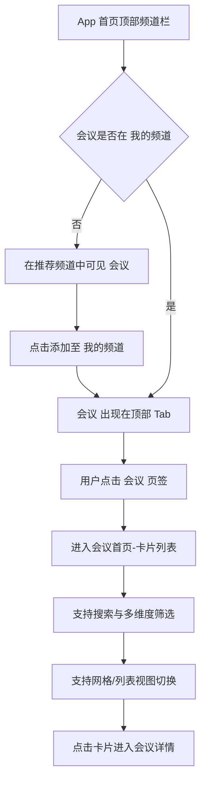
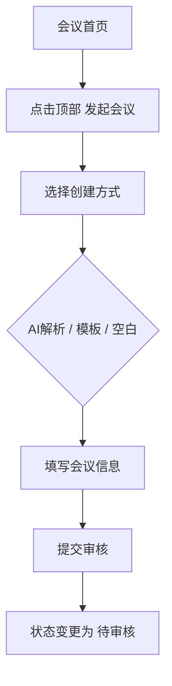
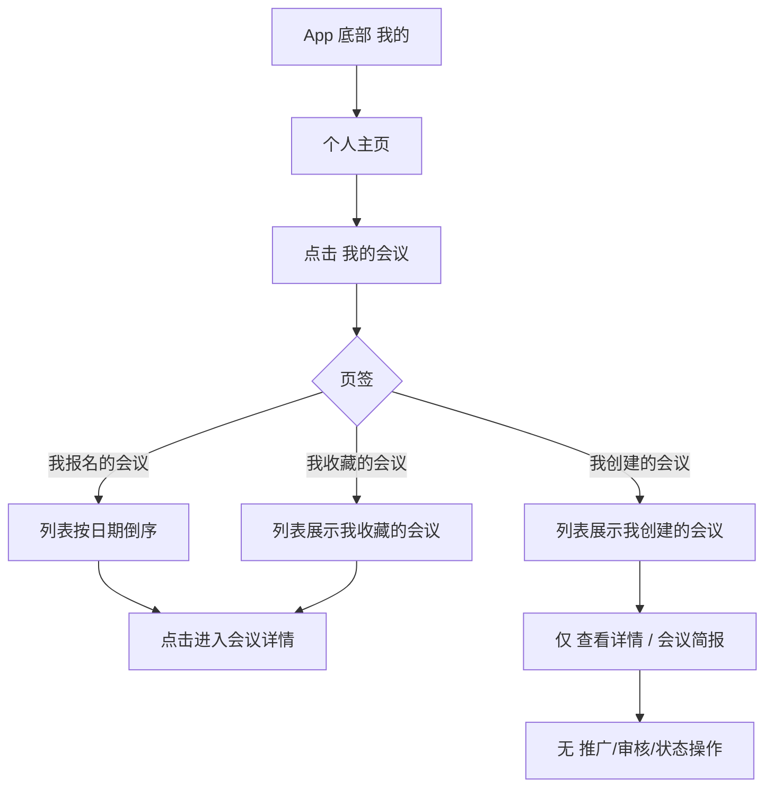
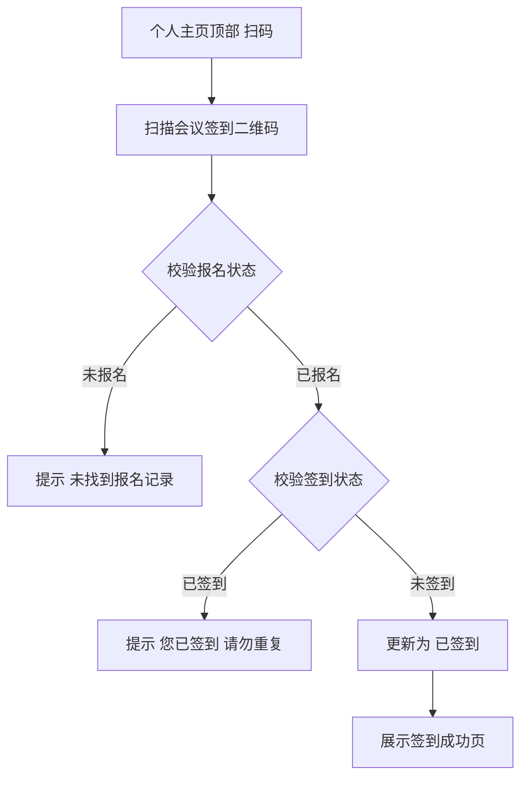

# 移动端会议功能产品需求说明书

## 需求概览

### 开篇摘要

本需求将 CSDN 会议能力完整延伸到**移动端**：在 App 与微信小程序上，用户既能像在网页端一样**发现、报名、签到、收藏**会议，也能在会议首页**一键发起会议**并享受与网页端一致的 AI 解析与模板能力；办会方在移动端可**查看我创建的会议详情与会议简报**，而所有状态变更与推广、审核则集中在网页端完成，避免移动端承载复杂管理流程。通过**统一的业务逻辑与清晰的能力边界**，我们让会议在手机上的体验与网页端对齐，同时用「会议频道 + 扫码签到 + 收藏多端一致」把发现、参会与线下签到串成一条线，用户无论用 App 还是小程序，都能顺畅地「看到会、报上名、签上到、管好收藏」。

### 设计思路

移动端以「参会与轻量办会」为主、以「重度管理在网页端」为界：App 顶部新增「会议」频道，进入即会议首页（卡片列表 + 多维度筛选 + 发起会议入口），列表筛选逻辑与《会议列表与检索》一致；发起会议在字段、校验、AI 解析与模板上与网页端完全一致，仅做布局适配。「我的会议」三页签（我报名的会议、我收藏的会议、我创建的会议）与网页端数据一致，移动端仅保留「查看详情」与「会议简报」，不提供推广、报名审核及任何状态操作。个人主页顶部扫码识别会议签到二维码，流程与《会议详情与报名》现场签到一致。收藏的会议统一在「我的会议」-「我收藏的会议」页签中查看，个人中心-我的收藏（App 收藏夹、小程序收藏页）下不再展示会议内容。整体不新增数据模型，全部复用现有接口与业务规则，确保多端一致、可验收。

### 历史实现参考

本需求严格沿用现有会议产品需求文档中的定义与流程：会议列表的筛选维度、视图与数据结构来自《会议列表与检索产品需求说明书》；发起会议的字段、AI 解析、模板与会议日程与分会场来自《发起会议与会议信息管理产品需求说明书》；「我的会议」三页签（含「我收藏的会议」）、列表规则、会议详情与会议简报能力来自《我的会议与商业化产品需求说明书》，仅在移动端做能力裁剪（仅查看与简报）；扫码签到流程与《会议详情与报名产品需求说明书》中现场签到一致。收藏的会议在「我的会议」-「我收藏的会议」页签中统一展示，个人中心-我的收藏下不展示会议。整体方案中 6.6 移动端能力与差异说明已约定移动端不提供管理员审核、与网页端逻辑对齐，本文档在该框架下对 App 与微信小程序分别落稿，保证与现有 PRD 和整体方案一致。

---

# 第1章：概述

## 1.1 术语表

| 术语 | 英文 | 描述 |
| :--- | :--- | :--- |
| **会议频道** | Conference Channel | App 首页顶部频道栏中的一个频道入口，用户可将「会议」从推荐频道添加至「我的频道」，点击后进入会议首页（会议卡片列表页）。 |
| **会议首页** | Conference Home | 用户点击顶部「会议」频道后进入的页面，以卡片形式展示会议列表，支持筛选与视图切换；顶部提供「发起会议」入口。 |
| **我的会议（移动端）** | My Events (Mobile) | 个人主页中的会议管理入口，包含「我报名的会议」「我收藏的会议」「我创建的会议」三个页签；移动端仅支持查看详情与会议简报，不支持推广、报名审核及任何状态变更操作。 |
| **会议简报** | Event Brief | 系统基于会议数据自动生成的总结性文档（PDF/Word），包含核心数据概览与精彩回顾；办会方在会议详情内可下载。 |
| **签到二维码** | Check-in QR Code | 主办方为某会议生成的、供参会者现场扫描以完成签到的唯一二维码；App 个人主页顶部扫码能力需识别该码并跳转签到页。 |
| **微信小程序收藏** | Mini Program Favorites | 微信小程序「我的」页面下展示用户全部收藏内容的区域；收藏的会议不在该区域展示，统一在「我的会议」-「我收藏的会议」中查看。 |

## 1.2 修订记录

| 版本 | 内容 | 负责人 | 更新时间 | 备注 |
| :--- | :--- | :--- | :--- | :--- |
| V1.0 | 初稿，覆盖 App 会议频道、发起会议、我的会议（含我收藏的会议）、扫码签到 | — | 2026-02-12 | 独立移动端需求文档 |
| V1.1 | 收藏的会议移至「我的会议」-「我收藏的会议」页签，个人中心-我的收藏（App 收藏夹、小程序收藏）下不再展示会议 | — | 2026-03-03 | 与我的会议与商业化、会议详情与报名文档对齐 |

## 1.3 背景和价值

**背景与痛点**：  
用户在移动场景下需要快速发现会议、报名参会、现场签到并管理自己报名或创建的会议；现有需求文档主要面向网页端，移动端（App 与微信小程序）的入口、布局与能力边界尚未单独成文，不利于开发与验收对齐。

**业务价值**：  
1. **统一移动体验**：在 App 与小程序上提供与网页端业务逻辑一致的会议发现、报名、签到与收藏能力，仅交互与布局按移动端规范适配。  
2. **办会轻量化**：App 支持在会议首页发起会议，填写内容与 AI 解析等能力与网页端一致，便于办会方随时随地创建会议。  
3. **管理边界清晰**：移动端「我的会议」仅保留查看详情与会议简报，所有状态变更（撤回、下架、删除）及推广、报名审核均在网页端完成，避免移动端承载复杂管理流程。  
4. **线下闭环**：App 个人主页扫码支持会议签到二维码，与《会议详情与报名》中的签到流程一致，打通现场签到体验。  
5. **多端收藏一致**：收藏的会议在「我的会议」-「我收藏的会议」页签中统一查看，App 与网页端数据一致；个人中心-我的收藏下不再展示会议内容。

---

# 第2章：功能需求

## 2.1 App 会议频道与会议列表

### 场景描述

**场景一：从推荐频道添加会议**  
用户小张打开 CSDN App，在首页顶部看到「推荐频道」与「我的频道」。他在推荐频道中看到新增的「会议」频道，点击「+」将其添加到「我的频道」。添加后，顶部 Tab 中出现「会议」页签。

**场景二：在会议首页浏览与筛选**  
用户点击「会议」页签进入会议首页。页面以卡片形式展示会议列表，顶部有搜索框，下方为多维度筛选标签（会议形式、会议类型、会议场景、召开时间）及网格/列表视图切换。他选择「线下」「技术沙龙」「本周」后，列表仅展示符合条件的会议；点击某卡片进入会议详情。

### 业务流程



### 基本事件流程

#### 主业务流程

1. **频道展示与添加**  
   *   【前置条件】：用户已打开 CSDN App 并进入首页。  
   *   【基本事件流程】：  
       *   在首页顶部频道列表中，于**推荐频道**区域展示「会议」频道（与现有其他推荐频道同区）。  
       *   用户可将「会议」添加到「我的频道」（交互与现有频道添加方式一致）。  
       *   添加后，用户在「我的频道」中点击「会议」页签，进入会议首页。  
   *   【后置条件】：会议首页以卡片形式展示会议列表，支持筛选与视图切换。

2. **会议列表展示与筛选**  
   *   【前置条件】：用户已进入会议首页（即点击会议频道后的卡片列表页）。  
   *   【基本事件流程】：  
       *   **列表数据**：与网页端一致，仅展示状态为「已发布」「进行中」「已结束」的会议；排序按推荐权重、发布时间等规则（与《会议列表与检索产品需求说明书》一致）。  
       *   **关键词搜索**：顶部提供搜索框，占位符提示“搜索会议名称、主办方或标签…”。用户输入关键词并确认后，系统执行混合检索：优先匹配会议标题，其次匹配标签、主办方，再次匹配简介；列表按当前关键词刷新。  
       *   **多维度标签筛选**：搜索栏下方提供筛选区，每行一个维度，行首为维度名称（可带下拉箭头），后跟可点击标签。  
           *   **会议形式**：全部、线上、线下、线上+线下。  
           *   **会议类型**：全部、技术峰会、技术沙龙、技术研讨会。  
           *   **会议场景**：全部、开发者会议、产业会议、产品发布会议、区域营销会议、高校会议。  
           *   **召开时间**：全部、本周、本月、未来三个月。  
       *   用户点击某一标签即选中该条件（选中态高亮），列表立即根据「当前关键词 + 各维度当前选中值」刷新；选择「全部」即清除该维度条件。多维度可组合，列表取各条件交集。  
       *   **视图切换**：搜索栏右侧提供网格视图、列表视图切换按钮；切换后列表展示方式与《会议列表与检索》2.1 双视图定义一致，并持久化用户偏好。  
   *   【后置条件】：用户可像网页端一样高效发现并筛选会议，仅页面布局与控件形态为移动端适配。

#### 扩展事件流程

*   **清空筛选**：各维度均为「全部」且搜索框为空时，等价于无筛选；用户将某维度改回「全部」即取消该维度条件。

#### 异常事件流程

*   **数据加载失败**：网络异常导致列表获取失败时，展示统一缺省页（空状态图），并提供「重新加载」按钮。  
*   **无结果**：当前关键词与筛选组合下无会议时，展示统一空状态提示（如「暂无相关会议，可进入感兴趣的会议详情页订阅标签获取推送」），可提供「清空筛选」或调整条件的引导。

### 数据项描述

会议列表项字段与《会议列表与检索产品需求说明书》第 3.1 节一致（会议ID、标题、海报地址、主办方、状态、形式、开始时间、城市、标签、报名热度等）；移动端仅展示形态为卡片/列表布局差异，数据源与接口与网页端共用。

---

## 2.2 App 会议首页发起会议

### 场景描述

**场景一：在会议首页发起会议**  
办会方小李在 App 会议首页（会议频道下的卡片列表页）顶部看到「发起会议」入口。点击后进入发起会议流程，需填写的字段及校验规则与网页端一致；支持 AI 解析（上传文档/图片自动填单）与活动模板创建，仅页面布局为移动端适配。

### 业务流程



### 基本事件流程

#### 主业务流程

1. **入口**  
   *   【前置条件】：用户已进入会议首页（点击「会议」频道后的卡片列表页）。  
   *   【基本事件流程】：在会议首页**顶部**提供「发起会议」入口（如按钮或文字链），用户点击后进入发起会议流程。  

2. **填写内容与逻辑**  
   *   【基本事件流程】：  
       *   用户需填写的**字段**、**校验规则**、**会议场景联动**（如选择线下必填举办地域）、**会议日程与分会场**配置等，与《发起会议与会议信息管理产品需求说明书》中定义**完全一致**。  
       *   **AI 解析**：支持「智能解析创建」—— 用户上传 PDF/Word 文档或 JPG/PNG 图片，系统解析后自动填充表单；文件大小与格式校验、解析超时与降级逻辑与网页端一致。  
       *   **活动模板**：支持选择预置模板（如技术沙龙、新品发布会等），应用后跳转填写页并预填内容，与网页端一致。  
       *   **智能标签**：根据会议标题与简介推荐标签，用户可点击采纳或手动输入，与网页端一致。  
       *   提交后会议状态变更为「待审核」，与网页端一致。  
   *   【后置条件】：仅**页面布局与控件形态**按移动端规范适配（如表单单列、折叠区块、底部固定提交按钮等），业务逻辑与网页端保持一致。

#### 异常事件流程

*   与《发起会议与会议信息管理产品需求说明书》中定义的异常一致（如文件格式不符、解析超时转手动、必填项与场景联动校验失败等），提示文案与交互按移动端规范展示。

### 数据项描述

发起会议涉及的数据项（会议基本信息、会议内容-日程与分会场等）以《发起会议与会议信息管理产品需求说明书》第 3 章为准；移动端不新增字段，仅做表单与布局适配。

---

## 2.3 App 个人主页「我的会议」

### 场景描述

**场景一：查看我报名的会议**  
用户小王在 App 底部点击「我的」进入个人主页，看到新增的「我的会议」入口。点击后进入「我的会议」页，默认展示「我报名的会议」页签，列表按会议日期倒序，默认仅展示已发布、进行中的会议，可勾选「包含已结束」扩展展示；点击某条进入会议详情。

**场景二：查看我收藏的会议**
用户小陈在会议详情页收藏了几场会议。在 App 个人主页点击「我的会议」，切换到「我收藏的会议」页签，即可看到已收藏的会议列表；点击某条进入会议详情页，详情页收藏按钮为已激活状态。

**场景三：查看我创建的会议（仅查看与简报）**  
办会方小张在「我的会议」中切换到「我创建的会议」页签，看到自己创建的所有会议列表。点击某会议的「查看详情」进入该会议详情页，可查看会议内容与数据统计（含基础数据；用户画像等高阶权益逻辑与网页端一致）。在详情内可点击「下载简报」获取会议简报（PDF/Word）；移动端**不提供**「配置推广」「审核报名」及任何状态操作（撤回审核、下架、删除等），这些操作均在网页端进行。

### 业务流程



### 基本事件流程

#### 主业务流程

1. **入口与三页签**  
   *   【前置条件】：用户已登录，在 App 底部点击「我的」进入个人主页。  
   *   【基本事件流程】：  
       *   在个人主页中新增「**我的会议**」入口（与现有其他入口并列）。  
       *   点击后进入「我的会议」页面，顶部为三个页签：「**我报名的会议**」「**我收藏的会议**」「**我创建的会议**」。默认展示「我报名的会议」。  
       *   页签切换时仅切换列表数据与操作能力，不刷新整页。  

2. **我报名的会议**  
   *   【基本事件流程】：  
       *   数据范围、排序（按会议日期倒序）、默认状态筛选（仅已发布、进行中）、勾选「包含已结束」扩展展示等规则，与《我的会议与商业化产品需求说明书》2.1.1 一致。  
       *   列表项建议包含：会议封面、标题、会议时间、状态标签、报名状态等；点击跳转会议详情或报名/票据页。  
       *   无数据时展示空状态（如「暂无报名的会议」）。  

3. **我收藏的会议**  
   *   【基本事件流程】：  
       *   数据范围、列表展示（至少会议名称）、点击跳转会议详情且详情页收藏按钮为已激活状态等规则，与《我的会议与商业化产品需求说明书》2.1.3 一致。  
       *   无数据时展示空状态（如「暂无收藏的会议」）。  

4. **我创建的会议（移动端能力边界）**  
   *   【基本事件流程】：  
       *   列表展示用户创建的所有会议，支持按状态、时间筛选；列表项包含封面、标题、时间、状态、核心数据（浏览/报名）等。  
       *   **移动端仅提供**：「**查看详情**」「**会议简报**」（在会议详情内下载）。  
       *   **移动端不提供**：配置推广、审核报名（报名管理）、以及任何状态变更操作（提交审核、撤回审核、下架、删除）。以上能力仅在网页端「我的会议」-「我创建的会议」中提供。  
       *   会议详情页内数据统计、用户画像（含高阶权益包购买与解锁逻辑）与网页端一致；会议简报的生成逻辑、权益与格式（PDF/Word）与《我的会议与商业化产品需求说明书》2.3 一致。  

#### 异常事件流程

*   未登录用户访问「我的会议」时，按系统现有逻辑跳转登录；登录后返回可恢复至「我的会议」并展示默认页签。

### 数据项描述

「我报名的会议」「我创建的会议」列表及会议详情所涉数据项以《我的会议与商业化产品需求说明书》及《会议详情与报名产品需求说明书》为准；移动端不新增数据项。

---

## 2.4 App 个人主页扫码签到

### 场景描述

会议当天，参会者到达现场，主办方在会场投屏或打印了会议签到二维码。参会者打开 CSDN App，在底部点击「我的」进入个人主页，使用**顶部扫码**功能扫描该二维码。若已报名该会议且未签到，页面显示「签到成功」及入场指引，后台将该用户报名状态更新为「已签到」。

### 业务流程



### 基本事件流程

#### 主业务流程

1. **扫码入口与识别**  
   *   【前置条件】：用户已打开 CSDN App 并进入个人主页（底部「我的」）。  
   *   【基本事件流程】：  
       *   个人主页**顶部**提供扫码入口（与现有扫码能力同一入口）。  
       *   App 需增加对**会议签到二维码**的识别逻辑：识别到会议签到码后，通过 Scheme 或路由跳转至会议签到结果页（H5 或原生页）。  
       *   系统校验当前登录用户在目标会议中的报名状态。  
       *   **已报名且未签到**：将报名状态更新为「已签到」，记录签到时间；前端展示大字号「签到成功」，并可展示座位号（如有）或入场指引。  
       *   **已报名且已签到**：提示「您已完成签到，无需重复操作」，可展示之前签到时间。  
       *   **未报名**：提示「未查询到您的报名记录，请先报名或联系现场工作人员」。  
   *   【后置条件】：与《会议详情与报名产品需求说明书》2.3 现场签到流程一致，仅入口为 App 个人主页顶部扫码。

#### 异常事件流程

*   **非会议时间扫码**：若在会议结束后很久扫码，提示「签到通道已关闭」。  
*   网络异常时给出重试或稍后再试的提示。

### 数据项描述

签到涉及的数据（报名记录、签到状态、签到时间等）以《会议详情与报名产品需求说明书》中报名与签到相关定义为准；App 仅调用现有签到接口并展示结果页。

---

# 第3章：数据项描述

本章所述数据项均**引用既有需求文档**，移动端不新增独立数据表或字段。

| 功能模块 | 数据项来源 | 说明 |
| :--- | :--- | :--- |
| 会议列表 | 《会议列表与检索产品需求说明书》第 3.1 节 | 列表项字段（会议ID、标题、海报、主办方、状态、形式、时间、城市、标签、报名热度等） |
| 发起会议 | 《发起会议与会议信息管理产品需求说明书》第 3 章 | 会议基本信息、会议内容（日程与分会场） |
| 我的会议 | 《我的会议与商业化产品需求说明书》 | 我报名的会议、我收藏的会议、我创建的会议列表及会议详情、简报相关数据 |
| 签到 | 《会议详情与报名产品需求说明书》 | 报名记录、签到状态、签到时间、签到码 Token |
| 收藏-会议 | 《我的会议与商业化产品需求说明书》2.1.3、收藏服务现有结构 | 我收藏的会议页签数据来自收藏服务（类型=会议），个人中心-我的收藏下不展示会议 |

移动端仅在使用上述数据时做展示与交互适配，不改变字段含义、校验规则与接口契约。

---

# 第4章：需求波及分析

## 4.1 影响模块

| 影响模块 | 影响说明 | 备注 |
| :--- | :--- | :--- |
| **App 首页频道** | 推荐频道与我的频道中新增「会议」频道，点击进入会议首页 | 需与客户端频道配置与路由联动 |
| **App 会议首页** | 新建会议列表页（卡片/列表双视图）、搜索与多维度筛选、顶部发起会议入口 | 复用网页端列表与筛选接口 |
| **App 发起会议** | 会议首页顶部入口，表单与 AI 解析、模板能力与网页端一致，仅布局适配 | 复用网页端发起会议接口与 AI 解析服务 |
| **App 个人主页** | 新增「我的会议」入口（含我报名的会议、我收藏的会议、我创建的会议三页签）；顶部扫码支持会议签到二维码识别与跳转 | 扫码需识别会议签到 Scheme/参数；收藏的会议在「我的会议」-「我收藏的会议」查看，个人中心-我的收藏下不展示会议 |

## 4.2 数据影响

不涉及新增数据库表或字段；移动端复用现有会议、报名、签到、收藏等接口与数据模型。

## 4.3 业务规则影响

*   **我的会议（移动端）**：办会方在 App 上仅能查看「我创建的会议」详情与会议简报，不能进行推广配置、报名审核、提交/撤回审核、下架、删除等操作，上述操作仅在网页端提供。  
*   其余业务规则（会议状态、报名审核、签到校验、收藏与收藏夹范围）与现有需求文档一致。

## 4.4 历史文档查阅记录

| 类型 | 文档名称 | 文档位置 | 参考范围 | 设计一致性 |
| :--- | :--- | :--- | :--- | :--- |
| 需求文档 | 会议列表与检索产品需求说明书 | `CSDN会议功能/docs/会议列表与检索产品需求说明书.md` | 2.1 双视图、2.2 智能筛选与检索（95–129 行）、3.1 列表项数据结构 | App 会议列表筛选维度、视图切换、列表项字段与文档一致 |
| 需求文档 | 发起会议与会议信息管理产品需求说明书 | `CSDN会议功能/docs/发起会议与会议信息管理产品需求说明书.md` | 全文（创建方式、字段、AI 解析、模板、日程与分会场、校验） | App 发起会议填写内容与逻辑、AI 解析能力与网页端保持一致 |
| 需求文档 | 我的会议与商业化产品需求说明书 | `CSDN会议功能/docs/我的会议与商业化产品需求说明书.md` | 2.1 三页签（含 2.1.3 我收藏的会议）、2.1.1 我报名的会议、2.1.2 我创建的会议、2.2 会议详情与数据统计、2.3 会议简报 | 我的会议三页签、我收藏的会议列表与跳转、列表规则、详情与简报能力沿用；移动端仅保留查看详情与简报，不提供推广与审核及状态操作 |
| 需求文档 | 会议详情与报名产品需求说明书 | `CSDN会议功能/docs/会议详情与报名产品需求说明书.md` | 2.3 现场签到 | 扫码签到流程一致；收藏的会议已迁移至「我的会议」-「我收藏的会议」，个人中心-我的收藏下不展示会议 |
| 整体方案 | CSDN会议产品整体方案 | `CSDN会议功能/CSDN会议产品整体方案.md` | 6.6 移动端能力与差异说明 | 移动端不提供管理员审核；会议发现、发起、参会、办会管理与网页端逻辑对齐，布局与交互按移动端规范 |

**说明**：当前项目目录下未设置 `docs/history` 目录，未单独查阅历史归档需求文档；上述参考均为本项目 `docs/` 下现有需求文档与整体方案。

---

# 第5章：验收准则

## 5.1 验收准则表格

| 编号 | 场景描述 | Given（前置条件） | When（触发条件） | Then（预期结果） | And（附加验证） |
| :--- | :--- | :--- | :--- | :--- | :--- |
| AC01 | 会议频道添加与进入 | 用户已打开 App 首页，会议尚未在「我的频道」 | 用户在推荐频道中找到「会议」并添加到「我的频道」，再点击「会议」页签 | 「会议」出现在顶部 Tab，点击后进入会议首页，以卡片形式展示会议列表 | 列表数据与网页端会议列表接口一致 |
| AC02 | 会议首页多维度筛选 | 用户已进入会议首页 | 用户在搜索框输入「Java」，并在会议形式选「线下」、召开时间选「本周」 | 列表仅展示标题/标签/主办方/简介中含「Java」且为线下、召开时间在本周的会议 | 选择「全部」后对应维度条件清除，列表刷新 |
| AC03 | 会议首页视图切换 | 用户已进入会议首页 | 用户点击搜索栏右侧的列表视图图标 | 列表由网格切换为列表样式，且偏好被持久化 | 再次进入会议首页时仍为列表视图 |
| AC04 | App 发起会议入口与填写 | 用户已进入会议首页且已登录 | 用户点击顶部「发起会议」，选择「智能解析」并上传合规 Word 文档 | 解析完成后跳转至填写页，会议名称、时间等字段自动填充并高亮；用户补充后提交 | 提交后会议状态为「待审核」，字段与校验与网页端一致 |
| AC05 | 我的会议-我报名的会议 | 用户已登录且已报名至少一场会议 | 用户在个人主页点击「我的会议」，停留在「我报名的会议」页签 | 列表按会议日期倒序展示已报名会议，默认仅已发布/进行中；可勾选「包含已结束」 | 点击某条进入会议详情或票据页 |
| AC06 | 我的会议-我创建的会议仅查看 | 用户已登录且已创建至少一场会议 | 用户在「我的会议」切换到「我创建的会议」，点击某会议的「查看详情」 | 进入该会议详情页，可查看内容与数据统计、可下载会议简报 | 页面不展示「配置推广」「审核报名」及撤回/下架/删除等操作入口 |
| AC07 | 我的会议-我收藏的会议 | 用户已登录且已收藏至少 1 场会议 | 用户在「我的会议」点击「我收藏的会议」页签 | 列表展示用户收藏的会议，每条至少显示会议名称；点击跳转详情且详情页收藏按钮为已激活 | 无收藏会议时展示「暂无收藏的会议」 |
| AC08 | App 扫码签到成功 | 用户已报名某会议且未签到，会议在可签到时间范围内 | 用户在个人主页点击顶部扫码，扫描该会议的签到二维码 | 页面展示「签到成功」及入场指引；后台该用户报名状态更新为「已签到」 | 再次扫描同一码时提示「您已完成签到，无需重复操作」 |
| AC09 | App 扫码未报名 | 用户未报名某会议 | 用户扫描该会议的签到二维码 | 页面提示「未查询到您的报名记录，请先报名或联系现场工作人员」 | 不更新任何签到状态 |

## 5.2 Gherkin 格式验收准则

```gherkin
Feature: App 会议频道与列表
  Scenario: 用户将会议频道加入我的频道并进入会议首页
    Given 用户已打开 CSDN App 并处于首页
    And 「会议」尚未被添加到「我的频道」
    When 用户在推荐频道中找到「会议」并点击添加
    And 用户在「我的频道」中点击「会议」页签
    Then 「会议」应出现在顶部 Tab
    And 应进入会议首页并以卡片形式展示会议列表
    And 列表数据应与网页端会议列表接口一致

  Scenario: 会议首页多维度筛选
    Given 用户已进入会议首页
    When 用户在搜索框输入「Java」
    And 在会议形式中选择「线下」
    And 在召开时间中选择「本周」
    Then 列表应仅展示符合「Java」且线下且本周召开的会议
    And 用户将某维度改为「全部」时该维度条件应被清除且列表刷新

  Scenario: 会议首页视图切换持久化
    Given 用户已进入会议首页且当前为网格视图
    When 用户点击搜索栏右侧的列表视图图标
    Then 列表应切换为列表样式
    And 用户再次进入会议首页时仍应为列表视图

Feature: App 会议首页发起会议
  Scenario: 从会议首页发起会议并提交
    Given 用户已登录且已进入会议首页
    When 用户点击顶部「发起会议」
    And 选择「智能解析」并上传符合要求的 Word 文档
    And 解析完成后在填写页补充必填项并提交
    Then 会议应提交成功且状态为「待审核」
    And 填写字段与校验规则应与网页端一致

Feature: App 我的会议
  Scenario: 我报名的会议列表与筛选
    Given 用户已登录且已报名至少一场会议
    When 用户点击个人主页「我的会议」
    Then 默认应展示「我报名的会议」页签
    And 列表应按会议日期倒序且默认仅展示已发布、进行中的会议
    And 勾选「包含已结束」后应扩展展示已结束的会议

  Scenario: 我创建的会议仅支持查看详情与简报
    Given 用户已登录且已创建至少一场会议
    When 用户在「我的会议」中切换到「我创建的会议」
    And 点击某会议的「查看详情」
    Then 应进入该会议详情页并可查看数据统计与下载会议简报
    And 页面不应展示「配置推广」「审核报名」及撤回、下架、删除等操作入口

  Scenario: 我收藏的会议页签与列表
    Given 用户已登录且已收藏至少 1 场会议
    When 用户在「我的会议」中点击「我收藏的会议」页签
    Then 应展示用户收藏的会议列表且每条至少显示会议名称
    And 点击某条应跳转至该会议详情页且详情页收藏按钮为已激活状态
    And 无收藏会议时应展示「暂无收藏的会议」

Feature: App 扫码签到
  Scenario: 已报名用户扫码签到成功
    Given 用户已报名某会议且未签到
    And 会议处于可签到时间范围内
    When 用户在个人主页点击顶部扫码并扫描该会议签到二维码
    Then 页面应展示「签到成功」及入场指引
    And 后台该用户报名状态应更新为「已签到」
    And 再次扫描同一二维码时应提示「您已完成签到，无需重复操作」

  Scenario: 未报名用户扫码拦截
    Given 用户未报名某会议
    When 用户扫描该会议的签到二维码
    Then 页面应提示「未查询到您的报名记录，请先报名或联系现场工作人员」
    And 不应更新任何签到状态
```

---

# 第6章：国际化命名规则

| 使用场景 | 中文 | 英文 |
| :--- | :--- | :--- |
| 频道名称 | 会议 | Conference |
| 页面标题 | 会议首页 | Conference Home |
| 按钮 | 发起会议 | Create Conference |
| 入口 | 我的会议 | My Events |
| 页签 | 我报名的会议 | My Registered Events |
| 页签 | 我收藏的会议 | My Favorited Events |
| 页签 | 我创建的会议 | My Created Events |
| 空状态 | 暂无收藏的会议 | No favorited meetings |
| 空状态 | 暂无报名的会议 | No registered events |
| 提示 | 签到成功 | Check-in successful |
| 提示 | 您已完成签到，无需重复操作 | You have already checked in |
| 提示 | 未查询到您的报名记录 | No registration found |

---

# 第7章：埋点定义

| 模块 | 指标名称 | 指标定义 | PC/移动端 | 触发时机 | 频率 |
| :--- | :--- | :--- | :--- | :--- | :--- |
| App 会议频道 | 会议频道添加 | 用户将「会议」加入「我的频道」的次数 | App | 点击添加时 | 按次 |
| App 会议首页 | 会议首页曝光 | 会议首页（列表页）被展示的次数 | App | 页面曝光时 | 按次 |
| App 会议首页 | 会议列表筛选 | 用户使用搜索或筛选条件的次数 | App | 搜索或切换筛选时 | 按次 |
| App 发起会议 | 发起会议入口点击 | 从会议首页点击「发起会议」的次数 | App | 点击时 | 按次 |
| App 我的会议 | 我的会议入口点击 | 个人主页点击「我的会议」的次数 | App | 点击时 | 按次 |
| App 我的会议 | 我收藏的会议页签点击 | 在「我的会议」中点击「我收藏的会议」页签的次数 | App | 点击时 | 按次 |
| App 扫码签到 | 会议签到扫码 | 个人主页扫码识别为会议签到码的次数 | App | 识别到签到码时 | 按次 |

---

# 第8章：非功能性需求

1. **性能**  
   *   会议列表首屏加载时间建议 ≤ 2s（正常网络）；发起会议 AI 解析与网页端一致（如 15s 内完成或降级）。  

2. **安全**  
   *   扫码签到需校验登录态与报名状态，签到接口需防重放与伪造；发起会议与网页端共用同一权限与审核规则。  

3. **兼容性**  
   *   App：适配当前 CSDN App 支持的主流系统版本（如 iOS、Android 约定版本）；微信小程序：适配当前小程序基础库版本及微信客户端版本。  

4. **一致性**  
   *   业务规则、状态枚举、接口契约与网页端及既有需求文档保持一致；仅布局与交互按移动端规范适配。
