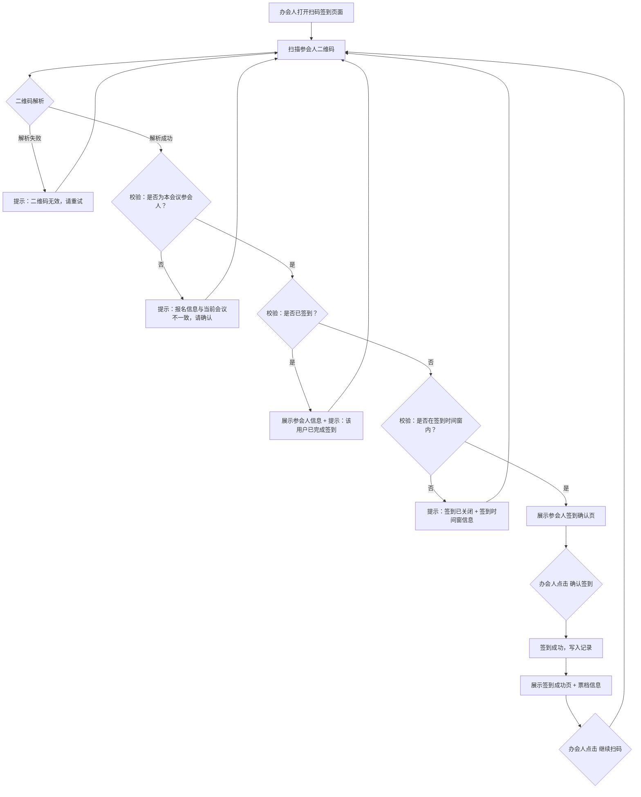

# 办会人扫码签到重构产品需求说明书

## 需求概览

将当前"参会人扫描会议签到二维码"的签到模式，重构为"办会人/工作人员扫描每个参会人的个人专属二维码"完成签到。参会人报名成功后自动获得个人专属签到二维码（含票档信息），办会人通过扫码设备逐人扫码确认签到。此举适应售票/票档功能上线后的差异化签到需求。

---

## 第1章：概述

### 1.1 术语表

| 名称 | 详细描述 |
|------|----------|
| 个人专属签到二维码 | 报名成功后系统为每个参会人自动生成的唯一二维码，包含参会人身份、票档等信息，用于办会人扫码签到 |
| 办会人扫码端 | 办会人或其授权的现场工作人员用于扫描参会人二维码的设备/页面，具体载体待与甲方确认 |
| 参会人二维码查看入口 | 参会人在"我的会议 → 我报名的会议"中查看个人签到二维码的功能入口 |
| 签到时间窗 | 会议开始前 1 小时（含）起至会议结束（含）止，仅在此时段内允许签到操作 |

### 1.2 修订记录

| 版本号 | 内容 | 负责人 | 更新时间 | 备注 |
|------|------|------|------|------|
| V1.0 | 首版，签到模式由"参会人扫会议码"重构为"办会人扫参会人码" | — | 2026-06-22 | 首版 |
| V1.1 | 开放问题 #2~6 全部确认裁定；新增 SCAN-04 签到通知（站内信+短信+文案）；新增 SCAN-05 手动签到（审核页操作列【签到】按钮）；Non-Goals 补充第9条"取消签到" | — | 2026-06-22 | — |

### 1.3 背景和价值

- **背景问题**：当前签到模式为"参会人扫描会议专属签到二维码"，一个会议一个码，所有参会人通用。随着售票/票档功能上线，不同参会人持有不同类型的票（免费票/收费票/VIP票等），需要一个能够区分票档的差异化签到方式。
- **业务价值**：签到数据细分到票档维度，支持按票档统计到场率，为后续的票务数据分析提供基础。
- **用户价值**：办会人掌握签到主动权，扫码即完成，不需参会人操作手机；参会人只需展示二维码即可，降低操作门槛。

### 1.4 现状 vs 目标

| 维度 | 现状 | 目标 |
|------|------|------|
| 签到发起方 | 参会人（主动扫描会议二维码） | 办会人/工作人员（主动扫描参会人二维码） |
| 被扫对象 | 会议签到二维码（一个会议一个码，投屏/打印） | 每个参会人的个人专属二维码（一人一码） |
| 二维码粒度 | 会议级 | 参会人级 |
| 签到信息 | 仅知道"谁签到了" | 知道"谁签到了 + 什么票档" |

---

## 第2章：功能需求

### 2.1 模块划分

本次重构涉及三个核心模块：

| 模块 | 编号 | 简述 |
|------|------|------|
| 参会人二维码生成与查看 | SCAN-01 | 报名成功后生成个人专属二维码，参会人在"我的会议"中查看 |
| 办会人扫码签到 | SCAN-02 | 办会人扫描参会人二维码，确认签到信息，完成签到 |
| 签到记录管理 | SCAN-03 | 签到数据记录、票档统计、导出 |
| 签到通知 | SCAN-04 | 签到成功后通过站内信和短信双通道通知参会人 |
| 手动签到 | SCAN-05 | 办会人在"报名用户审核"页对单个参会人手动标记签到状态 |

---

### 2.2 参会人二维码生成与查看（SCAN-01）

#### 场景描述

参会人报名某会议且审核通过后，系统自动为其生成个人专属签到二维码。参会人可在"我的会议 → 我报名的会议"页签中，点击对应会议卡片的【签到二维码】按钮查看。

#### 用户故事

| 编号 | 用户故事 |
|------|----------|
| US-SCAN-01 | 作为参会人，我报名成功且审核通过后，希望在我的会议中看到【签到二维码】按钮，以便现场出示给工作人员完成签到 |
| US-SCAN-02 | 作为参会人，我在审核未通过（待审核/已拒绝）时点击【签到二维码】，希望得到明确的提示，以便了解当前状态并及时处理 |
| US-SCAN-03 | 作为办会人，我希望每个参会人的签到二维码包含其票档信息，以便扫码时区分不同类型的参会人 |

#### 需求规格

**2.2.1 二维码生成规则**

| 规则项 | 内容 |
|--------|------|
| 生成时机 | 参会人报名审核通过后，系统自动生成个人专属签到二维码 |
| 二维码内容 | 包含参会人唯一标识（user_id + meeting_id + ticket_id），不包含敏感个人信息。二维码数据经编码处理，仅系统可解析 |
| 有效期 | **长期有效**（无过期机制）。会议结束后二维码仍可生成，但扫码签到时受时间窗限制 |
| 代签到 | 支持。二维码为静态码，无动态刷新/活码机制，参会人可截图发送他人代为签到（风险：本需求明确接受此行为，不做防代签到） |
| 票档关联 | 二维码关联参会人所购票档（免费票/收费票 + 票档名称 + 票档描述），扫码签到后记录票档信息 |

**2.2.2 参会人查看入口**

| 规则项 | 内容 |
|--------|------|
| 入口位置 | "我的会议 → 我报名的会议"页签，每个已报名会议卡片内新增【签到二维码】按钮 |
| 展示条件 | 仅当该会议状态为"报名中"或"进行中"或"已结束"时展示按钮 |
| 按钮状态 | 始终可点击（不因审核状态置灰），点击后按 2.2.3 分层逻辑处理 |

**2.2.3 点击按钮后的分层处理**

点击【签到二维码】时，系统根据参会人当前的报名审核状态分层响应：

| 审核状态 | 前端行为 | 提示文案 |
|----------|----------|----------|
| **已报名**（审核通过） | 弹窗展示个人专属签到二维码（大尺寸，适合扫码） | 二维码下方展示："请将此二维码出示给现场工作人员完成签到"；签到时间窗之外另提示："签到开放时间：YYYY-MM-DD HH:MM 至 YYYY-MM-DD HH:MM" |
| **待审核** | 弹窗展示纯文案提示，**不展示二维码** | "报名审核中，审核通过后可查看签到二维码" |
| **已拒绝** | 弹窗展示纯文案提示，**不展示二维码** | "您的报名未通过审核，如有疑问请联系主办方" |

**2.2.4 签到时间窗提示**

| 规则项 | 内容 |
|--------|------|
| 时间窗定义 | 会议开始前 1 小时（含）起至会议结束（含）止 |
| 参会人端提示 | 二维码弹窗下方展示："签到开放时间：YYYY-MM-DD HH:MM 至 YYYY-MM-DD HH:MM" |
| 时效性 | 该提示信息不阻断二维码展示——即使当前不在签到时间窗内，二维码仍正常展示，办会人扫码仍可签到 |
| 时间窗校验 | 实际扫码签到时的校验在 SCAN-02 办会人端执行 |

#### 验收标准

- [ ] AC-SCAN-01：参会人审核通过后，在"我报名的会议"中对应会议卡片看到【签到二维码】按钮
- [ ] AC-SCAN-02：点击按钮后，弹窗展示包含参会人身份和票档信息的个人专属二维码
- [ ] AC-SCAN-03：审核状态为"待审核"时点击按钮，展示"报名审核中，审核通过后可查看签到二维码"，不展示二维码
- [ ] AC-SCAN-04：审核状态为"已拒绝"时点击按钮，展示"您的报名未通过审核，如有疑问请联系主办方"，不展示二维码
- [ ] AC-SCAN-05：二维码弹窗下方展示签到时间窗信息
- [ ] AC-SCAN-06：二维码为静态码，同一参会人生成的二维码保持不变

---

### 2.3 办会人扫码签到（SCAN-02）

#### 场景描述

办会人或其授权的现场工作人员，通过扫码设备依次扫描参会人出示的个人签到二维码，确认签到信息后完成签到。签到成功后自动返回扫码页，便于连续扫描下一人。

#### 用户故事

| 编号 | 用户故事 |
|------|----------|
| US-SCAN-04 | 作为办会人，我希望扫描参会人的二维码后能看到其姓名、报名信息、票档类型，以便确认身份后完成签到 |
| US-SCAN-05 | 作为办会人，我希望签到成功后能快速返回扫码页面继续扫描下一个人，以便高效完成批量签到 |
| US-SCAN-06 | 作为办会人，我扫描到无效二维码（非本会议、已签到等）时，希望看到明确的错误提示 |

#### 需求规格

**2.3.1 扫码载体**

> **待定。** 具体实现载体（微信小程序 / 网页端摄像头 / 微信 JS-SDK / 其他方案）待与甲方沟通确认。本节其余规格对扫码载体的选择无依赖，各方案通用。

**2.3.2 办会人身份验证**

| 规则项 | 内容 |
|--------|------|
| 权限要求 | 仅会议创建者（办会人）及其授权的现场工作人员可进入扫码签到页面 |
| 登录态 | 扫码签到页面要求登录态验证，未登录时引导登录 |
| 会议锁定 | 扫码页面**不支持切换会议**，自动锁定当前办会人名下状态为"进行中"的会议；若有多场并行，在进入扫码页面前让办会人选择一场（仅进入时选择一次，进入后不可切换） |

**2.3.3 签到主流程**

**2.3.4 签到确认页展示内容**

扫描参会人二维码后、确认签到前，展示以下信息：

| 展示字段 | 说明 |
|----------|------|
| 头像 | 参会人账号头像（如有） |
| 报名问卷内容 | 参会人报名时填写的所有问卷字段及值（只读展示） |
| 票档类型 | 票档名称（如"VIP票"、"标准票"） |
| 票档描述 | 票档的服务/内容说明（如"含午餐、资料袋、会议纪念品"） |
| 确认签到按钮 | 办会人确认信息无误后点击 |
| 取消按钮 | 返回扫码页面，不执行签到 |

> **注意：不展示报名审核状态字段**——能走到这一步的二维码必然是审核通过的（待审核/已拒绝的人根本看不到二维码）。

**2.3.5 签到成功页**

| 规则项 | 内容 |
|--------|------|
| 展示内容 | 签到成功大图标 + "签到成功"文案 + 参会人姓名 + 票档类型 |
| 后续操作 | 【继续扫码】按钮（非自动跳转） |
| 页面行为 | 点击【继续扫码】→ 返回扫码页面，摄像头重新就绪，准备扫描下一个人 |

**2.3.6 异常场景处理**

| 场景 | 系统行为 | 办会人端提示文案 |
|------|----------|----------------|
| 二维码解析失败 | 不执行签到，返回扫码页 | "二维码无效，请重试" |
| 扫码到非本会议参会人的二维码 | 不执行签到，返回扫码页 | "报名信息与当前会议不一致，请确认" |
| 重复签到（已签到参会人被再扫） | 展示该参会人信息，但"确认签到"按钮替换为提示信息 | "该用户已完成签到" |
| 签到时间窗之外扫码 | 不执行签到，返回扫码页 | "签到已关闭。签到开放时间：YYYY-MM-DD HH:MM 至 YYYY-MM-DD HH:MM" |
| 网络断开 | 不执行签到，展示提示 | "网络连接异常，请检查网络后重试" |
| 并发签到（参会人A的码被工作人员B和C同时扫描，B先确认签到了） | B 正常签到成功；C 点击确认时后端校验返回已签到 | C 端展示"该用户已完成签到" |

**2.3.7 快速连续签到**

| 规则项 | 内容 |
|--------|------|
| 快速模式 | **不提供。** 每次扫描均需办会人查看确认页后手动点击确认签到 |
| 连续扫描效率 | 签到成功后点击【继续扫码】→ 返回扫码页，摄像头自动就绪 |

#### 验收标准

- [ ] AC-SCAN-07：办会人选择当前会议后进入扫码签到页面，摄像头就绪
- [ ] AC-SCAN-08：扫描参会人二维码后，确认页展示：头像、报名问卷内容、票档类型及描述
- [ ] AC-SCAN-09：确认页不展示报名审核状态字段
- [ ] AC-SCAN-10：点击确认签到后，展示签到成功页（姓名 + 票档 + "继续扫码"按钮）
- [ ] AC-SCAN-11：点击【继续扫码】返回扫码页面，摄像头重新就绪
- [ ] AC-SCAN-12：扫描非本会议参会人二维码时，提示"报名信息与当前会议不一致，请确认"
- [ ] AC-SCAN-13：重复签到（已签到用户再被扫），提示"该用户已完成签到"
- [ ] AC-SCAN-14：签到时间窗外扫码，提示"签到已关闭"并展示时间窗
- [ ] AC-SCAN-15：网络断开时扫码，提示"网络连接异常，请检查网络后重试"
- [ ] AC-SCAN-16：并发签到场景下，先确认的签到成功，后确认的提示"该用户已完成签到"

---

### 2.4 签到记录管理（SCAN-03）

#### 场景描述

签到完成后，系统自动记录签到数据至后台。办会人可在管理后台查看签到统计（含票档维度），运营端可导出签到数据。

#### 需求规格

**2.4.1 签到记录字段**

| 字段 | 说明 |
|------|------|
| 签到时间 | 办会人确认签到的时间戳 |
| 参会人 ID | 关联的参会人唯一标识 |
| 参会人姓名 | 签到记录展示用 |
| 手机号 | 报名时填写的手机号 |
| 会议 ID | 关联的会议唯一标识 |
| 票档 ID | 关联的票档唯一标识 |
| 票档名称 | 如"标准票"、"VIP票" |
| 票档类型 | 免费 / 收费 |
| 签到人（工作人员）ID | 执行扫码签到操作的办会人/工作人员标识 |

**2.4.2 签到统计**

| 统计维度 | 说明 |
|----------|------|
| 总签到数 | 已签到人数 / 总报名人数（审核通过） |
| 签到率 | 已签到人数 ÷ 总报名人数（审核通过）× 100% |
| 按票档统计 | 各票档的签到人数、对应签到率 |
| 按时间趋势 | 签到时间分布（可选，P1） |

**2.4.3 数据导出**

| 规则项 | 内容 |
|--------|------|
| 导出格式 | 沿用现有导出格式，新增票档相关列 |
| 导出权限 | 运营端可导出；办会人可在管理后台查看但不可导出（或待确认） |

#### 验收标准

- [ ] AC-SCAN-17：签到记录包含：签到时间、参会人信息、票档信息、操作人信息
- [ ] AC-SCAN-18：管理后台可查看签到统计（总数、签到率、按票档分组）
- [ ] AC-SCAN-19：运营端导出数据中包含票档字段

---

### 2.5 签到通知（SCAN-04）

#### 场景描述

参会人签到成功后（无论是扫码签到还是手动签到），系统通过站内信和短信双通道向参会人发送签到成功通知，让参会人及时确认签到状态。

#### 用户故事

| 编号 | 用户故事 |
|------|----------|
| US-SCAN-07 | 作为参会人，我签到成功后希望收到通知，以便确认签到已生效 |

#### 需求规格

**2.5.1 通知通道**

| 通道 | 触发时机 | 说明 |
|------|----------|------|
| 站内信 | 签到成功后即时发送 | 无需额外成本，实时送达 |
| 短信 | 签到成功后即时发送 | 需平台预购短信包，存量消耗 |

**2.5.2 通知文案**

| 通道 | 标题 | 内容 |
|------|------|------|
| 站内信 | 签到成功通知 | 尊敬的 {参会人姓名}，您已成功签到会议"{会议名称}"。签到时间：{YYYY-MM-DD HH:MM}。祝您参会愉快！ |
| 短信 | — | 【CSDN技术会议】{参会人姓名}，您已成功签到"{会议名称}"。签到时间：{YYYY-MM-DD HH:MM}。祝您参会愉快！ |

> **注意**：手动签到时，短信和站内信使用同一套文案，不做区分。

#### 验收标准

- [ ] AC-SCAN-20：扫码签到成功后，参会人收到站内信（标题"签到成功通知"，含会议名称和签到时间）
- [ ] AC-SCAN-21：扫码签到成功后，参会人收到短信（含会议名称和签到时间）
- [ ] AC-SCAN-22：手动签到成功后，参会人同样收到站内信和短信通知（文案同上）

---

### 2.6 手动签到（SCAN-05）

#### 场景描述

当参会人忘记携带手机/二维码无法展示时，办会人可在"报名用户审核"页面通过手动操作为此参会人完成签到。此功能作为扫码签到的兜底方案。

#### 交互分析

在办会人视角的「报名用户审核」页面中，每个参会人操作列新增一个【签到】按钮。点击后：

1. 弹出二次确认弹窗："确认将 {参会人姓名} 标记为已签到？"
2. 办会人确认 → 该参会人签到状态更新为"已签到"，签到时间为当前操作时间，签到人为当前登录的办会人
3. 同步触发 SCAN-04 签到通知（站内信 + 短信）
4. 按钮变更为【已签到】（置灰不可再操作）

> **设计备注**：这里有一个权衡——把"签到"按钮放在"审核"页面上，职责上不够纯粹（审核和签到是两个不同操作）。但考虑到这是办会人端的操作页面，且参会人列表天然适合作为"手持签到名单"，实际操作效率高于另开管理后台页面。建议后续如有独立的"签到管理"页面，再将该功能迁移过去。

#### 用户故事

| 编号 | 用户故事 |
|------|----------|
| US-SCAN-08 | 作为办会人，我希望在参会人忘带二维码时，可以在审核页面直接手动将其标记为已签到，以便不影响现场签到流程 |

#### 需求规格

| 规则项 | 内容 |
|--------|------|
| 入口 | 办会人视角 → 报名用户审核页面 → 每个参会人操作列新增【签到】按钮 |
| 可操作条件 | 仅对审核状态为"已报名"（审核通过）的参会人展示【签到】按钮；待审核/已拒绝的参会人不展示 |
| 二次确认 | 点击【签到】后弹出确认弹窗："确认将 {参会人姓名} 标记为已签到？" |
| 确认后 | 该参会人签到状态更新为"已签到"，签到时间 = 操作时间，签到人 = 当前登录办会人 |
| 按钮状态变化 | 签到成功后按钮变为【已签到】，置灰不可点击 |
| 通知 | 触发 SCAN-04 签到通知，向参会人发送站内信 + 短信 |
| 重复操作防护 | 已签到的参会人不展示【签到】按钮（展示置灰的"已签到"）；后端同样校验防止重复签到 |
| 时间窗限制 | 手动签到**不受签到时间窗限制**——办会人可在会议开始前及结束后手动签到（扫码签到仍受时间窗限制） |

#### 验收标准

- [ ] AC-SCAN-23：审核状态为"已报名"的参会人，操作列展示【签到】按钮
- [ ] AC-SCAN-24：待审核/已拒绝状态的参会人，操作列不展示【签到】按钮
- [ ] AC-SCAN-25：已签到状态的参会人，操作列展示【已签到】置灰
- [ ] AC-SCAN-26：点击【签到】→ 弹出二次确认弹窗 → 确认后该参会人状态变为已签到
- [ ] AC-SCAN-27：手动签到成功后，参会人收到站内信和短信通知
- [ ] AC-SCAN-28：手动签到不受签到时间窗限制，会议开始前/结束后均可操作

---

## 第3章：Non-Goals（本期不包含）

| 序号 | 不包含内容 | 说明 |
|------|-----------|------|
| 1 | 防代签到/活码机制 | 明确接受代签到行为，二维码为静态码 |
| 2 | 扫码后自动确认（快速模式） | 每次扫描均需手动点击确认 |
| 3 | 办会人扫码端多设备账号踢出/并发控制 | 不做并发锁，仅在后端校验时提示重复签到 |
| 4 | 离线签到（断网缓存→联网补传） | 首版仅支持在线签到 |
| 5 | 签到数据实时大屏/投屏 | 首版仅管理后台查看统计 |
| 6 | 工作人员权限体系（主办方添加/删除工作人员账号） | 首版仅支持办会人本人扫码签到及手动签到；多人协作通过账号共享方式授权 |
| 7 | 重新生成/刷新签到二维码 | 一个参会人仅生成一个固定二维码 |
| 8 | 票档信息用于现场分流/引导（如VIP专属通道） | 票档信息仅供签到记录和统计使用 |
| 9 | 取消签到/已签到回退 | 签到状态一经确认不可撤销。如需撤销需通过后台数据库操作 |

---

## 第4章：成功指标

| 指标 | 类型 | 目标值 | 衡量方式 |
|------|------|--------|----------|
| 签到效率 | 领先 | 单人次签到耗时（扫到码→确认完成）< 5 秒 | 前端埋点统计扫码→确认签到的时间差 |
| 签到成功率 | 领先 | 有效扫码中签到成功比例 ≥98% | 签到成功次数 / 有效扫码总次数 |
| 签到率 | 滞后 | 不低于现有签到率基线 | 已签到人数 / 总报名（审核通过）人数 |
| 票档签到数据完整率 | 滞后 | 100% 签到记录含票档字段 | 含票档信息的签到记录 / 总签到记录 |

---

## 第5章：开放问题

| 序号 | 问题 | 状态 | 阻塞程度 |
|------|------|------|----------|
| 1 | **扫码载体方案**（微信小程序 / 网页端摄像头 / 微信 JS-SDK / 其他）？ | **待与甲方确认** | **阻塞开发** |
| 2 | 办会人扫码端是否需要支持选择多场会议切换？ | **已确认：不支持。** 扫码页面锁定当前进行中的会议 | — |
| 3 | 未审核通过的参会人，是否可以看到【签到二维码】按钮？ | **已确认：按钮始终可见。** 点击后按 2.2.3 分层处理 | — |
| 4 | 签到二维码是否需要包含明文信息？ | **已确认：纯编码即可。** 扫码后服务端解析展示 | — |
| 5 | 签到成功是否需要给参会人发送通知？ | **已确认：需要。** 短信 + 站内信双通道通知，详见新增 SCAN-04 | — |
| 6 | 是否需要手动签到功能？ | **已确认：需要。** 在办会人"报名用户审核"页面操作列新增【签到】按钮，详见新增 SCAN-05 | — |

---

## 第6章：风险与依赖

| 风险 | 影响 | 缓解措施 |
|------|------|----------|
| 扫码载体方案（#1）未确定前无法进行前台开发 | 阻塞开发进度 | 优先与甲方沟通确定方案，后台逻辑（二维码生成/签到写入/统计）可先行开发 |
| 微信小程序方案需审核 | 上线时间不可控 | 在审核期间准备网页端扫码作为降级方案 |
| 现场网络环境不稳定 | 扫码签到失败 | 提示明确、引导重试；后续可考虑离线签到（P2） |
| 代签到导致签到数据失真 | 统计数据参考价值下降 | 作为已知取舍接受，首版不处理 |

---

*文档编制日期：2026-06-22*
