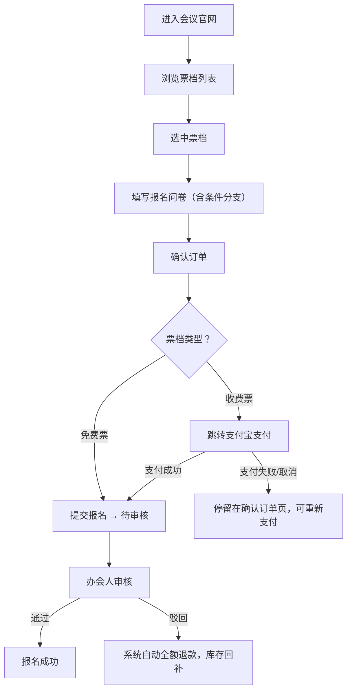

# 售票与票档配置产品需求说明书

## 需求概览

在快速创建会议流程中新增「售票设置」配置步骤（Step 09）。办会人可为会议配置免费票和收费票两种票档（可同时存在），收费票支持设置限时优惠。参会人选票、填写报名问卷、确认订单后，通过支付宝完成支付；支付成功后进入待审核状态，办会人审核通过即报名成功，审核不通过则自动全额退款、库存回补。平台通过办会人钱包管理售票资金，会议结束后次日统一结算。

---

## 第1章：概述

### 1.1 术语表

| 名称 | 详细描述 |
|------|----------|
| 票档 | 办会人为会议配置的票种，含名称、描述、类型（免费/收费）、价格、库存等信息 |
| 免费票 | 票价为 0 的票档，参会人无需支付，选票后直接进入待审核 |
| 收费票 | 票价大于 0 的票档，参会人需通过支付宝完成支付后方进入待审核 |
| 限时优惠 | 收费票可配置的促销折扣，含优惠价和截止时间，系统自动计算折扣 |
| 办会人钱包 | 平台为每个办会人维护的虚拟账户，售票收入在会议结束后次日结算入账 |
| 库存 | 票档的可售数量，支付成功后扣减，审核不通过退款时回补 |

### 1.2 修订记录

| 版本号 | 内容 | 负责人 | 更新时间 | 备注 |
|------|------|------|------|------|
| V1.0 | 首版，基于 AI 原型定义售票需求 | — | 2026-06-16 | 首版 |
| V1.1 | 新增 2.1.5 票档库存与报名人数上限；补充参会端"名额已满"规则及验收标准 AC-TK-13~16 | — | 2026-06-17 | — |
| V1.2 | 2.4 办会人钱包从 P1 升级为 P0：明确提现功能（T+1 结算、支持提现申请、流水明细、余额不足垫付）；新增 US-TK-15~16、验收标准 AC-TK-30~33；更新开放问题 | — | 2026-06-17 | — |

### 1.3 背景和价值

- **背景问题**：现有会议系统仅支持"免费报名 + 主办方审核"模式，无法满足付费参会场景。部分办会人有售票需求（技术峰会、培训课程等），缺乏售票能力导致平台无法覆盖这类场景，也损失了潜在的售票收入流水。
- **业务价值**：解锁付费会议场景，提升平台 GMV；通过办会人钱包沉淀资金流，建立平台金融服务能力的基础。
- **用户价值**：办会人可直接在平台完成售票，无需对接第三方票务系统；参会人在同一页面完成选票、填表、支付，体验闭环。

---

## 第2章：功能需求

### 2.1 票档配置（TICKET-01）

#### 场景描述

办会人在快速创建会议流程中，完成报名问卷配置（Step 07）和报名渠道选择（Step 08，需选择"平台官网报名"）后，进入 Step 09「售票设置」配置票档。可添加免费票和收费票，两种类型可同时存在。

#### 用户故事

| 编号 | 用户故事 |
|------|----------|
| US-TK-01 | 作为办会人，我希望为会议配置不同类型的票档（免费/收费），以便覆盖不同参会人群 |
| US-TK-02 | 作为办会人，我希望为每个票档设置名称、描述、价格和库存，以便参会人清晰了解票种信息 |
| US-TK-03 | 作为办会人，我希望可同时设置免费票和收费票（如"学生票"免费 + "标准票"收费），以便灵活定价 |
| US-TK-04 | 作为办会人，我希望为收费票配置限时优惠（优惠价+截止时间），系统自动计算折扣，以便在特定时段促销 |
| US-TK-05 | 作为参会人，我在会议官网上看到所有可售票档（含名称、描述、价格、优惠信息），以便做出选择 |

#### 需求规格

**2.1.1 票档字段定义**

| 字段 | 类型 | 必填 | 说明 |
|------|------|------|------|
| 票档名称 | 文本 | 是 | 如：标准票、VIP票、学生票、早鸟票 |
| 票档描述 | 长文本 | 否 | 说明该票档包含的服务/内容，如"含午餐、资料袋、会议纪念品" |
| 票档类型 | 单选 | 是 | 免费 / 收费 |
| 价格 | 数字（元） | 收费票必填 | 正整数，单位为人民币元；免费票时自动置 0 且不可编辑 |
| 库存 | 整数 | 是 | 正整数，≥1；首次创建后仅可增加不可减少 |
| 限时优惠 | 复合 | 否 | 仅收费票支持，详见 2.3 节 |

**2.1.2 配置端交互**

```
办会人进入 Step 09「售票设置」
  ↓
初始状态：提示"还没有票档，点击下方按钮添加"
  ↓
点击【免费票】或【收费票】按钮 → 新增票档卡片
  ↓
票档卡片展示：
  - 折起/展开箭头
  - 票档名称、类型（标签）、价格、库存摘要
  - 右侧【限时优惠】配置按钮（收费票）或 无（免费票）
  ↓
展开票档卡片 → 编辑完整信息：
  - 票档名称（必填）
  - 票档描述（选填，支持多行文本）
  - 类型（免费/收费，创建后不可切换）
  - 价格（收费票必填）
  - 库存（必填，正整数）
  ↓
可继续添加更多票档（免费/收费同时存在）
  ↓
进入下一步 / 确认创建
```

**2.1.3 票档编辑规则**

| 规则项 | 内容 |
|--------|------|
| 删除 | **不支持删除**票档。已创建即不可移除 |
| 价格修改 | 支持修改（收费票），修改后不影响已有订单（已下单未支付的订单以实际支付时票档价格为准） |
| 库存修改 | **仅可增加，不可减少**。修改库存不可低于已售出数量 |
| 票档类型 | 免费/收费创建后不可切换 |
| 票档排序 | 按创建顺序展示，首版不支持拖拽排序 |

**2.1.4 参会端展示**

| 规则项 | 内容 |
|--------|------|
| 展示位置 | 会议官网中，报名问卷上方展示票档选择区 |
| 票档卡片 | 每张卡片展示：票档名称、描述（如有）、价格（免费票显示"免费"）、库存状态（充足 / 已售罄）、限时优惠标签（如有） |
| 库存状态 | 库存 > 0：显示"剩余 X 张"或正常展示；库存 = 0：显示"已售罄"，卡片置灰不可选 |
| 限时优惠 | 收费票如配有限时优惠且未过期，展示原价（划线）和优惠价，及折扣标签（如"6折"） |
| 选择行为 | 参会人点击票档卡片即选中，同一时间只能选一张票（一人一票） |
| 名额已满 | 所有票档库存之和已用完时（即所有票档库存均为 0 或总已售 = 总库存），报名入口显示"名额已满"且不可进入，与现有会议人数上限逻辑一致。详见 2.1.5 节 |

**2.1.5 票档库存与报名人数上限**

配置售票的会议，使用各票档库存总数替代原有的"报名人数上限"字段。

| 规则项 | 内容 |
|--------|------|
| 库存替代上限 | 当会议配置了票档（≥1 个），**报名人数上限 = 所有票档库存之和**。原有的独立"报名人数上限"字段不再展示或置为只读，自动同步为票档库存总和 |
| 动态联动 | 办会人新增/删除票档或修改任一票档库存时，报名人数上限同步更新 |
| 无票档时 | 会议未配置票档时，沿用原有的"报名人数上限"字段（`max_participants`），行为不变 |
| 名额已满判定 | 所有票档总库存已售完（各票档已售数量之和 = 总库存之和）时，参会端展示"名额已满"，阻止新报名。同现有的 `已报名人数 >= max_participants` 逻辑，唯一区别是将 `max_participants` 替换为票档库存总和 |
| 混合场景 | 一个会议同时有免费票和收费票时，总名额 = 免费票库存 + 各收费票库存之和；任一票档售罄仅影响该票档的选择，总名额满则整体关闭报名入口 |

#### 验收标准

- [ ] AC-TK-01：办会人在 Step 09 看到免费票/收费票两个添加按钮
- [ ] AC-TK-02：点击添加按钮后，票档卡片出现在配置区域
- [ ] AC-TK-03：展开卡片后可编辑：名称、描述、类型、价格、库存；免费票价格自动置 0 不可编辑
- [ ] AC-TK-04：票档名称为空时提交会议校验失败
- [ ] AC-TK-05：收费票价格为 0 或空时，提交校验失败
- [ ] AC-TK-06：库存为空、为 0、非正整数时，提交校验失败
- [ ] AC-TK-07：免费票和收费票可在同一会议中同时存在
- [ ] AC-TK-08：会议发布后，票档不支持删除
- [ ] AC-TK-09：会议发布后，价格可修改，库存只增不减
- [ ] AC-TK-10：参会端官网正确展示所有票档（含免费/收费、有/无优惠、库存状态）
- [ ] AC-TK-11：库存为 0 的票档显示"已售罄"且不可选
- [ ] AC-TK-12：选择外链报名时，Step 09 不展示（互斥逻辑见报名渠道 PRD）
- [ ] AC-TK-13：配置售票后，报名人数上限自动计算为各票档库存之和，原"报名人数上限"字段不展示或置为只读
- [ ] AC-TK-14：修改任一票档库存时，报名人数上限同步更新
- [ ] AC-TK-15：总库存售完后（所有票档已售之和 = 总库存），参会端展示"名额已满"，报名入口关闭
- [ ] AC-TK-16：某票档售罄不影响其他票档的选择（如免费票售罄但收费票仍有库存，收费票仍可选）

---

### 2.2 购票与支付流程（TICKET-02）

#### 场景描述

参会人在会议官网选择合适的票档后，填写报名问卷，确认订单信息，完成支付。



#### 用户故事

| 编号 | 用户故事 |
|------|----------|
| US-TK-06 | 作为参会人，我选择票档后填写问卷、确认订单，通过支付宝完成支付，以便正式报名 |
| US-TK-07 | 作为参会人，我选择免费票后直接提交报名，无需支付，以便快速完成 |
| US-TK-08 | 作为参会人，我支付成功后希望看到明确的支付成功反馈和订单状态 |
| US-TK-09 | 作为办会人，我在审核通过报名时，参会人状态变为"已报名"；审核不通过时，系统自动全额退款给参会人 |
| US-TK-10 | 作为参会人，我的报名被驳回后，希望及时收到退款通知 |

#### 需求规格

**2.2.1 确认订单页**

| 元素 | 内容 |
|------|------|
| 票档信息 | 票档名称、描述（如有） |
| 价格明细 | 原价、优惠价（如有）、实付金额 |
| 问卷摘要 | 已填写的报名问卷字段（只读展示） |
| 支付按钮 | 免费票：【确认报名】；收费票：【立即支付】 |
| 底部提示 | 收费票：支付成功后进入待审核，审核结果将通知您；免费票：提交后进入待审核，请等待审核结果 |

**2.2.2 支付流程**

| 规则项 | 内容 |
|--------|------|
| 支付方式 | 支付宝（JSAPI 或扫码支付，视终端环境选择） |
| 支付时间限制 | 建议设定支付超时时间（如 15 分钟），超时未支付则订单取消、库存释放。**待与甲方确认** |
| 支付成功 | 报名状态变为"待审核"，扣减库存 |
| 支付失败/取消 | 停留在确认订单页，可重新发起支付 |
| 免费票 | 无支付环节，点击【确认报名】后直接进入"待审核"状态，扣减库存 |

**2.2.3 库存扣减与回补**

| 规则项 | 内容 |
|--------|------|
| 扣减时机 | 收费票：支付成功后扣减；免费票：确认报名后扣减 |
| 回补时机 | 办会人审核驳回后，系统自动全额退款（收费票），并将该票档库存 +1 |
| 防超卖 | 支付前预校验库存，库存不足时阻止支付/提交并提示"该票档已售罄" |

**2.2.4 审核与退款**

| 规则项 | 内容 |
|--------|------|
| 审核通过 | 报名状态 →"已报名"，通知参会人 |
| 审核驳回 | 办会人点击"驳回"时，系统自动发起支付宝全额退款；退款成功后库存回补；报名状态 →"已拒绝"，通知参会人 |
| 退款时效 | 自动发起，无需办会人手动操作退款 |

**2.2.5 一人一票规则**

| 规则项 | 内容 |
|--------|------|
| 限制 | 同一会议，同一参会人只能购买一张票（不区分票档类型） |
| 校验时机 | 点击票档或进入报名问卷时，校验该参会人是否已有有效报名记录（含待审核、已报名），若有则提示"您已报名该会议，无需重复报名" |
| 被驳回后 | 被驳回的参会人可重新报名 |

#### 验收标准

- [ ] AC-TK-13：收费票参会人选择票档、填写问卷后，确认订单页展示票档信息、价格、实付金额
- [ ] AC-TK-14：收费票点击【立即支付】后跳转支付宝支付
- [ ] AC-TK-15：支付成功后报名状态变为"待审核"，库存扣减
- [ ] AC-TK-16：支付失败或取消后，停留在确认订单页，可重新支付
- [ ] AC-TK-17：免费票点击【确认报名】后直接进入"待审核"，无支付环节，库存扣减
- [ ] AC-TK-18：办会人审核通过后，报名状态变为"已报名"
- [ ] AC-TK-19：办会人点击驳回时，系统自动全额退款，库存回补，报名状态变为"已拒绝"
- [ ] AC-TK-20：同一参会人对同一会议不能重复购票，提示"您已报名该会议"
- [ ] AC-TK-21：被驳回后该参会人可重新报名

---

### 2.3 限时优惠配置（TICKET-03）

#### 场景描述

办会人为收费票配置限时优惠，吸引参会人在指定时间前以优惠价购票。

#### 用户故事

| 编号 | 用户故事 |
|------|----------|
| US-TK-11 | 作为办会人，我希望为收费票配置限时优惠价和截止时间，以便在特定时段促销 |
| US-TK-12 | 作为办会人，我希望输入优惠价后系统自动计算折扣（如"6折"），以便直观确认优惠力度 |
| US-TK-13 | 作为参会人，我在票档卡片上看到原价（划线）、优惠价和折扣标签，以便感知优惠 |
| US-TK-14 | 作为系统，我希望优惠到期后自动恢复原价，无需办会人手动操作 |

#### 需求规格

**2.3.1 配置端**

| 规则项 | 内容 |
|--------|------|
| 配置位置 | 收费票卡片右侧【限时优惠】按钮 |
| 展开/收起 | 点击按钮后，在当前票档卡片下方展开优惠配置栏；再次点击收起 |
| 优惠价输入 | 数字输入框，正整数；输入后右侧动态计算折扣：`折扣 = 优惠价 ÷ 原价 × 10` 并显示"X折"（向上取整到整数折） |
| 截止时间 | 日期时间选择器，格式 YYYY-MM-DD HH:MM，精确到分钟 |
| 校验 | 优惠价必须 < 原价；截止时间必须晚于当前时间 |

示例：

| 原价 | 优惠价 | 计算 | 显示 |
|------|--------|------|------|
| ¥200 | ¥120 | 120 / 200 × 10 = 6 | **6折** |
| ¥599 | ¥299 | 299 / 599 × 10 ≈ 4.99 | **5折** |
| ¥100 | ¥85 | 85 / 100 × 10 = 8.5 | **9折** |

**2.3.2 参会端**

| 规则项 | 内容 |
|--------|------|
| 优惠期内 | 票档卡片展示：原价（划线灰色）+ 优惠价（红色/醒目）+ 折扣标签（如"6折"）+ 截止时间提示 |
| 优惠到期后 | 自动隐藏优惠信息，仅展示原价 |
| 确认订单页 | 展示原价、优惠价（如适用）、实付金额 |

**2.3.3 边界情况**

| 情形 | 处理 |
|------|------|
| 办会人输入优惠价 ≥ 原价 | 校验失败，提示"优惠价必须低于原价" |
| 截止时间 ≤ 当前时间 | 校验失败，提示"截止时间必须晚于当前时间" |
| 办会人未配置限时优惠 | 收费票无优惠标签，直接按原价展示 |
| 优惠截止时间到达 | 系统自动恢复原价，无需手动操作 |
| 办会人修改原价后优惠价仍然有效 | 重新计算折扣显示；若修改后优惠价 ≥ 新原价，提示办会人调整 |

#### 验收标准

- [ ] AC-TK-22：收费票卡片右侧展示【限时优惠】按钮，免费票不展示
- [ ] AC-TK-23：点击按钮后展开优惠配置栏：优惠价输入框 + 截止时间选择器
- [ ] AC-TK-24：输入优惠价后，右侧动态计算并显示"X折"
- [ ] AC-TK-25：优惠价 ≥ 原价时校验失败
- [ ] AC-TK-26：截止时间 ≤ 当前时间时校验失败
- [ ] AC-TK-27：优惠期内参会端展示原价（划线）、优惠价、折扣标签
- [ ] AC-TK-28：优惠到期后参会端自动恢复原价展示
- [ ] AC-TK-29：确认订单页正确展示原价、优惠价（如适用）、实付金额

---

### 2.4 办会人钱包（TICKET-04）

#### 场景描述

平台为每个办会人维护虚拟钱包账户。售票收入在会议结束后 T+1（次日）由定时任务统一结算入账。办会人可随时查看钱包余额和收支流水，并发起提现申请。平台抽成比例待与甲方确认。

#### 用户故事

| 编号 | 用户故事 |
|------|----------|
| US-TK-15 | 作为办会人，我希望在个人中心查看钱包余额和收支流水（待结算 / 已结算 / 已提现），以便掌握售票收入情况 |
| US-TK-16 | 作为办会人，我希望将已结算余额提现到指定账户，以便实际使用售票收入 |

#### 需求规格

| 规则项 | 内容 |
|--------|------|
| 账户模型 | 每个办会人一个钱包账户，记录余额和流水 |
| 入账规则 | 售票收入（扣除平台抽成后，抽成比例待定）在会议结束后次日由定时任务统一结算入账 |
| 流水记录 | 每笔售票收入产生时，记录"待结算"流水；结算后转入"已结算"余额 |
| 提现 | 支持。办会人可将已结算余额提现。不要求实时到账（如 T+1 银行处理），但必须提供提现发起入口和提现记录查询 |
| 退款扣款 | 审核不通过的退款从办会人待结算金额中扣除；若已结算则从钱包余额扣除。若余额不足，平台先行垫付后退款，办会人钱包余额为负，后续售票收入优先冲抵 |
| 钱包入口 | 办会人个人中心 / 我的会议 → 钱包管理 |
| 流水明细 | 支持按时间范围筛选，展示：发生时间、摘要（会议名称/票档/退款/提现）、金额、余额变动、状态（待结算/已结算/已提现） |

#### 待与甲方确认事项

| 序号 | 事项 | 当前建议 |
|------|------|----------|
| 1 | 平台抽成比例 | 待定（如 0%、3%、5%） |
| 2 | 提现到账方式 | 提现至支付宝账户还是银行卡？单笔最低提现金额？提现手续费？ |
| 3 | 钱包入口 | 办会人个人中心 / 我的会议 |
| 4 | 财务合规 | 需确认是否需要开具发票等财务流程 |

#### 验收标准

- [ ] AC-TK-30：办会人可在个人中心查看钱包余额（区分待结算/已结算）
- [ ] AC-TK-31：售票收入在会议结束后 T+1 由定时任务结算入账，待结算金额变为已结算余额
- [ ] AC-TK-32：办会人可发起提现申请，输入提现金额；提现记录在流水明细中可查询
- [ ] AC-TK-33：审核不通过退款时，优先从待结算金额扣除；已结算的从余额扣除；余额不足时平台垫付、钱包余额为负

---

## 第3章：Non-Goals（本期不包含）

| 序号 | 不包含内容 | 说明 |
|------|-----------|------|
| 1 | 支付宝以外的支付方式（微信支付等） | 首期仅对接支付宝 |
| 2 | 一人多票购票 | 严格一人一票 |
| 3 | 票档删除 | 不支持，避免已购票参会人受影响 |
| 4 | 票档拖拽排序 | 按创建顺序展示，首版不实现排序 |
| 5 | 售票数据的实时看板 | 首版在后台报名管理页查看，不建独立看板 |
| 6 | 退款的人工审核流程 | 驳回即自动退款，无二次确认 |
| 7 | 支付超时取消订单 | 待与甲方确认是否需要；首版建议保留 |
| 8 | 票档二维码验票 | 与签到系统耦合，后续单独设计 |
| 9 | 阶梯票价/会员专属票/邀请码票等高级票种 | 首版仅支持免费/收费基本类型 + 限时优惠 |
| 10 | 外链报名 + 售票组合 | 互斥：外链报名时售票设置隐藏 |

---

## 第4章：成功指标

| 指标 | 类型 | 目标值 | 衡量方式 |
|------|------|--------|----------|
| 售票会议占比 | 领先 | 上线 60 天内，≥10% 的新建会议配置了收费票 | 统计含收费票的会议 / 总会议数 |
| 支付成功率 | 领先 | ≥95%（支付成功 / 发起支付） | 埋点统计支付发起→成功转化 |
| 购票转化率 | 领先 | 选票→支付完成 ≥40% | 埋点漏斗 |
| 退款率 | 滞后 | ≤5%（退款 / 总支付成功数） | 按月统计 |
| 客单价 | 滞后 | 建立基线 | 收费票平均实付金额 |
| 售票 GMV | 滞后 | 建立基线 | 总售票收入 |

---

## 第5章：开放问题

| 序号 | 问题 | 状态 |
|------|------|------|
| 1 | 平台抽成比例？ | **需与甲方讨论** |
| 2 | 支付超时时间？15 分钟是否合理？ | **需与甲方确认** |
| 3 | 提现到账方式和手续费？（支付宝/银行卡、最低提现金额） | **需与甲方确认** |
| 4 | 退款是否同步发送通知（短信/站内信）？通知模板？ | 待确认 |
| 5 | 支付宝商户资质？是以平台主体还是办会人主体开通？ | **需与甲方确认** |
| 6 | 办会人修改原价后，已展示优惠价的处理策略？ | 建议实时生效（以支付时价格为准） |
