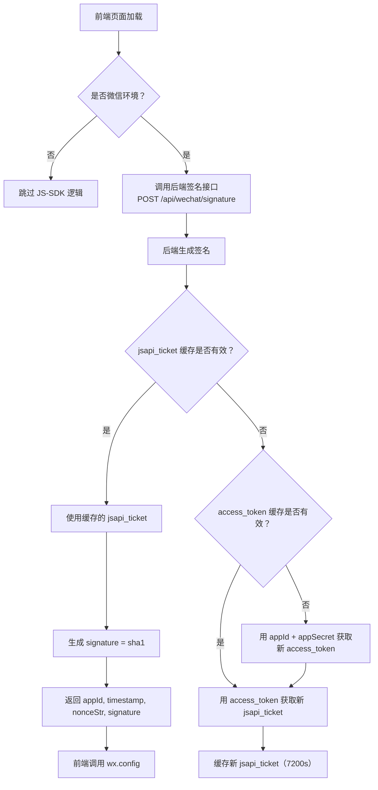

# 微信内卡片分享产品需求说明书

## 需求概览

实现会议系统各页面在微信内置浏览器中的**卡片式分享**（替代当前纯 URL 文本分享）。用户通过微信内置浏览器打开会议系统的任意页面后，点击右上角"..."菜单选择"分享给朋友"或"分享到朋友圈"，展示包含标题、描述、缩略图的分享卡片，而非仅暴露一个裸链接 URL。

---

## 第1章：概述

### 1.1 术语表

| 名称 | 详细描述 |
|------|----------|
| 微信 JS-SDK | 微信公众号提供的 JavaScript 接口，网页在微信内置浏览器中加载后可通过 JS-SDK 调用微信原生能力（分享、扫码、支付等） |
| wx.config | JS-SDK 的权限注入方法，需传入 appId、timestamp、nonceStr、signature 参数完成鉴权 |
| jsapi_ticket | 用于生成 wx.config 签名的临时票据，有效期 7200 秒，需要通过 access_token 获取 |
| access_token | 微信公众号全局唯一接口调用凭据，有效期 7200 秒，通过 appId + appSecret 获取 |
| 签名服务 | 会议系统后端提供的接口，接收前端传入的当前页面 URL，返回 wx.config 所需的 appId、timestamp、nonceStr、signature |
| 分享卡片 | 微信对话/朋友圈中展示的分享预览卡片，包含标题、描述（朋友分享）、缩略图；分享到朋友圈时不展示描述字段 |
| 公众号 JS 接口安全域名 | 在微信公众号后台配置的域名白名单，只有在此列表中的域名才能通过 JS-SDK 调用微信接口 |
| 缩略图上传至微信服务器 | 将会议海报/背景图缩略图通过微信临时素材接口上传至微信服务器，获取 `media_id`，用于分享卡片展示 |

### 1.2 修订记录

| 版本号 | 内容 | 负责人 | 更新时间 |
|------|------|------|------|
| V1.0 | 首版，微信内卡片分享 + 缩略图生成与上传 | — | 2026-06-22 |

### 1.3 背景和价值

- **背景问题**：当前会议系统的页面在微信内置浏览器中分享时，仅以纯 URL 文本形式出现在对话/朋友圈中。对比其他在微信生态内优化过的产品（如 B 站、公众号文章）的卡片式分享，裸链接形式缺少视觉冲击力和信息辨识度，降低了好友点击意愿和传播效果。
- **业务价值**：提升微信生态内会议的自然传播效率，增加会议曝光和报名转化；卡片分享是微信生态内的基础体验预期，缺失会降低产品专业感。
- **用户价值**：分享者在对话/朋友圈中展示更醒目、更丰富的会议信息；接收者无需点开链接即可通过卡片标题和缩略图快速判断是否感兴趣。

### 1.4 影响范围

| 端 | 影响 |
|----|------|
| 前端（微信环境） | 新增 wx.config 注入逻辑 + 各页面分享卡片配置（标题/描述/缩略图） |
| 后端 | 新增签名服务（access_token 管理 + jsapi_ticket 缓存 + 签名生成接口）；新增缩略图生成与微信上传管线 |
| 基础设施 | 需配置公众号 JS 接口安全域名；需存储 access_token / jsapi_ticket / 微信 media_id |
| 非微信环境 | 无影响——仅在 `navigator.userAgent` 检测到微信客户端时执行 JS-SDK 逻辑 |

### 1.5 前置依赖（阻塞项）

| 序号 | 依赖项 | 状态 | 说明 |
|------|--------|------|------|
| 1 | CSDN 已认证微信公众号的 **appId** 和 **appSecret** | **待与甲方确认** | 整个功能的前置条件。若无可用公众号，需甲方先完成公众号注册与认证（服务号或已认证订阅号） |
| 2 | 公众号后台配置"JS 接口安全域名"为会议系统的域名 | **待甲方操作** | 需甲方公众号管理员在后台"公众号设置 → 功能设置"中配置 |
| 3 | 签名服务的部署方式（我方独立维护 vs 甲方提供接口） | **待与甲方确认** | 见 5.1 开放问题 #2 |

---

## 第2章：功能需求

### 2.1 模块划分

| 模块 | 编号 | 简述 |
|------|------|------|
| 后端签名服务 | WX-01 | 管理 access_token 与 jsapi_ticket，为前端提供 wx.config 签名 |
| 缩略图生成与上传 | WX-02 | 从会议原始图片等比缩放生成缩略图（宽 300px，高按比例），并上传至微信临时素材库 |
| 前端 JS-SDK 集成 | WX-03 | 在微信环境中注入 wx.config，配置各页面分享卡片内容 |

---

### 2.2 后端签名服务（WX-01）

#### 场景描述

前端页面在微信内置浏览器中加载时，需调用后端签名接口获取 wx.config 所需参数。签名服务负责管理 access_token 的获取与刷新、jsapi_ticket 的获取与缓存，并为每个请求的 URL 生成合法签名。

#### 用户故事

| 编号 | 用户故事 |
|------|----------|
| US-WX-01 | 作为前端页面，我需要在加载时获取 wx.config 的签名参数，以便成功注入微信 JS-SDK 权限 |

#### 需求规格

**2.2.1 签名服务架构**



**2.2.2 签名接口定义**

| 项目 | 内容 |
|------|------|
| 接口路径 | `POST /api/wechat/signature` |
| 请求参数 | `{ "url": "当前页面完整 URL（不含 hash）" }` |
| 返回数据 | `{ "appId": "...", "timestamp": "...", "nonceStr": "...", "signature": "..." }` |
| 签名算法 | `sha1(jsapi_ticket={ticket}&noncestr={nonceStr}&timestamp={timestamp}&url={url})` |

**2.2.3 Token 管理**

| 规则项 | 内容 |
|--------|------|
| access_token 存储 | Redis 或数据库缓存，TTL = 7000s（提前 200s 过期，留缓冲防并发边界） |
| jsapi_ticket 存储 | 同上，TTL = 7000s |
| 刷新策略 | 缓存过期后自动重新获取，不依赖定时任务（懒加载 + 缓存） |
| 并发控制 | 多实例部署时，建议使用分布式锁防止多个实例同时刷新（各实例共享同一 Redis） |
| 中控服务（可选） | 若系统架构不止一个后端服务调用微信 API，建议将 token 管理抽取为独立中控服务 |

**2.2.4 安全与日志**

| 规则项 | 内容 |
|--------|------|
| appSecret 存储 | 不得以明文写入前端代码或日志；建议使用环境变量或密钥管理服务 |
| 签名日志 | 记录每次签名请求的 URL 和签名结果（用于调试，不记录 appSecret） |
| 错误监控 | access_token 或 jsapi_ticket 获取失败时触发告警 |

#### 验收标准

- [ ] AC-WX-01：前端传入页面 URL，后端返回正确的 appId、timestamp、nonceStr、signature
- [ ] AC-WX-02：access_token 和 jsapi_ticket 缓存命中时直接使用，不重复请求微信 API
- [ ] AC-WX-03：access_token 或 jsapi_ticket 缓存过期后自动刷新
- [ ] AC-WX-04：签名接口响应时间 < 200ms（缓存命中时）

---

### 2.3 缩略图生成与上传（WX-02）

#### 场景描述

微信分享卡片需展示缩略图。目前会议系统允许上传最大 10MB 的原始图片（推荐尺寸 1920×420），需按相同比例生成缩略图并上传至微信服务器获取 `media_id` 供分享卡片使用。

#### 用户故事

| 编号 | 用户故事 |
|------|----------|
| US-WX-02 | 作为系统，我希望在会议发布时自动生成缩略图并上传至微信服务器，以便分享卡片能够正常展示缩略图 |

#### 需求规格

**2.3.1 缩略图生成**

| 规则项 | 内容 |
|--------|------|
| 生成时机 | 会议发布时异步生成（上传海报/背景图后触发）；会议编辑更换海报/背景图时重新生成 |
| 源图选取 | 优先使用会议官网背景图（英雄区图片）；无背景图时使用会议海报；无海报时使用平台默认图 |
| 输出规格 | 横向宽度固定 **300px**，高度按源图宽高比等比缩放（与会议系统推荐背景图 1920×420 的比例保持一致），JPEG 格式，质量 85%。例如：1920×420 的源图 → 300×66；1920×1080 的源图 → 300×169 |
| 缩放策略 | 等比缩放（保持原始宽高比，不做裁切）。将源图缩放至宽度 300px，高度按 `300 ÷ (源图宽/源图高)` 计算取整 |
| 存储位置 | 与原图存储在相同服务器；文件路径纳入 `meeting.thumbnail_url` 字段 |
| 性能 | 异步队列处理（避免发布时阻塞）；建议使用 image processing 库（如 sharp / Pillow） |

**2.3.2 缩略图上传至微信服务器**

上传流程：

```
会议发布 → 缩略图生成完成
  ↓
后端获取 access_token
  ↓
调用微信临时素材上传接口：
  POST https://api.weixin.qq.com/cgi-bin/media/upload?access_token={TOKEN}&type=image
  Content-Type: multipart/form-data
  ← 返回 { "media_id": "xxxxx" }
  ↓
存储 media_id → meeting.wechat_media_id
  ↓
前端分享卡片配置中使用该 media_id 对应的缩略图
```

| 规则项 | 内容 |
|--------|------|
| 上传接口 | `POST https://api.weixin.qq.com/cgi-bin/media/upload?access_token={access_token}&type=image` |
| 上传内容 | 缩略图文件（multipart/form-data） |
| 返回字段 | `media_id`（微信临时素材 ID） |
| media_id 有效期 | **3 天**（微信临时素材规则）。依赖此 media_id 的分享卡片需在生成后 3 天内完成传播；3 天后分享卡片缩略图可能失效 |
| media_id 刷新策略 | 定时任务：每天凌晨扫描 `meeting.wechat_media_id` 不为空且会议未结束的记录，重新上传缩略图并更新 media_id，确保正在传播中的会议分享卡片缩略图不失效 |
| 上传失败处理 | 记录错误日志；不阻塞会议发布（降级：分享卡片不展示缩略图，仅展示标题和描述） |

**2.3.3 缩略图使用优先级**

分享卡片配置时，缩略图选取优先级：

| 优先级 | 来源 | 说明 |
|--------|------|------|
| 1 | `wechat_media_id` | 上传至微信服务器的缩略图 media_id，通过 JS-SDK `imgUrl` 参数引用 |
| 2 | `thumbnail_url` | 会议服务器上的缩略图 HTTP 地址（当 media_id 失效或未上传时降级使用） |
| 3 | 平台默认图 | 既无 media_id 也无 thumbnail_url 时使用会议平台的默认分享图 |

#### 验收标准

- [ ] AC-WX-05：会议发布后，系统自动按源图等比缩放生成缩略图（宽 300px，高按比例计算）
- [ ] AC-WX-06：缩略图成功上传至微信服务器并返回 media_id
- [ ] AC-WX-07：上传失败不阻塞会议发布，日志记录错误信息
- [ ] AC-WX-08：每日定时任务刷新进行中会议的 media_id，防止 3 天过期

---

### 2.4 前端 JS-SDK 集成（WX-03）

#### 场景描述

用户通过微信内置浏览器访问会议系统页面（会议详情页 / 会议列表页 / 快速创建的海报官网），点击右上角分享按钮时，展示带有标题、描述和缩略图的分享卡片。

#### 用户故事

| 编号 | 用户故事 |
|------|----------|
| US-WX-03 | 作为用户在微信内打开会议详情页，我希望分享给朋友时展示带有会议名称和缩略图的卡片，以便好友一眼了解会议信息 |
| US-WX-04 | 作为用户在微信内打开会议列表页，我希望分享到朋友圈时展示带有平台名称和缩略图的卡片，以便传播平台品牌 |
| US-WX-05 | 作为用户在微信内打开快速创建的海报官网，我希望分享时展示会议主题卡片，以便更有吸引力地传播 |

#### 需求规格

**2.4.1 环境检测**

| 规则项 | 内容 |
|--------|------|
| 检测方式 | 前端通过 `navigator.userAgent` 检测是否包含 `MicroMessenger` |
| 非微信环境 | 跳过所有 wx.config 和分享配置逻辑，不引入 JS-SDK 脚本 |
| 浏览器兼容 | iOS 微信、Android 微信内置浏览器均需支持 |

**2.4.2 wx.config 注入**

```
// 页面加载完成后
1. 检测微信环境
2. 调用后端 /api/wechat/signature?url={encodeURIComponent(window.location.href)}
3. 使用返回参数调用：
   wx.config({
     debug: false,           // 生产环境关闭调试
     appId: res.appId,
     timestamp: res.timestamp,
     nonceStr: res.nonceStr,
     signature: res.signature,
     jsApiList: [
       'updateAppMessageShareData',  // 分享给朋友
       'updateTimelineShareData'     // 分享到朋友圈
     ]
   })
4. wx.ready() 回调中配置分享卡片内容
5. wx.error() 回调中记录错误日志
```

**2.4.3 各场景分享卡片内容**

微信分享有两个 API，统一使用同一套数据：

| 页面 | 标题 | 描述（仅朋友分享展示） | 缩略图 |
|------|------|----------------------|--------|
| **会议详情页** | `{会议名称}` | `{会议副标题}` + `{已选城市站、时间}，`如"北京站 · 2026-07-15 09:00" | 该会议的缩略图 media_id 地址 |
| **会议列表页** | "CSDN 技术会议" | "发现精彩技术会议" | 平台默认分享图 |
| **海报官网**（快速创建） | `{会议名称}` | `{会议副标题}` | 办会人上传的官网背景图缩略图 |

> **说明**：
> - 分享到朋友圈时，微信仅展示标题和缩略图，**不展示描述**字段
> - 标题长度建议 ≤ 30 字，超出部分可能被截断
> - 统一使用同一套内容，不针对"朋友"和"朋友圈"做差异化配置

**2.4.4 缩略图 URL 处理**

| 场景 | 缩略图 URL 构造方式 |
|------|-------------------|
| 会议详情页 / 海报官网 | 优先使用 `meeting.wechat_media_id` 对应的微信服务器地址；降级使用 `meeting.thumbnail_url`（自有服务器 HTTPS 地址） |
| 列表页 / 无会议上下文 | 使用平台默认分享图（自有服务器 HTTPS 地址） |

**2.4.5 异常处理**

| 场景 | 行为 |
|------|------|
| wx.config 签名失败（wx.error） | 记录错误日志；分享时降级为默认微信分享行为（裸 URL），不阻断页面正常使用 |
| 签名接口调用超时（>3s） | 跳过 wx.config 注入，降级为默认分享 |
| 缩略图 URL 不可访问 | 微信端分享卡片不展示缩略图（仅展示标题和描述），不影响分享功能本身 |
| 用户快速反复分享 | 无额外处理，每次分享行为由微信客户端独立触发 |

#### 验收标准

- [ ] AC-WX-09：微信环境内打开会议详情页，分享给朋友时展示含会议名称、描述、缩略图的卡片
- [ ] AC-WX-10：微信环境内打开会议详情页，分享到朋友圈时展示含会议名称、缩略图的卡片（无描述）
- [ ] AC-WX-11：微信环境内打开会议列表页，分享卡片标题为"CSDN 技术会议"，描述为"发现精彩技术会议"
- [ ] AC-WX-12：微信环境内打开海报官网，分享卡片含会议名称和背景图缩略图
- [ ] AC-WX-13：非微信环境下不加载 JS-SDK，不影响页面正常功能
- [ ] AC-WX-14：wx.config 签名失败或超时时，降级为微信默认分享行为，不阻断页面使用

---

## 第3章：Non-Goals（本期不包含）

| 序号 | 不包含内容 | 说明 |
|------|-----------|------|
| 1 | 微信开放标签（如 `<wx-open-launch-app>` 跳转 App） | 本期仅做分享卡片，不涉及开放标签能力 |
| 2 | 微信内支付（JSAPI 支付） | 售票支付走支付宝，本期不接入微信支付 |
| 3 | 小程序内分享卡片 | 本期仅适配微信内置浏览器中的网页分享，不含小程序场景 |
| 4 | 分享卡片的 A/B 测试（不同标题/缩略图的点击率对比） | 首版统一配置即可 |
| 5 | 分享卡片的自定义封面（如带二维码的合成图） | 使用会议海报/背景图缩略图即可，不做额外合成 |
| 6 | QQ、微博等其他社交平台的卡片分享优化 | 本期仅适配微信 |

---

## 第4章：成功指标

| 指标 | 类型 | 目标值 | 衡量方式 |
|------|------|--------|----------|
| 微信内分享卡片展示成功率 | 领先 | ≥95%（卡片正常展示 / 微信内分享总次数） | wx.ready 回调埋点 vs wx.error 回调埋点 |
| 签名接口可用率 | 领先 | ≥99.9% | 后端签名接口监控 |
| 缩略图上传成功率 | 领先 | ≥98% | 文件上传成功数 / 会议发布数 |
| 微信渠道报名转化率 | 滞后 | 上线 60 天后，微信渠道报名占比提升 ≥5% | 对比上线前后报名来源渠道（微信内）占比 |

---

## 第5章：开放问题

| 序号 | 问题 | 状态 | 阻塞程度 |
|------|------|------|----------|
| 1 | CSDN 微信公众号是否已认证？能否提供 **appId 和 appSecret** 用于会议系统集成？ | **待与甲方确认** | **阻塞：无公众号则整个功能无法启动** |
| 2 | 签名服务的部署方式：甲方提供签名接口（我方调用）还是我方独立维护签名服务（甲方给 appId + appSecret）？ | **待与甲方确认** | **阻塞：影响后端架构设计** |
| 3 | 微信公众号后台"JS 接口安全域名"需添加会议系统的域名（测试 + 生产），由谁操作？ | 建议由甲方公众号管理员操作 | 非阻塞（可开发末期配置） |
| 4 | 平台默认分享图（会议列表页等无具体会议上下文的场景）由谁提供？ | 建议使用 CSDN 或会议平台 Logo | 非阻塞 |
| 5 | 微信临时素材 media_id 3 天有效期：定时任务每天刷新是否足够？频率是否需要调整？ | 建议每天凌晨 | 非阻塞 |

---

## 第6章：实现方案概要

### 6.1 技术栈

| 层 | 技术 | 说明 |
|----|------|------|
| 前端 JS-SDK | 微信 JS-SDK 1.6.0（`jweixin-1.6.0.js`） | 从微信官方 CDN 引入 |
| 后端签名 | Node.js / Python / Java（与现有后端技术栈一致） | 新增 `/api/wechat/signature` 接口 |
| Token 缓存 | Redis | 存储 access_token、jsapi_ticket |
| 缩略图生成 | sharp（Node.js）/ Pillow（Python） | 等比缩放（宽 300px，高按源图比例计算） |
| 微信 API 调用 | 后端 HTTP Client | 调用微信服务端 API |

### 6.2 开发与部署流程

```
Phase 1: 前置确认
  → 与甲方确认公众号 appId / appSecret 可用性
  → 确认签名服务部署方式
  → 确认 JS 接口安全域名配置负责人

Phase 2: 后端开发
  → 签名服务（access_token 管理 + jsapi_ticket 缓存 + 签名接口）
  → 缩略图生成管线（异步队列 + sharp/Pillow）
  → 微信素材上传管线（upload media + media_id 刷新定时任务）

Phase 3: 前端开发
  → 微信环境检测 + JS-SDK 引入
  → wx.config 注入逻辑（调用签名接口 + wx.ready 配置分享卡片）
  → 各页面分享卡片内容映射（详情页 / 列表页 / 海报官网）
  → 非微信环境兼容（跳过 JS-SDK 逻辑）

Phase 4: 联调与测试
  → 测试环境配置 JS 接口安全域名
  → 微信内置浏览器真机测试（iOS + Android）
  → 缩略图上传与 media_id 刷新测试
  → 签名失败降级测试
```

### 6.3 关键限制

| 限制项 | 说明 |
|--------|------|
| JS-SDK 仅在微信内置浏览器中生效 | 非微信环境（如系统浏览器、其他 App WebView）不触发 |
| access_token 每日调用上限 2000 次 | 通过缓存将实际请求降至每天 1~2 次（缓存 7000s），远低于上限 |
| 分享卡片缩略图宽 300px，高度按源图比例等比缩放 | 非强制；微信会对过大图片进行压缩处理 |
| 微信临时素材 3 天过期 | 通过定时任务每天凌晨刷新进行中会议的 media_id |

---

## 第7章：风险与依赖

| 风险 | 影响 | 缓解措施 |
|------|------|----------|
| 甲方公众号 appId/appSecret 不可用 | 整个功能无法实现 | 优先阻断项，开发前必须确认 |
| JS 接口安全域名配置未及时完成 | 测试环境无法验证分享卡片效果 | 提前确认甲方操作时间和流程 |
| 微信 JS-SDK 版本更新导致 API 不兼容 | 现有分享配置失效 | 锁定 JS-SDK 版本 1.6.0（CDN 固定版本号），非必要时不升级 |
| access_token 被其他业务挤占（如甲方同一公众号下有其他系统也在刷新 token） | 会议系统的 token 频繁失效 | 建议使用中控服务统一管理 token；或与甲方确认是否有其他业务共用 |

---

*文档编制日期：2026-06-22*
