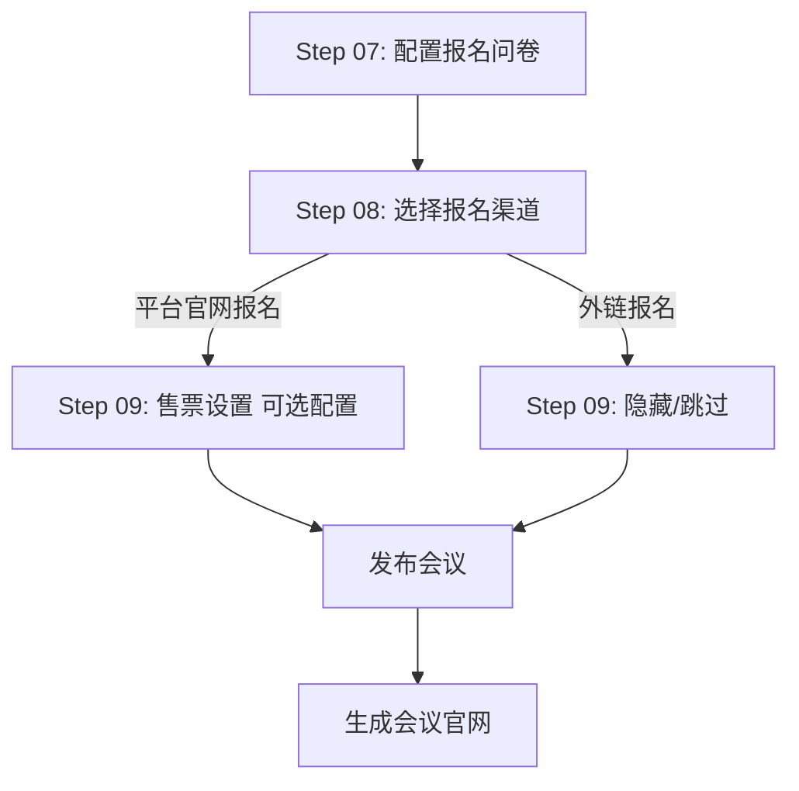
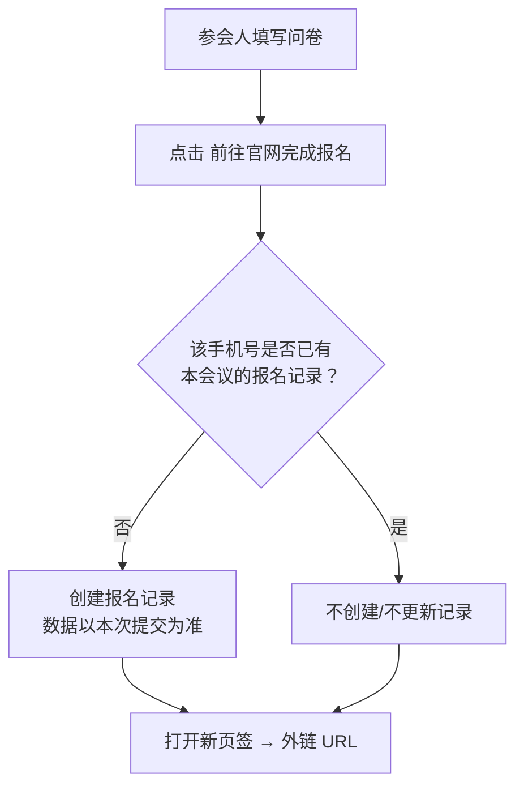

# 报名渠道配置产品需求说明书

## 需求概览

在快速创建会议流程中新增"报名渠道"配置步骤（Step 08）。办会人可选择**平台官网报名**（保持现有模式）或**外链报名**（参会人填写问卷后跳转到外链页面完成报名）。两种模式互斥——选择外链报名时，售票设置（Step 09）自动隐藏。外链报名场景下，参会人在会议系统内填写的问卷数据同样记录到后台，支持办会人查看、审核及运营端导出。

---

## 第1章：概述

### 1.1 术语表

| 名称 | 详细描述 |
|------|----------|
| 平台官网报名 | 使用会议系统生成的官网页面收集报名，参会人填写问卷后直接提交至平台后台，零接入成本 |
| 外链报名 | 办会人提供一个外部 URL，参会人填写问卷后点击按钮在新页签中打开该外链页面，在该页面中完成报名 |
| 外链 URL | 办会人配置的目标第三方页面地址，应在新的浏览器页签中打开 |
| 报名渠道 | 参会人从哪里完成报名的载体选择，与"社交媒体渠道码"（分享渠道）是不同的概念 |

### 1.2 修订记录

| 版本号 | 内容 | 负责人 | 更新时间 | 备注 |
|------|------|------|------|------|
| V1.0 | 首版，基于 AI 原型定义报名渠道需求 | — | 2026-06-16 | 首版 |
| V1.1 | 新增 2.1.5 重复提交与去重规则；修正外链报名的审核状态（支持手动标记）；补充验收标准 AC-CH-12~15 | — | 2026-06-17 | — |

### 1.3 背景和价值

- **背景问题**：当前快速创建会议只有一种报名方式——使用平台生成的官网页面。部分办会人已有自己的报名系统（如企业内部 OA、第三方活动平台），希望在会议系统内展示会议信息并收集基础数据，但实际报名流程导向自己的系统。
- **业务价值**：降低办会人迁移成本，不强制绑定平台报名流程；同时确保会议系统沉淀参会人填写的基础问卷数据，不因外链而丢失信息。
- **用户价值**：办会人可灵活选择报名载体；参会人在同一页面完成问卷填写后无缝跳转，不需要在两个系统重复填写信息。

### 1.4 与现有功能的区别

| 概念 | 说明 |
|------|------|
| **报名渠道**（本需求） | 参会人在**哪里**完成报名：平台页面 vs 外链页面。决定报名行为的落地载体。 |
| **社交媒体渠道码**（已有） | 办会人在**哪些社交平台**分享会议链接（小红书/抖音/B站等）。用于追踪报名来源。 |

两者无直接关联，互不影响。

---

## 第2章：功能需求

### 2.1 报名渠道选择（CHANNEL-01）

#### 场景描述

办会人完成报名问卷配置（Step 07）后，进入 Step 08「报名渠道」配置。系统提供两个互斥选项："平台官网报名"（默认选中）和"外链报名"。选择不同选项后，后续步骤（主要是 Step 09 售票设置）和报名页面的按钮行为不同。

#### 用户故事

| 编号 | 用户故事 |
|------|----------|
| US-CH-01 | 作为办会人，我希望选择"平台官网报名"时，保持现有的参会人填写问卷、提交报名、办会人审核的完整模式，以便无需额外配置 |
| US-CH-02 | 作为办会人，我希望选择"外链报名"时，配置一个外链 URL，参会人填写问卷后跳转到该外链页面完成最终报名，以便对接我已有的报名系统 |
| US-CH-03 | 作为参会人，我在外链报名场景下填写完所有必填问卷字段后，【前往官网完成报名】按钮变为可点击状态，点击后在新页签打开外链页面，以便我的填写不被中断 |
| US-CH-04 | 作为办会人，我希望外链报名场景下，参会人在本系统问卷中填写的数据同样被记录到后台，支持我在审核页查看、在运营端导出，以便不丢失数据 |

#### 需求规格

**2.1.1 配置端**

| 规则项 | 内容 |
|--------|------|
| 配置位置 | 快速创建会议流程 Step 08（报名问卷配置之后） |
| 选项 | "平台官网报名"（默认选中）/ "外链报名"，单选，不可同时勾选 |
| 外链 URL 输入 | 选择"外链报名"后，展示外链 URL 输入框，必填；需校验 URL 格式（http:// 或 https:// 开头） |
| 与售票的关系 | 选择"外链报名"时，Step 09 售票设置**隐藏**，流程直接跳至确认创建（Step 10）；选择"平台官网报名"时，Step 09 正常展示 |
| 默认值 | 未配置时，默认"平台官网报名" |

**2.1.2 参会端（平台官网报名）**

与现有报名流程完全一致，无变化。

**2.1.3 参会端（外链报名）**

| 规则项 | 内容 |
|--------|------|
| 问卷展示 | 复用已有的报名问卷配置能力（含条件分支下钻），所有字段按办会人配置渲染 |
| 按钮文案 | **【前往官网完成报名】** （非【立即报名】） |
| 按钮状态 | 所有必填项未填写完成时，按钮置灰禁用；必填项全部填写完成后，按钮变为可点击 |
| 点击按钮 | 将参会人已填写的问卷数据提交后台记录，同时在新浏览器页签中打开办会人配置的外链 URL |
| 按钮下方提示 | 建议展示文案："填写信息后，点击按钮前往活动官网完成正式报名" |
| 页面行为 | 点击按钮后，当前会议系统页面不跳转、不关闭；外链页面在新页签打开 |
| 多次点击 | 按钮始终可用；点击后均在新页签打开外链 URL。数据记录的去重规则见 2.1.5 节（首次提交记录入仓，同手机号后续点击不重复写入、不覆盖已有记录） |

**2.1.4 后台数据记录**

| 规则项 | 内容 |
|--------|------|
| 记录时机 | 参会人使用某手机号**首次**点击【前往官网完成报名】时，将本次问卷数据写入后台。同手机号后续点击不重复写入，不覆盖已有记录（详见 2.1.5 节） |
| 记录内容 | 参会人填写的完整问卷字段及值（JSON 格式，含时间戳）；**以首次提交时的数据为准，后续不更新** |
| 后端能力 | 支持办会人在审核页查看该条报名记录的问卷数据；支持运营端在数据导出中导出该条记录 |
| 外链数据回流 | **不要求**外链页面数据回流传入；会议系统仅负责保存本系统问卷中收集的数据 |
| 报名状态 | 记录生成后状态为"已报名"。办会人可在后台查看并执行审核操作（通过/拒绝），审核模块功能与平台报名保持一致。**注**：外链场景下，参会人实际报名结果以外部页面为准，会议系统内的审核操作不影响外链页面的报名状态，此处审核仅作为数据管理手段 |

**2.1.5 重复提交与去重规则**

外链报名场景下，同一个参会人可能多次打开会议页面、填写不同的问卷内容、点击按钮。系统按以下规则处理：

| 规则项 | 内容 |
|--------|------|
| 去重依据 | 以参会人填写的**手机号**为唯一校验键（与平台报名逻辑一致） |
| 首次提交 | 参会人使用手机号 X 填写问卷并点击按钮 → 系统以本次填写数据为准创建一条报名记录，状态为"已报名" |
| 同手机号重复提交 | 同一会议下，手机号 X 已存在记录后，再次以手机号 X 填写（即使其他字段不同）并点击按钮 → **不创建新记录、不覆盖已有记录**；按钮仍然响应，在新页签打开外链 URL，但后台数据不变 |
| 不同手机号提交 | 手机号 X 已有记录，参会人改用手机号 Y 填写 → 为手机号 Y 创建一条**新的**报名记录（按现有业务逻辑关联手机号 Y 对应的账号） |
| 首次提交为准 | 系统以首次提交时的问卷数据为最终记录，不做替换或合并 |
| 参会人端反馈 | 同手机号重复点击时，按钮行为与首次一致（打开外链），不额外弹窗阻断。如需提示，建议为轻提示（toast）："您已提交过报名信息" |

**判断流程**：

**与平台报名的对比**：

| 维度 | 平台官网报名 | 外链报名 |
|------|-------------|----------|
| 重复报名校验 | 手机号已报名 → 提示"无需重复报名"，**不可再次提交** | 手机号已报名 → 按钮仍可用、外链仍可打开，**但不重复记录** |
| 数据覆盖 | 不可提交，无覆盖问题 | 首次提交为准，后续不覆盖 |
| 不同手机号 | 视为不同参会人，可分别报名 | 同平台逻辑，为不同手机号分别创建记录 |

#### 验收标准

- [ ] AC-CH-01：办会人在快速创建会议 Step 08 看到两个互斥选项："平台官网报名"（默认选中）、"外链报名"
- [ ] AC-CH-02：选择"外链报名"后，外链 URL 输入框出现，URL 为空或格式不合法时不可提交会议
- [ ] AC-CH-03：选择"外链报名"后，Step 09 售票设置不展示，创建流程直接跳至 Step 10
- [ ] AC-CH-04：选择"平台官网报名"后，Step 09 售票设置正常展示
- [ ] AC-CH-05：外链报名的会议官网，按钮文案为【前往官网完成报名】而非【立即报名】
- [ ] AC-CH-06：必填问卷字段未填写完毕时，【前往官网完成报名】按钮置灰不可点击
- [ ] AC-CH-07：必填问卷字段全部填写完成后，按钮变为可点击
- [ ] AC-CH-08：点击按钮后，问卷数据被记录到后台，同时新页签打开外链 URL
- [ ] AC-CH-09：办会人在审核页可查看外链报名记录的问卷数据
- [ ] AC-CH-10：运营端可在数据导出中包含外链报名记录的问卷数据
- [ ] AC-CH-11：外链 URL 输入框校验：仅接受 http:// 或 https:// 开头的合法 URL
- [ ] AC-CH-12：同一手机号首次点击按钮后，后台创建一条报名记录，数据以本次提交为准
- [ ] AC-CH-13：同一手机号再次（填写不同信息）点击按钮，不创建新记录、不覆盖已有记录，按钮仍可打开外链
- [ ] AC-CH-14：不同手机号点击按钮，为对应手机号分别创建独立的报名记录
- [ ] AC-CH-15：外链报名记录生成后状态为"已报名"，审核模块可用（通过/拒绝），但审核结果不影响外部页面的实际报名状态

---

## 第3章：Non-Goals（本期不包含）

| 序号 | 不包含内容 | 说明 |
|------|-----------|------|
| 1 | 外链页面数据回流传入 | 外链页面可能是任意第三方系统，无法无限适配；会议系统仅负责记录本系统问卷中收集的数据 |
| 2 | 外链报名的审核结果与外部页面联动 | 审核模块功能保持完整，但审核结果不回传至外部页面，也无法影响外链页面的实际报名状态 |
| 3 | 外链页面的 iframe 内嵌 | 外链页面始终在新页签打开，不嵌入会议系统页面 |
| 4 | 外链报名与售票并存 | 两者互斥，选择外链报名后售票设置隐藏 |
| 5 | 外链点击次数统计 | 首版不追踪外链页面的后续行为（注册/支付完成等），仅记录问卷提交行为 |

---

## 第4章：成功指标

| 指标 | 类型 | 目标值 | 衡量方式 |
|------|------|--------|----------|
| 外链报名使用率 | 领先 | 上线 30 天内，≥10% 的新建会议选择外链报名 | 统计选择外链报名的会议占比 |
| 外链问卷提交率 | 领先 | 问卷必填完成 + 按钮点击 / 页面访问 ≥60% | 埋点统计外链报名页的问卷完成与按钮点击 |
| 平台报名满意度 | 滞后 | 不因新增外链选项而产生混淆（平台报名转化率不下降） | 对比上线前后平台报名转化率 |

---

## 第5章：开放问题

| 序号 | 问题 | 状态 |
|------|------|------|
| 1 | 外链报名时，【前往官网完成报名】按钮下方是否需要提示文案？文案建议内容？ | 待讨论 |
| 2 | 外链报名记录在后台是否需要标记"外链"标识以区别于平台报名记录？ | 建议增加标识，待确认 |
| 3 | 办会人多次修改外链 URL 后，已生成的分享链接是否需要同步更新？ | 待技术评估 |
