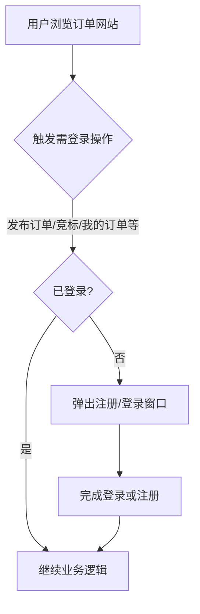
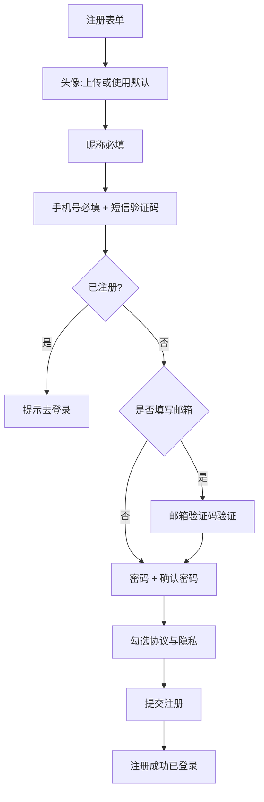
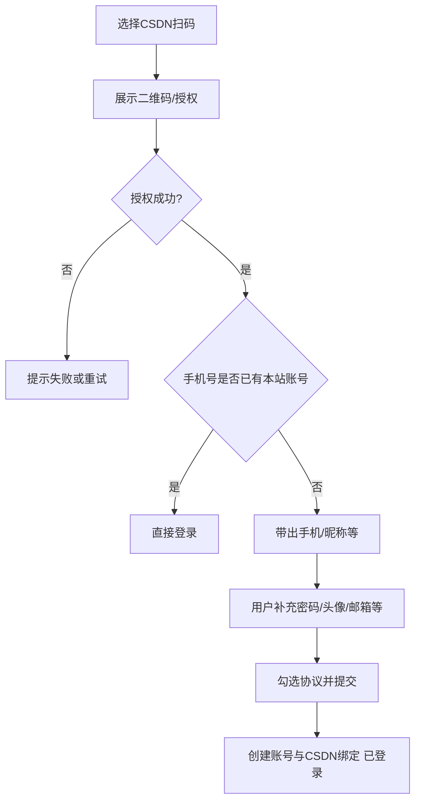
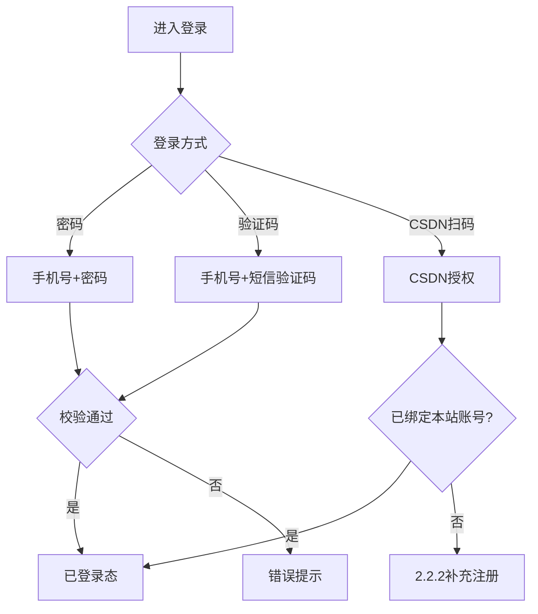
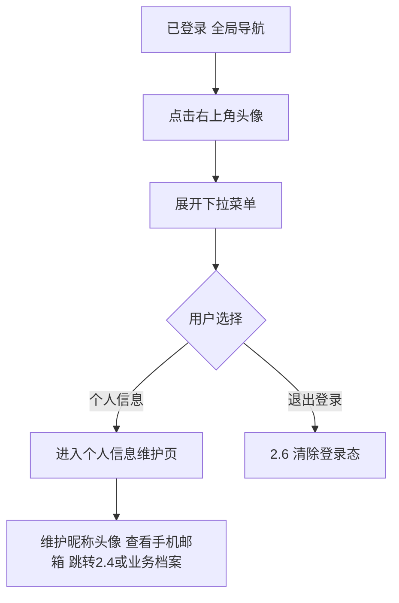
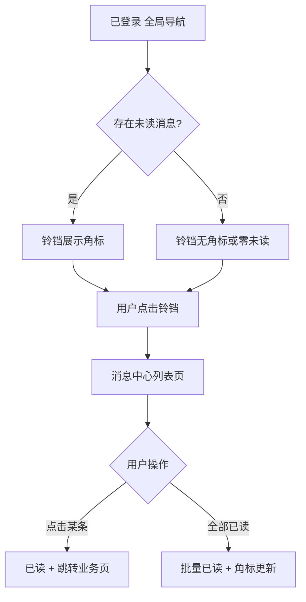
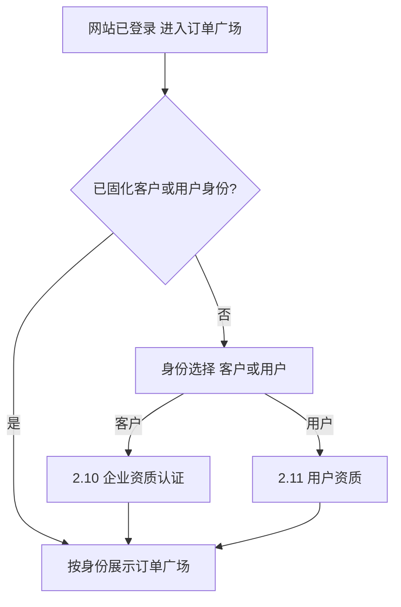

# 订单系统独立用户体系产品需求说明书

## 需求概览

订单管理系统以**独立部署网站**为载体，需要**自有的、可运营的账号体系**，而不是复用 CSDN 站内统一登录态。用户可先浏览公开能力，在**发布订单、报名/竞标、进入我的订单/账单**等关键动作时再完成**注册或登录**；我们提供与会议独立站同构的**表单注册**（含手机号短信验证、邮箱可选绑定与邮件验证、密码与协议同意）以及 **CSDN App 扫码**：未注册用户扫码授权后可**快速创建本站账号并建立与 CSDN 账户的绑定**，已注册用户可**扫码直接登录**。登录后，同一网站账号在业务侧**仅允许一种身份——客户（发单）或用户（接单）二选一**，完成对应资质后固定，与《CSDN订单管理系统整体方案》单一身份口径一致。**运营端人员**不经过客户/用户身份选择与资质流程，而是通过**单独的运营账号注册页面**或由运维人员**调用运维接口创建账号**获得后台访问能力。在此基础上提供**消息中心**：客户可及时看到**谁报名了我发布的订单**等发单方动态，用户可看到**某订单待我提交里程碑交付物**等接单方待办，减少漏办与反复打开订单列表的焦虑。

**核心变革**可概括为：一是**账号层独立**，注册、登录、手机/邮箱绑定、扫码建号与绑定均在订单网站内闭环；二是**与 CSDN 主站衔接**，用 **CSDN App 扫码**降低已有 CSDN 用户的建号与登录成本；三是**业务身份与账号凭证解耦分层**，账号级安全与资料在一处管理，**客户/用户身份**在首次进入订单广场时二选一并走各自资质；四是**运营账号与客户/用户前台隔离**，避免角色混用；五是**站内消息可感知**，全局导航**消息入口 + 消息中心列表**按角色投递业务事件，并可跳转至对应订单/里程碑页面。

**设计思路**：需登录场景采用**弹窗或等价浮层**完成注册/登录（与会议独立站一致的节奏），减少整页跳转流失；注册环节强制**同时同意《用户协议》与《隐私政策》**；扫码流程与会议侧 **CSDN App 扫码注册/登录**逻辑对齐，便于跨产品一致体验。身份选择仅在**网站已登录且尚未选定客户/用户身份**时出现，与订单广场统一入口及后续 PRD 中的发单/接单入口控制一致。**已登录**用户在**全局导航右上角**可看到**消息（铃铛）与头像**并列：消息中心聚合与本人相关的订单与资质类提醒；头像菜单进入**个人信息**或**退出登录**，与常见 Web 产品习惯一致。

**历史实现参考**：文档结构与注册/登录/扫码/验证码/协议等规则主要参考 `CSDN会议功能/docs/用户体系产品需求说明书.md` 的写法与颗粒度；其中**消息中心入口（铃铛 + 未读角标 + 列表页）**与会议文档 **2.7** 交互习惯对齐并适配订单业务消息类型。**订单广场首次进入身份选择、单一身份、客户企业资质与用户能力资质**与 `CSDN订单系统/docs/CSDN订单管理系统整体方案.md` 第 4 章「账号与身份」、第 6.1 节及本文档第 **2.9～2.11** 节保持一致。**运营端账号创建方式**以本需求用户明确提出的「单独注册页面或运维接口创建」为准，见本文 **2.8**；若与整体方案中「既有运营/管理员权限」表述并存，**以实现时以本文运营端章节为据**。

---

# 第1章：概述

## 1.1 术语表

| 术语 | 英文 | 描述 |
| :--- | :--- | :--- |
| **订单网站用户体系** | Order Site User System | 订单管理独立站内负责**账号注册登录**、**手机/邮箱绑定与验证**、**个人展示资料**、**与 CSDN 账户绑定关系**及**登录态会话**的一整套能力。 |
| **网站账号** | Site Account | 用户在订单网站内注册得到的账号实体，通过用户 ID 唯一标识；登录态基于网站账号，**不依赖 CSDN 站内登录态复用**。 |
| **注册** | Sign Up | 新用户通过**表单**或 **CSDN App 扫码**授权后补充资料，在订单网站内创建网站账号的过程；**须同时同意《用户协议》与《隐私政策》**，否则无法完成注册。 |
| **登录** | Sign In | 已为网站账号的用户通过凭证进入已登录状态的过程。 |
| **短信验证码** | SMS OTP | 下发至手机的一次性验证码，用于注册、登录（验证码方式）、换绑手机等场景。 |
| **邮箱验证码** | Email OTP | 下发至邮箱的一次性验证码，用于校验邮箱归属与绑定。 |
| **CSDN App 扫码注册/登录** | CSDN App QR Auth | 用户使用 CSDN App 扫描页面二维码（或按产品约定调起 App）完成授权；未注册则创建网站账号并补充必填项，已注册则直接登录；成功后建立或复用 **CSDN 账户与网站账号的绑定关系**（绑定标识以实现为准）。 |
| **客户** | Customer / Order Publisher | 完成**身份选择为客户**且**企业资质认证**通过后的网站账号业务身份；**仅可发单、不可接单**。 |
| **用户（接单方）** | Contractor / Order Taker | 完成**身份选择为用户**且**用户资质**维护达到业务要求后的网站账号业务身份；**仅可接单、不可发单**。 |
| **单一身份** | Single Role | 同一网站账号**仅能具备客户或用户业务身份之一**（资质完成后固定），不可同时具备发单与接单能力。 |
| **运营账号** | Operations Account | 平台运营/管理人员使用的后台账号；**不经过**订单广场「客户/用户」身份选择与资质认证流程；通过**运营端专用注册页面**或**运维接口创建**获得。 |
| **注册/登录弹窗** | Auth Modal | 用户未登录触发需登录操作时，在当前页面之上展示的注册或登录浮层。 |
| **登录态** | Session | 登录成功后，在一定时间内系统识别为「已登录」的状态。 |
| **全局导航用户头像区** | Global User Avatar Entry | 页面**右上角**展示当前用户头像（无头像时显示默认图）；**已登录**时点击头像展开**下拉菜单**。 |
| **头像下拉菜单** | Avatar Dropdown Menu | 从头像展开的操作菜单，本期包含 **【个人信息】**、**【退出登录】** 两项。 |
| **个人信息维护页** | Personal Profile Page | 用户通过下拉菜单中 **【个人信息】** 进入的页面，用于维护已填写的**账号级身份展示信息**及跳转维护**手机/邮箱**、**业务侧档案**等（与 **2.4**、**2.10**、**2.11** 能力衔接）。 |
| **消息中心** | Message Center | 登录用户查看**站内消息**的完整列表页；消息由订单、报名、里程碑、协议、资质审核等业务事件产生，按账号与**客户/用户身份**过滤可见范围。 |
| **消息通知入口（铃铛）** | Notifications Entry | 全局导航栏上的**消息图标**（建议铃铛）；有未读时展示**角标**；点击进入 **消息中心**。 |
| **站内消息** | In-App Message | 归属于某网站账号的一条通知记录，含类型、标题、摘要、时间、已读状态及跳转目标（如订单 ID、里程碑 ID 等逻辑关联，以实现为准）。 |

## 1.2 修订记录

| 版本 | 内容 | 负责人 | 更新时间 | 备注 |
| :--- | :--- | :--- | :--- | :--- |
| V1.0～V1.3 | 以「复用 CSDN 账号登录、订单广场无需单独注册」为主线的历史版本 | — | 2025-03～2025-03 | 见修订记录旧表；已被 V2.0 替代 |
| V2.0 | **独立网站账号体系**；表单注册与手机/邮箱绑定；**CSDN App 扫码**快速建号与登录及 CSDN 绑定；登录后**客户/用户二选一**单一身份及资质流程；**运营账号**单独注册页或运维接口创建 | 待定 | 2026-04-11 | 对齐《CSDN订单管理系统整体方案》2.5 及会议《用户体系产品需求说明书》结构；**不再**将「CSDN 直登即入订单广场」作为账号层方案 |
| V2.1 | **客户企业资质认证**：补充常规认证材料清单（除营业执照外的必备/选填影像件与表单字段）及**人工审核规则**、通过与拒绝后的系统行为 | 待定 | 2026-04-11 | 落实整体方案「认证材料清单、审核规则在需求文档中细化」 |
| V2.2 | **第一期简化**：客户认证**未通过**全阶段（含**待审核**）**不可发布订单**且**不支持订单草稿**；移除待审核期间可存草稿的待定项 | 待定 | 2026-04-11 | 按产品确认收紧发单与草稿规则 |
| V2.3 | **客户资质重提**：明确运营**拒绝**（含说明补件要点）后，客户可**补充/修改材料并重新提交**，再次进入**待审核**；第一期可无独立「待补件」状态 | 待定 | 2026-04-11 | 闭环客户补充信息后重新审核 |
| V2.4 | **个人资料与登出入口**：右上角头像下拉提供【个人信息】【退出登录】；个人信息页集中维护账号展示信息并衔接手机邮箱与业务档案 | 待定 | 2026-04-11 | 与 2.4～2.6 联动 |
| V2.5 | **消息中心**：全局导航消息入口（铃铛+角标）、消息中心列表与已读操作；客户/用户典型消息类型及跳转；原 2.7～2.10 顺延为 2.8～2.11 | 待定 | 2026-04-11 | 参考会议用户体系 2.7 入口形态 |

## 1.3 背景和价值

独立部署后，订单业务需要**可控的站内账号与绑定关系**，以便发单/接单权限、账单与客户档案均落在可审计的网站账号上；仅依赖 CSDN 站内登录态无法满足独立站会话与扩展字段的闭环管理。

**业务价值**：

1. **账号自有、安全合规**：站内注册与协议同意、手机验证、可选邮箱验证，满足告知同意与账号级安全策略。
2. **降低 CSDN 用户门槛**：**CSDN App 扫码**可带出手机号、昵称等信息，减少手填步骤，并与 CSDN 账户建立绑定，便于后续运营或联合场景。
3. **身份边界清晰**：**客户/用户二选一**与单一身份规则，避免同一普通账号既发单又接单，与订单广场、看板、账单等模块权限一致。
4. **运营与客户/用户隔离**：运营人员通过**独立入口或接口**建号，不混入客户/用户身份选择链路，权限模型清晰。
5. **与会议用户体系体验对齐**：注册登录交互、扫码流程、验证码与协议规则与会议独立站用户文档一致，降低多产品学习与实现成本。
6. **关键事件可感知**：通过**消息中心**将报名、审核、里程碑待办、验收与资质结果等推送给对应客户或用户，支持一键跳转业务页，降低漏办与客服咨询成本。

---

# 第2章：功能需求详情

## 2.1 浏览与需登录场景（不强制首访注册）

### 场景描述

**场景一：仅浏览**  
用户打开订单网站首页或订单广场等**允许公开访问**的页面时，**无需登录**即可浏览公开订单列表与详情（以各业务 PRD 为准）。

**场景二：触发登录**  
用户点击**【发布订单】**、**报名/竞标**、**我的订单**、**我的账单**、**订单看板/订单管理**等**需登录**能力时，系统检测当前**未登录**，则**弹出注册/登录窗口**（浮层/抽屉等形式，以 UI 为准）；用户完成注册或登录后，关闭弹窗并**继续完成刚才触发的操作**（或回到可操作状态）。

**数值与范围说明**：具体「哪些操作需登录」以订单广场、客户发布订单、我的订单等专项 PRD 为准；本文要求至少覆盖上述典型动作。

### 基本事件流程

#### 主业务流程

- **【前置条件】**：用户未登录。
- **【基本事件流程】**：
  1. 用户执行需登录操作（本期至少包含：**发布订单**、**报名/竞标**、进入**我的订单**或**我的账单**、客户侧**订单看板/订单管理**等，与相关 PRD 对齐）。
  2. 系统校验登录态；若未登录，**拦截并弹出注册/登录弹窗**。
  3. 用户在弹窗内完成登录或注册（见 **2.2**、**2.3**）后，系统建立**网站账号**已登录态，弹窗关闭。
  4. **继续原操作**（与订单模块联调）。
- **【后置条件】**：用户已登录并完成触发意图，或用户关闭弹窗放弃操作。

#### 异常事件流程

| 异常 | 系统行为 |
| :--- | :--- |
| 用户关闭弹窗未登录 | 不执行原操作；停留在触发前页面状态 |

### 业务流程（示意）



---

## 2.2 注册（表单注册与 CSDN App 扫码）

### 2.2.1 表单注册

#### 场景描述

**场景一：在弹窗中完成注册**  
用户从未登录状态触发需登录操作，弹出注册/登录窗口；切换到「注册」，选择**上传头像**或**使用默认头像**，填写**昵称（必填）**，输入**手机号**并获取**短信验证码**完成验证；可选填写**邮箱**，若填写则需获取**邮箱验证码**并完成验证；输入**登录密码**与**确认密码**；**同时勾选《用户协议》与《隐私政策》**后提交。注册成功后自动登录。

**场景二：手机号已注册**  
用户输入已绑定账号的手机号，系统提示「该手机号已注册，请直接登录」并支持切换到登录。

#### 业务流程



#### 基本事件流程

##### 主业务流程

- **【前置条件】**：用户未登录。
- **【基本事件流程】**：
  1. **头像**：用户须**上传头像**或**选择系统默认头像**之一，二者必选其一后方可提交注册。
  2. **昵称**：必填；长度与字符规则由产品统一约束，校验失败时就地提示。
  3. **手机号**：必填；格式校验通过后获取**短信验证码**并输入，系统确认该手机号**尚未注册**本站账号。
  4. **邮箱**：**非必填**。若填写，须获取**邮箱验证码**并验证通过后方可提交。
  5. **密码**：**登录密码**与**确认密码**须一致且满足密码强度规则（最小规则在验收准则中量化）。
  6. **协议与隐私**：用户须**同时**同意**《用户协议》**与**《隐私政策》**（须提供可点击全文链接）。**仅当两项均已同意时**方可提交；否则**不创建账号、不进入已登录态**。
  7. 提交成功后创建**网站账号**，建立已登录态。
- **【后置条件】**：用户已登录；若业务要求首次进入订单广场前须选身份，则后续进入订单广场时走 **2.9**。

##### 异常事件流程

| 异常 | 系统行为 | 用户提示（示例） |
| :--- | :--- | :--- |
| 未选择头像且未选默认 | 阻止提交 | 「请上传头像或选择默认头像」 |
| 填写邮箱但未完成邮箱验证 | 阻止提交 | 「请先完成邮箱验证」 |
| 两次密码不一致 | 阻止提交 | 「两次输入的密码不一致」 |
| 该手机号已注册 | 不创建账号 | 「该手机号已注册，请使用登录」 |
| 未同时同意协议与隐私 | 阻止提交 | 「请阅读并同意《用户协议》和《隐私政策》」 |

### 2.2.2 CSDN App 扫码注册与登录

#### 场景描述

**场景：未注册用户扫码完成本站注册**  
用户在注册/登录弹窗选择「**使用 CSDN App 扫码**」。用户使用 CSDN App 完成授权后，系统从授权结果获取**手机号**、**昵称**（及允许范围内的头像等）。若该手机号**尚未注册**本站账号，进入**补充资料**：用户须设置**登录密码与确认密码**、按规则处理**头像**（若 CSDN 未返回则须上传或选默认；若返回可预填）、**邮箱**规则同 2.2.1（可选，填写则须邮件验证）；并**同时同意《用户协议》与《隐私政策》**。提交后**创建网站账号**，建立**与 CSDN 账户的绑定关系**，进入已登录态。

**场景：已注册用户扫码登录**  
若授权手机号或 CSDN 绑定标识**已对应**本站已有账号，则**直接登录**，无需再输入密码。

**场景：扫码手机号已存在**  
若返回手机号已绑定本站账号，**不重复建号**，应**直接登录**该账号（提示文案由产品设计确定）。

#### 业务流程



#### 异常事件流程

| 异常 | 系统行为 | 用户提示（示例） |
| :--- | :--- | :--- |
| 用户取消扫码或授权失败 | 不创建账号、不登录 | 「授权已取消」/「授权失败，请重试」 |
| CSDN 未返回合法手机号 | 无法自动注册 | 「未能获取账号信息，请使用其他方式注册」 |
| 补充资料未满足协议同意 | 阻止提交 | 同 2.2.1 |

**此处信息不明确，需补充确认**：CSDN 授权返回的**字段清单、头像 URL、绑定标识**以 **CSDN 侧对接文档**为准；昵称不合法时是否允许在补充步骤微调，需产品与技术确认。

---

## 2.3 登录

### 场景描述

已注册网站账号的用户在弹窗或独立登录页登录时，系统**同时支持**：

1. **手机号 + 密码**
2. **手机号 + 短信验证码**（业务场景区分为「登录」以便风控与频控）
3. **CSDN App 扫码**：已绑定则直接登录；未绑定且手机号未注册则进入 **2.2.2** 补充注册流程

### 业务流程



### 异常事件流程

| 异常 | 用户提示（示例） |
| :--- | :--- |
| 手机号未注册 | 「该手机号尚未注册」并提供注册入口 |
| 密码错误 | 「手机号或密码错误」 |
| 验证码错误/过期 | 「验证码错误，请重新输入」/「验证码已失效，请重新获取」 |

**此处信息不明确，需补充确认**：**忘记密码**是否本期必做（常见为短信验证码重置密码）。

---

## 2.4 手机号与邮箱绑定（常规信息绑定）

### 场景描述

用户已登录后，在**账号与安全**（或等价入口）中可维护**手机号**、**邮箱**：  
- **换绑手机号**：通常需验证**原手机号**或已登录态下的安全校验 + **新手机号短信验证**（具体步骤以安全策略为准）。  
- **绑定/换绑邮箱**：输入邮箱后获取**邮箱验证码**，验证通过后绑定。  

注册环节已验证的手机号/邮箱应在资料区**展示**（脱敏规则与会议侧一致，如 138****0000）。

### 基本事件流程

- **【前置条件】**：用户已登录。  
- **【基本事件流程】**：用户进入绑定页 → 按引导完成验证 → 保存成功提示「绑定成功」或等价文案。  
- **【异常】**：验证码错误、手机号已被其他账号占用、频控触发等，展示明确错误文案（如「该手机号已被占用」「操作过于频繁，请稍后再试」）。

**此处信息不明确，需补充确认**：换绑手机是否必须验证旧手机；同一邮箱是否允许跨账号绑定的冲突策略。

---

## 2.5 个人资料维护（右上角头像菜单与个人信息页）

### 场景描述

**场景一：从头像进入菜单**  
用户已登录，在网站**全局导航栏右上角**看到自己的**头像**（未设置头像时展示**默认头像**）。**点击头像**，系统在头像下方（或侧方，以 UI 稿为准）展开**下拉菜单**，包含两项：**【个人信息】**、**【退出登录】**。

**场景二：进入个人信息维护**  
用户在下拉菜单中点击**【个人信息】**，跳转至**个人信息维护页**。在该页可维护注册及使用过程中已填写的**账号级展示信息**（如**昵称**、**头像**），并**展示**已绑定**手机号**、已验证**邮箱**（脱敏展示）；修改手机/邮箱须通过页面内入口进入 **2.4** 所述**账号与安全**流程。若账号已固化**客户**或**用户**业务身份，本页提供与 **2.10 统一客户档案**、**2.11 用户能力与资质**的**跳转入口**（或内嵌只读摘要 +「去完善」），以便用户继续维护业务侧已填写的身份信息，避免与账号资料混为一谈。

**场景三：退出登录**  
用户在下拉菜单中点击**【退出登录】**，行为与 **2.6** 一致。

### 基本事件流程

#### 主业务流程

- **【前置条件】**：用户已登录。  
- **【基本事件流程】**  
  1. 用户在任意已展示全局导航的页面（导航含**消息铃铛**与**用户头像**，消息能力见 **2.7**），点击右上角**头像**。  
  2. 系统展开**头像下拉菜单**，展示 **【个人信息】**、**【退出登录】**（顺序以 UI 为准，建议自上而下为个人信息、退出登录）。  
  3. **点击【个人信息】**：路由跳转至**个人信息维护页**；用户可编辑昵称、头像并保存；查看手机/邮箱并可跳转 **2.4**；按业务身份进入客户档案或用户资质相关维护入口。  
  4. **点击【退出登录】**：执行 **2.6**，菜单关闭。  
- **【后置条件】**：进入个人信息页后用户仍可返回站内浏览；退出登录后同 **2.6**。

#### 扩展事件流程

- 点击头像外区域或再次点击头像可**关闭**下拉菜单（交互以实现为准）。  
- **未登录**时右上角展示**登录**入口或占位，**不展示**已登录头像菜单（与 **2.1** 一致）。

#### 异常事件流程

| 异常 | 系统行为 | 用户提示（示例） |
| :--- | :--- | :--- |
| 个人信息保存校验失败 | 不保存 | 按字段展示具体校验提示 |
| 保存成功 | 刷新展示 | 「保存成功」或 Toast |

### 业务流程（示意）



### 个人信息维护页 — 内容范围（与既有章节衔接）

| 区块 | 可维护/展示内容 | 规则与衔接 |
| :--- | :--- | :--- |
| **账号展示资料** | 昵称、头像 | 校验规则同注册环节；保存后全局展示更新 |
| **联系与安全** | 手机号、邮箱（脱敏）、「修改手机/邮箱」入口 | 跳转或展开 **2.4** 换绑与验证流程 |
| **业务身份资料** | 客户：企业/档案信息入口；用户：能力与资质入口 | 编辑规则分别遵循 **2.10**、**2.11**；本页以**入口聚合**为主，避免重复定义字段校验 |

**此处信息不明确，需补充确认**：个人信息页是否内嵌编辑客户档案字段，还是**仅提供跳转**至独立「企业档案」「用户资质」页面（第一期建议**跳转**以简化）。

---

## 2.6 登出

用户在**全局导航右上角头像下拉菜单**中点击**【退出登录】**（见 **2.5**），系统**清除当前网站登录态**（会话失效、本地令牌按安全方案清理）；关闭下拉菜单；跳转至未登录可浏览页或当前站首页（以实现为准）。用户再次触发需登录操作时，弹出 **2.1** 所述注册/登录弹窗。

**此处信息不明确，需补充确认**：退出前是否增加**二次确认**弹窗（建议弱提示或免确认以缩短路径，由产品定稿）。

---

## 2.7 消息中心（站内消息）

### 场景描述

**场景一：客户获知报名动态**  
某客户已发布公开抢单订单，希望及时知道**有哪些用户报名/竞标了该订单**。系统在**消息中心**生成对应站内消息；客户从全局导航进入消息中心即可查看摘要（如订单标题、报名用户昵称或脱敏标识、时间），并可**点击跳转**至该订单的报名/选标相关页面（与《订单广场与报名竞标》等 PRD 对齐）。

**场景二：用户获知里程碑待办**  
某用户已承接订单并处于交付中，当前里程碑需其**提交交付物**。系统在消息中心推送提醒；用户打开消息中心可看到「某订单某里程碑待您提交交付物」类摘要，**点击跳转**至「我的订单」中该订单的里程碑提交入口（与《里程碑确认与交付验收》等 PRD 对齐）。

**场景三：未读提醒**  
用户登录后在**全局导航栏**看到**消息图标**上的**未读角标**（红点或数字），进入消息中心后可**单条标记已读**或**全部已读**，角标随之更新。

### 2.7.1 入口与全局导航

- **【前置条件】**：用户已登录。  
- **【入口位置】**：在网站**全局导航栏右上角区域**提供**消息中心入口**（建议为**铃铛图标**，与常见 Web 产品一致）；与**用户头像**并列展示（从左到右可为：**消息（铃铛）** → **头像**，具体以 UI 稿为准）。  
- **【未读角标】**：当该账号存在**未读**站内消息时，铃铛旁展示**未读角标**（红点或数字，与会议独立站消息入口习惯一致）；无未读时可不展示角标或展示为 0（由产品设计定稿）。  
- **【点击行为】**：用户点击铃铛，**进入消息中心页面**（全页列表，非必须先用浮层；若第一期采用「先浮层再查看全部」可与会议侧一致，**此处信息不明确，需补充确认**）。  
- **【未登录】**：不展示铃铛未读角标或展示为禁用态；点击可引导登录（与 **2.1** 一致）。

### 2.7.2 消息中心页

- **【列表展示】**：以**时间倒序**展示当前用户**有权查看**的站内消息列表；支持**分页**（或滚动加载）。每条消息至少包含：**标题**、**摘要**、**时间**（相对时间或绝对时间由 UI 约定）、**已读/未读**状态区分（如未读加粗或背景区分）。  
- **【筛选】**：第一期至少支持 **「全部 / 未读」** 切换（可选 **「已读」** tab，**此处信息不明确，需补充确认**）。  
- **【操作】**：  
  - **标记已读**：用户点击单条消息或进入详情后，将该条置为已读（具体触发时机：点进即已读 vs 显式按钮，由交互定稿）。  
  - **全部已读**：提供「全部已读」操作，将当前列表可见范围内未读消息批量标记为已读，并刷新角标。  
  - **跳转**：点击消息行或「查看详情」进入**业务落地页**（订单详情、我的订单指定页签、里程碑提交页、协议确认页等），目标由**消息类型**与业务模块约定（见 **2.7.3**）。  
- **【空状态】**：无消息时展示「暂无消息」或等价文案。

### 2.7.3 消息类型与可见范围（与角色衔接）

消息按**接收方网站账号**投递；**客户**与**用户**因**单一身份**仅能看到与本身份相关的消息。下列为**典型类型**（完整清单、模板文案与触发时机以各业务 PRD 及消息服务配置为准；**新增类型时不改动账号层规则**）。

| 方向 | 典型场景（示例） | 摘要须含关键信息（示例） |
| :--- | :--- | :--- |
| **客户** | 有用户**报名/竞标**我发布的订单 | 订单名称/编号、报名方展示名、时间 |
| **客户** | 我发布的订单**运营审核**通过/打回 | 订单名称/编号、结果、原因摘要 |
| **客户** | 接单方**提交里程碑交付物**待我验收 | 订单名称、里程碑名称/序号、时间 |
| **客户** | **协议签署**流程待我或对方操作（若站内提醒） | 订单名称、当前待办环节 |
| **用户** | 我报名的订单**被选中/未中标**（若通知） | 订单名称、结果 |
| **用户** | 某订单当前**里程碑需我提交交付物** | 订单名称、里程碑名称/序号、截止提示（若有） |
| **用户** | 客户**验收通过/驳回**某里程碑 | 订单名称、里程碑、结果摘要 |
| **用户** | **指定给我的订单**待确认接单（若通知） | 订单名称、指定说明摘要 |
| **共通** | **企业资质认证**通过/拒绝（与客户身份相关） | 认证结果、拒绝原因摘要（拒绝时） |

**此处信息不明确，需补充确认**：消息是否同步推送**短信/邮件**；是否支持用户关闭某类消息（免打扰）。

### 基本事件流程（汇总）



### 异常事件流程

| 异常 | 系统行为 | 用户提示（示例） |
| :--- | :--- | :--- |
| 列表加载失败 | 展示失败态 | 「消息加载失败」+ 重试 |
| 跳转目标订单无权限 | 不暴露详情 | 「无权查看」或回列表 |

### 与头像菜单的关系

**消息中心**与 **2.5** 头像下拉中的「个人信息」「退出登录」**并列**为全局能力；**第一期**可不将「消息中心」重复放入头像下拉，避免入口冗余（若产品希望头像菜单内增加「消息中心」二级入口，**此处信息不明确，需补充确认**）。

---

## 2.8 运营端账户（独立注册页面与运维接口创建）

### 场景描述

**运营账号**用于运营端后台，**不参与**订单广场「客户 / 用户」身份选择与资质认证。获得运营账号的方式为二者之一（可同时存在两种入口，权限由后台角色配置）：  

1. **单独注册页面**：面向运营人员的**独立 URL 注册页**（可与前台注册页 UI/入口隔离），完成账号创建后由管理员分配角色/权限。  
2. **运维接口创建**：运维人员通过**约定的运维接口**直接创建运营账号（或写入账号库），无需走前台注册表单。

### 基本事件流程

- **【前置条件】**：创建者具备使用注册页权限或持有运维接口调用权限（以实现为准）。  
- **【基本事件流程】**：提交账号标识信息（如登录名、初始密码或邀请邮件等，**具体字段需与业务确认**）→ 系统创建**运营类账号** → 可在运营后台登录。  
- **【约束】**：运营账号**不得**通过客户/用户前台注册流程自动获得；**不得**将同一账号同时当作「已完成客户资质的客户」与「已完成用户资质的用户」混用（运营后台能力单独建模）。

**此处信息不明确，需补充确认**：运营注册页是否需要邀请码/企业邮箱后缀；运维接口的鉴权方式、审计日志要求；运营账号与「网站普通账号」是否同库不同角色。

---

## 2.9 订单广场身份选择与客户/用户单一身份

### 场景描述

与《CSDN订单管理系统整体方案》一致：**网站已登录**用户进入订单广场时，若该**网站账号尚未选定并固化客户或用户身份**（未完成对应资质），则须先**选择身份（客户 / 用户，二选一）**，再进入**对应资质流程**；完成后再次进入订单广场**不再弹出**身份选择。  
- **客户**：完成**企业资质认证**（材料与审核规则见 **2.10**）后，**仅可发单、不可接单**，可见【发布订单】。  
- **用户**：完成**用户资质**（见 **2.11**）后，**仅可接单、不可发单**，不可见【发布订单】。

**单一身份**：同一网站账号**仅能**为客户或用户之一，**不支持**双身份共存。

### 基本事件流程

- **【前置条件】**：用户已就**网站账号**登录。  
- **【基本事件流程】**：进入订单广场 → 若未选身份，展示身份选择页（客户/用户二选一）→ 选择后进入 2.10 或 2.11 → 资质完成后写入业务身份标记。  
- **【后置条件】**：再次进入订单广场不再展示身份选择；入口与按钮按身份显示。

### 业务流程（示意）



#### 异常事件流程

| 异常 | 系统行为 |
| :--- | :--- |
| 用户未完成资质即离开 | 下次进入订单广场仍须完成身份选择与资质 |

---

## 2.10 客户企业资质认证

### 场景描述

用户选择**客户**身份后，进入**企业资质认证**。除**营业执照**外，按本节**认证材料清单**提交法人/经办人身份证明、对公账户信息等材料及可选行业资质影像；**人工审核通过**后形成**统一客户档案**，订单发布与各处客户信息展示复用该档案。支持材料上传、表单校验、认证状态与审核意见展示；运营端具备客户认证审核入口（与《运营端业务看板》等文档中客户/认证模块对齐）。

### 2.10.1 认证材料清单（常规）

材料分为**影像件上传**与**结构化表单**；下列为**常规**企业准入常见要求，与整体方案中「营业执照与资质证书等材料」一致并细化。**是否全部列为本期必填**若与风控/法务有差异，可在实现前微调，但文档默认以下分工。

#### 影像件（上传）

| 材料名称 | 必填 | 说明 |
| :--- | :--- | :--- |
| **营业执照** | **是** | 副本扫描件或照片；须清晰可读，**四角完整**；支持常见图片/PDF 格式；大小与分辨率上限由非功能或交互规范约定。 |
| **法定代表人身份证明** | **是** | 法定代表人**身份证正反面**（或护照等有效证件，若主体为外籍法人按产品约定）；用于核验签约主体与法人身份。**证件须在有效期内**。 |
| **经办人身份证明** | 条件必填 | 若当前操作用户**非**法定代表人本人办理认证，须补充**经办人身份证正反面**，并上传**加盖企业公章的授权委托书**（或法定代表人授权书），授权范围须覆盖「在本平台办理企业认证及发单」等语义（具体模板文案由法务提供）。**若由法定代表人本人办理，可不要求经办人材料**。 |
| **企业对公账户信息证明** | **是** | 用于后续**结算、对公打款或账单核验**等场景的主体一致性校验。可采用以下**之一**（产品可配置接受范围）：开户许可证扫描件、**银行开户证明/开户回单**（含户名、账号、开户行，且户名与营业执照企业名称一致）、或加盖银行/企业公章的**账户说明函**。 |
| **行业资质或许可（资质证书）** | **选填** | 与发单业务相关的**行业准入类**材料（如增值电信业务许可证、人力资源服务许可证、特定行业经营许可证等）；**非所有行业强制**，由客户在表单中勾选「是否涉及特殊行业」后按需上传。**无特殊行业可不传**。 |
| **其他补充材料** | 选填 | 如企业更名证明（营业执照与历史合同主体不一致时）、分支机构授权等；运营审核时可要求客户补传。 |

#### 表单字段（与证照信息一致、可校验）

| 字段名称 | 必填 | 说明 |
| :--- | :--- | :--- |
| 企业名称 | 是 | 须与营业执照**完全一致**（系统可做与 OCR 或人工审核对照，以实现为准）。 |
| 统一社会信用代码 | 是 | 18 位统一社会信用代码，须与营业执照一致。 |
| 注册地址 | 是 | 与营业执照住所一致或按最新证照填写。 |
| 法定代表人姓名 | 是 | 与营业执照及法人证件一致。 |
| 联系人姓名 / 职务 / 电话 / 邮箱 | 是 | 业务联系信息；电话可与网站注册手机号一致或另填，**至少一项**与账号已验证手机或邮箱可触达（用于审核沟通，规则可配置）。 |

### 2.10.2 审核规则（运营人工审核）

- **审核方式（第一期简化）**：客户企业资质认证采用**人工审核**。在认证**未审核通过**之前（含：尚未首次提交认证、已提交且状态为**待审核**、已拒绝后尚未再次审核通过等），账号**不可发布订单**，**不支持订单草稿**（不新建、不保存、不编辑订单草稿；**发布订单**及相关草稿入口隐藏或对操作统一拦截）。其中**待审核**状态下**明确不允许**发布订单，**也不支持保存订单草稿**。本期**不提供**「待审核期间可先撰写订单草稿、审核通过后再提交」等能力，以降低规则分支。  
- **运营端操作**：审核人员可查看全部上传影像与表单字段；操作包括：**通过**、**拒绝**（须填写**拒绝原因**，必填，对客户可见；原因中应可写清**需补充或更正的材料/字段**，便于客户按指引修改）。**须支持客户补充信息后重新提交资质审核**：客户在被**拒绝**后（或后续若启用独立「待补件」状态时，在**待补件**状态下），可在企业资质认证页**修改表单、替换或补传影像件**，点击**重新提交**后，该次认证申请重新进入**待审核**，由运营再次审核；**第一期**可不单独建设「待补件」状态，采用「**拒绝 + 拒绝原因说明补件要点 + 客户补充后重新提交 → 待审核**」闭环即可。  
- **通过条件（须同时满足）**：  
  1. **材料齐全**：本节规定的**必填**影像件与表单均已提供且格式有效。  
  2. **主体一致**：企业名称、统一社会信用代码、法定代表人姓名在营业执照、法人证件、对公账户证明之间**无矛盾**；对公账户**户名**与营业执照企业名称一致（个体工商户等特殊主体规则若需例外，**此处信息不明确，需补充确认**）。  
  3. **证照有效**：营业执照、法人证件在审核时点**未过期**；营业执照状态正常（非明显吊销、注销截图，具体以运营判断为准）。  
  4. **清晰可辨**：影像无关键信息遮挡、模糊到无法辨认；否则可拒绝或要求补件。  
  5. **合规与风控**：发现伪造、盗用、严重不一致或命中黑名单策略时，**拒绝**并记录原因（是否同步冻结账号由风控策略确认）。  
- **时效**：审核完成时效（如工作日 1～3 个自然日）**此处信息不明确，需补充确认**，可在 SLA 或运营规范中单列。  
- **通过后**：认证状态更新为**已通过**，写入**统一客户档案**，客户可发单；客户收到通知（站内信/短信/邮件等渠道以实现为准）。  
- **拒绝后**：认证状态为**已拒绝**，客户可见拒绝原因；客户**补充或修改**认证信息与材料后，点击**重新提交资质审核**，状态变为**待审核**，再次排队人工审核（历史提交版本是否保留供运营比对，以实现/审计要求为准）。  
- **客户重新提交（补充信息）**：与「拒绝后」相同路径；客户每次重新提交均须通过前端**必填项与格式校验**；重新提交成功后，**在审核通过前**仍适用上文「不可发单、无订单草稿」规则。

### 基本事件流程

- **【前置条件】**：网站账号已选择客户身份。  
- **【基本事件流程】**：进入认证页 → 填写表单并上传必填影像件 → 校验格式与必填项 → 提交 → 状态为**待审核** → 运营人工审核 → **已通过**则写入统一客户档案并开放发单；**已拒绝**则展示原因 → 客户**补充/修改**后**重新提交** → 再次**待审核** → 直至通过或客户放弃（放弃策略**此处信息不明确，需补充确认**）。  
- **【异常】**：必填缺失、格式错误、文件过大、敏感内容校验失败时，就地提示（示例：「请上传营业执照」「请上传法定代表人身份证正反面」「请上传对公账户证明材料」「请完善统一社会信用代码」）。

### 数据项描述（客户认证与档案 — 业务项）

以下为业务逻辑层数据项，**不视为**数据库建表指令；与 **2.10.1** 对应。

| 字段名（中文） | 标识符（逻辑） | 数据类型 | 必填 | 前端展示 | 说明 |
| :--- | :--- | :--- | :--- | :--- | :--- |
| 企业名称 | `company_name` | 字符串 | 是 | 是 | 与营业执照一致 |
| 统一社会信用代码 | `credit_code` | 字符串 | 是 | 是 | 18 位，与证照一致 |
| 注册地址 | `registered_address` | 字符串 | 是 | 是 | 与证照一致 |
| 法定代表人姓名 | `legal_rep_name` | 字符串 | 是 | 是 | 与证照、法人证件一致 |
| 联系人姓名 | `contact_name` | 字符串 | 是 | 是 | 业务联系人 |
| 联系人职务 | `contact_title` | 字符串 | 否 | 是 | — |
| 联系人电话 | `contact_phone` | 字符串 | 是 | 是 | 格式校验 |
| 联系人邮箱 | `contact_email` | 字符串 | 否 | 是 | 若填建议做格式校验 |
| 营业执照影像 | `business_license` | 文件/引用 | 是 | 是 | 见 2.10.1 |
| 法定代表人身份证（正反面） | `legal_rep_id_doc` | 文件/引用（多文件） | 是 | 是 | 或等价有效证件 |
| 经办人身份证（正反面） | `agent_id_doc` | 文件/引用 | 条件必填 | 是 | 非法人办理时 |
| 授权委托书 | `authorization_letter` | 文件/引用 | 条件必填 | 是 | 非法人办理时 |
| 对公账户证明 | `corporate_bank_proof` | 文件/引用 | 是 | 是 | 开户许可/开户回单/说明函等 |
| 行业资质证书 | `industry_qualification` | 文件/引用 | 否 | 是 | 多文件可支持 |
| 其他补充材料 | `extra_attachments` | 文件/引用 | 否 | 是 | — |
| 认证状态 | `certification_status` | 枚举 | 是 | 是 | 待审核/已通过/已拒绝/待补件（若启用） |
| 拒绝原因 | `reject_reason` | 文本 | 否 | 是（拒绝时） | 运营填写，客户可见 |
| 统一客户档案 | — | 聚合 | — | — | 订单侧引用 |

---

## 2.11 用户（接单方）能力与资质维护

### 场景描述

用户选择**用户**身份后，填写或维护**个人/团队能力背景**、**资质证书**等信息；可选 **「团队」开关**（默认关闭），开启后可填**团队名称**等（与历史需求一致：关闭时仅个人维度）。

### 数据项描述（业务项）

| 字段名（中文） | 标识符（逻辑） | 必填 | 说明 |
| :--- | :--- | :--- | :--- |
| 是否团队 | `is_team` | 否 | 默认 false |
| 团队名称 | `team_name` | 开启团队时待确认 | 与 is_team 联动 |
| 能力背景介绍 | `capability_intro` | 待确认 | 多行文本 |
| 资质证书信息 | `qualification_certs` | 待确认 | 文本或结构化 |

---

# 第3章：数据项描述

以下为用户账号与绑定相关的**业务数据项**说明；不视为数据库建表指令。

## 3.1 网站账号（User_Account）

| 字段名（中文） | 标识符（逻辑） | 数据类型 | 必填 | 前端是否展示 | 说明 |
| :--- | :--- | :--- | :--- | :--- | :--- |
| 用户 ID | `user_id` | 字符串/数值 | 是 | 否 | 站内唯一 |
| 手机号 | `mobile` | 字符串 | 是 | 脱敏展示 | 短信验证；唯一 |
| 登录密码 | `password` | — | 是 | 否 | 安全存储 |
| CSDN 绑定标识 | `csdn_bind_id` | 字符串 | 否 | 否 | 扫码绑定用户具备 |
| 账号类型 | `account_type` | 枚举 | 是 | 否 | 如：普通 / 运营（逻辑区分，以实现为准） |
| 业务身份 | `biz_role` | 枚举 | 否 | 部分 | 未选 / 客户 / 用户；完成资质后固化 |
| 账号状态 | `status` | 枚举 | 是 | 否 | 正常、冻结等 |
| 注册时间 | `created_at` | 日期时间 | 是 | 可选 | — |
| 最后登录时间 | `last_login_at` | 日期时间 | 否 | 可选 | — |

## 3.2 用户展示资料（User_Profile）

| 字段名（中文） | 标识符（逻辑） | 必填 | 说明 |
| :--- | :--- | :--- | :--- |
| 昵称 | `nickname` | 是 | 站内展示 |
| 头像 | `avatar_url` | 是 | 上传、默认或 CSDN 预填 |

## 3.3 联系与验证（User_Contact）

| 字段名（中文） | 标识符（逻辑） | 必填 | 说明 |
| :--- | :--- | :--- | :--- |
| 邮箱 | `email` | 否 | 填写须邮件验证 |
| 邮箱已验证 | `email_verified` | — | 布尔 |

## 3.4 验证码（OTP，临时）

| 字段名（中文） | 说明 |
| :--- | :--- |
| 目标 | 手机或邮箱 |
| 业务场景 | 注册、登录、换绑等 |
| 有效期与频控 | 见第8章 |

## 3.5 站内消息列表项（Inbox_Message，逻辑实体）

用于**消息中心列表**与角标统计的业务字段；消息**生成规则**由各业务模块与消息模板约定，本表仅定义展示与跳转所需逻辑字段。

| 字段名（中文） | 标识符（逻辑） | 数据类型 | 必填 | 前端是否展示 | 说明 |
| :--- | :--- | :--- | :--- | :--- | :--- |
| 消息 ID | `message_id` | 字符串/数值 | 是 | 否 | 站内唯一 |
| 接收账号 | `recipient_user_id` | 关联网站账号 | 是 | 否 | 投递目标 |
| 消息类型 | `type` | 枚举/字符串 | 是 | 部分 | 用于图标、筛选与跳转路由解析；如报名通知、里程碑待办等 |
| 标题 | `title` | 字符串 | 是 | 是 | 列表与通知摘要标题 |
| 摘要 | `summary` | 字符串 | 是 | 是 | 含订单名等可变信息的短文案 |
| 创建时间 | `created_at` | 日期时间 | 是 | 是 | 可展示为相对时间 |
| 已读状态 | `read` | 布尔 | 是 | 是 | 驱动角标与行样式 |
| 跳转参数 | `action_payload` | 结构化/JSON 逻辑 | 否 | 否 | 如 `order_id`、里程碑标识、页签目标等；**不**在需求层规定序列化细节 |

---

# 第4章：需求波及分析

## 4.1 影响模块

| 影响模块 | 影响说明 |
| :--- | :--- |
| 订单广场与报名竞标 | 需登录触发点改为**网站登录态**；身份与发单/接单入口仍按客户/用户区分。 |
| 全局导航 / 框架页 | 须承载**消息中心入口（铃铛+未读角标）**、**消息中心页路由**、**右上角头像**、**头像下拉菜单**（个人信息、退出登录）及个人信息维护页路由。 |
| 客户发布订单与审核 | 客户身份依赖网站账号 + 企业资质；客户档案关联 `user_id`。 |
| 我的订单、我的账单、订单看板 | 依赖网站账号与业务身份。 |
| 订单全链路（报名、审核、里程碑、协议等） | 状态变更时**产生站内消息**并投递至对应客户/用户账号，与 **2.7.3** 类型表及专项 PRD 对齐；跳转落地页与权限校验一致。 |
| 运营端业务看板 | 依赖**运营账号**体系（独立注册或接口创建）。 |
| 原「CSDN 直登」相关描述 | 各文档中「已登录 CSDN 即可进入订单广场」需统一改为**网站注册/登录**口径。 |

## 4.2 数据影响

业务上需承载**网站账号表**、**CSDN 绑定关系**、**手机/邮箱验证状态**、**业务身份与客户档案/用户资质**关联、**站内消息（收件箱）及已读状态**；具体表结构由技术方案设计。消息**产生**可由订单、报名、里程碑、协议、认证等模块写入或由统一消息服务触发（以实现为准）。

## 4.3 业务规则影响

- **登录态**以订单网站为准，不复用 CSDN 站内 Session。  
- **单一身份**规则不变，绑定对象由「CSDN 账号」改为「网站账号」。  
- **运营账号**与客户/用户前台链路隔离。  
- **站内消息**仅对接收方账号可见；**客户**与**用户**消息集合按 **2.7.3** 与身份权限过滤，互不串阅。

## 4.4 历史文档查阅记录

#### 历史需求文档

- **文档名称**：用户体系产品需求说明书（会议独立站）  
- **文档位置**：`CSDN会议功能/docs/用户体系产品需求说明书.md`  
- **参考功能**：注册/登录弹窗节奏、表单注册字段与协议、CSDN App 扫码注册/登录流程、密码与验证码双登录、个人资料与数据项章节结构、验收与 Gherkin 风格。  
- **设计一致性**：订单网站在**账号层**沿用相同交互与合规规则；**消息入口**（铃铛、角标、列表页结构）参考会议文档 **2.7**，消息**业务类型**适配订单场景（见本文 **2.7**）。

#### 现有功能/方案文档

- **文档名称**：CSDN订单管理系统整体方案  
- **文档位置**：`CSDN订单系统/docs/CSDN订单管理系统整体方案.md`  
- **参考功能**：修订记录 2.5、第 4 章「账号与身份」、第 6.1 节「用户注册与身份认证」、客户/用户定义与订单广场统一入口。  
- **设计一致性**：独立部署、站内注册登录、CSDN 扫码建号与绑定、客户/用户二选一单一身份与资质要求与方案对齐。

#### 本项目历史版本文档

- **文档名称**：用户注册与身份认证产品需求说明书（V1.x）  
- **文档位置**：`CSDN订单系统/docs/用户注册与身份认证产品需求说明书.md`（已由 V2.0 整体替换）  
- **参考功能**：客户企业资质、用户能力与团队开关、订单广场身份选择流程描述（已改为基于网站账号）。  
- **设计一致性**：资质与团队相关用户价值在 2.10、2.11 保留；**删除**「无需在订单广场单独注册、CSDN 直登」等与新方案冲突的表述。

#### 其他说明

- **未在本项目 `docs/history/` 目录找到归档文件**（目录不存在或为空）；查阅以 `docs/` 内现行方案与会议侧用户文档为主。  
- 若整体方案中「运营方使用既有账号」与本文 **2.8**「单独注册页/运维接口」并存，**以本文 2.8 为产品口径**，方案后续修订建议同步。

---

# 第5章：验收准则

## 5.1 验收场景列表

| 编号 | 场景描述 | Given（前置条件） | When（触发条件） | Then（预期结果） | And（附加验证） |
| :--- | :--- | :--- | :--- | :--- | :--- |
| AC01 | 浏览不强制注册 | 用户未登录 | 用户访问允许公开的订单列表/首页 | 可浏览公开内容 | 不自动弹出注册窗 |
| AC02 | 需登录操作弹窗 | 用户未登录 | 用户点击发布订单或报名/竞标等需登录操作 | 弹出注册/登录窗口 | 未完成登录则原操作不生效 |
| AC03 | 表单注册成功 | 手机号未注册且可收短信 | 用户完成头像/昵称/手机验证/密码/同时勾选双协议并提交 | 创建网站账号且已登录 | 可选邮箱时已通过邮件验证 |
| AC04 | 未同意协议不可注册 | 其余必填已满足 | 用户未同时勾选双协议即提交注册 | 不创建账号、保持未登录 | 提示须同意协议与隐私政策 |
| AC05 | 重复手机号拦截 | 手机号已存在 | 用户尝试完成注册 | 提示使用登录 | 不建新账号 |
| AC06 | 密码登录 | 网站账号已存在 | 输入正确手机号与密码 | 进入已登录态 | — |
| AC07 | 验证码登录 | 网站账号已存在 | 完成登录场景短信验证 | 进入已登录态 | 频控与注册场景区分 |
| AC08 | CSDN 扫码补充注册 | 未登录且手机号未注册 | 授权成功并补充密码与双协议等 | 创建账号、建立 CSDN 绑定、已登录 | — |
| AC09 | CSDN 扫码直接登录 | 未登录且已绑定 | 授权成功 | 已登录 | 无需密码 |
| AC10 | 头像下拉与退出登录 | 用户已登录且页面展示全局导航 | 用户点击右上角头像展开菜单并点击【退出登录】 | 清除网站登录态；菜单关闭 | 再次需登录操作时出现 2.1 弹窗；行为与 2.6 一致 |
| AC10a | 个人信息入口 | 用户已登录 | 用户点击头像展开菜单并点击【个人信息】 | 进入个人信息维护页 | 菜单含且仅含本期两项：个人信息、退出登录（顺序可配置） |
| AC10b | 个人信息页维护账号资料 | 用户已进入个人信息维护页 | 用户修改昵称或头像并保存 | 校验通过则保存成功并更新展示 | 手机邮箱脱敏展示；修改入口衔接 2.4 |
| AC11 | 邮箱绑定 | 用户已登录 | 输入邮箱并完成邮件验证 | 邮箱标记为已验证 | 资料区可见脱敏邮箱 |
| AC12 | 首次进入订单广场选身份 | 网站已登录且未固化业务身份 | 进入订单广场 | 展示客户/用户二选一 | 选择后进入对应资质流程 |
| AC13 | 单一身份 | 账号已固化为客户或用户 | 进入订单广场 | 客户可见发布订单不可接单；用户相反 | 不同时具备发单与接单能力 |
| AC14 | 运营账号独立链路 | 运营人员使用运营注册页或接口创建账号 | 完成创建 | 可登录运营后台 | 未走客户/用户身份选择页 |
| AC15 | 运营不走广场身份 | 新运营账号 | 登录网站前台并进入订单广场 | **此处信息不明确，需补充确认**：运营账号是否允许进入前台订单广场 | 若禁止，应拦截或隐藏入口 |
| AC16 | 客户认证必填材料校验 | 用户已选择客户身份并进入企业资质认证页 | 用户未上传法定代表人身份证明或对公账户证明即提交 | 提交被拦截 | 提示须补齐对应材料（文案可逐项提示） |
| AC17 | 非法人办理须经办人材料 | 用户选择非本人为法人办理 | 用户未上传经办人身份证或授权委托书即提交 | 提交被拦截 | 提示须上传经办人证件与授权委托书 |
| AC18 | 待审核不可发单且无存稿 | 客户认证已提交且状态为待审核 | 用户尝试发布订单、或尝试新建/保存/编辑订单草稿 | 系统均阻止；不可进入可保存草稿的发布流程 | 提示认证审核中或等价文案；第一期无「待审核可写草稿」例外 |
| AC18a | 认证未通过前均无订单草稿 | 客户企业认证尚未审核通过（含未提交、待审核、已拒绝未再过审） | 用户尝试使用订单草稿相关能力 | 系统不提供或拦截新建/保存/编辑草稿 | 与 2.10.2 第一期简化规则一致 |
| AC19 | 审核通过可发单 | 运营将客户认证置为已通过 | 客户进入发布订单流程 | 可正常发单（仍受订单业务规则约束） | 统一客户档案已写入 |
| AC20 | 审核拒绝后补充并重提 | 运营拒绝客户认证并填写拒绝原因（可含补件/更正指引） | 客户在企业认证页补充或修改信息、替换/补传影像后点击重新提交 | 认证状态变为**待审核**，再次进入运营审核队列 | 重新提交前须通过表单与材料校验；审核通过前仍不可发单、无订单草稿 |
| AC21 | 消息入口与角标 | 用户已登录且存在未读站内消息 | 用户查看全局导航栏 | 消息铃铛展示未读角标（红点或数字） | 角标与未读计数一致或可感知 |
| AC22 | 进入消息中心 | 用户已登录 | 用户点击消息铃铛 | 进入消息中心列表页 | 列表含标题、摘要、时间与已读/未读区分 |
| AC23 | 客户收到报名类消息 | 某用户已报名客户发布的公开抢单订单 | 客户打开消息中心 | 列表中出现与该订单相关的报名/竞标类消息 | 摘要可识别订单与报名方信息；点击可跳转至约定报名/选标页（权限内） |
| AC24 | 用户收到里程碑待办消息 | 某订单当前里程碑需该用户提交交付物 | 用户打开消息中心 | 列表中出现里程碑待提交类提醒 | 点击可跳转至「我的订单」中该订单的里程碑提交入口（权限内） |
| AC25 | 全部已读 | 消息中心存在多条未读 | 用户点击「全部已读」 | 未读消息标记为已读 | 导航角标更新或消失 |

## 5.2 Gherkin 验收用例

```gherkin
Feature: 浏览与需登录弹窗
  Scenario: 未登录用户触发发单弹出注册登录窗口
    Given 用户当前未登录
    When 用户点击「发布订单」或等价入口
    Then 系统应弹出注册或登录窗口
    And 用户未完成登录前不应完成发单提交

  Scenario: 未登录用户可浏览公开列表
    Given 用户当前未登录
    When 用户访问允许公开的订单广场或列表
    Then 用户应能浏览公开内容
    And 系统不应仅因进入页面而强制弹出注册窗口

Feature: 表单注册
  Scenario: 新用户完成注册
    Given 用户使用的手机号尚未在本站注册
    And 用户能够接收短信
    When 用户选择默认头像或上传合规头像
    And 用户填写必填昵称与合法手机号并完成短信验证
    And 用户输入一致的密码与确认密码
    And 用户同时勾选《用户协议》与《隐私政策》并提交注册
    Then 系统应创建网站账号并使用户处于已登录状态

  Scenario: 未同意协议则无法注册
    Given 用户使用的手机号尚未在本站注册
    And 用户已填写其余注册必填项且校验通过
    When 用户未同时勾选《用户协议》与《隐私政策》即点击注册
    Then 系统应阻止提交
    And 系统不应创建用户账号
    And 用户应仍处于未登录状态

Feature: CSDN App 扫码
  Scenario: 未注册用户扫码后补充信息完成注册
    Given 用户当前未登录且授权手机号尚未在本站注册
    When 用户完成 CSDN App 扫码授权
    And 用户补充符合规则的密码与确认密码并同时勾选双协议
    And 用户按规则处理头像与可选邮箱
    Then 系统应创建网站账号并建立与 CSDN 的绑定关系
    And 用户应处于已登录状态

  Scenario: 已绑定用户扫码直接登录
    Given 用户当前未登录
    And 该用户授权身份或手机号已绑定本站账号
    When 用户完成 CSDN App 扫码授权
    Then 用户应直接进入已登录状态
    And 用户无需输入本站密码

Feature: 登录
  Scenario: 手机号密码登录
    Given 网站账号已存在且用户未登录
    When 用户输入注册手机号与正确密码并提交
    Then 用户应进入已登录状态

  Scenario: 手机号短信验证码登录
    Given 网站账号已存在且用户未登录
    And 用户能够接收短信
    When 用户选择验证码登录并完成短信验证
    Then 用户应进入已登录状态

Feature: 联系信息绑定
  Scenario: 绑定邮箱
    Given 用户已登录
    When 用户输入邮箱并完成邮箱验证码验证
    Then 系统应将邮箱记为已验证
    And 用户资料中应展示脱敏后的邮箱信息

Feature: 头像菜单与个人信息
  Scenario: 点击头像展开菜单并进入个人信息页
    Given 用户已登录
    And 页面展示全局导航栏
    When 用户点击右上角用户头像
    Then 系统应展开头像下拉菜单
    And 菜单应包含「个人信息」与「退出登录」
    When 用户点击「个人信息」
    Then 系统应进入个人信息维护页

  Scenario: 从头像菜单退出登录
    Given 用户已登录
    When 用户点击右上角用户头像展开菜单
    And 用户点击「退出登录」
    Then 系统应清除当前网站登录态
    And 用户再次触发需登录操作时应出现注册或登录弹窗

Feature: 订单广场身份与单一身份
  Scenario: 首次进入需选择客户或用户
    Given 用户已就网站账号登录
    And 该账号尚未固化客户或用户业务身份
    When 用户进入订单广场
    Then 系统应展示身份选择且仅允许选择客户或用户之一
    When 用户选择客户并完成企业资质认证要求
    Then 该账号应固定为客户身份且仅可发单不可接单
    When 用户选择用户并完成用户资质要求
    Then 该账号应固定为用户身份且仅可接单不可发单

Feature: 客户企业资质认证材料与审核
  Scenario: 缺少法定代表人身份证明或对公账户证明不可提交
    Given 用户已选择客户身份并进入企业资质认证页
    When 用户已上传营业执照但未上传法定代表人身份证明或对公账户证明材料
    And 用户尝试提交认证
    Then 系统应阻止提交
    And 系统应提示用户须补齐对应必填材料

  Scenario: 非法人办理时缺少经办人材料不可提交
    Given 用户已选择客户身份并进入企业资质认证页
    And 当前办理人非法定代表人
    When 用户未上传经办人身份证明或授权委托书即尝试提交认证
    Then 系统应阻止提交
    And 系统应提示用户须上传经办人证件与授权委托书

  Scenario: 待审核状态下不可发单且不可保存订单草稿
    Given 客户认证已提交且状态为待审核
    When 用户尝试发布订单或提交订单至需已通过企业认证的环节
    Then 系统应阻止该操作
    And 用户应看到认证审核中或等价提示
    When 用户尝试新建、保存或编辑订单草稿
    Then 系统应阻止该操作或不提供可用入口

  Scenario: 认证未通过前不提供订单草稿能力
    Given 客户企业认证尚未审核通过
    When 用户尝试使用订单草稿相关能力
    Then 系统应不提供或拦截新建、保存与编辑草稿

  Scenario: 审核通过后客户可发单且档案生效
    Given 运营人员已将客户企业认证审核置为已通过
    When 客户进入发布订单流程
    Then 客户应可正常进行发单相关操作
    And 统一客户档案应已写入可供订单复用的信息

  Scenario: 审核拒绝后客户补充信息并重新提交资质审核
    Given 运营人员已拒绝客户企业认证并填写了拒绝原因
    When 客户打开企业资质认证页
    Then 客户应看到已拒绝状态与拒绝原因
    When 客户补充或修改表单信息并替换或补传影像件
    And 客户点击重新提交资质审核
    Then 系统应校验必填项与材料格式
    And 认证状态应变为待审核并再次进入运营审核队列
    And 在再次审核通过前客户仍不可发布订单且不可使用订单草稿

Feature: 消息中心
  Scenario: 未读时导航展示消息角标
    Given 用户已登录
    And 当前账号存在未读站内消息
    When 用户查看全局导航栏
    Then 消息铃铛旁应展示未读角标

  Scenario: 点击铃铛进入消息中心
    Given 用户已登录
    When 用户点击全局导航中的消息铃铛
    Then 用户应进入消息中心列表页
    And 列表项应包含标题、摘要、时间与已读或未读状态

  Scenario: 客户查看报名相关消息
    Given 用户已登录且为发单客户身份
    And 有用户已报名该客户发布的某公开抢单订单
    When 客户打开消息中心
    Then 客户应能看到与该订单报名相关的消息
    And 客户在权限允许时点击该消息应能跳转至约定的报名或选标页面

  Scenario: 用户查看里程碑待提交提醒
    Given 用户已登录且为接单用户身份
    And 某已接订单存在待该用户提交交付物的里程碑
    When 用户打开消息中心
    Then 用户应能看到与该里程碑相关的待办提醒
    And 用户点击后应能跳转至约定的里程碑提交入口

  Scenario: 全部已读更新角标
    Given 消息中心存在未读消息
    When 用户点击全部已读
    Then 未读消息应被标记为已读
    And 导航栏未读角标应更新或消失

Feature: 运营端账号
  Scenario: 通过运营注册页或运维接口创建运营账号
    Given 创建者具备使用运营注册页面或运维接口的权限
    When 创建者提交运营账号创建请求
    Then 系统应创建运营类账号
    And 该账号创建过程不要求用户完成订单广场客户或用户身份选择
```

---

# 第6章：国际化命名规则

| 使用场景说明 | 中文 | 英文 |
| :--- | :--- | :--- |
| 注册入口 | 注册 | Sign Up |
| 登录入口 | 登录 | Sign In |
| 退出 | 退出登录 | Log Out |
| 手机号 | 手机号 | Mobile Number |
| 获取验证码 | 获取验证码 | Get Code |
| 短信验证码 | 验证码 | Verification Code |
| 邮箱验证码 | 邮箱验证码 | Email Verification Code |
| 昵称 | 昵称 | Nickname |
| 头像 | 头像 | Avatar |
| 默认头像 | 默认头像 | Default Avatar |
| 密码 | 密码 | Password |
| 确认密码 | 确认密码 | Confirm Password |
| 用户协议 | 用户协议 | Terms of Service |
| 隐私政策 | 隐私政策 | Privacy Policy |
| CSDN App 扫码 | 使用 CSDN App 扫码 | Scan with CSDN App |
| 身份选择 | 客户 | Customer |
| 身份选择 | 用户（接单方） | Contractor |
| 订单广场 | 订单广场 | Order Plaza |
| 头像下拉菜单 | 个人信息 | Personal Information |
| 账号与安全 | 账号与安全 | Account & Security |
| 绑定手机 | 绑定手机 | Link Mobile |
| 绑定邮箱 | 绑定邮箱 | Link Email |
| 客户认证 | 企业资质认证 | Enterprise Qualification |
| 客户认证 | 营业执照 | Business License |
| 客户认证 | 法定代表人 | Legal Representative |
| 客户认证 | 法定代表人身份证明 | Legal Representative ID |
| 客户认证 | 经办人身份证明 | Authorized Agent ID |
| 客户认证 | 授权委托书 | Letter of Authorization |
| 客户认证 | 对公账户证明 | Corporate Bank Account Proof |
| 客户认证 | 行业资质证书 | Industry Qualification Certificate |
| 客户认证 | 统一社会信用代码 | Unified Social Credit Code |
| 认证状态 | 待审核 | Pending Review |
| 认证状态 | 已通过 | Approved |
| 认证状态 | 已拒绝 | Rejected |
| 认证状态 | 拒绝原因 | Reason for Rejection |
| 客户认证 | 重新提交资质审核 | Resubmit Qualification |
| 消息中心 | 消息中心 | Message Center |
| 消息中心 | 消息通知 | Notifications |
| 消息中心 | 全部已读 | Mark All as Read |
| 消息中心 | 暂无消息 | No Messages Yet |

---

# 第7章：埋点定义

| 模块 | 指标名称 | 指标定义 | PC/移动端 | 触发时机 | 频率 |
| :--- | :--- | :--- | :--- | :--- | :--- |
| 登录拦截 | 弹窗曝光 | 注册/登录弹窗展示 | 均可 | 因需登录操作触发 | 每次 |
| 注册 | 注册提交成功 | 网站账号创建成功 | 均可 | 提交成功 | 每次；宜区分 form / csdn_scan |
| 登录 | 登录成功 | 会话建立成功 | 均可 | 登录成功 | 每次；宜区分 password / sms / csdn_scan |
| CSDN 扫码 | 授权结果 | 成功/失败/新注册 | 均可 | 回调 | 每次 |
| 绑定 | 手机换绑提交 | 换绑流程提交成功 | 均可 | 提交成功 | 每次 |
| 绑定 | 邮箱绑定成功 | 邮箱验证通过 | 均可 | 验证通过 | 每次 |
| 身份 | 身份选择确认 | 选择客户或用户 | 均可 | 确认 | 每次 |
| 全局导航 | 消息铃铛曝光 | 导航栏消息入口展示 | 均可 | 进入含全局导航的页面 | 可按需去重 |
| 全局导航 | 消息中心进入 | 点击铃铛进入消息中心页 | 均可 | 路由到达列表页 | 每次 |
| 全局导航 | 消息行点击 | 用户点击某条消息 | 均可 | 点击 | 每次；宜带消息类型 |
| 消息中心 | 全部已读 | 用户点击全部已读 | 均可 | 操作成功 | 每次 |
| 全局导航 | 头像菜单展开 | 点击头像展开下拉 | 均可 | 展开成功 | 每次 |
| 全局导航 | 个人信息点击 | 点击菜单内「个人信息」 | 均可 | 点击 | 每次 |
| 客户认证 | 认证提交 | 客户首次或重新提交企业资质认证 | 均可 | 提交成功 | 每次；宜区分是否重提 |
| 客户认证 | 审核结果 | 运营通过/拒绝 | 均可 | 审核操作完成 | 每次 |
| 账号 | 退出登录 | 用户从头像下拉菜单点击「退出登录」完成登出 | 均可 | 登出成功 | 每次；若二次确认则记确认后成功 |
| 运营 | 运营账号创建 | 注册页或接口创建成功 | 均可 | 创建成功 | 每次 |

---

# 第8章：非功能性需求

1. **安全**：短信与邮箱验证码须具备频控、错误次数限制、有效期；密码安全存储与传输；防刷与暴力破解策略由安全方案约定。  
2. **性能**：注册、登录、验证码发送在正常负载下可接受时间内返回，具体指标由技术方案量化。**消息中心**列表首屏加载、分页与「全部已读」应在常用网络下可感知时间内完成；未读角标与列表已读状态**允许短延迟**，延迟上限由技术方案约定。  
3. **兼容性**：覆盖整体方案约定的浏览器与移动端环境。  
4. **隐私与合规**：须**同时同意**《用户协议》与《隐私政策》方可完成注册；CSDN 授权字段范围须符合授权协议与用户告知。  
5. **外部依赖**：**CSDN App 扫码**依赖 CSDN 侧接口可用性；不可用时提示用户使用表单注册或密码/验证码登录。  
6. **运营账号**：运维接口与运营注册页须具备访问控制与审计要求（**细化需与安全/运维确认**）。

---

*本文档以**修订记录**最新版本为准（当前已含 V2.5 消息中心等增量）；与 V1.x「CSDN 直登、无需站内注册」口径冲突时以 V2.0 及《CSDN订单管理系统整体方案》2.5 为准。*
