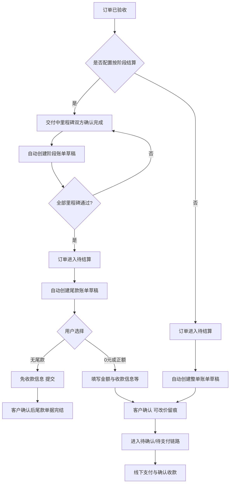
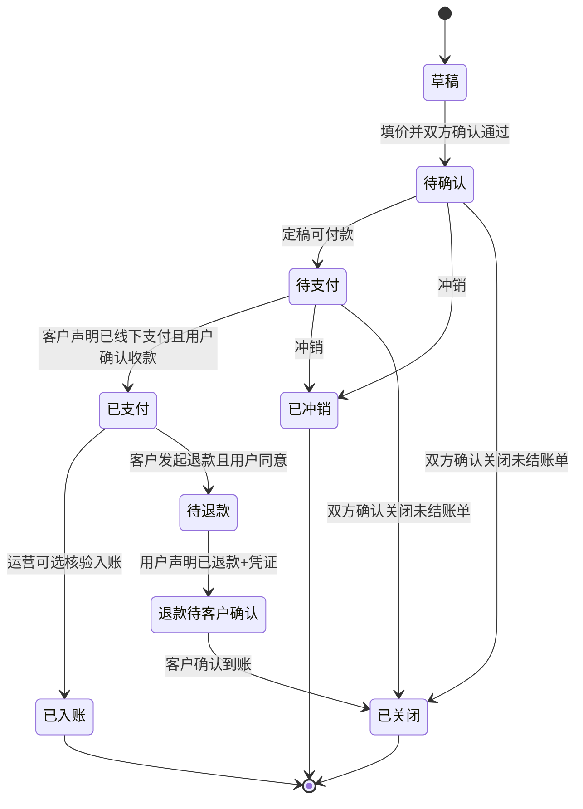
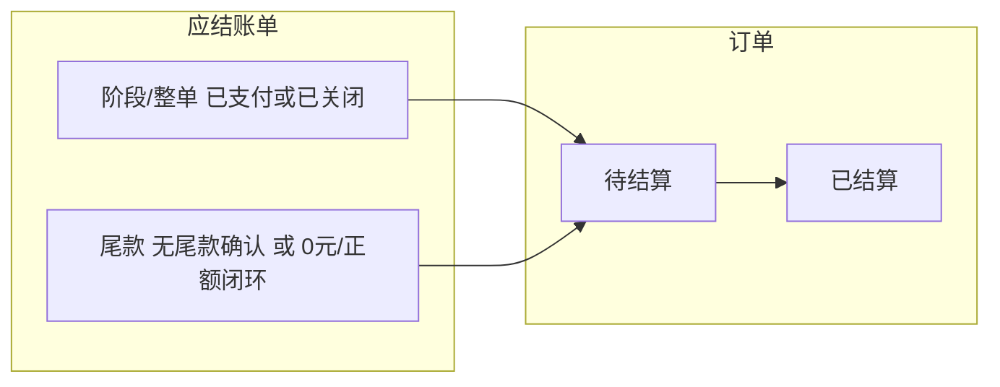
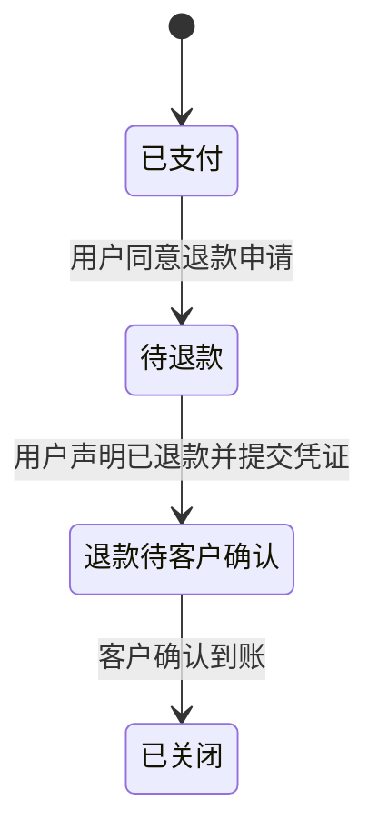

# 账单与结算产品需求说明书

## 需求概览

### 核心摘要
本需求将《CSDN 订单管理系统整体方案》中的「账单与结算（订单关联）」落到可执行的产品规则，并与**一期迭代边界**对齐（整体方案第 4.2 节：本期不展开订单支付、担保、发票、电子签等详细设计，仅预留「正式结算」能力）：**订单与账单为独立对象**，通过关联与状态协同；支持**按阶段结算可配置**与**一订单多账单**。一期**不对接支付网关、不提供真实「支付中」状态**——账单作为**结算与对账载体**，金额**不由系统自动推算合同应付**，而采用**用户（接单方）在账单草稿中填写、客户确认、双方可改价并留痕**的方式，以适配多样合同形态；里程碑或待结算触发时系统仅**自动生成账单草稿**并通知，经双方确认金额与收款信息后进入**待支付**，客户通过**「我已线下完成支付」**（可选凭证/流水号）声明付款，**用户（接单方）确认收款**后推进状态；**运营**可核验、驳回补证、依申诉**代为确认**。一期支持**退款闭环**（含**部分退款、单笔退款申请**；退款金额允许大于账单已付金额，通过**款项性质**区分合同退款与违约金/赔偿金等）、**未结账单须双方确认关闭**；**0 元尾款**与**无尾款**分场景处理。二期预留 **CSDN 在线支付**与**支付中**等状态及验真能力。客户、用户、运营在**【我的账单】/运营账单管理**中协同；**用户侧【我的账单】**提供**累计已收款**汇总（已支付/已入账账单金额合计），便于总览与正向反馈。当订单下**全部应结账单**达到约定完成态时，订单可进入**已结算**。

### 设计思路
设计上坚持「**草稿先行、双方定价、线下资金、线上留痕、运营兜底**」：里程碑或整单/尾款触发点只负责**拉起结算单据（草稿）与时限提醒**，不把复杂合同读解交给系统；**付款与退款的真实性与到账**由线下完成，平台统一用**凭证 + 对端确认 + 申诉与运营仲裁**保证过程可追溯。与整体方案「结算动作不强制绑在里程碑时刻」一致——草稿可早生成，填价、确认与打款可后置。与《里程碑确认与交付验收》《我的订单与运营订单管理》《运营端业务看板》在入口与订单状态上衔接；**凭证与申诉规则**在支付确认与退款确认链路复用一套逻辑，降低例外成本。

### 历史实现参考
本需求主要依据《CSDN 订单管理系统整体方案》第 4.1 节「账单与结算（订单关联）」及第 10 章术语表中账单、账单状态、按阶段结算、结算动作等定义；并与同项目《我的订单与运营订单管理产品需求说明书》中客户/用户【我的账单】入口与展示项、《里程碑确认与交付验收产品需求说明书》中交付完成与待结算触发、《运营端业务看板产品需求说明书》中「账单与结算」模块跳转保持一致。本项目 `docs/history/` 目录下未检索到独立归档的历史账单需求，故以整体方案与本系列 PRD 为设计来源；若后续 CSDN 支付、对账、发票等能力有单独平台文档，建议在「参考与沿袭」中补充 URL 或路径。

---

# 第1章：概述

## 1.1 术语表

| 术语 | 英文（如需） | 描述 |
|------|--------------|------|
| 账单 | Bill / Invoice | 与订单关联的结算单据，**独立业务对象**；一订单可关联多笔账单（按阶段结算时，每阶段/里程碑可对应一笔）。 |
| 账单草稿 | Bill Draft | 系统根据里程碑或待结算等触发点**自动生成的账单壳**；**金额由用户填写、客户确认**，双方可改价并**留痕**；草稿在约定时限内未完成填价或确认则按超时规则处理（见第 2.9 节）。 |
| 订单与账单关系 | Order–Bill Relationship | 订单与账单通过关联关系连接；触发点到达时系统**自动创建账单草稿**并通知；金额与收款信息经双方确认后进入后续状态；二者状态**协同但独立定义**。 |
| 按阶段结算 | Phase-based Settlement | 订单可配置的结算方式：在**交付中**每达成一个里程碑（**客户与用户双方确认里程碑完成**后），系统自动创建该阶段**账单草稿**；订单**全部里程碑通过**进入**待结算**时，再创建**尾款账单草稿**（用户可选择**无尾款**或填写**0 元尾款**等，见第 2.1 节）。未配置时仅在订单进入待结算时创建**整单账单草稿**（一次）。 |
| 整单账单 | Whole-order Bill | 未配置按阶段结算时，仅在订单进入**待结算**时创建的单笔账单草稿/账单，覆盖整单结算。 |
| 阶段账单 | Phase Bill | 按阶段结算时，与某一已达成里程碑（或阶段）对应的账单。 |
| 尾款账单 | Final Payment Bill | 按阶段结算时，在订单全部里程碑通过、订单进入**待结算**时创建的账单草稿/账单；用户可选择**无尾款**（免采集收款账户等，经客户确认即完结该尾款单据）或**0 元尾款**（少见，仍生成金额为 0 的尾款账单，流程与普通尾款一致，用于留痕）。 |
| 无尾款 | No Final Payment | 尾款场景下用户声明**不存在尾款**；**不采集收款账户等信息**，用户提交后需**客户确认**，确认通过后该尾款相关单据进入约定完成态，不参与线下打款。 |
| 0 元尾款 | Zero Final Payment | 尾款金额为 **0** 的尾款账单；**与普通尾款账单流程一致**（含收款信息等字段），用于明确「尾款为零」的双方确认与审计。 |
| 应结账单 | Bills Subject to Settlement | 某订单下**需要完成结算闭环**的账单集合，用于判断订单可否由待结算进入已结算。**已冲销、已关闭**且业务定义为不再承担的账单**不计入应结**；**无尾款**经双方确认完结的单据视为已满足该订单尾款侧闭环；**0 元尾款**账单须达到与普通账单一致的完成态规则（见第 2.6 节）。 |
| 金额变更留痕 | Amount Change History | 每次双方议定或单方提议改价（以对方重新确认生效）时，系统记录变更时间、操作者、变更前后金额、可选原因；**双方可见**，展示上可对历史金额**弱化（如置灰）**但不可缺失。 |
| 款项性质 | Payment Nature / Line Type | 用于区分资金性质，尤其在**退款申请**中标识**合同退款、违约金、赔偿金**等；**一期在账单侧以字段或选项体现**，便于审计与对账；若未来赔偿场景极度复杂，可再拆独立调账单——本期以账单内区分优先。 |
| 账单状态 | Bill Status | 账单生命周期状态，**单独定义**，与订单状态协同；**一期**枚举与流转见第 2.3 节（**不含支付中**；二期对接在线支付时增补）。 |
| 结算动作 | Settlement Action | 将账单从草稿确认、待支付向已支付及后续态推进的操作集合（含填价、确认、声明线下已付、确认收款、运营核验等），**不强制绑定在里程碑完成时刻**。 |
| 结算渠道 | Settlement Channel | **一期**仅为**线下结算（线上维护状态）**；**二期**可增加 **CSDN 在线支付**，见第 2.0、2.4 节。 |
| 待结算（订单） | Pending Settlement (Order) | 订单侧表示「交付已完成或已终止，进入结算阶段」；可与「存在草稿/待确认账单」或「等待线下财务动作」并存，以页面展示与账单状态为准。 |
| 已结算（订单） | Settled (Order) | 订单闭环完成；与「该订单下全部应结账单达到约定完成态」挂钩，见第 2.6 节。 |
| 累计已收款（用户侧） | Total Confirmed Receipt (User) | 用户【我的账单】汇总区展示的、该用户作为接单方已**确认收款**（账单为**已支付**或**已入账**）的金额合计；**不含**未闭环账单，**退款结案后的已关闭**账单不再计入；口径见第 2.6 节场景 2。 |
| 冲销 | Write-off / Reversal | 账单作废或冲销，状态为**已冲销**；与**关闭**、**退款完结**的适用边界见第 2.7、2.8、2.9 节。 |

## 1.2 修订记录

| 版本 | 内容 | 负责人 | 更新时间 | 备注 |
|------|------|--------|----------|------|
| 1.0 | 初稿：基于《CSDN 订单管理系统整体方案》第 4.1 节「账单与结算（订单关联）」及结算渠道方向（线下更新状态 / CSDN 支付能力） | — | 2026-04-05 | — |
| 1.1 | 细化**一期范围**：账单草稿、双方填价与改价留痕、线下支付声明与用户确认收款、去除一期「支付中」、运营核验与申诉代确认、退款状态机（单笔部分退款、款项性质含违约金/赔偿）、0 元尾款与无尾款拆分、未结账单双方关闭、统一凭证与申诉规则；二期预留在线支付 | — | 2026-04-11 | 与产品沟通稿对齐 |

## 1.3 背景和价值

**背景与痛点**：  
整体方案已明确订单全生命周期包含**待结算、已结算**，且账单与订单为独立对象、支持按阶段结算与灵活发起结算动作。若不单独定义账单状态机、生成规则与三端（客户、用户、运营）操作边界，易出现「订单已验收但结算单据不清晰」「阶段款与尾款混淆」「线下已付款但系统状态未更新」等问题，客户与用户无法在【我的账单】中形成一致预期。

**业务价值**：  
1. **结算单据结构化**：以账单为载体重现应付/应收与进度，支持一订单多账单，与里程碑及订单状态解耦，降低合同时点与系统实现的强行映射成本。  
2. **阶段与尾款可控**：按阶段结算可配置，交付中即可产生阶段账单，待结算产生尾款账单，支持部分结算与剩余取消等真实业务。  
3. **渠道可演进**：**一期**落地线下结算与线上状态、凭证与申诉；**二期**再对接 CSDN 支付与「支付中」等能力，与整体方案第 4.2 节节奏一致。  
4. **三端协同**：客户、用户、运营在各自权限内推进草稿、确认、支付声明、收款确认、退款与关闭；订单「已结算」与应结账单完成态联动，与业务看板「账单与结算」统计衔接。

---

# 第2章：功能需求

## 2.0 一期范围与二期预留

### 场景说明
整体方案第 4.2 节明确：**订单支付、担保、发票、合同电子签等资金与法务流程的详细设计本期仅预留节点**。本需求将「账单与结算」拆为**一期可交付**与**二期增强**，避免研发按「必有支付网关」实现。

### 2.0.1 一期（本期）必须交付的能力

| 维度 | 说明 |
|------|------|
| 资金验真 | **不实现**平台级支付、到账验真；客户「支付完毕」= 点击**「我已线下完成支付」** + 可选上传凭证/填写流水号，**不代表**平台已核验到账。 |
| 账单金额 | **不**由系统自动解析合同生成应付金额；触发点仅生成**账单草稿**，由**用户填写金额 → 客户确认**；双方均可发起改价，**须经对方重新确认**后生效，并**全量留痕**（见第 2.1 节）。 |
| 状态机 | 一期账单状态**不包含「支付中」**；线下付款完成后以**用户确认收款**作为一期推进主路径（见第 2.3 节）。 |
| 可见性与修改 | 账单**仅客户、用户（接单方）、运营**可见；**生成后（草稿起）**即可查看权限范围内的信息；任一方对账单关键信息的修改（范围见第 2.1 节）导致**对方需重新确认**。 |
| 时限 | 里程碑达成后用户填价、填价后对方确认、用户确认收款等关键等待环节，默认**48 小时**（**后台可配置**）；超时默认策略见第 2.9 节（**满 48 小时用户仍未确认收款时，不自动视为已收款**，可提醒并进入运营/申诉处理）。 |
| 尾款 | **无尾款**与 **0 元尾款**分场景（见第 2.1 节）：无尾款**免采集收款账户等**，用户提交后客户确认即完结该尾款单据；0 元尾款仍走**完整尾款账单流程**（含收款信息等），用于少见审计场景。 |
| 退款 | 支持客户发起**单笔**退款申请（**部分退款**允许；**同一账单一期不支持多次退款申请**）；状态与角色动作见第 **2.8** 节。 |
| 关闭未结账单 | **未结账单**需**客户与用户双方确认**后方可关闭（与冲销/终止场景衔接见第 2.7 节）。 |
| 运营 | 运营可**在用户确认前核验账单信息**、**驳回**并要求客户补充凭证；客户**申诉**后运营可核验并**通知用户后代为确认**（与第 2.9 节统一）。 |

### 2.0.2 二期预留（本期不实现或仅预留扩展点）

- **CSDN 在线支付**对接、收银台跳转、结果回调/查询一致后自动变更账单状态。  
- 账单状态 **支付中**及与支付单的深度绑定、重复支付防控的自动化。  
- **自动入账**与财务对账平台化能力（一期可用「已支付」等价于双方确认的线下闭环，是否单独保留「已入账」见第 2.3 节一期约定）。  

### 2.0.3 需求波及分析

- **影响模块**：与《我的订单》《里程碑验收》触发事件文案对齐（「自动生成账单」对外宜表述为「已生成结算单草稿」）。  
- **历史文档查阅记录**：同第 2.1.3 节；并显式对齐整体方案 `CSDN订单系统/docs/CSDN订单管理系统整体方案.md` 第 4.1 节与第 4.2 节边界。

---

## 2.1 账单对象、订单关联与生成触发

### 场景描述

**场景 1：里程碑达成后生成阶段账单草稿**  
某订单配置**按阶段结算**，交付中某一里程碑经**客户与用户双方确认完成**后，系统**立即**为该里程碑创建**账单草稿**，并通知用户与客户。用户在约定时限内（默认 48 小时，可配置）**填写金额、收款账户等**（字段以本节数据项为准）；客户在同一时限内对金额与信息进行**确认**或提出改价；双方确认通过后，账单从草稿流程进入**待确认/待支付**链路（见第 2.3 节）。**付款与打款可在更晚时间进行**，与整体方案「结算动作不强制绑在里程碑时刻」一致。

**场景 2：订单进入待结算——整单草稿或尾款草稿**  
- **未配置按阶段结算**：订单由**已验收**进入**待结算**时，系统创建**一条整单账单草稿**，规则同「填价—确认—留痕—时限」。  
- **配置按阶段结算**：订单进入**待结算**时，系统创建**尾款账单草稿**；**默认由用户（接单方）**进入尾款处理：可选择 **无尾款** 或 **0 元尾款** 或 **正额尾款**。  

**场景 3：无尾款（免收款信息）**  
用户选择**无尾款**，**无需填写收款账户等信息**，直接提交声明；**客户确认**后，该尾款单据按约定进入**完成态**（不计线下打款），订单在「应结」判定上视为尾款侧已闭环（见第 2.6 节）。

**场景 4：0 元尾款（完整流程留痕）**  
用户选择或填写尾款金额为 **0**（少见场景），系统仍按**普通尾款账单**处理：**采集收款账户等字段**并与普通账单一致的确认、留痕与展示，用于双方明确「尾款为零」的审计记录。

**场景 5：运营对账与看板**  
运营在业务看板进入「账单与结算」，可按订单、账单状态、草稿超时、时间筛选，核对与客户/用户侧展示是否一致，并处理申诉与代确认（见第 2.9、2.10 节）。

**交互流程（订单与账单协同，一期）**：



### 2.1.1 基本事件流程

#### 主业务流程

**前置条件**：订单已存在；创建整单账单草稿时订单须进入**待结算**；创建阶段账单草稿时订单须为**交付中**且对应里程碑已**双方确认完成**；创建尾款账单草稿时订单须进入**待结算**且已配置按阶段结算。

**基本事件流程**：  
1. 系统根据订单的**按阶段结算**配置决定账单创建策略（与《客户发布订单与审核》等需求衔接）。  
2. **未配置按阶段结算**：仅在订单进入**待结算**时创建**一条整单账单草稿**。  
3. **配置按阶段结算**：每达成一个里程碑（**双方确认完成**），系统创建该阶段**账单草稿**并通知；订单**全部里程碑通过**且进入**待结算**时，创建**尾款账单草稿**。  
4. **尾款草稿**首先由用户选择 **无尾款 / 0 元尾款 / 正额尾款**：  
   - **无尾款**：不展示或不要求填写收款账户等字段，用户提交 → 客户确认 → 按第 2.3、2.6 节进入尾款完结路径。  
   - **0 元尾款**：金额填 0，**其余字段与普通尾款一致**（含收款信息等）。  
   - **正额尾款**：用户填写金额与收款信息等，进入与客户互认、可改价留痕流程。  
5. **非无尾款**的草稿：用户须在**里程碑达成后首段时限**内完成填价/提交（默认 48 小时，可配置）；提交后对方须在**第二段时限**内完成确认或发起改价（默认 48 小时，可配置）——细则见第 2.9 节。  
6. 双方对金额与关键信息确认通过后，账单进入**待确认**（或业务统一为进入**待支付**前的锁定态，见第 2.3 节）；**任一方修改**已提交的关键信息（含金额、收款账户、备注等，以产品最终勾选字段为准）的，**须经对方重新确认**方可继续推进。  
7. 账单与订单建立**关联关系**；列表与详情支持从账单跳转订单、从订单查看账单列表。

**后置条件**：订单待结算阶段存在应结所需的账单或尾款豁免记录；阶段账单在交付中可已存在多条草稿或已定稿记录。

**系统响应与提示**：  
- 草稿创建成功后，客户与用户、运营在【我的账单】、订单详情关联区域可见，并收到**待填价/待确认**类通知（渠道以《消息通知》需求为准）。  
- 生成失败时提示「结算单生成失败，请稍后重试或联系运营」，并记录日志。  
- **改价留痕**：每次金额从 A 变为 B，在双方可见详情中展示**当前生效金额**，历史金额以**弱化样式**保留（如置灰小字），并保留审计字段（时间、操作者、变更前后、可选原因）。

#### 扩展事件流程

- **模版创建订单**：整体方案约定模版创建类订单不走里程碑与结算；**不生成**业务结算账单草稿，或仅零金额审计记录——**若需与「待审核/推广中取消」完全一致，此处信息不明确，需补充确认。**  
- **并发**：同一触发条件重复请求时，系统应保证**不重复创建**草稿或具备幂等（业务语义「一里程碑一阶段账单草稿」）。

#### 异常事件流程

- **订单状态回退或重复进入待结算**：若业务允许从待结算回退（见第 2.7 节），已生成账单的处理以冲销/关闭、退款及**双方关闭**规则为准。  
- **草稿超时**：用户未在时限内填价，或对方未在时限内确认——**不自动生效金额**；默认进入**提醒 + 运营可介入**（见第 2.9 节）；默认不会自动关闭草稿。

### 2.1.2 数据项描述（账单主信息-逻辑层）

| 字段名（中文） | 字段名（英文） | 数据类型/长度 | 是否必填 | 前端展示 | 默认值 | 说明 | 界面/控件说明 | 备注 |
|----------------|----------------|----------------|----------|----------|--------|------|----------------|------|
| 账单标识 | bill_id | 唯一标识 | — | 是 | — | 账单主键 | 列表、详情 | — |
| 关联订单 | order_id | 关联 | 是 | 是 | — | 所属订单 | 可跳转订单详情 | — |
| 账单类型 | bill_type | 枚举 | 是 | 是 | 依生成规则 | 整单、阶段、尾款等 | 标签、筛选 | 与国际化表一致 |
| 关联里程碑 | milestone_id | 可选关联 | 否 | 可选 | — | 阶段账单关联里程碑 | 详情 | 整单/尾款可为空 |
| 是否无尾款 | no_final_payment | 布尔 | 否 | 是 | false | 仅尾款场景；true 时免收款信息等 | 尾款草稿页 | 与 0 元尾款互斥业务规则需在界面约束 |
| 当前生效金额 | bill_amount | 金额 | 条件 | 是 | 无尾款可为 0 或不展示应付 | **双方确认后的当前金额**；无尾款可为 0 | 列表、详情 | 改价后仅更新本字段，历史见下 |
| 金额变更履历 | amount_change_log | 结构化列表 | — | 是 | — | 时间、操作者、变更前、变更后、原因 | 详情折叠区 | 双方可见 |
| 收款账户信息 | payee_account_info | 文本/结构化 | 条件 | 是 | — | **无尾款不要求**；0 元与普通尾款要求填写 | 表单 | 仅客户、用户、运营可见 |
| 币种 | currency | 枚举/字符串 | — | 可选 | 与订单一致 | 与订单报价币种一致 | 详情 | — |
| 账单状态 | bill_status | 枚举 | 是 | 是 | 草稿/待确认 | 见第 2.3 节 | 状态标签 | 一期无支付中 |
| 结算渠道 | settlement_channel | 枚举 | — | 是 | 线下 | 一期固定为线下展示 | 详情 | 二期增加在线 |
| 生成时间 | created_at | 日期时间 | 是 | 是 | 系统生成 | 草稿创建时间 | 列表、筛选 | — |
| 最近更新时间 | updated_at | 日期时间 | 是 | 是 | 系统更新 | 变更时间 | 详情 | — |

### 2.1.3 需求波及分析

- **影响模块**：订单状态机（已验收→待结算）、里程碑模块（里程碑通过事件）、客户/用户【我的账单】、订单详情账单区、运营端账单列表与业务看板。  
- **数据影响**：业务上新增账单主数据及与订单、里程碑的关联；**存储结构此处信息不明确，需补充确认**（仅逻辑层描述）。  
- **业务规则影响**：订单进入待结算时必须触达账单生成；按阶段结算时交付中即可能生成账单。  
- **历史文档查阅记录**：  
  - 查阅的历史需求文档：《CSDN 订单管理系统整体方案》（`CSDN订单系统/docs/CSDN订单管理系统整体方案.md`）第 4.1 节「账单与结算」、第 10 章术语表。  
  - 查阅的现有功能文档：《我的订单与运营订单管理产品需求说明书》（`CSDN订单系统/docs/我的订单与运营订单管理产品需求说明书.md`）第 2.2 节客户【我的账单】、第 2.5 节用户【我的账单】；《里程碑确认与交付验收产品需求说明书》（`CSDN订单系统/docs/里程碑确认与交付验收产品需求说明书.md`）已验收/待结算/已结算表述；《运营端业务看板产品需求说明书》（`CSDN订单系统/docs/运营端业务看板产品需求说明书.md`）账单与结算入口。  
  - 参考的实现方案：整体方案「一订单多账单」「待结算创建结算单据」；一期将「自动创建账单」落实为**自动创建账单草稿 + 双方填价确认**；《我的订单》中账单列表字段与客户/用户权限边界。  
  - 设计一致性保证：账单与订单独立对象；与整体方案第 4.2 节「本期不展开具体支付能力」一致，一期不实现支付中状态与支付网关。

---

## 2.2 按阶段结算配置（订单级）

### 场景描述

**场景 1：发单时打开按阶段结算**  
客户在发布订单或选择模板时，勾选**按阶段结算**。交付中里程碑**双方确认完成**后，即创建**阶段账单草稿**；订单收尾进入待结算时再创建**尾款账单草稿**（无尾款 / 0 元 / 正额，见第 2.1 节）。

**场景 2：未配置则整单出账**  
客户未勾选按阶段结算。则交付过程中不创建阶段草稿，仅在订单进入**待结算**时创建**一条整单账单草稿**。

### 2.2.1 基本事件流程

#### 主业务流程

**前置条件**：订单处于可编辑状态（新建/待审核等，具体以《客户发布订单与审核》为准）或模板配置保存权限为运营。

**基本事件流程**：  
1. 配置项名称建议为「按阶段结算」或业务确认后的等价文案，类型为布尔或开关。  
2. 配置结果随订单保存，并在订单详情中向客户、用户、运营展示当前订单是否按阶段结算。  
3. 后续账单生成逻辑遵循第 2.1 节。

**后置条件**：订单维度可读取「是否按阶段结算」，供账单生成与展示使用。

**系统响应与提示**：  
- 切换配置时若订单已进入交付中或更后状态，是否允许变更——**此处信息不明确，需补充确认**（建议默认锁定或仅运营可改）。

#### 扩展事件流程

- **平台承包转包模式**：里程碑由运营定义，按阶段结算配置的客户可编辑性是否与抽佣模式一致——遵循订单结算模式规则，**细节此处信息不明确，需补充确认。**

#### 异常事件流程

- **配置缺失**：老数据无该字段时，默认**否**（整单结算）——**此处信息不明确，需补充确认。**

### 2.2.2 数据项描述（订单侧配置-逻辑层）

| 字段名（中文） | 字段名（英文） | 数据类型 | 是否必填 | 前端展示 | 默认值 | 说明 | 界面/控件说明 | 备注 |
|----------------|----------------|----------|----------|----------|--------|------|----------------|------|
| 是否按阶段结算 | phase_settlement_enabled | 布尔 | 是 | 是 | false | 为 true 时启用阶段账单+尾款账单策略 | 发单页开关、订单详情只读展示 | 与模板默认值可继承 |

### 2.2.3 需求波及分析

- **影响模块**：客户发布订单、订单模板管理、订单详情。  
- **数据影响**：订单维度增加按阶段结算配置项（逻辑层）。  
- **业务规则影响**：与账单生成策略直接绑定。  
- **历史文档查阅记录**：同第 2.1.3 节；并参考整体方案原文「是否按阶段结算可在订单创建或模板中配置」。

---

## 2.3 账单状态与状态流转

### 场景描述

**场景 1：草稿与定稿**  
触发点创建**账单草稿**后，经用户填价、双方确认（可含改价留痕），进入**待确认**；双方对结算单内容无异议并满足业务规则后，进入**待支付**（一期可将「待确认→待支付」合并为一步交互，但状态上仍建议区分以便审计——**若合并为单状态，此处信息不明确，需补充确认**；默认保留两步）。

**场景 2：一期线下支付与确认收款**  
账单在**待支付**：客户点击**「我已线下完成支付」**，可上传凭证/填写流水号（可选必填策略可配置）；账单进入**已支付（待对方确认收款）**或仍称**待支付**但子状态「待用户确认收款」——**产品展示上**客户侧为「待对方确认到账」，用户侧为「待确认收款」；**用户**在时限内（默认 48 小时，可配置）**确认收款**后，账单进入**已支付（已确认收款）**。一期**不单独强制「已入账」**时，可将「用户确认收款」视为该笔账单结算闭环；若财务仍需「已入账」状态，由运营在核验后标记**已入账**（与第 2.9、2.10 节一致）。

**场景 3：二期在线支付（预留）**  
对接 CSDN 支付后，在**待支付**可发起在线支付，账单经**支付中**（二期新增状态）→ **已支付**；失败回退规则在二期需求中定义。

**场景 4：退款（见第 2.8 节）**  
自**已支付**（及运营认可的已入账）状态，客户可发起**单笔**退款申请，经用户同意后进入**待退款**→用户完成线下退款并声明→**退款待客户确认**→客户确认到账后进入**已关闭**。

**状态流转示意（一期主路径 + 二期虚线）**：



*说明：二期对接在线支付时，在「待支付」与「已支付」之间增加「支付中」状态，不在一期实现。*

### 2.3.1 基本事件流程

#### 主业务流程

**前置条件**：账单已存在。

**基本事件流程（一期）**：  
1. **草稿**：系统创建草稿；用户填价（无尾款除外）并提交；客户确认或改价（改价须对方再确认）；通过后→**待确认**（若与待支付合并则跳过）。  
2. **待确认**：双方或运营完成最终确认（含收款信息核对）→ **待支付**。  
3. **待支付**：客户执行**线下支付声明**（「我已线下完成支付」+ 可选凭证）→ 账单标记为等待用户确认收款（内部可记为**已支付（未确认）**或统一仍用待支付子状态——**实现选型此处信息不明确，需补充确认**；对外文案见场景 2）。  
4. **用户确认收款**后 → **已支付**（表示双方对「本次应付结算」闭环确认）。  
5. **已入账**（可选）：运营或财务规则需要时，在已支付后补充标记。  
6. **已冲销 / 已关闭**：按第 2.7、2.8、2.9 节规则处理。

**后置条件**：账单状态与操作日志、凭证关联可追溯。

**系统响应与提示**：  
- 每次状态变更在详情页展示时间、操作者；**角色视角文案**区分客户/用户（见国际化表「待您付款」「待确认收款」等）。  
- 非法跳转应被拒绝并提示「当前状态不允许该操作」。  
- **一期不包含「支付中」状态**；开发不得依赖支付回调驱动主路径。

#### 扩展事件流程

- **已冲销/重开**：冲销后是否允许生成替代账单、订单是否从已结算回退——**此处信息不明确，需补充确认**。  
- **无尾款完结**：不经过待支付打款，客户确认无尾款后直接进入**已关闭**或专用**已完结（无尾款）**——**枚举是否单独取值此处信息不明确，需补充确认**（建议在应结判定中视为完成态即可）。

#### 异常事件流程

- **用户超时未确认收款**：不自动确认；客户可**申诉**，运营可**代为确认**或**驳回**（第 2.9 节）。  
- **二期重复支付**：同一账单不应重复有效支付；一期无网关，本条预留。

### 2.3.2 数据项描述

| 字段名（中文） | 字段名（英文） | 取值说明 | 说明 |
|----------------|----------------|----------|------|
| 账单状态 | bill_status | **一期**：草稿、待确认、待支付、已支付、已入账（可选）、待退款、退款待客户确认、已冲销、已关闭 | **不含支付中**；二期增加支付中；展示名见国际化表 |

### 2.3.3 需求波及分析

- **影响模块**：全部涉及账单展示与操作的页面。  
- **数据影响**：账单状态字段及状态变更审计（逻辑层）。  
- **业务规则影响**：与订单「已结算」判定条件联动（见第 2.6 节）。  
- **历史文档查阅记录**：同第 2.1.3 节；整体方案第 4.1 节状态名词在二期与一期子集对齐说明。

---

## 2.4 结算渠道与结算动作（一期线下为主 / 二期在线支付预留）

### 场景描述

**场景 1：一期线下结算 + 双方确认**  
账单处于**待支付**时，**客户**点击**「我已线下完成支付」**，可上传凭证、填写流水号/备注（是否必填可配置）；**不代表**平台已核验到账。随后**用户（接单方）**在时限内**确认收款**（或按第 2.9 节申诉、运营代确认），账单进入**已支付**闭环。运营可在用户确认前**核验账单信息**、**驳回**并要求客户补充凭证。

**场景 2：二期 CSDN 在线支付（预留）**  
账单处于**待支付**，付款方点击「去支付」等入口，跳转或唤起 **CSDN 支付能力**；账单经**支付中**（二期状态）与支付结果同步；失败回退与对账在二期需求中定义。

**场景 3：灵活发起**  
填价、确认、打款、确认收款**不绑定**里程碑完成时刻；草稿可先产生，双方可在后续时点完成各步。

### 2.4.1 基本事件流程

#### 主业务流程

**前置条件**：账单处于可推进状态（草稿、待确认、待支付等）；操作者具备相应权限。

**基本事件流程（一期）**：  
1. **定稿与待支付**：双方完成草稿确认后进入**待支付**（见第 2.3 节）。  
2. **客户声明已付**：客户在**待支付**提交「我已线下完成支付」及可选凭证；系统记录时间、操作者、附件与流水号。  
3. **用户确认收款**：用户在**待确认收款**视角下确认或发起异议；确认后账单→**已支付**。  
4. **已入账（可选）**：若财务要求与运营流程需要，运营在核验后将账单标记**已入账**。  
5. 全流程记录操作者与时间；凭证与申诉规则见第 2.9 节。

**后置条件**：账单状态与 `settlement_channel=offline`（一期）一致。

**系统响应与提示**：  
- 提交「已线下支付」成功：提示「已记录，请等待接单方确认收款」；用户侧提示「客户已声明付款，请核对到账后确认」。  
- 用户确认收款成功：提示「已确认收款」/「对方已确认到账」。  
- 运营驳回：向责任方推送「请补充凭证或说明」类文案（具体文案可配置）。

#### 扩展事件流程

- **部分线下分期打款**：一期不按多笔子支付拆状态；若同一账单分多笔线下付清，**此处信息不明确，需补充确认**是否允许客户多次补充凭证或仅备注。

#### 异常事件流程

- **用户对声明有异议**：不确认收款，走申诉与运营介入（第 2.9 节）。

### 2.4.2 数据项描述

| 字段名（中文） | 字段名（英文） | 说明 |
|----------------|----------------|------|
| 结算渠道 | settlement_channel | 一期固定为 **offline**；二期增加 csdn_pay 等 |
| 外部支付单号 | external_pay_id | 二期对接支付返回单号；一期可空 |
| 线下支付声明时间 | offline_paid_declared_at | 客户点击「已线下支付」的时间 |
| 客户支付凭证 | payment_proof_attachments | 可选多附件 |
| 流水号/备注 | payment_reference_text | 客户填写的流水号或说明 |
| 用户确认收款时间 | payee_confirmed_at | 用户确认收款时间 |
| 操作备注 | operation_remark | 运营驳回原因、补充说明等 |

### 2.4.3 需求波及分析

- **影响模块**：账单详情操作区；二期再增支付对接模块。  
- **数据影响**：上述逻辑字段与审计。  
- **业务规则影响**：与财务合规、审计要求相关；凭证留存范围与第 2.9 节一致。  
- **历史文档查阅记录**：同第 2.1.3 节；整体方案第 4.2 节——**一期不展开支付网关**，本节约束为线下声明 + 双方确认。

---

## 2.5 客户侧「我的账单」

### 场景描述

**场景 1：查看应付与进度**  
客户进入【我的账单】，列表展示本人所发订单关联的账单，字段包含应付金额、账单状态、关联订单、时间等；点击账单可查看详情与可执行操作（如确认、发起支付——依权限）。

**场景 2：一订单多账单**  
按阶段结算时，同一订单多条账单分行展示，并可从列表筛选该订单。

### 2.5.1 基本事件流程

#### 主业务流程

**前置条件**：客户已登录为客户身份。

**基本事件流程**：  
1. 客户从【我的账单】入口进入页面。  
2. 列表展示**本人所发出的订单**关联的账单；展示项包括：关联订单、账单类型、金额、账单状态、时间、结算渠道（若有）。  
3. 支持按订单、时间、账单类型、账单状态筛选。  
4. 账单详情展示关联订单跳转、状态流转记录（若实现）。

**后置条件**：客户仅能查看本人客户身份下发起的订单的账单（与《我的订单与运营订单管理》权限一致）。

**系统响应与提示**：  
- 无账单：展示「暂无账单」。  
- 无权限：提示并拒绝。

#### 扩展事件流程

- **发起结算动作**：客户在账单详情中可执行确认、**我已线下完成支付**、退款申请（满足第 2.8 节条件时）等；具体按钮与禁用态与状态机一致。

#### 异常事件流程

- 加载失败：提示重试。

### 2.5.2 数据项描述

客户侧列表至少包含：`bill_id`、`order_id`（展示标题/编号）、`bill_type`、`bill_amount`、`bill_status`、`created_at`、可选 `settlement_channel`；与《我的订单与运营订单管理》一致处不重复扩展字段。

### 2.5.3 需求波及分析

- **影响模块**：客户【我的账单】页面（在《我的订单与运营订单管理》已定义入口的基础上，本需求细化规则与状态）。  
- **历史文档查阅记录**：《我的订单与运营订单管理产品需求说明书》第 2.2 节。

---

## 2.6 用户侧收入账单与订单「已结算」判定

### 场景描述

**场景 1：用户查看收入账单**  
用户在【我的账单】查看本人参与订单关联的账单及状态；展示应得金额、当前生效金额、历史改价（弱化）、草稿/待支付/待确认收款、退款进度等（与角色视角文案一致）。

**场景 2：累计已收款总额（成就感/总览）**  
在【我的账单】页面**顶部或固定汇总区**展示**累计已收款**（文案可配置为「累计已收款」「已到账合计」等）：对该用户作为接单方关联的、已进入**已支付**或**已入账**（若启用）状态的账单，按其**当前生效金额**汇总；**多笔账单金额相加**后与列表数据一致（例如 10 笔各 100 元则展示 1000 元）。**统计口径**：  
- **计入**：状态为 **已支付**、**已入账** 的账单（即用户已完成「确认收款」或运营已标记入账的闭环）。  
- **不计入**：草稿、待确认、待支付、待退款、退款待客户确认、已冲销等未形成「已确认到账」的账单。  
- **已关闭**：因**退款闭环**等原因进入**已关闭**的账单，**不再计入**累计（视为该笔收入在平台侧已冲回或结案）；因**无尾款**等完结且金额为 0 的单据**计入 0 不影响总额**。**同一账单状态变更后汇总应即时或可短时最终一致地更新**（可以每日刷新）。  
- **多币种**：若存在多币种账单，**此处信息不明确，需补充确认**是否分币种展示合计或仅支持单币种订单场景下同币种加总。

**场景 3：全部应结闭环完成后订单转已结算**  
订单处于**待结算**时，系统校验该订单下**应结集合**是否均已达到**完成态**：  
- **阶段账单、整单账单**：达到**已支付**（含用户已确认收款）或**已入账**（若启用），或**已关闭**且属于**双方确认的合法关闭**（见第 2.7 节）。  
- **尾款**：下列之一即视为尾款侧满足应结——  
  - **无尾款**：用户提交无尾款且**客户已确认**，该尾款单据进入**已关闭**（或等价完结态）；  
  - **0 元尾款**：尾款账单完成与普通账单一致的**确认与闭环**（金额为 0，仍走收款信息等字段，见第 2.1 节）；  
  - **正额尾款**：与客户互认金额并完成**线下支付声明 + 用户确认收款**（或退款完结后关闭，见第 2.8 节）。  
全部应结满足后，订单可由**待结算**进入**已结算**。



### 2.6.1 基本事件流程

#### 主业务流程（用户【我的账单】列表与汇总）

**前置条件**：用户已登录为用户身份。

**基本事件流程**：  
1. 用户进入【我的账单】。  
2. 列表区展示本人参与订单关联的账单明细（字段同场景 1）。  
3. **汇总区**展示**累计已收款**（计算规则见场景 2），与明细中处于 **已支付/已入账** 的账单金额合计一致；无符合条件账单时展示 **0** 或「暂无已到账款项」类文案（可配置）。  
4. 用户切换筛选条件时，**此处信息不明确，需补充确认**：汇总区展示**全局累计**还是**当前筛选结果内合计**（建议一期**始终全局累计**，避免与「成就感总览」预期不一致）。

**系统响应与提示**：  
- 汇总数据加载失败时，列表仍可展示，汇总区提示「汇总暂不可用」并支持重试。

#### 主业务流程（订单「已结算」判定）

**前置条件**：订单处于待结算；存在应结所需的账单或尾款豁免记录。

**基本事件流程**：  
1. 系统在关键事件后校验：该订单下全部**应结账单**是否达到**完成态**（见场景 3）。  
2. 条件满足时，将订单状态更新为**已结算**。  
3. 用户在「已验收订单-已结算」页签可见该订单。

**后置条件**：订单已结算；与开发工具资源失效策略衔接（见整体方案开发工具章节）。

**系统响应与提示**：  
- 仍有未完成应结时，订单保持待结算；可向客户/用户提示「尚有账单未完成结算」。

#### 扩展事件流程

- **已冲销、已关闭**：**不计入应结**完成条件，除非该账单在业务上被定义为「无需再结算」且与订单终止/双方关闭规则一致（见第 2.7 节）。  
- **退款完结后的账单**：进入**已关闭**且不再要求「已支付」时，若业务认定该账单已从应结集合剔除，**此处信息不明确，需补充确认**（建议：退款闭环后的**已关闭**视为该账单应结已了结）。

#### 异常事件流程

- 校验任务失败时应重试或告警运营。

### 2.6.2 数据项描述

| 字段名（中文） | 字段名（英文） | 说明 |
|----------------|----------------|------|
| 累计已收款（展示） | total_confirmed_receipt_display | 用户【我的账单】汇总区展示值；由后端按场景 2 口径聚合，**非持久化必填**亦可实时计算 |

逻辑层以「订单—账单列表聚合规则」实现应结判定；尾款**无尾款**依赖 `no_final_payment` 与客户确认标记。

### 2.6.3 需求波及分析

- **影响模块**：订单状态机、用户【我的订单】已验收页签、《开发工具配置与订单资源用量》资源失效时机。  
- **历史文档查阅记录**：《我的订单与运营订单管理产品需求说明书》已验收订单页签；《里程碑确认与交付验收产品需求说明书》结算表述。

---

## 2.7 订单取消、终止、待结算后取消结算与账单处理

### 场景描述

**场景 1：待审核/推广中取消**  
订单**已取消**时，一般不生成应付/应收账单，或仅**零金额/冲销类审计记录**。

**场景 2：交付中终止或运营取消**  
未结算的**阶段账单**可作**已冲销**或经**客户与用户双方确认后关闭**（见第 2.7.1 节）；已进入**已支付**等完成态且需回款的，走第 **2.8** 节退款流程。支持**款项原路退回**（二期依赖支付渠道）及补偿机制——**违约金/赔偿金等可通过退款申请中「款项性质」体现**（第 2.8 节）；若未来需独立「调账单」，可再行拆分。

**场景 3：部分结算 + 剩余取消**  
订单有 A、B、C 三里程碑且按阶段结算；A、B 已结算，C 未达成且订单**已终止**——C 对应账单不生成或生成后**已冲销/已关闭**；订单为**已终止**，结算以双方协议及运营审核为准。

**场景 4：待结算后取消结算**  
需将订单回退为**已验收**或**已终止**（视规则）；账单**已冲销**或**已关闭**，并可按需生成**退款/冲销账单**。

### 2.7.1 基本事件流程

#### 主业务流程

**前置条件**：对应订单状态与触发事件符合整体方案。

**基本事件流程**：  
1. **待审核/推广中→已取消**：不生成实质结算账单，或仅审计用途记录。  
2. **交付中→已终止/运营取消**：对未结算账单批量或单笔**冲销**，或引导**客户与用户双方确认关闭**（第 2.9 节统一确认与凭证规则）；已进入**已支付**的走第 **2.8** 节退款。  
3. **部分结算+终止**：未达成阶段不生成草稿或草稿冲销/关闭；已闭环阶段保持已完成。  
4. **待结算后撤销**：订单回退与账单冲销/关闭及可选退款；**未结账单关闭须双方确认**（与单方冲销区分：冲销可为运营/规则驱动，**关闭**为双方合意时适用）。  
5. **双方确认关闭**：适用于**未结**且需终结账单而不走完整支付链的场景；双方均在系统中确认后账单**已关闭**，并记录原因与可选凭证。

**后置条件**：账单与订单状态与方案描述一致，可查审计信息。

**系统响应与提示**：  
- 冲销/关闭需二次确认，提示文案需说明对订单与后续结算的影响。  
- **双方关闭**：第一步一方发起关闭申请并说明原因，第二步另一方确认；拒绝则保持原状态。

#### 扩展事件流程

- **原路退回**：依赖支付渠道是否支持，**此处信息不明确，需补充确认。**

#### 异常事件流程

- 冲销失败：提示失败原因并保留原状态。

### 2.7.2 数据项描述

冲销/关闭操作须记录：操作者、时间、原因类型、关联原账单 id。

### 2.7.3 需求波及分析

- **影响模块**：订单取消/终止流程、运营审核、财务对接。  
- **历史文档查阅记录**：整体方案第 4.1 节同段；《客户发布订单与审核》取消逻辑；《里程碑确认与交付验收》终止结算表述。

---

## 2.8 退款申请与退款状态流转（一期）

### 场景描述

**场景 1：客户发起单笔退款申请**  
账单已处于**已支付**（或**已入账**，若业务规定仅已入账可退，**此处信息不明确，需补充确认**；默认**已支付**即可申请）时，**客户**可发起**退款/回款申请**：填写**退款金额**（支持**部分退款**，即小于等于账单已付金额的退款；**违约金、赔偿金等**通过**款项性质**选择，**申请金额允许大于该账单已付金额**，以双方确认与运营核验为准，用于覆盖违约惩罚条款）、说明、可选凭证。同一账单**一期仅允许存在一笔生效的退款申请流程**（**不支持同一账单多次串行/并行退款申请**；若部分退款后仍需再次调整，**此处信息不明确，需补充确认**是否必须运营线下处理或留待二期）。

**场景 2：用户同意与待退款**  
用户审阅申请，**同意后**账单进入**待退款**（表示双方就退款/赔偿金额与性质达成一致，等待用户方向客户完成线下划付）。

**场景 3：用户完成退款并待客户确认**  
用户线下完成打款后，点击**「已完成退款」**，上传凭证、填写流水号等（规则与第 2.9 节凭证统一）；账单进入**退款待客户确认**。

**场景 4：客户确认到账与关闭**  
客户确认退款到账后，账单进入**已关闭**（或业务定义为**已退款结案**并与应结判定联动，见第 2.6 节）。客户可**申诉**、运营可**仲裁**（第 2.9 节）。

**款项性质与是否独立赔偿单**：一期在**同一退款申请**中通过**款项性质**枚举区分**合同退款、违约金、赔偿金**等，便于审计；**若金额结构极度复杂**，后续可拆独立「调账单/赔偿单」——本期以账单内字段优先。



*说明：用户拒绝退款申请时账单保持「已支付」，不进入上述分支。*

### 2.8.1 基本事件流程

#### 主业务流程

**前置条件**：账单处于可发起退款的状态；客户、用户身份正确。

**基本事件流程**：  
1. 客户提交退款申请（金额、**款项性质**、说明、凭证）。  
2. 用户**同意**→ **待退款**；用户**拒绝**→ 保持**已支付**，客户可见拒绝原因（可选填）。  
3. 用户在**待退款**完成线下退款后提交「已完成退款」+ 凭证 → **退款待客户确认**。  
4. 客户**确认到账**→ **已关闭**；若有异议→ 申诉与运营介入（第 2.9 节）。  

**后置条件**：账单状态与退款申请记录可追溯；订单应结判定按第 2.6 节更新。

**系统响应与提示**：  
- 申请提交成功：「已提交，等待接单方确认」。  
- 用户拒绝：「对方已拒绝本次退款申请」。  
- 客户确认到账：「已确认退款到账，账单已关闭」。

#### 扩展事件流程

- **用户超时未在待退款完成打款**：不自动关闭；提醒与运营介入（第 2.9 节）。  
- **部分退款后账单本体**：**已关闭**或保持**已支付**但标记「部分退款已结」——**此处信息不明确，需补充确认**（建议：部分退款完成后账单仍可**已关闭**并备注实退金额，或保留已支付+关联退款单记录）。

#### 异常事件流程

- 重复发起：同一账单已存在进行中退款流程时，提示「当前已有进行中的退款申请」。

### 2.8.2 数据项描述（退款申请-逻辑层）

| 字段名（中文） | 字段名（英文） | 说明 |
|----------------|----------------|------|
| 退款申请标识 | refund_request_id | 与账单关联 |
| 申请金额 | refund_amount | 可部分退款；可大于已付若款项性质为违约金/赔偿等 |
| 款项性质 | refund_nature | 合同退款、违约金、赔偿金等枚举 |
| 申请说明 | refund_reason | 文本 |
| 申请凭证 | refund_request_attachments | 可选 |
| 用户同意/拒绝 | user_decision | 枚举+时间 |
| 用户退款凭证 | refund_completed_attachments | 用户声明已退时提交 |
| 客户确认到账 | payer_refund_confirmed_at | 时间 |

### 2.8.3 需求波及分析

- **影响模块**：账单详情、客户/用户【我的账单】、运营列表筛选「待退款」。  
- **业务规则影响**：与订单终止补偿、应结判定联动。  
- **历史文档查阅记录**：同第 2.1.3 节；整体方案第 4.1 节订单取消与退款方向。

---

## 2.9 时限、申诉、运营介入与凭证统一规则

### 场景描述

**统一原则**：**支付声明、确认收款、退款申请、退款到账确认、双方关闭未结账单**等关键环节，均支持**凭证上传**（可选或按配置必填）、**对方确认**与**申诉**；**运营**可查看全量信息、**驳回**补证、在**申诉**核实后**通知相对方并代为确认**（代确认须在审计日志中明确操作者与原因）。

**时限（默认可后台配置）**：  
- 里程碑达成后**用户填价**、填价提交后**对方确认**、客户声明已付后**用户确认收款**等环节，默认各 **48 小时**；超时**不自动视为收款已确认**；系统发送提醒，并允许客户**申诉**、运营**代确认或驳回**（与前期沟通一致）。  
- **草稿填价超时**、**对方确认超时**：不自动生效金额；提醒 + 运营介入；是否自动关闭草稿见第 2.1 节待确认项。

### 2.9.1 基本事件流程

#### 主业务流程

1. **申诉**：客户或用户在对端超时或未按预期操作时发起申诉，填写说明与凭证。  
2. **运营核验**：运营查看账单、双方历史操作与凭证，可**驳回**任一方并要求补充材料（提示文案需指向责任方）。  
3. **代确认**：运营在核验通过后，可**代为确认收款**或**代为确认退款到账**（等效于对端确认），系统记录**运营操作者、时间、原因**。  
4. **凭证**：支持的文件类型、大小上限、保留时长——**此处信息不明确，需补充确认**（建议与平台通用附件能力一致）。

#### 异常事件流程

- 恶意重复申诉：运营可标记并限制频率——**此处信息不明确，需补充确认**。

### 2.9.2 需求波及分析

- **影响模块**：消息通知、运营后台工单或账单详情、审计日志。  
- **历史文档查阅记录**：同第 2.1.3 节。

---

## 2.10 运营端账单管理与业务看板衔接

### 场景描述

**场景 1：账单列表与待办**  
运营从业务看板「账单与结算」进入账单列表，支持按状态、订单、时间筛选；处理**草稿超时**、**待确认**、**待支付**、**待用户确认收款**、**申诉**、**待退款**、**退款待客户确认**等待办。

**场景 2：人工入账确认**  
线下结算场景下，运营根据财务反馈将账单置为**已入账**。

### 2.10.1 基本事件流程

#### 主业务流程

**前置条件**：运营已登录并具有账单管理权限。

**基本事件流程**：  
1. 业务看板展示账单与结算汇总或待办（指标口径与《运营端业务看板》一致，本需求不重复定义统计口径细节——**具体数字定义此处信息不明确，需补充确认**）。  
2. 进入账单列表，可检索、查看详情、执行冲销、**双方关闭**协调、**申诉处理**、代确认、驳回补证、线下确认入账、二期「重试支付查询」等（依权限）。  
3. 所有操作记日志。

**后置条件**：与客户/用户侧展示一致或可解释（延迟说明）。

#### 扩展事件流程

- **与「终止订单结算审核」关系**：已终止订单的人工结算审核与账单冲销/退款可并行存在，**此处信息不明确，需补充确认**主流程先后。

#### 异常事件流程

- 权限不足：拒绝并提示。

### 2.10.2 数据项描述

运营列表字段在客户列表基础上可增加：客户名称、用户名称、订单编号、申诉标记、操作按钮集合等——**具体列此处信息不明确，需补充确认**。

### 2.10.3 需求波及分析

- **影响模块**：运营端业务看板、账单后台。  
- **历史文档查阅记录**：《运营端业务看板产品需求说明书》。

---

# 第3章：验收准则

下列验收准则覆盖一期：**账单草稿、双方填价与改价留痕、线下支付声明与用户确认收款、无尾款/0 元尾款、单笔退款（含部分退款与款项性质）、双方关闭未结、申诉与运营代确认**；**应结**定义见第 2.6 节。

| 编号 | 场景描述 | Given（前置条件） | When（触发条件） | Then（预期结果） | And（附加验证） |
|------|----------|-------------------|------------------|------------------|-----------------|
| AC-01 | 整单结算创建草稿 | 订单未配置按阶段结算；订单已从已验收进入待结算 | 系统处理待结算进入事件 | 系统自动创建**一条整单账单草稿** | 账单关联正确订单；状态为草稿；客户与用户均收到通知（若消息能力已启用） |
| AC-02 | 按阶段创建阶段草稿 | 订单配置按阶段结算；交付中；某里程碑客户与用户均已确认完成 | 里程碑完成事件达成 | 系统自动创建该阶段**账单草稿** | 账单类型为阶段账单；可关联里程碑 |
| AC-03 | 尾款草稿与无尾款 | 订单配置按阶段结算；全部里程碑已通过；订单进入待结算 | 系统处理待结算进入事件 | 系统创建**尾款账单草稿** | 用户可选择无尾款；选择无尾款时不要求填写收款账户 |
| AC-04 | 0 元尾款完整字段 | 尾款草稿已创建；用户选择 0 元尾款 | 用户填写金额为 0 及收款信息等并提交，客户确认 | 尾款账单按普通流程进入后续态 | 详情可见金额变更留痕（若有） |
| AC-05 | 改价留痕 | 账单草稿已提交待客户确认；当前生效金额为 100 元 | 客户将金额改为 120 元并提交 | 用户需重新确认后 120 元方可生效 | 双方可见历史中 100 元记录（弱化展示）与时间线 |
| AC-06 | 待支付与声明已付 | 账单处于待支付 | 客户点击「我已线下完成支付」并可选上传凭证 | 系统记录声明时间与凭证；用户侧展示「待确认收款」 | 不代表平台已验真到账 |
| AC-07 | 用户确认收款 | 客户已声明已线下支付；未满默认确认时限 | 用户点击确认收款 | 账单进入已支付 | 一期不出现「支付中」状态 |
| AC-08 | 用户超时未确认收款 | 客户已声明已线下支付；超过默认 48 小时用户未确认 | 时限到达 | 系统不自动确认收款 | 客户可发起申诉；运营可驳回或代确认（审计记录） |
| AC-09 | 订单已结算判定 | 订单待结算；阶段账单均已已支付；尾款为无尾款且客户已确认 | 系统校验应结 | 订单转已结算 | 用户「已结算订单」页签可见 |
| AC-10 | 退款单笔与部分 | 账单已支付；该账单无进行中退款申请 | 客户发起退款申请金额 500 元（小于已付 1000 元），用户同意 | 账单进入待退款 | 同一账单不可再发起第二笔并行退款申请 |
| AC-11 | 退款金额大于已付（违约金） | 账单已支付；款项性质选「违约金」 | 客户发起申请金额大于已付；用户同意 | 进入待退款流程 | 申请单记录款项性质与说明 |
| AC-12 | 退款闭环 | 账单处于待退款 | 用户点击已完成退款并上传凭证 | 账单进入退款待客户确认 | 客户确认到账后账单已关闭 |
| AC-13 | 未结账单双方关闭 | 账单处于待确认或待支付；无未决申诉 | 客户发起关闭申请，用户确认 | 账单已关闭 | 双方操作均有记录 |
| AC-14 | 待审核取消无实质账单 | 订单待审核或推广中 | 订单取消为已取消 | 不产生实质结算账单草稿或仅为零金额审计记录 | 与客户/运营展示一致 |
| AC-15 | 终止与未结账单 | 交付中按阶段结算；存在草稿或待支付阶段账单；订单终止 | 终止流程完成 | 未闭环账单为已冲销或经双方确认关闭 | 已进入已支付的走退款或协商规则 |
| AC-16 | 客户我的账单权限 | 客户已登录 | 进入【我的账单】 | 仅见本人所发订单的账单 | 可按订单/时间/类型筛选 |
| AC-17 | 用户我的账单权限 | 用户已登录 | 进入【我的账单】 | 仅见本人参与订单的账单 | 展示状态含草稿、待确认收款等 |
| AC-17b | 累计已收款汇总 | 用户已登录；存在 3 笔已支付账单，当前生效金额分别为 100、200、300 元 | 用户进入【我的账单】 | 汇总区展示累计已收款 **600** 元 | 与三笔账单金额之和一致；列表筛选不改变汇总时仍为 600（若采用「全局累计」策略） |
| AC-18 | 运营账单入口 | 运营已登录 | 从业务看板进入账单与结算 | 进入账单列表并可检索、处理申诉 | 权限不足不可见 |
| AC-19 | 二期在线支付（预留） | 账单待支付；CSDN 支付已对接（二期） | 付款方发起在线支付且成功 | 账单经支付中变为已支付 | 本条在一期可不测；文档预留 |

### Gherkin 格式验收准则

```gherkin
Feature: 账单草稿与生成

  Scenario: 整单结算在待结算创建一条草稿
    Given 订单未配置按阶段结算
    And 订单已从已验收进入待结算
    When 系统完成待结算进入处理
    Then 系统自动创建一条整单账单草稿
    And 账单关联该订单
    And 账单状态为草稿

  Scenario: 按阶段结算在里程碑双方确认后创建阶段草稿
    Given 订单已配置按阶段结算
    And 订单处于交付中
    When 某里程碑被客户与用户双方确认完成
    Then 系统自动创建该阶段对应账单草稿
    And 账单类型标识为阶段账单

  Scenario: 尾款无尾款免收款信息
    Given 订单已配置按阶段结算
    And 全部里程碑已通过
    And 订单已进入待结算
    When 用户在尾款草稿中选择无尾款并提交
    And 客户确认无尾款
    Then 尾款单据按规则进入已关闭或等价完结态
    And 用户未被要求填写收款账户信息

Feature: 线下支付声明与确认收款

  Scenario: 客户声明已线下支付
    Given 存在一条处于待支付的正额账单
    When 客户点击「我已线下完成支付」并可选上传凭证
    Then 系统记录支付声明时间与凭证信息
    And 用户侧展示待确认收款类文案

  Scenario: 用户确认收款后进入已支付
    Given 客户已提交线下支付声明
    And 用户尚未确认收款
    When 用户点击确认收款
    Then 账单状态更新为已支付
    And 账单状态机中不包含支付中状态

Feature: 退款（一期）

  Scenario: 单笔部分退款
    Given 存在一条已支付账单
    And 该账单无进行中的退款申请
    When 客户发起退款申请金额为已付金额的一部分
    And 用户同意该申请
    Then 账单进入待退款

  Scenario: 退款完成并关闭账单
    Given 账单处于待退款
    When 用户点击已完成退款并上传凭证
    Then 账单进入退款待客户确认
    When 客户确认退款到账
    Then 账单状态为已关闭

Feature: 订单已结算

  Scenario: 无尾款与阶段款均闭环后订单已结算
    Given 订单处于待结算
    And 所有阶段账单均已支付
    And 尾款为无尾款且客户已确认
    When 系统校验应结账单
    Then 订单状态更新为已结算

Feature: 权限与运营

  Scenario: 用户我的账单仅展示参与订单
    Given 用户已登录为用户身份
    When 用户进入我的账单页面
    Then 仅展示本人参与订单相关的账单

  Scenario: 累计已收款汇总展示
    Given 用户已登录为用户身份
    And 该用户有三笔作为接单方的账单处于已支付状态
    And 三笔账单的当前生效金额分别为 100、200、300 元
    When 用户进入我的账单页面
    Then 页面汇总区展示累计已收款为 600 元

  Scenario: 运营进入账单与结算
    Given 运营已登录且具有权限
    When 从业务看板进入账单与结算
    Then 可进入账单列表并检索
```

---

# 第4章：国际化命名规则

| 使用场景说明 | 中文 | 英文 |
|--------------|------|------|
| 入口 | 我的账单 | My Bills |
| 账单类型 | 整单账单 | Whole Order Bill |
| 账单类型 | 阶段账单 | Phase Bill |
| 账单类型 | 尾款账单 | Final Payment Bill |
| 尾款选项 | 无尾款 | No Final Payment |
| 尾款选项 | 0 元尾款 | Zero Final Payment |
| 状态 | 草稿 | Draft |
| 状态 | 待确认 | Pending Confirmation |
| 状态 | 待支付 | Pending Payment |
| 状态 | 支付中（二期） | Paying |
| 状态 | 已支付 | Paid |
| 状态 | 已入账 | Posted / Credited |
| 状态 | 待退款 | Pending Refund |
| 状态 | 退款待客户确认 | Pending Payer Refund Confirmation |
| 状态 | 已冲销 | Written Off |
| 状态 | 已关闭 | Closed |
| 配置 | 按阶段结算 | Phase-based Settlement |
| 操作 | 确认账单 | Confirm Bill |
| 操作 | 我已线下完成支付 | Mark Paid Offline |
| 操作 | 确认收款 | Confirm Receipt |
| 操作 | 去支付（二期） | Pay Now |
| 退款 | 款项性质-合同退款 | Refund - Contractual |
| 退款 | 款项性质-违约金 | Penalty / Liquidated Damages |
| 退款 | 款项性质-赔偿金 | Compensation |
| 客户视角文案 | 待您付款 | Awaiting Your Payment |
| 用户视角文案 | 待确认收款 | Awaiting Receipt Confirmation |
| 用户汇总 | 累计已收款 | Total Received |
| 用户汇总 | 已到账合计 | Total Credited (optional copy) |
| 渠道 | 线下结算 | Offline Settlement |
| 渠道 | 在线支付（CSDN，二期） | Online Payment (CSDN) |
| 运营 | 账单与结算 | Billing & Settlement |
| 运营 | 冲销 | Write Off |
| 运营 | 代确认 | Confirm on Behalf |

---

# 第5章：埋点定义

| 模块 | 指标名称 | 指标定义 | PC/移动端 | 触发时机 | 频率 |
|------|----------|----------|------------|----------|------|
| 账单 | 我的账单曝光 | 客户或用户【我的账单】页面展示 | 均可 | 页面曝光 | 按次 |
| 账单 | 累计已收款汇总曝光 | 用户【我的账单】汇总区展示累计已收款 | 均可 | 汇总区渲染成功 | 按次 |
| 账单 | 账单详情查看 | 点击某条账单进入详情 | 均可 | 点击 | 按次 |
| 账单 | 账单草稿创建 | 系统创建账单草稿成功 | 后端 | 创建成功 | 按次 |
| 账单 | 填价提交 | 用户在草稿中提交金额与收款信息 | 均可 | 提交成功 | 按次 |
| 账单 | 金额改价 | 任一方发起改价且进入待对方确认 | 均可 | 操作成功 | 按次 |
| 账单 | 账单确认 | 待确认账单被确认通过 | 均可 | 操作成功 | 按次 |
| 账单 | 线下支付声明 | 客户点击「我已线下完成支付」 | 均可 | 提交成功 | 按次 |
| 账单 | 确认收款 | 用户确认收款成功 | 均可 | 操作成功 | 按次 |
| 账单 | 退款申请提交 | 客户提交退款申请 | 均可 | 提交成功 | 按次 |
| 账单 | 退款用户同意/拒绝 | 用户对退款申请同意或拒绝 | 均可 | 操作成功 | 按次 |
| 账单 | 用户声明已退款 | 用户在待退款提交已完成退款 | 均可 | 提交成功 | 按次 |
| 账单 | 客户确认退款到账 | 客户在退款待确认确认到账 | 均可 | 操作成功 | 按次 |
| 账单 | 申诉提交 | 客户或用户提交申诉 | 均可 | 提交成功 | 按次 |
| 账单 | 运营代确认/驳回 | 运营代确认收款或驳回补证 | PC 为主 | 操作成功 | 按次 |
| 账单 | 发起在线支付 | 用户或客户发起 CSDN 支付（二期） | 均可 | 点击发起 | 按次 |
| 账单 | 账单冲销/关闭 | 冲销或关闭账单成功 | PC 为主 | 操作成功 | 按次 |
| 订单 | 订单转已结算 | 因应结闭环触发订单已结算 | 后端/均可 | 状态变更 | 按次 |

---

# 第6章：非功能性需求

- **性能**：【我的账单】列表与账单详情首屏加载在正常网络条件下建议不超过 3 秒；二期在线支付跳转与回跳阈值以 CSDN 侧为准。  
- **安全**：账单**仅客户、用户（接单方）、运营**可见；收款账户等敏感信息按角色脱敏策略展示（**脱敏细则此处信息不明确，需补充确认**）；敏感操作需权限校验与**完整审计日志**（含代确认、驳回、改价）。  
- **兼容性**：网页端与移动端与整体方案一致；一期无支付 SDK 依赖。  
- **可用性**：账单状态、**当前生效金额**、历史金额（弱化）、关联订单在列表与详情中一致；客户与用户视角文案区分「待您付款」「待确认收款」；**一期不向用户展示「支付中」**。

---

# 参考与沿袭

| 类型 | 名称/来源 | 参考范围/沿袭说明 |
|------|-----------|--------------------|
| 工作区方案 | 《CSDN 订单管理系统整体方案》`CSDN订单系统/docs/CSDN订单管理系统整体方案.md` | 第 4.1 节「账单与结算（订单关联）」全文；术语表中账单、账单状态、按阶段结算、结算动作 |
| 工作区 PRD | 《我的订单与运营订单管理产品需求说明书》`CSDN订单系统/docs/我的订单与运营订单管理产品需求说明书.md` | 客户/用户【我的账单】入口与列表字段；权限边界 |
| 工作区 PRD | 《里程碑确认与交付验收产品需求说明书》`CSDN订单系统/docs/里程碑确认与交付验收产品需求说明书.md` | 已验收→待结算→已结算与终止不自动结算表述 |
| 工作区 PRD | 《运营端业务看板产品需求说明书》`CSDN订单系统/docs/运营端业务看板产品需求说明书.md` | 「账单与结算」看板模块与跳转 |
| 项目元信息 | `CSDN订单系统/PROJECT.md` | 文档目录约定 |
| 待补充 | CSDN 支付与对账产品说明（若有） | 在线支付、回调、对账口径 |

---

*本文档为《CSDN 订单管理系统整体方案》第 4.1 节「账单与结算（订单关联）」的细化需求说明书，并与第 4.2 节「一期不展开具体支付/担保/发票/电子签」对齐：**一期**以账单草稿、双方定价留痕、线下支付声明与确认收款、单笔退款（含款项性质）、申诉与运营兜底为主；**二期**补充 CSDN 支付、支付中状态与自动验真。权限矩阵细表、附件大小与格式上限、部分退款后账单形态等以业务补充确认为准。*
