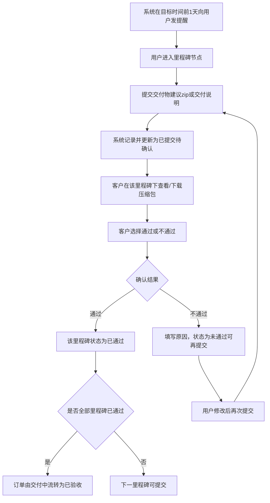

# 里程碑确认与交付验收产品需求说明书

## 需求概览

### 核心摘要
本需求将订单从「协议签署完成」到「正式结算」之间的交付与验收讲清楚、落下去：订单只有在**协议签署并上传至平台且自动关联当前订单**后才能进入**交付中**；进入交付中后，由**客户**（平台抽佣）或**平台运营方**（平台承包转包）与用户**共同确认里程碑与总工期**，支持自定义数量与内容（如总工期 3 个月、每月一个里程碑及对应交付说明）。在各里程碑节点，用户提交交付物或交付说明、客户确认；确认通过则该里程碑通过，未通过可要求修改后再次提交。全部里程碑通过后，订单由交付中 → 已验收 → 待结算 → 已结算，形成闭环。同时，当某里程碑在**约定完成日 + 宽限期**内未达成时，**开放客户的终止订单权利**（此前不开放），客户行使终止权后订单进入已终止；终止后结算以双方协议为准、由运营端人工审核执行，**平台不承诺系统自动结算**，以规避平台法律责任。这样既保证了交付节奏可预期、节点验收清晰，又划定了超期终止与结算风险的边界。

### 设计思路
设计上坚持「协议前置、里程碑可配置、节点可验收、超期可终止、终止不自动结算」：进入交付中的必要前置条件是协议签署并上传至平台且关联订单，与整体方案一致；里程碑与总工期按结算模式由客户或平台运营方与用户共同确认，支持自定义，不固化模板；节点流程采用「用户提交 → 客户确认 → 通过/不通过可再提交」的简单闭环；超期判断依赖约定完成日与宽限期（具体天数或配置方式在需求文档中定义），仅在超期未达成时开放客户终止权，避免滥用；终止后结算明确为运营端人工审核、按双方协议执行、平台不自动结算，与方案一致。与《我的订单与运营订单管理》《账单与结算》等需求在状态展示、待结算/已结算页签、账单创建触发上保持衔接，不扩展方案未提及的自动结算或复杂变更流程。

### 历史实现参考
本需求严格依据《CSDN 订单管理系统整体方案》第 6.5 节「里程碑确认与交付验收」及第 4.1 节「协议签署中」「交付中」「已验收」「待结算」「已结算」「已终止」「里程碑与交付验收」「订单终止与终止后结算」等表述拆分，交付中前置条件、里程碑定义方（按结算模式）、节点流程、超期与客户终止权、结算与状态流转及「平台不承诺系统自动结算」的表述与方案一致。本项目 `docs/history/` 目录不存在，未在本项目目录中找到相关历史需求文档；文档结构与验收准则格式参考同项目《订单发布模板与任务类型管理产品需求说明书》《用户注册与身份认证产品需求说明书》，保持需求文档风格与 Given-When-Then/Gherkin 验收方式一致。

---

# 第1章：概述

## 1.1 术语表

| 术语 | 英文（如需） | 描述 |
|------|--------------|------|
| 交付中 | In Delivery | 订单状态之一：协议已签署并上传至平台且已关联订单，里程碑进行中（尚未全部通过）；客户与接单方按里程碑提交与确认。 |
| 协议签署中 | Agreement Pending | 订单状态之一：客户选标或指定接单方/运营方确认接单后进入；双方需完成协议签署并将协议上传至平台（自动关联当前订单）。协议签署并上传是进入交付中的必要前置条件。 |
| 里程碑 | Milestone | 订单交付过程中与接单方共同确认的节点，每个节点对应约定的交付物或交付说明；用户在各节点提交交付物（或交付说明），客户确认通过则该里程碑通过。 |
| 总工期 | Total Duration | 订单从交付开始到全部里程碑完成的约定总时长；与里程碑数量、内容一并由客户（平台抽佣）或平台运营方（平台承包转包）与用户共同确认。 |
| 结算模式 | Settlement Mode | 客户在定义订单时确定：① **平台抽佣**：客户与用户直接交易结算，该订单的里程碑、结算等内容由**客户**定义；② **平台承包转包**：客户将订单承包给平台、平台转包给用户，该订单的里程碑、结算等操作由**平台运营方**定义。 |
| 已验收 | Accepted | 订单状态之一：全部里程碑已通过，交付完成；可进入待结算。 |
| 待结算 | Pending Settlement | 订单状态之一：已验收，等待结算流程（支付、对账等）。 |
| 已结算 | Settled | 订单状态之一：结算完成，订单闭环结束。 |
| 已终止 | Terminated | 订单状态之一：交付中阶段因某里程碑超过约定期限未达成，客户行使终止权后订单结束；终止后结算以客户与用户的相关协议为准，由运营端人工审核并按条款执行，平台不承诺系统自动结算。 |
| 客户 | Order Publisher / Requester | 在订单平台上发布订单的一方；平台抽佣模式下由客户与用户共同确认里程碑与总工期。 |
| 用户 | Order Taker / Contractor | 承接任务订单的一方；在各里程碑节点提交交付物（或交付说明）并由客户确认。 |
| 平台运营方 | Platform Operation | 平台运营人员；平台承包转包模式下由平台运营方与用户共同确认里程碑与总工期；终止后结算由运营端人工审核双方提供的合同/协议内容并按条款执行。 |
| 在线三方协议 | Tripartite Agreement | 客户、用户、平台三方签订的协议；选标/确认接单后进入协议签署中，双方签订并上传至平台（自动关联当前订单），原则上用户与 CSDN 结算。 |

## 1.2 修订记录

| 版本 | 内容 | 负责人 | 更新时间 | 备注 |
|------|------|--------|----------|------|
| 1.0 | 初稿，基于《CSDN 订单管理系统整体方案》第 6.5 节「里程碑确认与交付验收」及第 4.1 节相关表述拆分 | — | 2025-03-07 | — |

## 1.3 背景和价值

**背景与痛点**：  
选标或指定接单方/运营方确认接单后，订单进入协议签署中；协议签署并上传至平台后，订单进入交付中。交付阶段需要明确的节点约定与验收机制：若缺乏统一的里程碑定义与确认流程，客户与用户易在交付范围、节点标准上产生分歧；若超期无明确规则，客户无法在合理边界内终止订单，平台也需规避自动结算带来的法律责任。

**业务价值**：  
1. **交付节奏可控**：通过客户（或平台运营方）与用户共同确认里程碑与总工期，支持自定义数量与内容（如总工期 3 个月、每月一个里程碑及对应交付说明），使交付节奏可预期、可追踪。  
2. **节点验收清晰**：用户在里程碑节点提交交付物（或交付说明）→ 客户确认；确认通过则该里程碑通过，未通过可要求修改后再次提交，减少交付争议。  
3. **超期终止权与风险边界**：某里程碑超过约定期限（如约定完成日 + 宽限期）未达成时，开放客户的终止订单权利；终止后结算以双方协议为准、由运营端人工审核执行，平台不承诺系统自动结算，规避平台法律责任。  
4. **状态与结算闭环**：全部里程碑通过后订单由交付中 → 已验收 → 待结算 → 已结算，与协议签署中、已终止等状态一起形成完整订单生命周期，为账单与结算提供明确触发条件。  

---

# 第2章：功能需求

## 2.1 交付中前置条件与协议原则

### 场景描述

**场景 1：协议签署是进入交付中的必要条件**  
客户选标或指定接单方/运营方确认接单后，订单状态由推广中流转为**协议签署中**。双方需签订**在线三方协议**（客户、用户、平台）并将签署后的协议**上传至平台**（自动关联当前订单）。只有完成签署并上传后，订单才可从协议签署中流转为**交付中**，进入里程碑确认环节；未完成签署并上传前，订单不得进入交付中。

**场景 2：结算关系**  
原则上**用户与 CSDN 结算**；选标/确认接单后进入协议签署中，双方签订在线三方协议并上传至平台，协议与结算原则在需求或后续迭代中与账单、支付流程协同。

### 2.1.1 基本事件流程

#### 主业务流程

**前置条件**：订单已由客户选标或指定接单方/运营方确认接单，订单状态为**协议签署中**；客户与接单方（用户或运营方）需完成协议签署并将协议上传至平台。

**流程描述**：  
1. 订单处于**协议签署中**时，双方完成**在线三方协议**的签署。  
2. 签署后的协议**上传至平台**，并**自动关联当前订单**。  
3. 系统校验：协议已签署且已上传并关联当前订单后，允许订单状态由**协议签署中**流转为**交付中**。  
4. 未完成上述步骤前，订单不得进入交付中；进入交付中后，方可进行里程碑定义与节点确认。

**后置条件**：订单状态为**交付中**；协议已关联订单，原则上用户与 CSDN 结算。

**系统响应与提示**：  
- 协议未签署或未上传时，订单详情或状态区应明确提示「请完成协议签署并上传至平台后方可进入交付」；不提供「进入交付中」或等同含义的按钮或操作，直至条件满足。  
- 协议签署并上传且关联订单成功后，可提示「协议已生效，订单已进入交付阶段」或等同文案。

#### 扩展事件流程

- 协议签署超时或一方拒绝签署时的处理（如取消订单、退回推广中等）在整体方案中约定「在需求文档中定义」，**此处信息不明确，需补充确认**。

#### 异常事件流程

- **协议未上传或未关联**：若仅签署但未上传、或上传未关联当前订单，系统不允许订单进入交付中，并提示「请将签署后的协议上传至平台并关联当前订单」。  
- **权限不足**：仅客户、接单方（用户或运营方）及运营方可进行协议相关操作；非相关方无法执行上传或状态推进。

### 2.1.2 需求波及分析

- **影响模块**：订单状态机（协议签署中 → 交付中）、协议上传与关联、客户/用户订单详情与操作入口、运营端订单列表与状态筛选。  
- **数据影响**：订单状态字段、协议存储与订单关联关系；不改变协议签署前的创建与选标逻辑。  
- **业务规则影响**：明确「协议签署并上传至平台（自动关联当前订单）」为进入交付中的必要前置条件；原则上用户与 CSDN 结算。  
- **历史文档查阅记录**：  
  - 查阅的整体方案文档：`CSDN订单系统/docs/CSDN订单管理系统整体方案.md`（工作区相对路径）  
  - 参考功能：第 6.5 节「交付中前置条件」「协议与结算原则」、第 4.1 节「协议签署中」「交付中」「在线三方协议」「结算关系」  
  - 设计一致性保证：交付前置条件、协议与结算原则与整体方案表述一致。  
  - 本项目 `docs/history/` 目录不存在，未在本项目目录中找到相关历史需求文档；文档结构与验收准则格式参考同项目《订单发布模板与任务类型管理产品需求说明书》《用户注册与身份认证产品需求说明书》。

---

## 2.2 里程碑定义与总工期确认

### 场景描述

**场景 1：按结算模式确定定义方**  
根据订单的**结算模式**，里程碑与总工期由不同主体与用户共同确认：**平台抽佣**时由**客户**与用户共同确认；**平台承包转包**时由**平台运营方**与用户共同确认。例如客户发单时选择「平台抽佣」，则进入交付中后由客户与接单用户一起确认「总工期 3 个月、每月一个里程碑及对应交付说明（如 Month1 完成 ABC、Month2 完成 DEF、Month3 整体验收）」。

**场景 2：自定义数量与内容**  
支持自定义里程碑数量与内容，如总工期 3 个月、每月一个里程碑及对应交付说明；不限定固定模板，具体每个里程碑的约定完成日、交付说明、宽限期等在本需求或配置中定义。

**场景 3：入口与配置确认流程**  
客户在「交付中的订单」下可见【查看详情】入口，点击后进入订单详情页；在订单详情页可进入「里程碑确认」页面。在里程碑确认页面内，客户（或平台承包转包时为平台运营方）配置各里程碑的**目标时间**、**最晚达成时间**、交付物说明等；配置完成后需**等待用户（接单方）确认**此里程碑配置，用户确认后里程碑生效，后续按 2.3 章节进行节点提交与客户验收。交付过程中，在里程碑目标时间前 1 天系统会向用户发送提醒（见 2.3），用户按要求提交交付物（建议 zip 格式）后，客户可在该里程碑下获取压缩包。

**场景 4：AI 自动生成里程碑建议**  
在里程碑确认页面内，系统提供「AI 生成里程碑建议」能力：定义方点击后，AI 会基于当前订单的关键信息（如任务类型、交付模式、预算区间、预期交付周期、订单描述等）自动给出包含**总工期**及若干里程碑节点（含里程碑名称/摘要、目标时间、最晚达成时间与交付说明示例）的初步建议方案，并自动填充到页面对应字段中；定义方可在此基础上对总工期、里程碑数量与内容逐项修改、增删后保存，由用户（接单方）最终确认，确保里程碑配置仍以人工确认结果为准。

### 2.2.1 基本事件流程

#### 主业务流程

**前置条件**：订单已进入**交付中**（协议已签署并上传至平台且已关联订单）；操作角色为**客户**（平台抽佣）或**平台运营方**（平台承包转包），以及与订单关联的**用户**（接单方）。

**流程描述**：  
1. **进入里程碑定义**：客户（或运营方，依订单结算模式）在「交付中的订单」列表点击【查看详情】→ 进入订单详情页 → 在订单详情页点击进入「里程碑确认」页面；用户（接单方）可通过订单详情或「里程碑确认」等入口进入同一页面参与确认。  
2. **确定定义方**：系统根据订单的**结算模式**判断里程碑与总工期的定义方：**平台抽佣** → 由**客户**与用户共同确认；**平台承包转包** → 由**平台运营方**与用户共同确认。  
3. **AI 自动生成里程碑建议（可选）**：定义方可在页面点击「AI 生成里程碑建议」按钮，系统基于当前订单的关键信息（如任务类型、交付模式、预算区间、预期交付周期、订单描述等）调用 AI 能力自动生成初步的**总工期**与各里程碑节点建议（含里程碑名称/摘要、目标时间、最晚达成时间与交付说明示例），并将建议内容自动填充到对应字段；即使当前订单信息不完整或不足以支撑高度精确的方案，AI 也会在其理解范围内尽可能给出**合理/常规的建议内容**，并通过提示文案提醒定义方需结合实际业务进行校对与调整，**此处信息不明确，需补充确认：AI 生成异常（如服务不可用）时的具体提示文案与退回策略**。  
4. **定义方确认与编辑**：无论是基于 AI 生成结果还是纯手动配置，定义方均可在页面对**总工期**及**各里程碑**进行增删与修改（包括调整里程碑数量、名称/摘要、目标时间、最晚达成时间、交付说明/交付物要求等）；确认配置后点击保存，此时里程碑处于**待用户确认**状态。  
5. **用户确认**：用户（接单方）在订单详情或里程碑确认入口查看里程碑配置（包括基于 AI 建议经定义方修改后的最终内容），确认无误后执行「确认」操作；用户确认后里程碑**生效**（配置状态为已生效），后续按 2.3 章节进行节点提交与客户验收。  
6. **保存与生效**：仅定义方保存时里程碑未生效，需用户确认后才生效；双方确认后，里程碑与总工期与该订单绑定，后续节点流程按已确认的里程碑执行。

**后置条件**：订单具备已确认（已生效）的里程碑列表与总工期；各里程碑具备目标时间、最晚达成时间（及宽限期规则），供提醒、节点提交与超期判断使用。

**系统响应与提示**：  
- 未确认里程碑与总工期前，可提示「请与接单方共同确认里程碑与总工期后再进行节点交付」；具体交互与是否允许「先提交后补确认」以产品确认为准。  
- 定义方保存后、用户未确认前：提示「里程碑已保存，请等待接单方确认」；用户侧可见「待确认的里程碑配置」及确认入口。  
- 用户确认后：提示「里程碑已确认」或 Toast；订单详情与交付进度可展示里程碑列表与总工期。  
- 定义方点击「AI 生成里程碑建议」时：生成成功则提示「已基于当前订单信息生成里程碑建议，请确认后再保存」或等同文案；生成失败或信息不足时提示原因（如「当前订单信息不足，无法生成里程碑建议，请手动配置」），**具体提示文案与交互细节此处信息不明确，需补充确认**。

#### 扩展事件流程

- **里程碑变更**：若交付过程中需调整里程碑数量或内容，原始需求未明确是否支持变更、变更权限与生效规则，**需补充确认**。  
- **总工期与里程碑的展示形式**：列表、时间轴、进度条等在需求文档中定义，可与《我的订单与运营订单管理》需求文档中「交付中的订单」展示形式统一。

#### 异常事件流程

- **结算模式缺失**：若订单无结算模式（异常数据），系统应禁止进入里程碑定义或提示「订单结算模式未设置，无法确认里程碑」；需由运营或客户修正订单信息。  
- **一方未确认**：客户（或运营方）配置并保存后，里程碑处于「待用户确认」状态，**仅用户确认后里程碑才生效**；仅定义方保存时系统提示「需接单方确认后里程碑生效」，用户侧展示待确认的里程碑配置及确认操作。

### 2.2.2 数据项描述（里程碑与总工期）

| 字段名（中文） | 字段名（英文） | 数据类型/长度 | 是否必填 | 前端展示 | 默认值 | 说明 | 界面/控件说明 | 备注 |
|----------------|----------------|----------------|----------|----------|--------|------|----------------|------|
| 订单标识 | order_id | 唯一标识 | 是 | 否 | — | 关联订单 | — | 里程碑归属订单 |
| 总工期 | total_duration | 字符串或结构化，建议 200 | 是 | 是 | — | 如「3 个月」或具体天数；与业务约定单位一致 | 输入或选择 | 与用户共同确认 |
| 里程碑序号 | milestone_seq | 整数 | 是 | 是 | — | 从 1 起递增，表示顺序 | 列表展示 | — |
| 里程碑名称/摘要 | milestone_name | 字符串，建议 500 | 是 | 是 | — | 如「Month1 完成 ABC」 | 单行或多行输入 | — |
| 交付说明 | delivery_description | 文本，建议 2000 | 否 | 是 | — | 该里程碑的交付物或交付说明 | 多行文本 | 用户提交时可填交付说明或上传交付物 |
| 约定完成日 | due_date | 日期 | 是 | 是 | — | 该里程碑的约定完成日期；超期判断依据；可与「最晚达成时间」一致或作为其计算基准 | 日期选择 | 具体与宽限期一起在需求文档中定义 |
| 目标时间 | target_date | 日期 | 是 | 是 | — | 期望完成日期，用于在目标时间前 1 天向用户发送提交交付物提醒 | 日期选择 | 见 2.3 提醒与交付物 |
| 最晚达成时间 | latest_due_date | 日期 | 是 | 是 | — | 该日期前里程碑未通过则可能触发超期与客户终止权；可与约定完成日一致或为约定完成日+宽限期 | 日期选择 | 与超期判断、终止权开放关联 |
| 宽限期（天或配置） | grace_period | 整数或配置项 | 待确认 | 是 | — | 约定完成日 + 宽限期未达成时开放客户终止权；具体天数或配置方式在需求文档中定义 | 数字输入或下拉 | **此处信息不明确，需补充确认** |
| 里程碑配置状态 | milestone_config_status | 枚举 | 是 | 是 | 待用户确认 | 待用户确认/已生效；定义方保存后为待用户确认，用户确认后为已生效 | 状态标签 | 仅已生效的里程碑参与 2.3 节点流程 |
| 里程碑状态 | milestone_status | 枚举 | 是 | 是 | 待提交 | 待提交/已提交待确认/已通过/未通过（可再提交）；由节点流程更新，仅当配置状态为已生效后使用 | 状态标签 | — |
| 定义方类型 | definer_type | 枚举 | 是 | 否（可仅后端） | — | customer / operation；平台抽佣为客户，平台承包转包为运营方 | — | 用于权限与展示 |

**说明**：目标时间用于提前 1 天提醒用户提交交付物（见 2.3）；最晚达成时间与约定完成日、宽限期的关系可由业务约定（如最晚达成时间 = 约定完成日，或 = 约定完成日+宽限期）。约定完成日与宽限期的具体规则（如固定 N 天、按订单配置、运营全局配置）、以及「未达成」的判定标准（如未在最晚达成时间前被客户确认通过）在需求文档中定义；上表为业务与逻辑层面数据项，具体表结构由实现设计确定。

### 2.2.3 需求波及分析

- **影响模块**：**交付中的订单**列表（需提供【查看详情】入口）、**订单详情页**（需提供进入「里程碑确认」页面的入口）、里程碑确认页面（配置目标时间、最晚达成时间、交付物等；定义方保存、用户确认）、超期与终止权判断。  
- **数据影响**：里程碑主表或子表（关联订单）、总工期存储；与订单结算模式、订单状态关联；AI 自动生成能力不新增持久化字段，仅基于现有订单与里程碑相关字段生成初步建议，由定义方人工确认后按现有字段落库。  
- **业务规则影响**：按结算模式确定里程碑与总工期的定义方（客户或平台运营方）；支持自定义数量与内容；在不改变最终以人工确认为准的前提下，引入「AI 生成里程碑建议」作为可选辅助能力，由定义方触发、定义方与用户共同确认后生效。  
- **历史文档查阅记录**：  
  - 查阅的整体方案文档：`CSDN订单系统/docs/CSDN订单管理系统整体方案.md`（工作区相对路径），参考第 6.5 节「里程碑确认与交付验收」中关于「根据订单的结算模式，由客户或平台运营方与用户共同确认里程碑与总工期」的描述。  
  - 查阅的现有需求文档：`CSDN订单系统/docs/订单广场与报名竞标产品需求说明书.md`、`CSDN订单系统/docs/我的订单与运营订单管理产品需求说明书.md`、`CSDN订单系统/docs/运营端业务看板产品需求说明书.md`，参考订单创建与展示、交付中的订单入口、运营端看板与订单管理的既有设计，确保 AI 能力不改变订单流转与各端入口。  
  - 参考的实现方案：沿用当前项目在协议签署阶段的「AI 生成协议」能力模式，即由业务方主动点击 AI 按钮生成建议文本，再由人工确认后保存；本功能在里程碑定义阶段采用同样的「AI 辅助、人工把关」范式。  
  - 设计一致性保证：AI 自动生成里程碑仅作为页面辅助工具，不改变整体方案中「按结算模式由客户或平台运营方与用户共同确认里程碑与总工期」的职责划分与状态机设计。

---

## 2.3 节点流程：用户提交交付物与客户确认

### 场景描述

**场景 1：按节点提交与确认**  
里程碑配置经用户确认生效后（见 2.2），用户在某一里程碑节点提交交付物（或交付说明）→ 客户（或平台承包转包时由运营方代表客户）进行确认。客户确认通过则该里程碑通过；未通过可要求修改后再次提交，用户修改后再次提交直至该里程碑通过或订单进入其他状态（如超期终止）。

**场景 2：提醒与交付物形态**  
在订单交付过程中，系统在里程碑**目标时间**前 1 天向用户发送通知（站内信/推送等），提示用户按时提交该里程碑所需的交付物；交付物**建议以 zip 压缩包格式**上传。用户上传后，客户可在该里程碑的详情或交付物区域**查看并下载该压缩包**。交付物也可以是链接或单纯的说明文本，三种形态（zip 文件、链接、说明文本）均为本期支持范围；具体大小与格式限制在需求文档中定义。

### 2.3.1 基本事件流程

#### 主业务流程

**前置条件**：订单处于**交付中**，已存在**已生效**的里程碑列表（见 2.2）；当前里程碑配置状态为已生效、节点状态为**待提交**或**已提交待确认**（若未通过后再次提交）；操作用户为订单接单方（用户或运营方），确认方为客户（或平台承包转包时为运营方）。

**流程描述**：  
1. **到期前提醒**：系统在里程碑**目标时间**前 1 天向用户（接单方）发送通知（站内信），提示「请在目标时间前提交该里程碑的交付物（建议 zip 格式）」或等同文案，以便用户按时提交。  
2. **用户提交**：用户在对应里程碑节点提交**交付物**（建议 **zip 压缩包**格式，也可为链接或交付说明）或**交付说明**。系统记录提交时间、内容或附件，并将该里程碑状态更新为**已提交待确认**。  
3. **客户获取交付物**：客户（或平台承包转包时由运营方）在订单详情或里程碑列表中进入该里程碑，可**在该里程碑下查看并下载用户上传的压缩包**（或其它交付物）；客户据此进行验收。  
4. **客户确认**：客户（或平台承包转包时由运营方）在订单详情或里程碑列表中查看该节点提交内容，选择「通过」或「不通过」。  
5. **通过**：客户选择「通过」后，该里程碑状态更新为**已通过**；若存在下一里程碑，则下一里程碑变为可提交；若全部里程碑已通过，则触发订单状态由**交付中**流转为**已验收**（见 2.5）。  
6. **不通过**：客户选择「不通过」时，可填写不通过原因或修改要求；该里程碑状态更新为**未通过（可再提交）**，用户可修改后再次提交，重复上述流程直至通过或订单超期/终止。

**后置条件**：该里程碑状态为已通过，或保持未通过/已提交待确认直至超期或订单终止；全部里程碑通过后订单进入已验收。

**系统响应与提示**：  
- 目标时间前 1 天：用户收到「请在目标时间前提交该里程碑的交付物（建议 zip 格式）」或等同文案的站内信/推送。  
- 用户提交成功：提示「已提交，等待客户确认」或 Toast。  
- 客户在里程碑下可查看并下载用户上传的压缩包（或其它交付物）。  
- 客户确认通过：提示「该里程碑已通过」；若为最后一个里程碑，可提示「全部里程碑已通过，订单已进入已验收」。  
- 客户确认不通过：提示「未通过，请根据反馈修改后重新提交」，并展示不通过原因或修改要求；用户侧该里程碑可再次提交。



#### 扩展事件流程

- **补充说明**：用户提交后、客户确认前，用户是否可补充或替换交付物/交付说明，原始需求未明确，**需补充确认**。  
- **撤回提交**：用户提交后是否可撤回，原始需求未明确，**需补充确认**。

#### 异常事件流程

- **未到约定节点顺序**：若产品约定按顺序提交（如必须先通过里程碑 1 再提交里程碑 2），则用户无法跳过顺序提交；系统提示「请先完成前一里程碑的确认」。  
- **非接单方提交**：仅订单接单方（用户或运营方）可提交交付物；客户仅可确认，不可代接单方提交；权限校验失败时提示「无权限」。  
- **非客户确认**：平台抽佣时由客户确认；平台承包转包时由运营方确认；其他角色无法执行确认操作，提示「无权限」。

### 2.3.2 数据项描述（节点提交与确认）

| 字段名（中文） | 字段名（英文） | 数据类型/长度 | 是否必填 | 前端展示 | 默认值 | 说明 | 界面/控件说明 | 备注 |
|----------------|----------------|----------------|----------|----------|--------|------|----------------|------|
| 里程碑标识 | milestone_id | 唯一标识 | 是 | 否 | — | 关联 2.2 里程碑 | — | — |
| 提交内容类型 | submission_type | 枚举 | 是 | 是 | — | 交付物（文件/链接）或交付说明（文本）；交付物建议 zip 压缩包 | 提交页选项 | **需补充确认** |
| 交付说明文本 | delivery_note_text | 文本，建议 5000 | 否 | 是 | — | 用户填写的交付说明 | 多行文本框 | — |
| 交付物附件/链接 | delivery_attachment_ref | 字符串或关联 | 否 | 是 | — | 上传文件 ID（建议 zip 格式）或外链 URL；客户可在该里程碑下查看并下载压缩包 | 上传或链接输入 | **需补充确认**；客户侧需支持在该里程碑下获取并下载 |
| 提交时间 | submitted_at | 日期时间 | 是 | 是 | — | 用户提交时间 | 只读 | — |
| 确认结果 | confirm_result | 枚举 | 是 | 是 | — | 通过/不通过 | 客户操作 | — |
| 不通过原因/修改要求 | reject_reason | 文本，建议 2000 | 否 | 是 | — | 客户选择不通过时填写 | 多行文本 | — |
| 确认时间 | confirmed_at | 日期时间 | 否 | 是 | — | 客户确认时间 | 只读 | — |

### 2.3.3 需求波及分析

- **影响模块**：订单详情、里程碑列表与节点操作（用户侧提交、客户/运营侧确认与**在该里程碑下查看/下载交付物**）、交付中的订单页签展示、订单状态机（交付中 → 已验收）、**站内信/推送（目标时间前 1 天提醒）**。  
- **数据影响**：里程碑提交记录表或扩展字段、交付物（含 zip）存储或引用；与 2.2 里程碑、2.5 状态流转关联；**通知触达（按里程碑目标时间前 1 天）**。  
- **业务规则影响**：目标时间前 1 天向用户发送提交提醒；用户提交（建议 zip）→ 客户在该里程碑下获取压缩包并确认；通过则该里程碑通过，不通过可修改后再提交；全部里程碑通过后订单进入已验收。  
- **历史文档查阅记录**：同 2.1.2；本功能对应整体方案 6.5.2「节点流程：用户在里程碑节点提交交付物（或交付说明）→ 客户确认；确认通过则该里程碑通过，未通过可要求修改后再次提交」。

---

## 2.4 里程碑超期与客户终止权

### 场景描述

**场景 1：超期开放终止权**  
客户与用户（或平台运营方与用户）商定的某个里程碑，在**约定完成日 + 宽限期**内未达成（即在该时间点前该里程碑未被客户确认通过）时，**开放客户的终止订单权利**（此前不开放）。客户行使终止权后，订单进入**已终止**。

**场景 2：终止后结算**  
终止后结算以客户与用户的相关协议为准，由**运营端人工审核**双方提供的合同/协议内容并按条款执行结算；**平台不承诺系统自动结算**，以规避平台法律责任。具体审核流程与结算执行在需求或后续迭代中细化。

### 2.4.1 基本事件流程

#### 主业务流程

**前置条件**：订单处于**交付中**；至少存在一个里程碑的「约定完成日 + 宽限期」已届满，且该里程碑状态尚未为**已通过**；操作方为**客户**（或平台承包转包时是否由运营方代行终止权在需求文档中确认）。

**流程描述**：  
1. **超期判断**：系统根据每个里程碑的约定完成日与宽限期（具体天数或配置方式在需求文档中定义）判断是否「超期未达成」。若某里程碑在约定完成日 + 宽限期届满时仍未处于**已通过**，则视为该里程碑超期未达成。  
2. **开放终止权**：当存在至少一个里程碑超期未达成时，**开放客户的终止订单权利**（此前不开放）；客户在订单详情或订单管理入口可见「终止订单」或等同操作，并可选择行使终止权。  
3. **客户行使终止权**：客户点击「终止订单」并确认（若需二次确认）；系统将订单状态由**交付中**流转为**已终止**。  
4. **终止后结算**：订单已终止后，**终止后结算**以客户与用户的相关协议为准，由**运营端人工审核**双方提供的合同/协议内容并按条款执行结算；**平台不承诺系统自动结算**。具体审核流程与结算执行在需求或后续迭代中细化；本期需求仅明确「运营端人工审核」「按双方协议执行」「平台不自动结算」的原则。

**后置条件**：订单状态为**已终止**；客户终止权仅在「存在里程碑超期未达成」时开放，且一经行使订单即进入已终止。

**系统响应与提示**：  
- 当存在里程碑超期未达成时，客户侧订单详情或列表应展示「可终止订单」或「终止订单」入口，并提示「因某里程碑已超期未达成，您可终止本订单」或等同文案。  
- 客户点击终止并确认后，提示「订单已终止；后续结算以您与接单方的协议为准，由平台运营人工审核执行」。  
- 终止后，订单从「交付中」列表移除，归入「已终止」状态；用户侧与运营侧可见订单已终止。

#### 扩展事件流程

- **运营方在交付中取消/终止**：整体方案 4.1 约定「是否支持运营方在交付中取消/终止订单（如纠纷、严重违约）在需求文档中确认；若支持，建议限定为运营方操作并需记录原因」。**此处信息不明确，需补充确认**。  
- **宽限期与约定完成日的配置方式**：具体天数（如 3 天、7 天）或按订单/运营配置，在需求文档中定义，见 2.2.2。

#### 异常事件流程

- **未超期时隐藏终止权**：在未有里程碑超期未达成前，客户侧不展示「终止订单」或等同操作，或展示为不可用并说明「当某里程碑超期未达成后可终止订单」。  
- **已终止后不可恢复**：订单进入已终止后，不再支持「恢复交付中」；若有争议，通过线下或运营审核流程处理，不在本需求范围。

### 2.4.2 需求波及分析

- **影响模块**：订单状态机（交付中 → 已终止）、客户订单详情与订单管理（终止订单入口）、运营端订单列表与「终止订单结算审核」、用户侧「已终止」订单展示与筛选。  
- **数据影响**：订单状态更新为已终止；终止原因、操作人、操作时间建议记录以备审计；与账单与结算模块协同（终止后结算为人工审核、不自动结算）。  
- **业务规则影响**：里程碑超期未达成时开放客户终止权；客户行使终止权后订单进入已终止；终止后结算以双方协议为准、运营人工审核、平台不承诺系统自动结算。  
- **历史文档查阅记录**：同 2.1.2；本功能对应整体方案 6.5.2「里程碑超期与客户终止权」「协议与结算原则」及第 4.1 节「已终止」「订单终止与终止后结算」。

---

## 2.5 结算与状态流转（全部里程碑通过后）

### 场景描述

**场景 1：正常交付完成**  
全部里程碑通过后，订单状态由**交付中**流转为**已验收**，再进入**待结算**；结算流程完成后流转为**已结算**（具体结算动作与支付在需求或后续迭代中定义）。  
**场景 2：与账单的协同**  
订单转为待结算时，系统可自动创建账单并置于初始状态等逻辑，与《CSDN 订单管理系统整体方案》第 4.1 节「账单与结算（订单关联）」一致；本需求仅明确订单侧状态流转：交付中 → 已验收 → 待结算 → 已结算。

### 2.5.1 基本事件流程

#### 主业务流程

**前置条件**：订单处于**交付中**，且**全部里程碑均已通过**（每个里程碑状态均为已通过）。

**流程描述**：  
1. 当最后一个里程碑被客户确认通过时，系统将订单状态由**交付中**流转为**已验收**。  
2. 订单进入**已验收**后，按整体方案与账单规则进入**待结算**（如自动创建账单并置初始状态，具体在账单与结算需求文档中定义）。  
3. 结算流程完成后，订单状态流转为**已结算**（具体结算动作与支付在需求或后续迭代中定义）。

**后置条件**：订单状态依次为已验收、待结算、已结算；订单闭环结束。

**系统响应与提示**：  
- 全部里程碑通过时，可提示「全部里程碑已通过，订单已进入已验收，将进入待结算流程」或等同文案。  
- 已验收、待结算、已结算在客户/用户订单列表与详情中正确展示；用户侧「已验收订单」页签下区分待结算订单与已结算订单，与整体方案 6.7 一致。

#### 扩展事件流程

- 待结算后取消结算、账单冲销与订单状态回退等，见整体方案 4.1「待结算后取消结算」；具体在需求或后续迭代中定义，本需求不展开。

#### 异常事件流程

- **部分里程碑通过、部分未通过**：只要存在未通过的里程碑且未超期，订单保持交付中，不进入已验收。  
- **全部通过与账单创建**：订单转待结算时与账单的创建与状态由账单与结算需求定义；若账单创建失败，订单状态是否仍可进入待结算、以及重试与提示策略在需求或后续迭代中定义。

### 2.5.2 需求波及分析

- **影响模块**：订单状态机（交付中 → 已验收 → 待结算 → 已结算）、客户/用户「我的订单」与已验收订单页签、运营订单列表与状态筛选、账单与结算模块（触发创建账单等）。  
- **数据影响**：订单状态字段；与账单创建、结算动作的联动在账单需求中定义。  
- **业务规则影响**：全部里程碑通过 → 已验收 → 待结算 → 已结算；具体结算动作与支付在需求或后续迭代中定义。  
- **历史文档查阅记录**：同 2.1.2；本功能对应整体方案 6.5.2「结算与状态：全部里程碑通过后，订单状态由交付中流转为已验收，再进入待结算；结算流程完成后流转为已结算」。

---

## 2.6 验收准则

### 2.6.1 验收准则表格

| 编号 | 场景描述 | Given（前置条件） | When（触发条件） | Then（预期结果） | And（附加验证） |
|------|----------|-------------------|-------------------|------------------|-----------------|
| AC-1 | 协议未签署并上传时不可进入交付中 | 订单状态为协议签署中，协议未签署或未上传至平台关联订单 | 客户或接单方尝试将订单推进至交付中 | 系统不允许订单进入交付中，并提示「请完成协议签署并上传至平台后方可进入交付」或等同文案 | 订单状态保持协议签署中；无「进入交付」等可用操作 |
| AC-2 | 协议签署并上传关联后订单可进入交付中 | 订单状态为协议签署中，协议已签署并已上传至平台且已关联当前订单 | 客户或接单方执行进入交付或系统自动推进 | 订单状态由协议签署中流转为交付中 | 订单详情显示交付中；可进行里程碑定义与节点提交 |
| AC-3 | 平台抽佣时由客户与用户共同确认里程碑 | 订单结算模式为平台抽佣，订单已进入交付中 | 客户与用户进入里程碑确认入口并共同确认总工期与里程碑数量、内容 | 系统记录里程碑与总工期，定义方为客户；里程碑列表可展示且可进行节点提交与确认 | 平台承包转包时由平台运营方与用户共同确认，定义方为运营方；客户配置后需用户确认后里程碑才生效 |
| AC-3a | 客户通过交付中订单的查看详情进入里程碑确认页面 | 订单已进入交付中 | 客户在「交付中的订单」列表点击【查看详情】 | 进入订单详情页；订单详情页提供进入「里程碑确认」页面的入口，客户可进入并配置目标时间、最晚达成时间、交付物等 | 配置完成后保存为「待用户确认」，用户确认后里程碑生效 |
| AC-3b | 目标时间前1天用户收到提交提醒 | 订单交付中，某里程碑已生效且目标时间为明天 | 系统在目标时间前 1 天执行提醒 | 用户（接单方）收到站内信或推送，提示「请在目标时间前提交该里程碑的交付物（建议 zip 格式）」或等同文案 | 提醒内容可配置或按需求文档约定 |
| AC-3c | 用户上传后客户可在该里程碑下获取压缩包 | 订单交付中，用户已在某里程碑节点上传交付物（如 zip） | 客户进入该订单的订单详情或里程碑列表并进入该里程碑 | 客户可在该里程碑下查看并下载用户上传的压缩包（或其它交付物），用于验收 | 交付物为链接或仅文本时，客户可查看对应内容 |
| AC-4 | 用户提交交付物或交付说明后客户可确认 | 订单交付中，当前里程碑状态为待提交或已提交待确认，用户已提交交付物或交付说明 | 客户在订单详情或里程碑列表中选择「通过」或「不通过」 | 选择通过则该里程碑状态为已通过；选择不通过则状态为未通过并可填写原因，用户可再次提交 | 全部里程碑通过后订单进入已验收（见 AC-6） |
| AC-5 | 里程碑超期未达成时开放客户终止权 | 订单交付中，至少一个里程碑的约定完成日+宽限期已届满且该里程碑未处于已通过 | 客户查看该订单 | 客户可见「终止订单」或等同操作入口，并可见「因某里程碑已超期未达成，您可终止本订单」或等同提示 | 在未有里程碑超期未达成前，客户不可见或不可用终止订单操作 |
| AC-6 | 客户行使终止权后订单进入已终止 | 订单交付中，已开放客户终止权（存在里程碑超期未达成） | 客户点击「终止订单」并确认 | 订单状态由交付中流转为已终止；提示「订单已终止；后续结算以您与接单方的协议为准，由平台运营人工审核执行」或等同 | 订单在客户/用户/运营列表中归入已终止；终止后结算由运营端人工审核，平台不自动结算 |
| AC-7 | 全部里程碑通过后订单进入已验收并进入待结算 | 订单交付中，全部里程碑状态均为已通过 | 客户对最后一个里程碑确认通过 | 订单状态由交付中流转为已验收；随后按规则进入待结算（如自动创建账单等，以账单需求为准） | 用户侧「已验收订单」页签可区分待结算订单与已结算订单 |
| AC-8 | 结算完成后订单进入已结算 | 订单已处于待结算，结算流程已完成（具体动作在需求或后续迭代中定义） | 系统或运营完成结算动作 | 订单状态流转为已结算，订单闭环结束 | 客户/用户订单列表与详情正确展示已结算状态 |

### 2.6.2 Gherkin 格式验收准则

```gherkin
Feature: 里程碑确认与交付验收

  Scenario: 协议未签署并上传时不可进入交付中
    Given 订单状态为协议签署中
    And 协议未签署或未上传至平台关联订单
    When 客户或接单方尝试将订单推进至交付中
    Then 系统不允许订单进入交付中
    And 系统提示「请完成协议签署并上传至平台后方可进入交付」或等同文案
    And 订单状态保持协议签署中
    And 不提供「进入交付」等可用操作

  Scenario: 协议签署并上传关联后订单可进入交付中
    Given 订单状态为协议签署中
    And 协议已签署并已上传至平台且已关联当前订单
    When 客户或接单方执行进入交付或系统自动推进
    Then 订单状态由协议签署中流转为交付中
    And 订单可进行里程碑定义与节点提交

  Scenario: 平台抽佣时由客户与用户共同确认里程碑
    Given 订单结算模式为平台抽佣
    And 订单已进入交付中
    When 客户与用户进入里程碑确认入口并共同确认总工期与里程碑数量、内容
    Then 系统记录里程碑与总工期且定义方为客户
    And 里程碑列表可展示且可进行节点提交与确认
    And 客户配置后需用户确认后里程碑才生效
    When 订单结算模式为平台承包转包
    Then 由平台运营方与用户共同确认里程碑，定义方为运营方

  Scenario: 客户通过交付中订单的查看详情进入里程碑确认页面
    Given 订单已进入交付中
    When 客户在「交付中的订单」列表点击【查看详情】
    Then 进入订单详情页
    And 订单详情页提供进入「里程碑确认」页面的入口
    And 客户可进入里程碑确认页面并配置目标时间、最晚达成时间、交付物等
    And 配置完成后保存为「待用户确认」，用户确认后里程碑生效

  Scenario: 目标时间前1天用户收到提交提醒
    Given 订单处于交付中
    And 某里程碑已生效且目标时间为明天
    When 系统在目标时间前 1 天执行提醒
    Then 用户（接单方）收到站内信或推送
    And 提示内容为「请在目标时间前提交该里程碑的交付物（建议 zip 格式）」或等同文案

  Scenario: 用户上传后客户可在该里程碑下获取压缩包
    Given 订单处于交付中
    And 用户已在某里程碑节点上传交付物（如 zip）
    When 客户进入该订单的订单详情或里程碑列表并进入该里程碑
    Then 客户可在该里程碑下查看并下载用户上传的压缩包（或其它交付物）
    And 客户可据此进行验收

  Scenario: 用户提交交付物或交付说明后客户可确认
    Given 订单处于交付中
    And 当前里程碑状态为待提交或已提交待确认
    And 用户已提交交付物或交付说明
    When 客户在订单详情或里程碑列表中选择「通过」
    Then 该里程碑状态更新为已通过
    When 客户选择「不通过」并填写原因
    Then 该里程碑状态更新为未通过
    And 用户可修改后再次提交
    And 全部里程碑通过后订单进入已验收

  Scenario: 里程碑超期未达成时开放客户终止权
    Given 订单处于交付中
    And 至少一个里程碑的约定完成日+宽限期已届满
    And 该里程碑未处于已通过
    When 客户查看该订单
    Then 客户可见「终止订单」或等同操作入口
    And 客户可见「因某里程碑已超期未达成，您可终止本订单」或等同提示
    Given 未有里程碑超期未达成
    When 客户查看该订单
    Then 客户不可见或不可用「终止订单」操作

  Scenario: 客户行使终止权后订单进入已终止
    Given 订单处于交付中且已开放客户终止权
    When 客户点击「终止订单」并确认
    Then 订单状态由交付中流转为已终止
    And 系统提示「订单已终止；后续结算以您与接单方的协议为准，由平台运营人工审核执行」或等同
    And 订单在客户/用户/运营列表中归入已终止
    And 终止后结算由运营端人工审核，平台不承诺系统自动结算

  Scenario: 全部里程碑通过后订单进入已验收并进入待结算
    Given 订单处于交付中
    And 全部里程碑状态均为已通过
    When 客户对最后一个里程碑确认通过
    Then 订单状态由交付中流转为已验收
    And 订单按规则进入待结算（如自动创建账单等，以账单需求为准）
    And 用户侧「已验收订单」页签可区分待结算订单与已结算订单

  Scenario: 结算完成后订单进入已结算
    Given 订单已处于待结算
    And 结算流程已完成（具体动作在需求或后续迭代中定义）
    When 系统或运营完成结算动作
    Then 订单状态流转为已结算
    And 订单闭环结束
    And 客户/用户订单列表与详情正确展示已结算状态
```

---

## 2.7 国际化命名规则

| 使用场景说明 | 中文 | 英文 |
|--------------|------|------|
| 状态 | 协议签署中 | Agreement Pending |
| 状态 | 交付中 | In Delivery |
| 状态 | 已验收 | Accepted |
| 状态 | 待结算 | Pending Settlement |
| 状态 | 已结算 | Settled |
| 状态 | 已终止 | Terminated |
| 里程碑 | 里程碑 | Milestone |
| 里程碑 | 总工期 | Total Duration |
| 里程碑 | 约定完成日 | Due Date |
| 里程碑 | 目标时间 | Target Date |
| 里程碑 | 最晚达成时间 | Latest Due Date |
| 里程碑 | 待用户确认 | Pending User Confirmation |
| 里程碑 | 已生效 | Effective |
| 里程碑 | 宽限期 | Grace Period |
| 操作 | 查看详情 | View Details |
| 操作 | 里程碑确认 | Milestone Confirmation |
| 操作 | 提交交付物 | Submit Delivery |
| 操作 | 确认通过 | Confirm Pass |
| 操作 | 不通过 | Reject |
| 操作 | 终止订单 | Terminate Order |
| 通用 | 交付说明 | Delivery Description |

---

## 2.8 埋点定义

| 模块 | 指标名称 | 指标定义 | PC/移动端 | 触发时机 | 频率 |
|------|----------|----------|------------|----------|------|
| 里程碑确认 | 里程碑与总工期确认保存 | 客户或运营方与用户共同确认里程碑与总工期并保存成功 | 均可 | 点击保存且成功 | 按次 |
| 节点流程 | 里程碑交付物提交 | 用户在某一里程碑节点提交交付物或交付说明 | 均可 | 点击提交且成功 | 按次 |
| 节点流程 | 里程碑确认通过 | 客户（或运营方）对某里程碑确认通过 | 均可 | 点击通过 | 按次 |
| 节点流程 | 里程碑确认不通过 | 客户（或运营方）对某里程碑确认不通过 | 均可 | 点击不通过 | 按次 |
| 终止订单 | 客户终止订单 | 客户在里程碑超期未达成后行使终止权 | 均可 | 点击终止并确认 | 按次 |
| 状态流转 | 订单进入已验收 | 全部里程碑通过，订单由交付中进入已验收 | 均可 | 状态变更 | 按次 |

---

## 2.9 非功能性需求

- **性能**：里程碑列表加载、提交交付物、客户确认操作的响应时间建议不超过 3 秒（正常网络条件下）；交付物上传大小与超时策略在需求文档中定义。  
- **安全**：仅订单接单方可提交交付物；仅客户（或平台承包转包时为运营方）可确认里程碑；仅客户在超期未达成时可终止订单；协议与交付内容按订单参与方与运营权限可见。  
- **兼容性**：支持整体方案约定的网页端与移动端；与现有订单状态机、协议上传、账单与结算模块兼容。  
- **可用性**：未确认里程碑与总工期前，可明确提示并引导完成确认；超期与宽限期规则在配置或文案中可理解；终止后结算原则（运营人工审核、平台不自动结算）在界面或帮助中说明。

---

*本文档为《CSDN 订单管理系统整体方案》第 6.5 节「里程碑确认与交付验收」的细化需求说明书。约定完成日与宽限期的具体天数或配置方式、交付物形态与格式、协议签署超时/拒绝处理、运营方在交付中取消/终止是否支持及规则、具体结算动作与支付流程需在实现前与业务补充确认或在后续迭代中细化。*
